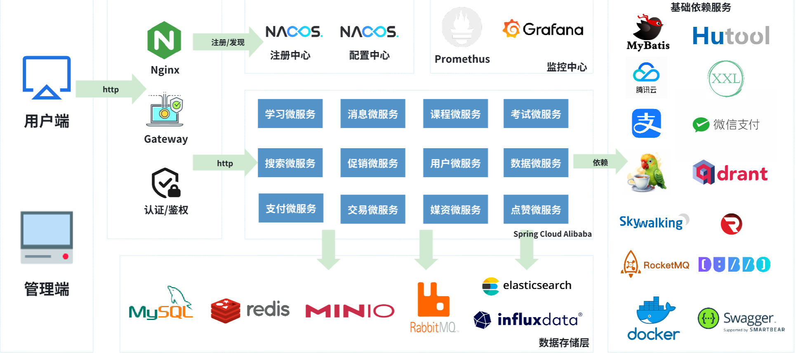

  

  <strong>智慧MOOC教育平台</strong>

  在线职业技能培训的一站式教学与运营平台

  
  
  

  <a href="#-项目介绍">项目介绍</a> ·
  <a href="#-核心特性">核心特性</a> ·
  <a href="#-模块介绍">模块介绍</a> ·
  <a href="#-技术栈">技术栈</a> ·
  <a href="#-项目资料">项目资料</a>

## 📖 项目介绍

智慧MOOC教育平台是一个在线的非学历职业技能培训平台，核心业务是以售卖各种技能培训的在线课程，并提供丰富的学习辅助功能、交互功能，以提升用户学习时的氛围感和学习的积极性。

**项目展示视频：**

- 用户端：<https://www.bilibili.com/video/BV1NEb5zBEko>
- 管理端：<https://www.bilibili.com/video/BV1fdtRz6Efc>

## ✨ 核心特性

| 特性                   | 说明                                                         |
| ---------------------- | ------------------------------------------------------------ |
| **在线课程与学习体验** | 支持课程售卖、学习计划、进度统计等完整学习闭环，提升学习氛围和参与度。 |
| **AIGC 能力整合**      | 集成 LangChain4j + Qdrant向量知识库 ，实现智能问答、RAG、ToolCalling。 |
| **多中心业务架构**     | 按业务域拆分为课程中心、学习中心、消息中心、交易中心等模块。 |
| **高并发与高可用设计** | 通过缓存、消息队列、分布式锁、异步化等方案优化并发与性能。   |
| **可观测与运维友好**   | 支持日志埋点、指标采集和监控大盘，便于问题定位与运维管理。   |

## 🏗️ 项目架构

## 🛠 技术栈

**核心技术栈：**  Spring Boot、Spring Cloud、MyBatis、MySQL、Redis、Redisson、Caffeine、RabbitMQ、XXL-JOB、腾讯云 VOD（视频点播）、Nginx、Minio、Langchain4j、Qdrant、Sentinel、Seata、InfluxDB  

拓展技术栈：Dubbo、RocketMQ、SkyWalking、Prometheus、Grafana

**中间件版本（当前环境）：**

- MySQL 8.0.29 
- Redis 7.0.0
- Nacos 2.1.0
- Elasticsearch 7.12.1
- RabbitMQ 3.8
- Kibana 7.12.1
- Minio RELEASE.2024-07-16T23-46-41Z
- XXL-JOB 2.3.0
- InfluxDB 1.8.2

**服务器与基础环境：**

- CentOS Linux release 7.9.2009 (Core)
- Docker 20.10.8

## 🧱 模块介绍

| 模块名称     | 模块定位   | 模块介绍                                                     |
| ------------ | ---------- | ------------------------------------------------------------ |
| tj-api       | 接口服务   | 提供统一的API服务，方便内部系统跨服务调用功能                |
| tj-auth      | 鉴权中心   | 负责平台的认证和授权相关功能，处理用户登录、权限验证等操作   |
| tj-chat      | AI服务中心 | 实现平台内AI智能对话、知识库管理、AI工具服务调用等操作       |
| tj-common    | 通用包     | 存放项目通用的代码、工具类、常量等，供其他模块复用           |
| tj-course    | 课程中心   | 管理课程相关业务，如课程的创建、编辑、展示、查询等           |
| tj-data      | 数据中心   | 涉及管理端数据展板展示、基于网关日志进行数据分析、流量统计、报表生成等功能 |
| tj-exam      | 考试中心   | 用于考试相关功能，包括考试管理、成绩记录等                   |
| tj-gateway   | 网关       | 作为网关，处理请求的路由、过滤、鉴权等，保障系统的安全和流量管理 |
| tj-learning  | 学习中心   | 专注于学习相关业务，也包含用户学习的各种辅助功能             |
| tj-live      | 直播中心   | 支持直播功能，如直播课程的创建、直播流管理、观众互动等       |
| tj-media     | 媒资管理   | 用于管理媒体资源，如媒资、文件的管理存储                     |
| tj-message   | 消息中心   | 负责平台系统消息/通知推送、以及用户私聊、在线群聊的功能      |
| tj-pay       | 支付中心   | 集成了多种支付方式，处理支付相关业务，如第三方支付或退款、支付方式管理、支付状态查询、对账等 |
| tj-promotion | 营销中心   | 管理平台的促销活动，如优惠券发放、折扣活动设置等             |
| tj-remark    | 互动中心   | 用于处理评论、评价等相关功能，对点赞等操作进行专门统计存储   |
| tj-search    | 搜索服务   | 提供搜索功能，支持用户对课程、资料等内容的搜索及提供个性化推荐 |
| tj-trade     | 交易中心   | 处理交易相关业务，如订单管理、交易记录查询等                 |
| tj-user      | 用户中心   | 管理用户相关业务，如用户信息的增删改查、用户角色管理等       |

## 💻 前端模块介绍

注：前端模块在tj-front文件夹下

| 模块名称   |  模块定位 | 模块介绍                    |
|-----------|-------|-------------------------|
| tj-admin  | 管理端  | 提供后台管理功能。只有后台用户、教师可以登录。 |
| tj-protal | 前台    | 围绕课程提供服务。只有学生端用户可以登录。   |

## 🧩 解决方案

本项目中包含的技术和解决方案有：

> 基于自定义注解和Redisson的分布式锁工具
>
> XXL-JOB分布式任务调度工具
>
> Caffeine本地缓存工具
>
> 支持可靠消息、延迟消息的RabbitMQ工具
>
> 延迟队列DelayQueue
>
> 基于CompletableFuture和CountDownLatch的并发任务处理方案
>
> 高并发高精度的视频进度记录和回放解决方案
>
> 学习计划和学习进度统计的学习监督方案
>
> 通用的问答（评论）功能实现方案
>
> 通用、高性能的点赞系统解决方案
>
> 高性能、低存储成本的签到解决方案
>
> 实时性强、通用性好的积分排行榜、历史排行榜解决方案
>
> 支持大数据量、高性能校验的优惠券兑换码算法
>
> 基于LUA脚本的高性能、并发安全的优惠券领取解决方案（秒杀解决方案）
>
> 优惠券叠加的智能推荐算法（MapReduce的思想）
>
> 基于Redis合并写请求并基于定时任务异步持久化的并发优化方案
>
> 基于Redis和MQ的异步写优化方案
>
> 基于腾讯VOD的视频加密、视频点播、视频审核、视频雪碧图功能
>
> 包含支付宝支付、微信支付的多平台支付系统
>
> 订单退款拆单处理方案
>
> 会话存储的表设计方案
>
> 多人在线群聊websocket的实现方案
>
> kibana生成简易数据大屏实现方案
>
> 通过本地短信模板存储无缝对接多种第三方短信发送平台
>
> 使用Spring状态机实现订单状态高效流转的优化方案
>
> Minio对象存储实现分片上传、秒传、断点续传的优化方案
>
> 兼容jdk8版本的langchian4j的AI解决方案
>
> 兼容jdk8并整合qdrant打造用户个人知识库来进行AI对话的实现方案
>
> 基于DFA有穷自动机算法对聊天违禁词高效过滤的解决方案
>
> 集成influxdb对日志进行高效存储与数据埋点的实现方案
>
> 基于数据埋点形成用户画像的课程推荐算法
>
> 通过网关全局过滤器+Redis存储+MQ异步削峰实现的日志高并发记录方案
>
> Promethus+Grafana整合数据指标收集的全链路跟踪解决方案
>
> *基于SpringAI对接阿里云百炼平台实现AI课程推荐、AI对话等*
>
> *集成MongoDB、Redis、MySQL等多异构数据源的数据存储方案*
>
> *基于Redis的Queue将数据定时持久化到MySQL的解决方案*
>
> *基于Nginx的rtmp模块实现平台级的直播推流方案*
>
> *企业级Websocket内存+Redis统一连接管理方案*

注：斜体为JDK17分支的改造亮点，需要切换到JDK17分支查看项目源码。

## ⚙ 环境配置

- **前端环境**：Node.js v17.8.0，NPM 8.5.5（或 PNPM 6.32.8）  
- **后端环境**：Java 11（JDK17版本请移步JDK17分支）  

> 相关中间件的详细安装与部署说明可参考[`天机学堂-扩展.md`](./天机学堂-扩展.md)

## 📚 项目资料

本项目当前已有文档与资料目录如下：

- [`/nacos`](./nacos)：存储项目 Nacos 配置文件  
- [`/sql`](./sql)：存储项目数据库表源文件（不带数据）  
- [`/sql/test`](./sql/test)：存储项目数据库表（带测试数据）  
- [`天机学堂-扩展.md`](./天机学堂-扩展.md)：项目改造笔记（基于原始「天机学堂」项目的改造说明）

## 📄 许可证

本项目采用 Apache License 2.0 许可证。

## ⭐ Star 历史

## 🧾 关于项目

项目基于天机学堂进行改造，改造笔记在 [项目改造笔记](天机学堂-扩展.md) 中，每一步改造都包含当时的技术考量与取舍，主要用于系统性学习与实践总结。

本项目改造的功能、代码为我本人原创。本项目仅为学习项目。

> 目前因为想集成AI相关内容到此项目中（具体开发进展请查看jdk17分支，相关改造笔记也撰写好），本分支暂时先不更新新功能。
> 
> 后续将会把本分支整体升级为jdk17版本，并再此基础上新增功能！

欢迎社区开发者参与贡献！遇到 Bug 欢迎提交 Issue；如有优化建议或想参与代码开发，也可直接提 Issue 沟通。

项目部署、代码问题或者一些定制化开发可前往我的**公众号**「正在绘制中」私信咨询，期待与你交流。

