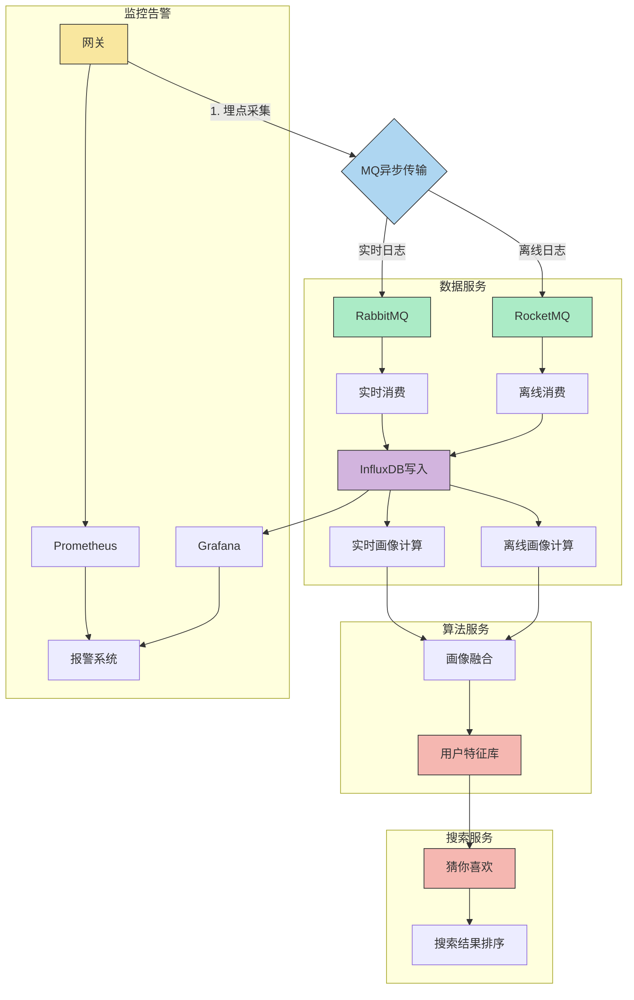

# 原项目产品原型

**产品原型**：

管理端：https://lanhuapp.com/link/#/invite?sid=qx03viNU Ssml

用户端：https://lanhuapp.com/link/#/invite?sid=qx0Fy3fa  ZsP3

# 启动流程总结&配置疑问

## 为什么我要改造项目

熟悉了《云岚到家》、《神领物流》、《天机学堂》、《四方保险》几个项目中，觉得天机学堂是我最有能力开发的。其他的项目要不就太复杂了导致我熟悉业务都要熟悉半天，要不就是得启动一堆服务巨占内存很难写代码，要不就是有的没前端代码不好改。

《谷粒随享》我已经改完了，但是感觉很多都是简单功能，所以就想到了天机学堂，毕竟有了《学成在线》的对比，更知道该怎么去加功能。

本项目中大部分新改造的功能的解决方案、代码都是我自己适配、改造的，希望我们也能通过完善旧项目去学到新东西，去品味技术。

## 启动流程

课后作业的笔记、考试等模块我用了master分支的代码，都以master分支代码为准。

### 后端

为了启动“天机学堂”项目，我们需要先去jenkins将每个微服务都给启动起来，然后去虚拟机使用dps命令查看几个微服务容器是否在线正常运行。此时距离微服务向nacos进行注册还需要一定时间，请稍作等待！

另外，有可能出现jenkins中点击，但是nacos没有注册的问题，这种需要重新在jenkins上启动，等待nacos上注册。

如果前端报错“服务不存在”，请检查接口对应的服务是否已经启动！

注意：在本机启动微服务进行测试时，要编辑配置为local

后端如果正常启动并在nacos中成功注册，应该一共有14个微服务。

### 前端

tj-protal是用户前台端，tj-admin是后台管理端

我已经通过虚拟机的gogs将代码拉到了我本地。先npm i下载依赖，然后在本机运行，命令：

```sh
npm run dev 
```

代理配置在src文件夹中的config里的proxy.js：

````js
export default {
  development: {
    // 开发环境接口请求
    // host: 'https://tjxt-dev.itheima.net/api',
    host: 'http://api.tianji.com',
    // 开发环境 cdn 路径
    cdn: '',
  },
  test: {
    // 测试环境接口地址
    host: 'https://tjxt-user-t.itheima.net/api',
    // 测试环境 cdn 路径
    cdn: '',
  },
  product: {
    // 正式环境接口地址
    host: 'https://tjxt-user-t.itheima.net/api',
    // 正式环境 cdn 路径
    cdn: '',
  },
};
````

在这里因为我们配置了DNS服务解析，所以http://api.tianji.com实际就是虚拟机里的地址。

一开始前端项目在我本机启动后进行访问会非常非常慢，在虚拟机自己的前端项目就很快，并且前端图片永远都显示不出来（在腾讯云转接的）。现在找到了原因：

用户端：在vite.config.js中，改一下服务器配置

```js
    server: {
      port: 18082,
      host: '0.0.0.0',
      proxy: {
        '/img-tx': {
          // target:  'https://tjxt-dev.itheima.net/', // 'http://172.17.2.134',
          target:  'http://www.tianji.com/',
          changeOrigin: true,
          // rewrite: (path) => {
          //   return path.replace(/^\/img-tx/, '')
          // }
        },
        // '/mock/3359':{
        //   target: 'http://172.17.0.137:8321/mock/3359',
        //   changeOrigin: true,
        // }
      }
    },
```

我们将target链接改为虚拟机地址即可。

管理端：

同样的文件，改一下图片配置即可

```js
 server: {
      port: 18081,
      host: "0.0.0.0",
      proxy: {
        '/img-tx': {
          // target:  'https://tjxt-dev.itheima.net/', // 'http://172.17.2.134',
          target:  'http://www.tianji.com/',
          changeOrigin: true,
          // rewrite: (path) => {
          //   return path.replace(/^\/img-tx/, '')
          // }
        },
      },
```

我们可以定期把改好的前端上传到虚拟机里。前端在虚拟机里的路径：/usr/local/src/里有tj-admin和tj-portal两个文件夹。

更新操作如下：删掉里之前的文件，本地执行打包操作npm run build会打包到dist文件夹，将dist文件夹分别拖入对应前台还是管理端的文件夹，然后执行nginx -s reload 重启nginx，即可完成新前端上线。

### nginx相关问题

在本项目中，nacos、gogs、jenkins等所有以xx.tianji.com访问的中间件实际上是在虚拟机里配置了nginx，然后通过nginx进行代理。

nginx在虚拟机的路径：

实际上本项目各种中间件、代码等都存放在了/usr/local/src这个目录下。

nginx的配置文件：

````conf
#user  nobody;
worker_processes  1;

#error_log  logs/error.log;
#error_log  logs/error.log  notice;
#error_log  logs/error.log  info;

#pid        logs/nginx.pid;


events {
    worker_connections  1024;
}


http {
    include       mime.types;
    default_type  application/octet-stream;

    #log_format  main  '$remote_addr - $remote_user [$time_local] "$request" '
    #                  '$status $body_bytes_sent "$http_referer" '
    #                  '"$http_user_agent" "$http_x_forwarded_for"';

    #access_log  logs/access.log  main;

    sendfile        on;
    #tcp_nopush     on;

    #keepalive_timeout  0;
    keepalive_timeout  65;

    #gzip  on;

    server {
        listen       80;
        server_name  localhost;

        #charset koi8-r;

        #access_log  logs/host.access.log  main;

        location / {
            root   html;
            index  index.html index.htm;
        }

        #error_page  404              /404.html;

        # redirect server error pages to the static page /50x.html
        #
        error_page   500 502 503 504  /50x.html;
        location = /50x.html {
            root   html;
        }
    }
  
    server {
       listen       80;
       server_name  git.tianji.com;
       location / {
            proxy_pass http://localhost:10880;
       }
    }
    server {
       listen       80;
       server_name  jenkins.tianji.com;
       location / {
            proxy_pass http://localhost:18080;
       }
    }
    server {
       listen       80;
       server_name  mq.tianji.com;
       location / {
            proxy_pass http://localhost:15672;
       }
    }
    server {
       listen       80;
       server_name  nacos.tianji.com;
       location / {
            rewrite /(.*)  /nacos/$1 break;
            proxy_pass http://localhost:8848;
       }
    }
    server {
       listen       80;
       server_name  xxljob.tianji.com;
       location / {
            rewrite /  /xxl-job-admin break;
            proxy_pass http://localhost:8880;
       }
       location /xxl-job-admin {
            proxy_pass http://localhost:8880;
       }
    }
    
    server {
       listen       80;
       server_name  es.tianji.com;
       location / {
            proxy_pass http://localhost:5601;
       }
    }
    server {
       listen       80;
       server_name  api.tianji.com;
       location / {
            proxy_set_header Host       $host; # 传递原始Host头
            proxy_pass http://192.168.150.101:10010;
            # proxy_pass http://192.168.150.1:10010; # 由于要修改网关在本地测试，所以代理到本地IP
       }
    }
    server {
       listen       80;
       server_name  www.tianji.com;
       location / {
            root /usr/local/src/tj-portal;
            index  index.html index.htm;
          #   proxy_pass http://192.168.150.1:18082;
       }
       location /img-tx {
            rewrite /img-tx/(.*)  /$1 break;
            proxy_pass http://wisehub-1312394356.cos.ap-shanghai.myqcloud.com;
       }
    }
    server {
       listen       80;
       server_name  manage.tianji.com;
       location / {
            root /usr/local/src/tj-admin;
            index  index.html index.htm;
          #   proxy_pass http://192.168.150.1:18081;
       }
       location /img-tx {
            rewrite /img-tx/(.*)  /$1 break;
            proxy_pass http://wisehub-1312394356.cos.ap-shanghai.myqcloud.com;
       }
    }
}

````

这里大家能看到/img-tx 被转接到了对应云服务器对象存储地址

## 业务问题

### 课程&优惠券过期问题

课程优惠券过期会导致我们测试不便。

如果是已经加入学习计划（已购买）的课程，如果课程过期，需要在learning_lesson中将expire_time字段设置时间长一些即可继续正常播放视频、练习考试等。访问课程视频只跟课程过期时间有关，和课程状态无关。


未购买课程只需要改course表的purchase_end_time字段即可。

优惠券，如果是已领取的只需要改coupon这一张表的term_end_time字段即可。未领取（等待领取）的需要改issue_end_time字段。

### 学习计划显示为空问题

学习中心-我的课程中，偶现最近学习与学习计划为空的情况，我们只需要根据LearningLessonServiceImpl.java的queryMyPlans方法，将数据库中已失效、已过期的课程给改回“学习中”即可


## 技术配置

### 网关怎么走的

以这个路径为例：

所有的路径都会先走到网关，利用上图箭头所指的短路径，由网关识别并将其分配到对应的微服务上，网关分配配置在tj-gateway/src/main/resources/bootstrap.yml，具体如下：(对应routes中的每个id)

```yml
    gateway:
      routes:
        - id: ms
          uri: lb://media-service
          predicates:
            - Path=/ms/**
        - id: as
          uri: lb://auth-service
          predicates:
            - Path=/as/**
          filters:
            - PreserveHostHeader
        - id: ds
          uri: lb://data-service
          predicates:
            - Path=/ds/**
        - id: sms
          uri: lb://message-service
          predicates:
            - Path=/sms/**
        - id: us
          uri: lb://user-service
          predicates:
            - Path=/us/**
        - id: cs
          uri: lb://course-service
          predicates:
            - Path=/cs/**
        - id: os
          uri: lb://order-service
          predicates:
            - Path=/os/**
        - id: ss
          uri: lb://search-service
          predicates:
            - Path=/ss/**
        - id: ls
          uri: lb://learning-service
          predicates:
            - Path=/ls/**
        - id: ps
          uri: lb://pay-service
          predicates:
            - Path=/ps/**
        - id: ts
          uri: lb://trade-service
          predicates:
            - Path=/ts/**
        - id: es
          uri: lb://exam-service
          predicates:
            - Path=/es/**
        - id: rs
          uri: lb://remark-service
          predicates:
            - Path=/rs/**
        - id: prs
          uri: lb://promotion-service
          predicates:
            - Path=/prs/**
```

### 前端图标


前端大部分图标是由iconfont已经配好并导入了，后面如果要新增图标比较难。所以后面可能会以element相关UI或者使用iconfont的原始svg代码改（可能会不雅观）

### 如何后端开放一个不用鉴权也可以访问的路径

在每个微服务的bootstrap.yml可以配置excludeLoginPaths


### 如何让新的微服务获取用户信息

有时候 UserContext.getUser();不能得到用户值，在message微服务中，我们需要在其pom文件中引入

````java
        <!--auth-sdk-->
        <dependency>
            <groupId>com.tianji</groupId>
            <artifactId>tj-auth-resource-sdk</artifactId>
            <version>1.0.0</version>
        </dependency> 
````

这样才可以成功获取到用户id，否则我们userId会拿到null

## 常见问题

### Nacos 中下线服务时，下线报错选举Leader失败问题的解决

Nacos注册中心一个微服务有多台实例的时候，点击一个实例下线操作，报错


Nacos 采用 raft 算法来计算 Leader，并且会记录前一次启动的集群地址，所以当我们自己的服务器 IP 改变时(这里特指自己学习时，在本地启动的同学，因为有时候我们的网络环境会变的 … WIFI，所以 IP 地址也经常变化)，会导致 raft 记录的集群地址失效，导致选 Leader 出现问题，只要删除 Nacos 根目录下 data 文件夹下的 protocol 文件夹即可。或者去重启nacos、以及手动将容器中的服务stop掉

### 前端规范

前端很多按钮实际是span标签、div标签等进行自己封装样式实现的，很少有直接调用elementUI

很多可以直接通过class里的内容来自定义样式。比如bt-red红色按钮 bt-round圆角按钮

```vue
         <!-- <el-button class="bt-round" type="primary" @click="openAddEvaluationDialog">
                    评价课程
                </el-button> -->
                <div class="bt bt-round ft-14" v-if="!isEvaluated" @click="openAddEvaluationDialog">评价课程</div>
```

# 项目bug修复&优化

## 交易微服务

### 前端点击购买单个课程提示优惠券获取失败


翻看了后端代码（tj-trade/src/main/java/com/tianji/trade/controller/OrderController.java）

```java
    @ApiOperation("预下单接口，生成订单id，确认订单可用优惠券信息")
    @GetMapping("prePlaceOrder")
    public OrderConfirmVO prePlaceOrder(@RequestParam("courseIds")List<Long> courseIds) {
        return orderService.prePlaceOrder(courseIds);
    }
```

发现前端根本没传courseIds！

前端定位到src\pages\classDetails\index.vue：（被注释掉的代码是之前的错误代码，增加了将courseIds参数传入跳转页面）

````js
// 立即购买
const payHandle = () => {
  // if(!validation()){
  //   return;
  // }
  // store.setOrderClassInfo([baseDetailsData.value])
  // router.push({path: '/pay/settlement'})
  if(!validation()){
    return;
  }
  store.setOrderClassInfo([baseDetailsData.value]);
  
  // 获取 courseIds（假设从 baseDetailsData 中获取）
  const courseIds = baseDetailsData.value?.courseIds || [];
  
  // 路由跳转并携带参数
  router.push({
    path: '/pay/settlement',
    query: {
      courseIds: detailsId.value  // 转为字符串（如 "1,2,3"）
    }
  });
}
````

### 偶现取消订单失败

如果没优惠券的话，getCouponIds字段是null，再调用优惠券微服务退还就报错了。

````java
   @Override
    @Transactional
    public void cancelOrder(Long orderId, OrderCancelReason cancelReason) {
        Long userId = UserContext.getUser();
        // 1.查询订单
        Order order = getById(orderId);
        if (order == null || !userId.equals(order.getUserId())) {
            throw new BadRequestException(ORDER_NOT_EXISTS);
        }
        // 2.判断订单状态是否已经取消，幂等判断
        if(OrderStatus.CLOSED.equalsValue(order.getStatus())){
            // 订单已经取消，无需重复操作
            return;
        }
        // 3.判断订单是否未支付，只有未支付订单才可以取消
        if(!OrderStatus.NO_PAY.equalsValue(order.getStatus())){
            throw new BizIllegalException(ORDER_ALREADY_FINISH);
        }
        // 4.可以更新订单状态为取消了
        boolean success = lambdaUpdate()
                .set(Order::getStatus, OrderStatus.CLOSED.getValue())
                .set(Order::getMessage, cancelReason.getMsg())
                .set(Order::getCloseTime, LocalDateTime.now())
                .eq(Order::getStatus, OrderStatus.NO_PAY.getValue())
                .eq(Order::getId, orderId)
                .update();
        if (!success) {
            return;
        }
        // 5.更新订单条目的状态
        detailService.updateStatusByOrderId(orderId, OrderStatus.CLOSED.getValue());

        // 6.退还优惠券
        if(CollUtils.isNotEmpty(order.getCouponIds())){
            promotionClient.refundCoupon(order.getCouponIds());
        }
    }
````

### 管理端访问退款管理界面无法加载、报错

根据访问接口（http://api.tianji.com/ts/refund-apply/page?pageSize=10&pageNo=1）直接定位到RefundApplyServiceImpl的queryRefundApplyByPage方法，打断点发现是getRefundUserInfo报错。

```java
    private Map<Long, UserDTO> getRefundUserInfo(List<RefundApply> records) {
        Set<Long> uIds = new HashSet<>();
        for (RefundApply record : records) {
            uIds.add(record.getCreater());
            uIds.add(record.getApprover());
        }
        uIds.remove(null);
        List<UserDTO> userDTOS = userClient.queryUserByIds(uIds);
        if (userDTOS.size() != uIds.size()) {
            //这里是因为用户可能信息被删除了，导致id在数据库中查不到，粗暴的抛异常会导致整页无法显示，感觉不应该这样
            throw new BizIllegalException("用户数据有误");
        }
        return userDTOS.stream().collect(Collectors.toMap(UserDTO::getId, u -> u));
    }

```

主要原因是之前有个用户id为5的退款记录，但是这个id为5的用户被删除了，在数据库查不到他的详细信息，报错。但是我觉得粗暴的抛异常不合理，直接略过就行了。

### 结算因为没优惠券出错

前端问题，如果未获取到优惠券，前端会传入couponIds的size为1，但是是个空字符串，导致远程调用优惠券微服务报错。


```java
// 优惠券Id
const couponIds = ref(null)
```

## 考试微服务

### 考试表设计

需要两张表：exam_record、exam_record_detail

````sql
CREATE TABLE `exam_record` (
  `id` bigint NOT NULL AUTO_INCREMENT COMMENT '考试id',
  `type` tinyint DEFAULT NULL COMMENT '类型，1-考试，2-练习',
  `course_id` bigint DEFAULT NULL COMMENT '课程id',
  `section_id` bigint DEFAULT NULL COMMENT '小节id',
  `user_id` bigint NOT NULL COMMENT '用户id',
  `score` int DEFAULT NULL COMMENT '实际得分',
  `correct_questions` int DEFAULT NULL COMMENT '正确答题数',
  `duration` int DEFAULT NULL COMMENT '考试用时',
  `finished` bit(1) DEFAULT b'0' COMMENT '是否完成',
  `create_time` datetime DEFAULT CURRENT_TIMESTAMP COMMENT '开始时间',
  `finish_time` datetime DEFAULT NULL COMMENT '交卷时间',
  `update_time` datetime DEFAULT NULL ON UPDATE CURRENT_TIMESTAMP COMMENT '更新时间',
  PRIMARY KEY (`id`)
) ENGINE=InnoDB AUTO_INCREMENT=11 DEFAULT CHARSET=utf8mb4 COLLATE=utf8mb4_0900_ai_ci COMMENT='考试记录表';

CREATE TABLE `exam_record_detail` (
  `id` bigint NOT NULL AUTO_INCREMENT COMMENT 'id',
  `exam_id` bigint NOT NULL COMMENT '考试记录id',
  `question_id` bigint DEFAULT NULL COMMENT '问题id',
  `correct` bit(1) DEFAULT b'0' COMMENT '是否正确',
  `score` int DEFAULT NULL COMMENT '本题得分',
  `answer` varchar(255) DEFAULT NULL COMMENT '考生答案',
  `comment` varchar(255) DEFAULT NULL COMMENT '教师评语',
  `create_time` datetime DEFAULT CURRENT_TIMESTAMP COMMENT '开始时间',
  `update_time` datetime DEFAULT NULL ON UPDATE CURRENT_TIMESTAMP COMMENT '更新时间',
  PRIMARY KEY (`id`)
) ENGINE=InnoDB AUTO_INCREMENT=5 DEFAULT CHARSET=utf8mb4 COLLATE=utf8mb4_0900_ai_ci COMMENT='考试记录明细表';
````

### 前端无法正常提交考试

发现正常答题后点击提交按钮无效，发现前端根本没发请求，看控制台报错：TypeError: n.answers.sort is not a function

问了AI：这个错误 `TypeError: n.answers.sort is not a function` 表明你试图对一个非数组对象调用 `sort()` 方法。在 JavaScript 中，只有数组类型才有 `sort()` 方法

定位到前端代码（src\pages\learning\components\Practise.vue）：

````js
const postSubjectHandle = async () => {
  const param = params.value.map(el => {
    return { questionId: el.id, answer: el.answers.sort((i1, i2) => parseInt(i1)-parseInt(i2)).toString(), questionType: el.type }
  });
  await postSubject({ examDetails: param, id: examId.value })
    .then((res) => {
      if (res.code === 200) {
        subjectList.value = res.data
        isSubmit.value = true
        ElMessage({
          message: '答案提交成功, 请前往个人中心查看',
          type: 'success'
        })
        emit('playHadle', { item: currentPlayData.value, tp: '9' })
      } else {
        ElMessage({
          message: res.msg,
          type: 'error'
        });
      }
    })
    .catch(() => {
      ElMessage({
        message: "学习计划获取请求出错！",
        type: 'error'
      });
    });
}
````

让AI改了一下:

````js
const postSubjectHandle = async () => {
  const param = params.value.map(el => {
    // 确保 answers 是数组且不为空
    const answersArray = Array.isArray(el.answers) ? el.answers : [];
    
    // 过滤掉无效值并转换为数字
    const validAnswers = answersArray
      .filter(answer => answer !== null && answer !== undefined && answer !== '')
      .map(answer => parseInt(answer));
    
    // 排序并转换为字符串
    const sortedAnswers = validAnswers.sort((a, b) => a - b).join(',');
    
    return { 
      questionId: el.id, 
      answer: sortedAnswers, 
      questionType: el.type 
    };
  });

  try {
    const res = await postSubject({ examDetails: param, id: examId.value });
    if (res.code === 200) {
      subjectList.value = res.data;
      isSubmit.value = true;
      ElMessage({
        message: '答案提交成功, 请前往个人中心查看',
        type: 'success'
      });
      emit('playHadle', { item: currentPlayData.value, tp: '9' });
    } else {
      ElMessage({
        message: res.msg,
        type: 'error'
      });
    }
  } catch (error) {
    ElMessage({
      message: "学习计划获取请求出错！",
      type: 'error'
    });
  }
};
````

AI修复思路：需要确保 `el.answers` 是一个数组，并且包含可排序的元素。

保存后在本地重启项目，发现可以正常提交，并留存考试记录。

### 我的考试 页面中前端无法正常展示“考试类型”、“考试时间”

字段写错了，前端考试字段是commitTime，后端是finishTime。文件：src\pages\personal\components\ExamTable.vue

```vue
 <el-table-column prop="finishTime" align="center" label="考试时间" width="180" >
        <template #default="scope">
          <span>{{scope.row.finishTime ? scope.row.finishTime : '--'}}</span>
        </template>
</el-table-column>
<el-table-column prop="type" align="center" label="类型" width="100" >
    <template #default="scope">
<span>{{scope.row.type == 1 ? '考试' : '练习'}}</span>
    </template>
</el-table-column>
```

src\pages\personal\myExamDetails.vue中：

```vue
         <div  class="td fx-1">
            <div class="marg-bt-10 ft-wt-600 ft-cl-1">提交时间</div>
            <div>{{$route.query.finishTime}}</div>
          </div>
```

## 学习微服务

### 笔记表设计

````sql
CREATE TABLE `note` (
  `id` bigint NOT NULL DEFAULT '0' COMMENT '笔记id',
  `user_id` bigint NOT NULL COMMENT '用户id',
  `course_id` bigint DEFAULT NULL COMMENT '课程id',
  `chapter_id` bigint DEFAULT NULL COMMENT '章id',
  `section_id` bigint DEFAULT NULL COMMENT '小节id',
  `note_moment` int DEFAULT NULL COMMENT '记录笔记时的视频播放时间',
  `content` varchar(255) CHARACTER SET utf8mb4 COLLATE utf8mb4_general_ci DEFAULT NULL COMMENT '笔记内容',
  `is_private` bit(1) DEFAULT b'0' COMMENT '是否是隐私笔记',
  `hidden` bit(1) DEFAULT b'0' COMMENT '是否被折叠（隐藏）',
  `hidden_reason` varchar(255) CHARACTER SET utf8mb4 COLLATE utf8mb4_general_ci DEFAULT NULL COMMENT '被隐藏的原因',
  `author_id` bigint DEFAULT NULL COMMENT '笔记作者id',
  `gathered_note_id` bigint DEFAULT NULL COMMENT '被采集笔记的id',
  `is_gathered` bit(1) DEFAULT b'0' COMMENT '是否是采集他人的笔记',
  `create_time` datetime DEFAULT CURRENT_TIMESTAMP COMMENT '创建时间',
  `update_time` datetime DEFAULT CURRENT_TIMESTAMP ON UPDATE CURRENT_TIMESTAMP COMMENT '更新时间',
  PRIMARY KEY (`id`)
) ENGINE=InnoDB DEFAULT CHARSET=utf8mb4 COLLATE=utf8mb4_general_ci COMMENT='笔记表';
````

### “我的笔记”界面无法成功取消采集笔记

对比在“全部笔记”和“我的笔记”中取消采集笔记的请求，发现在全部笔记中取消采集，向后端发的是原始笔记（你采集的笔记）的id，而在我的笔记中取消采集，向后端发的是你自己新采集笔记的id，因为id不同导致bug出现。

因为分页查询的数据没有具体的“采集原始笔记的id”信息，所以后端需要适配一下两种id的传法

```java
    @Override
    public void removeGatherNote(Long id) {
        Long gatheredNoteId = baseMapper.selectById(id).getGatheredNoteId();
        if(gatheredNoteId != null){
            //说明是传入的id不是原始笔记id，是自己的id
            id =  gatheredNoteId;
        }
        // 1.笔记删除条件
        LambdaUpdateWrapper<Note> queryWrapper =
                Wrappers.lambdaUpdate(Note.class)
                        .eq(Note::getUserId, UserContext.getUser())
                        .eq(Note::getGatheredNoteId, id);
        // 2.删除笔记
        baseMapper.delete(queryWrapper);
    }
```

### 笔记用户端无法点赞

前端给笔记点赞后并不会给后端发送请求。经过查看，播放视频时笔记没有点赞选项，那我们就只完善在课程界面的点赞吧。

一开始以为只要像回复一样，改改前端什么的就行了。后面才发现master好多关于笔记点赞相关代码没写，以及我一开始设计的笔记表压根没有点赞数这个字段，好吧，顺手将点赞数和采集数都加到数据库表吧。

````sql
CREATE TABLE `note` (
  `id` bigint NOT NULL DEFAULT '0' COMMENT '笔记id',
  `user_id` bigint NOT NULL COMMENT '用户id',
  `course_id` bigint DEFAULT NULL COMMENT '课程id',
  `chapter_id` bigint DEFAULT NULL COMMENT '章id',
  `section_id` bigint DEFAULT NULL COMMENT '小节id',
  `note_moment` int DEFAULT NULL COMMENT '记录笔记时的视频播放时间',
  `content` varchar(255) CHARACTER SET utf8mb4 COLLATE utf8mb4_general_ci DEFAULT NULL COMMENT '笔记内容',
  `is_private` bit(1) DEFAULT b'0' COMMENT '是否是隐私笔记',
  `gathered_times` int NOT NULL DEFAULT '0' COMMENT '被采集次数',
  `liked_times` int NOT NULL DEFAULT '0' COMMENT '点赞数量',
  `hidden` bit(1) DEFAULT b'0' COMMENT '是否被折叠（隐藏）',
  `hidden_reason` varchar(255) CHARACTER SET utf8mb4 COLLATE utf8mb4_general_ci DEFAULT NULL COMMENT '被隐藏的原因',
  `author_id` bigint DEFAULT NULL COMMENT '笔记作者id',
  `gathered_note_id` bigint DEFAULT NULL COMMENT '被采集笔记的id',
  `is_gathered` bit(1) DEFAULT b'0' COMMENT '是否是采集他人的笔记',
  `create_time` datetime DEFAULT CURRENT_TIMESTAMP COMMENT '创建时间',
  `update_time` datetime DEFAULT CURRENT_TIMESTAMP ON UPDATE CURRENT_TIMESTAMP COMMENT '更新时间',
  PRIMARY KEY (`id`)
) ENGINE=InnoDB DEFAULT CHARSET=utf8mb4 COLLATE=utf8mb4_general_ci COMMENT='笔记表';
````

然后需要在Note实体类增加这两个字段，以及别忘了在mapper的xml文件里的sql查询也都补充上这两个字段。

注意在NoteVo类中补充上这两个字段：

```java
    @ApiModelProperty("是否点过赞")
    private Boolean liked;
    @ApiModelProperty("点赞数量")
    private Integer likedTimes;
    @ApiModelProperty("被采集数量")
    private Integer gatheredTimes;
```

下面我们先仿照回复的点赞，利用MQ来实现点赞异步到数据库吧，定位到LikedRecordListener.java

为了防止重名，将之前的问答点赞方法改个名，改完后文件：

````java
   /**
     * QA问答系统 消费者
     * @param
     */
    @RabbitListener(bindings = @QueueBinding(
            value = @Queue(value = "qa.liked.times.queue",durable = "true"),
            exchange = @Exchange(value = MqConstants.Exchange.LIKE_RECORD_EXCHANGE,type = ExchangeTypes.TOPIC),
            key=MqConstants.Key.QA_LIKED_TIMES_KEY
    ))
    public void onQAMsg(List<LikedTimesDTO>  list){
        log.info("QA-LikedRecordListener监听到消息：{}",list);
        List<InteractionReply> replyList =new ArrayList<>();
        for (LikedTimesDTO dto : list) {
            InteractionReply reply =new InteractionReply();
            reply.setLikedTimes(dto.getLikedTimes());
            reply.setId(dto.getBizId());

            replyList.add(reply);
        }
        replyService.updateBatchById(replyList);
    }


    /**
     * NOTE 笔记系统 消费者
     * @param
     */
    @RabbitListener(bindings = @QueueBinding(
            value = @Queue(value = "note.liked.times.queue",durable = "true"),
            exchange = @Exchange(value = MqConstants.Exchange.LIKE_RECORD_EXCHANGE,type = ExchangeTypes.TOPIC),
            key=MqConstants.Key.NOTE_LIKED_TIMES_KEY
    ))
    public void onNoteMsg(List<LikedTimesDTO>  list){
        log.info("NOTE-LikedRecordListener监听到消息：{}",list);
        List<Note> noteList = new ArrayList<>();
        for (LikedTimesDTO dto : list) {
            Note note =new Note();
            note.setLikedTimes(dto.getLikedTimes());
            note.setId(dto.getBizId());

            noteList.add(note);
        }
        noteService.updateBatchById(noteList);
    }
````

这下点赞的同步就完成了，我们还需要对采集/取消采集进行采集数改动操作：

````java
    @Override
    @Transactional
    public void gatherNote(Long id) {
        // 1.获取用户
        Long userId = UserContext.getUser();
        // 2.判断笔记是否存在
        Note note = getById(id);

        if (note == null || note.getIsPrivate() || note.getHidden()) {
            throw new BadRequestException("笔记不存在");
        }
        // 3.另存一份
        note.setGatheredNoteId(note.getId());
        note.setIsGathered(true);
        note.setIsPrivate(true);
        note.setUserId(userId);
        note.setId(null);
        save(note);
        updateOriginGatheredNote(id,1);
        // 4.发送mq消息
        mqHelper.send(LEARNING_EXCHANGE, NOTE_GATHERED, userId);
    }

    @Override
    public void removeGatherNote(Long id) {
        Long gatheredNoteId = baseMapper.selectById(id).getGatheredNoteId();
        if(gatheredNoteId != null){
            //说明是传入的id不是原始笔记id，是自己的id,所以我们需要将他变为原采集笔记id
            id =  gatheredNoteId;
        }
        updateOriginGatheredNote(id,-1);
        // 1.笔记删除条件
        LambdaUpdateWrapper<Note> queryWrapper =
                Wrappers.lambdaUpdate(Note.class)
                        .eq(Note::getUserId, UserContext.getUser())
                        .eq(Note::getGatheredNoteId, id);
        // 2.删除笔记
        baseMapper.delete(queryWrapper);
    }

    public void updateOriginGatheredNote(Long id,Integer count){
        Note note = getById(id);
        note.setGatheredTimes(note.getGatheredTimes()+count);
        updateById(note);
    }
````

分页查询时，需要判断出“是否点过赞”、“是否采集过”，所以我们需要改造下分页查询最终的封装方法。

```java
   private PageDTO<NoteVO> parseNotePages(Page<Note> page) {
        // 1.非空判断
        List<Note> records = page.getRecords();
        if (CollUtils.isEmpty(records)) {
            return PageDTO.empty(page);
        }
        // 2.查询笔记作者
        Set<Long> userIds = records.stream().map(Note::getAuthorId).collect(Collectors.toSet());
        List<UserDTO> stuInfos = userClient.queryUserByIds(userIds);
        Map<Long, UserDTO> sMap = CollUtils.isEmpty(stuInfos) ?
                new HashMap<>() :
                stuInfos.stream().collect(Collectors.toMap(UserDTO::getId, s -> s));

        // 3.处理VO
        List<NoteVO> list = new ArrayList<>(records.size());

        // 4. 查询用户点赞状态
        Set<Long> bizLiked = remarkClient.getLikesStatusByBizIds(records.stream().map(i->i.getId()).collect(Collectors.toSet()));
        for (Note r : records) {
            NoteVO v = BeanUtils.toBean(r, NoteVO.class);
            UserDTO author = sMap.get(r.getAuthorId());
            if(author != null) {
                v.setAuthorId(author.getId());
                v.setAuthorName(author.getName());
                v.setAuthorIcon(author.getIcon());
            }
            v.setIsGathered(BooleanUtils.isTrue(r.getIsGathered()));
            v.setLiked(bizLiked.contains(r.getId()));
            list.add(v);
        }
        return new PageDTO<>(page.getTotal(), page.getPages(), list);
    }
```

改完后端，我们最终要修改一下前端，以及前端的样式，定位到src\pages\classDetails\components\Note.vue

````vue
     <span @click="gathersHandle(item)" class="marg-rt-20" :class="{activeLiked:item.isGathered}" v-if="userInfo.id != item.authorId "><i class="iconfont zhy-a-btn_caiji_nor2x" styel="font-size: 22px;" ></i> {{item.isGathered ? '已采集' : '采集'}} {{item.gatheredTimes || 0}}</span>
     <span @click="likedHandle(item)" :class="{activeLiked:item.liked}" ><i class="iconfont zhy-a-btn_zan_nor2x"></i> 点赞 {{item.likedTimes || 0}}</span>
````

```js
const gathersHandle = async item => {
  item.isGathered ? item.gatheredTimes-- : item.gatheredTimes++
  item.isGathered ? unNotesGathersData(item) : notesGathersData(item) 
}
```

```js
// 点赞
const likedHandle = async (item) => {
  await putLiked({bizId:item.id, liked:!item.liked, bizType: "NOTE"})
    .then((res) => {
      if (res.code == 200) {
        item.liked = !item.liked
        item.liked ? item.likedTimes++ : item.likedTimes--
      } else {
        ElMessage({
          message:res.data.msg,
          type: 'error'
        });
      }
    })
    .catch(() => {
      ElMessage({
        message: "点赞请求出错！",
        type: 'error'
      });
    });
}
```

至此，我们不仅实现了笔记点赞功能，还实现了笔记采集计数功能。

### 补充增加积分的多种方式

这里为了省事，我们索性把之前的签到、学习、回复、写笔记、笔记被采集、课程评价 这6种能增加积分的方法都重构一下吧。（PS：课程评价功能后续再做，这里先写上枚举类）

先来mq文件夹的LearningPointsListener.java

```java
    /**
     * 签到增加的积分
     * @param msg
     */
    @RabbitListener(bindings = @QueueBinding(
            value = @Queue(value = "sign.points.queue",durable = "true"),
            exchange = @Exchange(value = MqConstants.Exchange.LEARNING_EXCHANGE,type = ExchangeTypes.TOPIC),
            key = MqConstants.Key.SIGN_IN
    ))
    public void listenSignInListener(SignInMessage msg){
        log.debug("消费到签到增加的积分  消费到消息：{}",msg);
        recordService.addPointsRecord(msg, PointsRecordType.SIGN);
    }

    /**
     * 问答增加的积分
     * @param msg
     */
    @RabbitListener(bindings = @QueueBinding(
            value = @Queue(value = "qa.points.queue",durable = "true"),
            exchange = @Exchange(value = MqConstants.Exchange.LEARNING_EXCHANGE,type = ExchangeTypes.TOPIC),
            key = MqConstants.Key.WRITE_REPLY
    ))
    public void listenReplyListener(SignInMessage msg){
        log.debug("消费到问答增加的积分  消费到消息：{}",msg);
        recordService.addPointsRecord(msg, PointsRecordType.QA);
    }

    @RabbitListener(bindings = @QueueBinding(
            value = @Queue(name = "learning.points.queue", durable = "true"),
            exchange = @Exchange(name = MqConstants.Exchange.LEARNING_EXCHANGE, type = ExchangeTypes.TOPIC),
            key = MqConstants.Key.LEARN_SECTION
    ))
    public void listenLearnSectionMessage(SignInMessage msg){
        log.debug("消费到学习增加的积分  消费到消息：{}",msg);
        recordService.addPointsRecord(msg,  PointsRecordType.LEARNING);
    }

    @RabbitListener(bindings = @QueueBinding(
            value = @Queue(name = "note.new.points.queue", durable = "true"),
            exchange = @Exchange(name = MqConstants.Exchange.LEARNING_EXCHANGE, type = ExchangeTypes.TOPIC),
            key = MqConstants.Key.WRITE_NOTE
    ))
    public void listenWriteNoteMessage(SignInMessage msg){
        recordService.addPointsRecord(msg, PointsRecordType.NOTE);
    }

    @RabbitListener(bindings = @QueueBinding(
            value = @Queue(name = "note.gathered.points.queue", durable = "true"),
            exchange = @Exchange(name = MqConstants.Exchange.LEARNING_EXCHANGE, type = ExchangeTypes.TOPIC),
            key = MqConstants.Key.NOTE_GATHERED
    ))
    public void listenNoteGatheredMessage(SignInMessage msg){
        recordService.addPointsRecord(msg,  PointsRecordType.NOTE);
    }

    @RabbitListener(bindings = @QueueBinding(
            value = @Queue(name = "course.comment.points.queue", durable = "true"),
            exchange = @Exchange(name = MqConstants.Exchange.LEARNING_EXCHANGE, type = ExchangeTypes.TOPIC),
            key = MqConstants.Key.COURSE_COMMENT
    ))
    public void listenCourseCommentMessage(SignInMessage msg){
        recordService.addPointsRecord(msg,  PointsRecordType.NOTE);
    }

```

为了让项目的积分规则标准化，我们在LearningConstants中追加：

````java
    /*积分相关*/
    /* 写回答 */
    Integer REWARD_WRITE_REPLY = 5;
    /* 签到 */
    Integer REWARD_SIGN_IN = 1;
    /* 学习视频 */
    Integer REWARD_LEARN_SECTION = 10;
    /* 写笔记 */
    Integer REWARD_WRITE_NOTE = 3;
    /* 笔记被采集 */
    Integer REWARD_NOTE_GATHERED = 2;
    /* 课程评价 */
    Integer REWARD_COURSE_COMMENT = 10;
````

统一完枚举类后，我们只需要在用户完成对应行为时候进行积分追加即可。

签到：

```java
    //保存积分
        mqHelper.send(MqConstants.Exchange.LEARNING_EXCHANGE,
                MqConstants.Key.SIGN_IN,
                SignInMessage.of(userId,rewardPoints+ LearningConstants.REWARD_SIGN_IN)
        );
```

回复

````java
   //判断是否为学生提交
        if(dto.getIsStudent()){
            question.setStatus(QuestionStatus.UN_CHECK);
            // 学生才需要累加积分
            mqHelper.send(MqConstants.Exchange.LEARNING_EXCHANGE,
                    MqConstants.Key.WRITE_REPLY,
                    SignInMessage.of(userId,LearningConstants.REWARD_WRITE_REPLY)
            );
        }
````

学习视频：（这里在handleVideoRecord方法）

```java
    mqHelper.send(MqConstants.Exchange.LEARNING_EXCHANGE,
                MqConstants.Key.LEARN_SECTION,
                SignInMessage.of(userId, LearningConstants.REWARD_LEARN_SECTION)
        );
```

保存笔记：

````java
    // 4.发送mq消息 增加积分
        mqHelper.send(MqConstants.Exchange.LEARNING_EXCHANGE,
                WRITE_NOTE,
                SignInMessage.of(userId, LearningConstants.REWARD_WRITE_NOTE)
        );
````

注意一下，被采集笔记获得积分中，要将采集笔记中传的userId为笔记作者

````java
  @Override
    @Transactional
    public void gatherNote(Long id) {
        // 1.获取用户
        Long userId = UserContext.getUser();
        // 2.判断笔记是否存在
        Note note = getById(id);
        Long originUserId = note.getUserId();
        if (note == null || note.getIsPrivate() || note.getHidden()) {
            throw new BadRequestException("笔记不存在");
        }
        // 3.另存一份
        note.setGatheredNoteId(note.getId());
        note.setIsGathered(true);
        note.setIsPrivate(true);
        note.setUserId(userId);
        note.setId(null);
        save(note);
        updateOriginGatheredNote(id,1);
        // 4.发送mq消息 增加积分
        mqHelper.send(MqConstants.Exchange.LEARNING_EXCHANGE,
                NOTE_GATHERED,
                SignInMessage.of(originUserId, LearningConstants.REWARD_NOTE_GATHERED)
        );
    }
````

到此为止，就大功告成了，用户的互动行为就增加到积分了。

### 管理端分页查询笔记部分字段不全

根源出自NoteAdminVO和NoteAdminDetailVO。

前端分页查询要求查出笔记的引用次数和点赞次数，但是NoteAdminVO都没有....我们加上就行了。但是前端这边似乎有点不认我们的字段（前端是likeTimes，我是likedTimes，这里主要是为了和回复的点赞字段命名一致）

然后就改一下后台管理端的前端代码就好啦~

```vue
     <el-table-column
        prop="gatheredTimes"
        label="引用次数"
        sortable
        min-width="150"
      >
      </el-table-column>
      <el-table-column label="点赞次数" sortable min-width="150">
        <template #default="scope">
          {{ scope.row.likedTimes ? scope.row.likedTimes : "0" }}
        </template>
      </el-table-column>
```

在详情界面加上点赞数和被引用次数，并且修修样式：

````vue
       <tr>
          <td>所选时间</td>
          <td width="20%">{{formatSeconds(fromData.noteMoment)}}</td>
          <td width="20%">被引用次数</td>
          <td width="10%">{{fromData.gatheredTimes?fromData.gatheredTimes:0}}</td> 
          <td width="20%">点赞次数</td>
          <td width="10%">{{fromData.likeTimes?fromData.likeTimes:0}}</td>
          <td width="20%">是否展示</td>
          <td width="20%">{{!fromData.hidden?'显示':'隐藏'}}</td>
        </tr>
````

### 学习计划中对已失效的课程，前端显示删除课程，点击删除课程仍然弹出修改计划对话框

首先是前端的问题，点击删除课程，仍然像修改计划一样弹出对话框，并且将当前计划id传入。

````vue
  <div class="btn" v-if="type == '2' && data.status == 3" @click="planActive(data.id, 'del')">
        <span class="bt-grey bt-round">删除课程</span>
      </div>
````

````js
// 打开创建、修改弹窗
const planHandle = (val) => {
  const {data, type} = val
  dialogVisible.value = true
  currentData.value = data
  if (type == 'edit') {
    number.value = data.weekFreq
    days.value = data.sections
    title.value = '修改计划'
  } else if (type == 'add') {
    days.value = data.sections
    title.value = '创建计划'
  } else if (type == 'del') {
    dialogVisible.value = false
    delMyClassData(currentData.value)
  }
}
````

后端接口：

```java
 //刪除我的课程
    @ApiOperation("刪除我的课程")
    @DeleteMapping("/{id}")
    public void deleteMyLessons(@PathVariable("id") Long id){
        learningLessonService.deleteMyLessons(id);
    }
```

````java
    @Override
    public void deleteMyLessons(Long id) {
        Long userId = UserContext.getUser();
        LearningLesson lesson = getById(id);
        if(!lesson.getUserId().equals(userId)){
            throw new BizIllegalException("只能删除自己的课程！");
        }
        if(lesson.getStatus()!=LessonStatus.EXPIRED){
            throw new BizIllegalException("只能删除状态为已过期的课程!");
        }

        baseMapper.deleteById(id);
    }
````

### 管理端问答管理回答次数无法显示、无法点赞

因为回答次数对应字段出错，应该为：answerTimes

点赞是在remark微服务下，所以要改为rs开头，不要ls开头

```js
// 设置点赞或者取消点赞
export const setLiked = (data) =>
  request({
    url: `/rs/likes`,
    method: "post",
    data,
  })
```

点赞需要传业务id和业务类型，前端没传，要补充

```js
  let parent = {
    bizId: baseData.id,
    bizType:"QA",
    liked: baseData.liked,
  };
```

### 课程播放端无法显示回答列表

前端问答查询参数忘记添加courseId

```js
// 问答列表参数
const params = ref({
  isAsc:true,
  pageNo: 1,
  pageSize: 1000,
  sectionId: currentPlayData.sectionId,
  courseId: currentPlayData.courseId,
  sortBy: '',
  onlyMine: false
});
```

# 扩展功能想法&思路

这里是我打算为项目新增的扩展功能。

## 鉴权微服务（已完成）

目标：

- 短信验证码登录
- 注册功能（需要调用短信验证码接口）
- 找回密码

## 课程微服务（完成度：4/7）

目标：

- 前台首页轮播图改为从后台获取课程展示，并实现点击轮播图可以跳转对应界面（最好轮播图设计为管理端可以配置）
- 用户实现课程评价：定时统计课程评分（前端已有）
- 课程收藏（前端已有）
- 课程分享（微信？）
- 猜你喜欢模块（课程介绍中猜你喜欢模块是前端写死的，可以用大数据进行个性分析？）
- 常见问题（常见问题前端写死，可以改为由管理端动态配置？）
- 课程播放新增弹幕

## 数据微服务（完成度：2/7）

目标：

- 将工作台所有展示数据实时化：
  - 今日数据：今日访问量、今日订单金额、今日订单笔数、今日新增学员。（另外点击更新时间按钮即可手动更新）
  - 待办事项：退款待审批、优惠券待发布
  - 关键词TOP10：词云
  - 数据看板（近15天）：核心指标（访问量、订单金额、订单笔数、新增学员）、交易统计（订单金额、订单笔数、客单价）、用户统计（学员总数、新增学员、日活跃用户数）、流量统计（访客数、购买量）
  - 上周热门课程TOP10：排名、课程分类、课程名称、新增学员(人)、课程金额(元)
  - 上周热销课程TOP10：排名、课程分类、课程名称、新增学员(人)、课程金额(元)
  - 消息动态：类似新增题目、课程、优惠券等信息会异步到消息动态中

## 考试微服务（完成度：1/3）

目标：

- 考试系统防作弊：
  - 前端实时监控考生行为（多浏览器标签切换、面部识别、题目泄露溯源）。
  - WebSocket实时日志上报、OpenCV行为分析、Elasticsearch记录异常模式。
- 老师可以对题目写评语
- 题目从选择题、判断题等新增简答题，老师可以阅卷。用户可以催促老师阅卷，老师收到阅卷提醒（私信）

## 学习微服务（完成度：1/6）

目标：

- 排行榜升级：排行榜分库分表存储数据
- 学习笔记协同编辑：实现类似Google Docs的多人实时协作笔记，解决冲突合并问题。利用WebSocket长连接、MongoDB存储版本快照
- 学习小组：Redis Geo定位就近匹配学员，多个课程学员可以组队一起学习打卡、有积分奖励，可以在小组群发消息，类似群聊功能。
- 补签：可以通过消耗积分进行补签
- 积分商城：可以通过积分购买一些实物、或虚拟头衔
- 悬赏提问：学员提问时可质押金币，最佳答案获得者分账，引入经济模型激励互动（金币可以在支付微服务中进行支付）

## 媒资微服务（已完成）

目标：

- 文件上传集成Minio

- 上传大媒资文件实现分片上传、断点续传、秒传功能

## 消息微服务（已完成）

目标：

- 短信模块：短信异步发送、短信模板配置、短信平台信息配置、短信发送日志监控
- 系统通告：管理端发布系统公告，前台用户可以查看到系统公告（无需登录）
- 用户私信：学生与学生之间私信、学生与老师之间私信、私信发送、私信已读/未读、私信提醒（MQ）

## 支付微服务（已完成）

目标：

- 接入支付宝跳转/扫码支付（未实现）（参考尚品汇）
- 支付对账，定时任务进行每天差异化报告

## 搜索微服务（已完成）

目标：

- 课程检索提词：搜索提词器
- 记录检索历史
- 课程推荐接口（主要是根据兴趣爱好进行推荐，去es查）（精品好课、新课推荐、精品公开课接口）

## 交易微服务（完成度：2/3）

目标：

- 通过 定时任务、MQ 等实现数据的真实性（例如每1小时统计一次放入redis中）
- 将订单状态使用订单状态机思想，改造订单状态流转情况（模仿云岚到家）
- 增加VIP会员功能

## 用户微服务（完成度：1/2）

目标：

- 前台用户可以修改自己的个人信息（昵称、性别、头像、绑定手机、绑定邮箱、密码）
- 定时统计教师评分，为教师能力画像，给教师打上多个标签

## 前端杂务（已完成）

目标：

- 完善页脚底部相关链接信息


- 天机学堂名字可以尝试改为其他有辨识度的、前端UI风格改改、图标改改

## 中间件（完成度：2/4）

- Prometheus + Grafana告警
- SkyWalking拓扑分析
- ML异常检测（如K-means聚类）
- 自动触发熔断/扩容的运维机器人（ChatOps集成）。

# 额外的微服务？

## 直播微服务（新版已完成）

实现课程直播

## 账户微服务

实现账户余额管理，在账户中余额可以兑换为金币，购买课程也可以直接通过余额购买

## 人工智能微服务（新版已完成）

融入课程AI陪学、解答问题等

# 具体功能落地

## 学员登录&个人信息

涉及如下功能：短信发送、短信验证码登录、学员注册、找回密码、学员修改个人信息、修改密码、解绑手机号功能

### 短信发送

阅读消息微服务中的短信发送接口代码。查看了消息微服务中的SmsMessageHandler,他已经为我们封装好了MQ接收器：

````java
    @RabbitListener(bindings = @QueueBinding(
            value = @Queue(name = "sms.message.queue", durable = "true"),
            exchange = @Exchange(MqConstants.Exchange.SMS_EXCHANGE),
            key = MqConstants.Key.SMS_MESSAGE
    ))
    public void listenSmsMessage(SmsInfoDTO smsInfoDTO){
        smsService.sendMessage(smsInfoDTO);
    }
````

也给我们封装好了feign接口：

```java
public class AsyncSmsClient {
    private final RabbitMqHelper mqHelper;

    public AsyncSmsClient(RabbitMqHelper mqHelper) {
        this.mqHelper = mqHelper;
    }

    /**
     * 基于 MQ 异步发送短信
     * @param smsInfoDTO 短信相关信息
     */
    public void sendMessage(SmsInfoDTO smsInfoDTO){
        mqHelper.send(MqConstants.Exchange.SMS_EXCHANGE, MqConstants.Key.SMS_MESSAGE, smsInfoDTO);
    }
}
```

我们可以通过MQ也可以通过feign方法调用发短信接口，但是核心是要封装SmsInfoDTO这个参数：

````java
@Data
@ApiModel(description = "短信发送参数")
public class SmsInfoDTO {
    private String templateCode;
    private Iterable<String> phones;
    private Map<String, String> templateParams;
}
````

分析一下各个参数：

第一个参数是短信模板code，存在tj-message中的message_template表中的third_template_code字段，会查到对应短信模板的code

第二个参数是一系列要发送的手机号，

第三个参数是短信模板中有一些${}的未定参数，需要给参数进行赋值。例如：验证码:{code},您在使用天机学堂短信验证功能，仅限本人使用，请勿向他人泄露验证码信息

注意：这里你在第三方云平台配置的短信签名、短信模板code都要对上！没对上请自行改表。（第三方短信模板内容预览内容可以不一样，一切均以你在云平台的模板为准）。以及短信密钥请提前在bootstrap.yml这里配置好


SmsServiceImpl.java文件的sendMessage方法是发送短信的核心方法。我们可以将其中向第三方发送短信的核心方法smsHandler.send(smsInfoDTO, template);给注掉，避免花费太多短信额度。

```java
         //短信发送核心方法
                log.info("验证码已发送：{}",smsInfoDTO.getTemplateParams().get("code"));
//                smsHandler.send(smsInfoDTO, template);
```

以阿里云发送短信为例，我们可以先看看AliSmsHandler.java

````java
  @Override
    public void send(SmsInfoDTO platformSmsInfoDTO, MessageTemplate template) {
        log.info("aliYun平台，准备发送短信：{}", platformSmsInfoDTO);
        // 1.准备请求参数
        String phones = StringUtils.join(",", platformSmsInfoDTO.getPhones());
        SendSmsRequest request = SendSmsRequest.builder()
                .phoneNumbers(phones)
                .templateCode(template.getThirdTemplateCode())
                .signName(template.getSignName())
                .templateParam(JsonUtils.toJsonStr(platformSmsInfoDTO.getTemplateParams()))
                .build();
        // 2.发送短信验证码
        CompletableFuture<SendSmsResponse> responseFuture = asyncClient.sendSms(request);
        log.info("aliYun平台，短信发送请求发出 ...");
        // 3.结果处理
        responseFuture.thenAccept(response -> {
            SendSmsResponseBody body = response.getBody();
            String code = body.getCode();
            if("OK".equals(code)){
                log.debug("aliYun短信发送成功，手机号:{}", phones);
            }else{
                log.error("aliYun短信发送失败，code：{}， 原因：{}", code, body.getMessage());
            }
        });
        responseFuture.exceptionally(e -> {
            log.error("aliYun短信发送异常", e);
            return null;
        });
    }
````

我打了个断点，可以看到request中的核心信息，这个request会被发送给阿里云，request中包含了短信签名、短信模板code、短信模板参数等，这三个参数必须和你在云平台上拥有的对应！


用户微服务已经有写好的验证码发送以及校验的流程，我们拿过来即可，具体在：CodeServiceImpl.java，我们改改就变成我们自己的了：

```java
@Service
@Slf4j
@RequiredArgsConstructor
public class CodeServiceImpl  implements ICodeService {

    private final StringRedisTemplate stringRedisTemplate;
    private final AsyncSmsClient asyncSmsClient;

    @Override
    public void sendVerifyCode(String phone) {
        String key = AuthConstants.USER_VERIFY_CODE_KEY + phone;
        // 1.查看code是否存在
        String code = stringRedisTemplate.opsForValue().get(key);
        if(StringUtils.isBlank(code)){
            // 2.生成随机验证码
            code = RandomUtils.randomNumbers(4);
            // 3.保存到redis
            stringRedisTemplate.opsForValue()
                    .set(AuthConstants.USER_VERIFY_CODE_KEY + phone, code, AuthConstants.USER_VERIFY_CODE_TTL);

        }
        // 4.发送短信
        log.debug("发送短信验证码：{}", code);
        SmsInfoDTO info = new SmsInfoDTO();
        info.setPhones(CollUtils.singletonList(phone));
        info.setTemplateCode(SmsTemplate.VERIFY_CODE.toString());
        Map<String, String> params = new HashMap<>(1);
        params.put(VERIFY_CODE_PARAM_NAME, code);
        info.setTemplateParams(params);
        asyncSmsClient.sendMessage(info);
    }

    @Override
    public void verifyCode(String phone, String code) {
        String cacheCode = stringRedisTemplate.opsForValue().get(AuthConstants.USER_VERIFY_CODE_KEY + phone);
        if (!StringUtils.equals(cacheCode, code)) {
            // 验证码错误
            throw new BadRequestException(INVALID_VERIFY_CODE);
        }
        stringRedisTemplate.delete(AuthConstants.USER_VERIFY_CODE_KEY + phone);
    }
}
```

这里做了一些优化：一些常量类具体我写到了AuthConstants里，另外我认为验证码校验完后应该及时删除。前端我在验证码发送后设置了60秒倒计时，避免多次发送验证码（不过后端已经做了验证码是否在redis中的判断，这只是为了防止短信接口被滥用）

### 学员注册

学员需要手机号验证后并填入新密码即可注册。学员注册是已经有写好的接口了，直接通过feign接口调用即可。

```java
    @Override
    public void register(StudentFormDTO dto) {
        codeService.verifyCode(dto.getCellPhone(), dto.getCode());
        userClient.registerStudent(dto);
    }
```

### 短信登录

后端主要是通过前端传入的type类型来区分是短信登录还是用户名密码登录。注意调用的UserClient的queryUserDetail方法


这里都已经帮我们校验好了，我们只要让前端调即可。

### 找回密码

找回密码流程跟用户注册基本一致，只不过用户注册是不允许手机号重复，找回密码要求一定有用户是绑定该手机号的。这里只限定学员可以找回密码。

```java
  @Override
    public void resetPasswordByCellphone(StudentFormDTO dto) {
        Long id = userClient.exchangeUserIdWithPhone(dto.getCellPhone());
        if(id==null){
            throw new BizIllegalException("手机号未注册");
        }
        codeService.verifyCode(dto.getCellPhone(), dto.getCode());
        studentClient.resetPasswordByCellphone(dto);
    }
```

```java
    @Override
    public void resetPasswordByCellphone(StudentFormDTO studentFormDTO) {
        User user = userService.lambdaQuery().eq(User::getCellPhone, studentFormDTO.getCellPhone())
                .eq(User::getType, UserType.STUDENT)
                .one();
        if (user == null) {
            throw new BizIllegalException("用户类型错误或用户不存在");
        }
        user.setPassword(passwordEncoder.encode(studentFormDTO.getPassword()));
        userService.updateById(user);
    }
```

别忘了给他设置新密码时要加密！

找回密码的前端页面：

```vue
<template>
    <div class="resetPassword">
      <el-form autocomplete="off"
        ref="formRef"
        :model="fromData"
        :rules="rules"
        label-width="0px"
        class="demo-dynamic"
      >
        <el-form-item prop="cellPhone" label="">
          <el-input 
            v-model="fromData.cellPhone" 
            placeholder="请输入注册手机号" 
            @blur="validatePhone"
          />
        </el-form-item>
        
        <el-form-item prop="code" label="" >
          <div class="fx-sb">
            <el-input 
              v-model="fromData.code" 
              placeholder="请输入短信验证码" 
              type="number"
            />
            <span 
              class="bt" 
              :class="isSending ? 'bt-grey' : 'bt-primary'" 
              @click="sendVerificationCode"
              :disabled="isSending"
            >
              {{ isSending ? `${countdown}秒后重发` : '发送验证码' }}
            </span> 
          </div>
        </el-form-item>
        
        <el-form-item prop="newPassword" label="" readonly>
          <el-input 
            v-model="fromData.newPassword" 
            placeholder="请设置新密码" 
            show-password
            type="password"
          />
        </el-form-item>
        
        <el-form-item prop="confirmPassword" label="">
          <el-input 
            v-model="fromData.confirmPassword" 
            placeholder="请确认新密码" 
            show-password
            type="password"
          />
        </el-form-item>
        
        <el-form-item class="marg-bt-15">
          <div class="bt" @click="submitForm(formRef)">重置密码</div>
        </el-form-item>
      </el-form>
      
      <div class="font-bt text-center" @click="goLogin">
        返回到登录
      </div>
    </div>
  </template>
  
  <script setup>
  import { reactive, ref, onUnmounted } from "vue";
  import { useRouter } from "vue-router";
  import { verifycode,resetPassword } from "@/api/user"; // 假设的接口
  import { ElMessage } from "element-plus";
  
  const router = useRouter();
  const emit = defineEmits(["goHandle"]);
  
  // 表单数据
  const formRef = ref();
  const fromData = reactive({
    cellPhone: "",
    code: "", // 验证码
    newPassword: "", // 新密码
    confirmPassword: "" // 确认密码
  });
  
  // 倒计时状态
  const isSending = ref(false);
  const countdown = ref(60);
  let timer = null;
  
  // 手机号验证规则
  const validatePhone = (rule, value, callback) => {
    const reg = /^1[3-9]\d{9}$/;
    if (!value) {
      callback(new Error("请输入手机号"));
    } else if (!reg.test(value)) {
      callback(new Error("请输入正确的手机号"));
    }
    callback();
  };
  
  // 表单验证规则
  const rules = reactive({
    cellPhone: [
      { validator: validatePhone, trigger: "blur" }
    ],
    code: [
      { required: true, message: "请输入验证码", trigger: "blur" },
      { pattern: /^\d{4}$/, message: "请输入验证码", trigger: "blur" }
    ],
    newPassword: [
      { required: true, message: "请设置新密码", trigger: "blur" },
    ],
    confirmPassword: [
      { required: true, message: "请确认新密码", trigger: "blur" },
      { validator: (rule, value) => value === fromData.newPassword || "两次密码不一致", trigger: "blur" }
    ]
  });
  
  // 开始倒计时
  const startCountdown = () => {
    isSending.value = true;
    countdown.value = 60;
    timer = setInterval(() => {
      countdown.value--;
      if (countdown.value <= 0) {
        clearInterval(timer);
        isSending.value = false;
      }
    }, 1000);
  };
  
  // 组件卸载时清除定时器
  onUnmounted(() => {
    if (timer) clearInterval(timer);
  });
  
  // 发送验证码
  const sendVerificationCode = async () => {
    if (isSending.value) return;
    
    // 验证手机号
    const reg = /^1[3-9]\d{9}$/;
    if (!fromData.cellPhone || !reg.test(fromData.cellPhone)) {
      ElMessage.error("请输入正确的手机号");
      return;
    }
  
    try {
      const res = await verifycode({ cellPhone: fromData.cellPhone }); // 调用发送验证码接口
      if (res.code === 200) {
        ElMessage.success("验证码发送成功");
        startCountdown();
      } else {
        ElMessage.error(res.msg || "验证码发送失败");
      }
    } catch (error) {
      ElMessage.error("网络请求失败，请重试");
    }
  };
  
  // 提交重置密码
  const submitForm = (formEl) => {
    if (!formEl) return;
    formEl.validate(async (valid) => {
      if (valid) {
        try {
          // 调用重置密码接口
          const res = await resetPassword({
            cellPhone: fromData.cellPhone,
            code: fromData.code,
            password: fromData.newPassword
          });
          
          if (res.code === 200) {
            ElMessage.success("密码重置成功，请重新登录");
            setTimeout(() => {
              goLogin() // 跳转登录页
            }, 1000);
          } else {
            ElMessage.error(res.msg);
          }
        } catch (error) {
          ElMessage.error("密码重置失败，请检查信息");
        }
      }
    });
  };
  
  // 返回登录页
  const goLogin = () => {
  emit('goHandle', 'pass');
};
  </script>
  
  <style lang="scss" scoped>
  .resetPassword {
    margin-top: 40px;
    
    .fx-sb {
      position: relative;
      .bt {
        position: absolute;
        right: 10px;
        top: 6px;
        width: 80px;
        height: 28px;
        line-height: 28px;
        text-align: center;
        font-size: 14px;
        cursor: pointer;
        border-radius: 4px;
      }
      
      .bt-grey {
        background-color: #e4e6eb;
        color: #909399;
        cursor: not-allowed;
      }
      
      .bt-primary {
        background-color: #409eff;
        color: #fff;
      }
    }
    
    .el-input__inner {
      height: 40px;
      font-size: 14px;
    }
}
  </style>
```

另外，可以学习前端中login文件夹中index.vue中的多组件切换思路

````vue
        <!-- 用户名密码登录 - start -->
        <LoginPass v-if="act == 'pass'" @goHandle="goHandle"></LoginPass>
        <!-- 手机号登录 - start -->
        <LoginPhone v-if="act == 'phone'" @goHandle="goHandle"></LoginPhone>
        <!-- 注册 - start -->
        <Register v-if="act == 'register'" @goHandle="goHandle"></Register>
        <!-- 找回密码- start -->
        <ResetPassword v-if="act == 'reset'" @goHandle="goHandle"></ResetPassword>
````

````js
// 选中方法
const act = ref('pass')

// 切换登录方式
const changeLoginType = (type) => {
act.value = type
}
// 去注册
const goHandle = val => {
  act.value = val
}
// 注册监听 - 路由
watchEffect(() => {
  // 头部的登录注册 通过url的方式触发
  if(route.query.md)
  goHandle(route.query.md)
})
````

在本组件切换中无需跳转路径，就可以改变组件

另外后端既然我们写的注册和找回密码接口都是针对学员，且都是以students路径开头，我们就可以将其抽取成一个StudentClient并实现fallbackFactory接口：


### 用户基本信息更改

先分析后端用户数据库表，有两张表，一张为user表（基础数据），一张为user_detail表（用户信息扩展表）。因为是学员更改，我们就都写到了StudentController了。

````java
    @ApiOperation("学员更新个人信息")
    @PutMapping("")
    public void updateStudent(@RequestBody @Valid StudentUpdateDTO studentUpdateDTO){
        studentService.updateStudent(studentUpdateDTO);
    }
实现类：
    @Override
    public void updateStudent(StudentUpdateDTO studentUpdateDTO) {
        if(!studentUpdateDTO.getId().equals(UserContext.getUser())){
            throw new BizIllegalException("只能修改自己的信息！");
        }
        UserDTO dto = BeanUtils.copyProperties(studentUpdateDTO, UserDTO.class);
        userService.updateUser(dto);
    }

````

前端：

```html
   <!-- 基本信息 -->
    <div v-if="act == 0" class="fx-sb pd-tp-30">
      <div>
        <div class="fx">
          <!-- 一期先不加  放到二期 -->
          <div class="item fx">
            <span class="lab">账号：</span><el-input disabled v-model="user.username" placeholder="请输入内容"></el-input>
          </div> 
          <div class="item fx">
            <span class="lab">昵称：</span> <el-input v-model="user.name" placeholder="请输入内容"></el-input>
          </div>
        </div>
        <div class="item fx">
          <span class="lab">性别：</span>
          <el-radio-group class="radioGroup" v-model="user.gender">
            <el-radio :label="0">男</el-radio>
            <el-radio :label="1">女</el-radio>
          </el-radio-group>
        </div>
        <div class="item fx">
          <span class="lab">QQ：</span>
          <el-input v-model="user.qq" placeholder="请输入QQ号"></el-input>
        </div>
        <div class="item fx">
          <span class="lab">邮箱：</span>
          <el-input v-model="user.email" placeholder="请输入邮箱"></el-input>
        </div>
        <div class="item fx">
          <span class="lab">地区：</span>
          <el-cascader
            v-model="selectedRegion"
            :options="regionOptions"
            placeholder="请选择地区"
          ></el-cascader>
        </div>
        <div class="item fx">
          <span class="lab">简介：</span>
          <el-input 
            v-model="user.intro" 
            type="textarea" 
            :rows="3" 
            placeholder="请输入个人简介"
          ></el-input>
        </div>
        <div class="item fx">
          <div class="bt" @click="updateUserInfoHandle">更新信息</div>
        </div>
      </div>
      
      <div>
        <el-upload
          class="avatar-uploader"
          :action="actions"
          :show-file-list="false"
          :on-success="handleAvatarSuccess"
          :headers="uploadHeaders"
          >
          
          <i v-else class="el-icon-plus avatar-uploader-icon"></i>
          <div class="uploadBut"><span>上传头像</span></div>
        </el-upload>
      </div>
    </div>
```

```js
// 提交更新信息
const updateUserInfoHandle = async () => {
  await updateUserInfo(user)
    .then(async (res) => {
      console.log(res)
      if (res.code == 200) {
        // 重新获取当前登录用户的信息
        const data = await getUserInfo()
        if (data.code == 200) {
            // 记录到store
            store.setUserInfo(data.data)
            userInfo.value = data.data
            ElMessage.success('信息更新成功')
        } else {
        ElMessage.error(res.msg || '信息更新失败')
      }
      } else {
        ElMessage.error(res.msg || '信息更新失败')
      }
    })
```

```js
// 更改用户信息
export const updateUserInfo = data =>
	request({
		url: `${USER_API_PREFIX}/students`,
		method: 'put',
		data
	})
```

### 修改密码

用户输入旧密码和新密码实现修改密码

````java
    @Override
    public void updatePassword(StudentUpdatePasswordDTO dto) {
        if(!dto.getId().equals(UserContext.getUser())){
            throw new BizIllegalException("只能修改自己的信息！");
        }
        User user = userService.getById(dto.getId());
        if(!passwordEncoder.matches(dto.getOldPassword(), user.getPassword())){
            throw new BizIllegalException("原密码错误！");
        }
        user.setPassword(passwordEncoder.encode(dto.getNewPassword()));
        userService.updateById(user);
    }
````

请注意，这里用户旧密码与数据库密码进行匹配一定要用passwordEncoder.matches函数，不能直接字符串equals匹配！

```vue
 <!-- 修改密码弹窗 -->
    <el-dialog v-model="passwordDialogVisible" title="修改密码" width="500px">
      <el-form :model="passwordForm" :rules="passwordRules" ref="passwordFormRef" label-width="100px">
        <el-form-item label="当前密码" prop="oldPassword">
          <el-input v-model="passwordForm.oldPassword" type="password" show-password></el-input>
        </el-form-item>
        <el-form-item label="新密码" prop="newPassword">
          <el-input v-model="passwordForm.newPassword" type="password" show-password></el-input>
          <div class="password-strength">
            <span :class="{'active': passwordStrengthLevel >= 1}">弱</span>
            <span :class="{'active': passwordStrengthLevel >= 2}">中</span>
            <span :class="{'active': passwordStrengthLevel >= 3}">强</span>
          </div>
        </el-form-item>
        <el-form-item label="确认密码" prop="confirmPassword">
          <el-input v-model="passwordForm.confirmPassword" type="password" show-password></el-input>
        </el-form-item>
      </el-form>
      <template #footer>
        <el-button @click="passwordDialogVisible = false" style="color: white;">取消</el-button>
        <el-button type="primary" @click="submitPasswordChange">确定</el-button>
      </template>
    </el-dialog>
```

```js
// 提交密码修改
const submitPasswordChange = async () => {
  try {
    await passwordFormRef.value.validate()
    const res = await updatePassword({
      id:user.id,
      oldPassword: passwordForm.oldPassword,
      newPassword: passwordForm.newPassword
    })
    if (res.code === 200) {
      ElMessage.success('密码修改成功')
      passwordDialogVisible.value = false
      // 清空表单
      passwordForm.newPassword = ''
      passwordForm.confirmPassword = ''
    } else {
      ElMessage.error(res.msg || '密码修改失败')
    }
  } catch (e) {
    console.log('验证失败', e)
  }
}
```

### 绑定新手机号

用户输入新手机号并发送验证码，校验验证码正确后就成功解绑手机号，绑定了新的手机号。

发送验证码功能我们观察到用户微服务本身就有CodeServiceImpl，所以我们直接调用写好的方法，但是！用户微服务没在bootstrap.yml中引入MQ相关配置文件，导致连接异常，务必要引入配置文件！

````java
    @ApiOperation("解绑手机号 发送验证码")
    @PostMapping("/sendSms")
    public void sendVerifyCode(@RequestParam String cellPhone){
        codeService.sendVerifyCode(cellPhone);
    }

    @ApiOperation("更新绑定手机号")
    @PostMapping("/updateBindPhone")
    public void updateBindPhone(@RequestParam String cellPhone,@RequestParam String code){
        studentService.updateBindPhone(cellPhone,code);
    }

````

````java
    @Override
    public void updateBindPhone(String cellPhone, String code) {
        codeService.verifyCode(cellPhone, code);
        if(!userService.checkCellPhone(cellPhone)){
            throw new BizIllegalException("手机号已绑定账号！");
        }
        Long id = UserContext.getUser();
        User user = new User();
        user.setId(id);
        user.setCellPhone(cellPhone);
        userService.updateById(user);
    }
````

前端：

```js
// 发送手机验证码
const sendPhoneCode = async () => {
  try {
    await phoneFormRef.value.validateField('phone')
    const res = await sendSms({ 
      cellPhone: phoneForm.phone
    })
    if (res.code === 200) {
      ElMessage.success('验证码发送成功')
      codeCountdown.value = 60
      const timer = setInterval(() => {
        codeCountdown.value--
        if (codeCountdown.value <= 0) {
          clearInterval(timer)
        }
      }, 1000)
    } else {
      ElMessage.error(res.msg || '验证码发送失败')
    }
  } catch (e) {
    console.log('验证失败', e)
  }
}
// 提交手机号修改
const submitPhoneChange = async () => {
  try {
    await phoneFormRef.value.validate()
    const res = await bindPhone({
      cellPhone: phoneForm.phone,
      code: phoneForm.code
    })
    
    if (res.code === 200) {
      ElMessage.success(user.cellPhone ? '手机号修改成功' : '手机号绑定成功')
      phoneDialogVisible.value = false
      // 更新用户信息
      const data = await getUserInfo()
      if (data.code == 200) {
        store.setUserInfo(data.data)
        userInfo.value = data.data
        user.cellPhone = data.data.cellPhone
      }
    } else {
      ElMessage.error(res.msg || (user.cellPhone ? '手机号修改失败' : '手机号绑定失败'))
    }
  } catch (e) {
    console.log('验证失败', e)
  }
}


api.js:
// 用户解绑手机号  发送验证码
export const sendSms = (params) =>
	request({
		url: `${USER_API_PREFIX}/students/sendSms`,
		method: 'post',
		params
	})


// 用户更新绑定手机号  
export const bindPhone = (params) =>
	request({
		url: `${USER_API_PREFIX}/students/updateBindPhone`,
		method: 'post',
		params
	})

```

## 课程收藏功能

包含课程介绍页的收藏按钮、学习中心的我的收藏页面开发。

其实我觉得收藏和点赞都是这种只有01两种状态，而且还要回显是否已经点赞/收藏，都可以通用点赞微服务的一套逻辑进行使用，不过我这里还是先用数据库实现，但是性能肯定会差

我尽量追求简洁，设计课程收藏表

```sql
CREATE TABLE `lesson_collect` (
  `id` bigint NOT NULL AUTO_INCREMENT COMMENT '主键',
  `user_id` bigint NOT NULL COMMENT '学员id',
  `course_id` bigint NOT NULL COMMENT '课程id',
  `create_time` datetime NOT NULL DEFAULT CURRENT_TIMESTAMP COMMENT '创建时间',
  PRIMARY KEY (`id`) USING BTREE,
  UNIQUE KEY `idx_user_course` (`user_id`,`course_id`) USING BTREE,
  KEY `idx_course_id` (`course_id`) USING BTREE
) ENGINE=InnoDB AUTO_INCREMENT=6 DEFAULT CHARSET=utf8mb4 COLLATE=utf8mb4_0900_ai_ci COMMENT='学生课程收藏表';
```

设计了我的收藏页面：

````vue
<!-- 我的收藏 -->
<template>
  <div class="myCollectionWrapper">
    <div class="personalCards" v-if="data != null">
      <CardsTitle class="marg-bt-20" title="我的收藏" />
      <div v-if="count == 0" class="nodata">
        <Empty />
      </div>
      <!-- 使用 v-for 遍历 data 数组 -->
      <div class="classCards fx-sb fx-ct" v-for="item in data" :key="item.id">
        <div class="marg-rt-20">
          
        </div>
        <div class="info fx-1">
          <div class="tit " >{{item.courseName}}</div>
          <div>节数 ：{{item.sections}}</div>
          <div>收藏时间 ：{{item.createTime}}</div>
        </div>
        <div class="fx-ct info">
           <span class="bt bt-round" @click="addCollect(item.courseId)" >取消收藏</span>
        </div>
      </div>
      <div class="pageination" v-if="count > 0">
        <el-pagination
          background
          layout="total, sizes, prev, pager, next, jumper"
          :total="count"
          class="mt-4"
          @size-change="handleSizeChange"
          @current-change="handleCurrentChange"
        />
      </div>
    </div>
  </div>
</template>

<script setup>
/** 数据导入 **/
import { onMounted, ref, reactive } from "vue";
import { ElMessage ,ElMessageBox} from "element-plus";
import { getMyCollect, addMyCollect } from "@/api/class.js";
import { useRouter } from "vue-router";

// 组件导入
import CardsTitle from './components/CardsTitle.vue'
import Empty from "@/components/Empty.vue";

const router = useRouter();

// mounted生命周期
onMounted(async () => {
  // 查询我的收藏记录
  getCollectionListData()
});

/** 方法定义 **/

// 查询我的收藏记录
const data = ref(null)
const count = ref(0)
const params = reactive({
  pageNo: 1,
  pageSize: 10,
})

const addCollect = async (courseId) => { 
  //确定要取消收藏吗
  ElMessageBox.confirm('确定要取消收藏吗？', '提示', {
    confirmButtonText: '确定',
    cancelButtonText: '取消',
    type: 'warning',
  }).then(() => {
      addMyCollect({
      courseId: courseId,
      collected: false
    }).then(res => {
      if (res.code == 200) {
        ElMessage({
          message: "取消收藏成功！",
          type: 'success'
        });
        getCollectionListData()
      }
    }).catch(() => {
      ElMessage({
        message: "取消收藏失败！",
        type: 'error'
      })
    })
  }).catch(() => {
    
  });
  
}
// 查询我的收藏记录
const getCollectionListData = async () => {
  await getMyCollect(params)
    .then((res) => {
      if (res.code == 200 && res.data != null) {
        data.value = res.data.list
        console.log(data.value)
        count.value = Number(res.data.total)
      }
    })
    .catch(() => {
      ElMessage({
        message: "收藏数据请求出错！",
        type: 'error'
      });
    });
}

const handleSizeChange = (val) => {
  params.pageSize = val
  getCollectionListData()
}

const handleCurrentChange = (val) => {
  params.pageNo = val
  getCollectionListData()
}

</script>
<style lang="scss">
.myCollectionWrapper {
  padding: 20px;
  max-width: 1200px;
  margin: 0 auto;

  .personalCards {
    background-color: #fff;
    border-radius: 8px;
    box-shadow: 0 2px 4px rgba(0, 0, 0, 0.1);
    padding: 20px;

    .marg-bt-20 {
      margin-bottom: 20px;
    }

    .nodata {
      text-align: center;
      padding: 40px 0;
    }

    .pageination {
      text-align: center;
      margin-top: 20px;
    }

    img {
      width: 236px;
      height: 132px;
      border-radius: 8px;
      object-fit: cover; // 确保图片填充容器且不变形
    }

    .info {
      line-height: 30px;
      font-size: 14px;

      span {
        display: inline-block;
        color: #ffffff;
        min-width: 85px;
      }

      .tit {
        font-size: 20px;
        font-weight: 500;
        line-height: 40px;
      }
    }
  }
}
</style>
````

后端：

```java
@Slf4j
@Service
@RequiredArgsConstructor
public class LessonCollectServiceImpl extends ServiceImpl<LessonCollectMapper, LessonCollect> implements ILessonCollectService {


    final ILearningLessonService learningLessonService;
    final CourseClient courseClient;


    @Override
    public PageDTO<LessonCollectVO> queryMyCollects(LessonCollectQuery query) {
        //获取当前登录人
        Long userId = UserContext.getUser();
        //分页查询我的课表
        Page<LessonCollect> page = this.lambdaQuery()
                .eq(LessonCollect::getUserId, userId)
                .page(query.toMpPage("create_time",false));
        List<LessonCollect> records = page.getRecords();
        if(CollUtils.isEmpty(records)){
            return PageDTO.empty(page);
        }
        //远程调用课程服务，给vo的课程数，封面，章节数赋值
        Set<Long> courseIds = records.stream().map(LessonCollect::getCourseId).collect(Collectors.toSet());
        List<CourseSimpleInfoDTO> cinfos = courseClient.getSimpleInfoList(courseIds);
        if(CollUtils.isEmpty(cinfos)){
            throw new BadRequestException("课程不存在");
        }
        //将cinfos课程集合转换为map结构<课程id,对象>
        Map<Long, CourseSimpleInfoDTO> infoDTOMap = cinfos.stream().collect(Collectors.toMap(CourseSimpleInfoDTO::getId, c -> c));

        List<LessonCollectVO> voList=new ArrayList<>();
        //将po中的数据封装到vo中
        for (LessonCollect record : records) {
            LessonCollectVO vo = BeanUtils.copyBean(record, LessonCollectVO.class);
            CourseSimpleInfoDTO infoDTO = infoDTOMap.get(record.getCourseId());
            if(infoDTO!=null) {
                vo.setCourseName(infoDTO.getName());
                vo.setCourseCoverUrl(infoDTO.getCoverUrl());
                vo.setSections(infoDTO.getSectionNum());
            }
            voList.add(vo);
        }
        //返回
        return PageDTO.of(page,voList);
    }

    @Override
    public void addCollect(CollectFormDTO dto) {
        //获取当前登录人
        Long userId = UserContext.getUser();
        LambdaQueryWrapper<LessonCollect> lessonCollectLambdaQueryWrapper = new LambdaQueryWrapper<>();
        lessonCollectLambdaQueryWrapper.eq(LessonCollect::getUserId, userId)
                .eq(LessonCollect::getCourseId, dto.getCourseId());
        LessonCollect lessonCollect = baseMapper.selectOne(lessonCollectLambdaQueryWrapper);
        if(dto.getCollected()){
            //收藏
            if(lessonCollect!=null){
                throw new BadRequestException("该课程已收藏");
            }
            LessonCollect collect = new LessonCollect();
            collect.setUserId(userId);
            collect.setCourseId(dto.getCourseId());
            save(collect);
        }else{
            if(lessonCollect==null){
                throw new BadRequestException("该课程未收藏");
            }
            //取消收藏
            this.baseMapper.deleteById(lessonCollect);
        }
    }

    @Override
    public Boolean isCollected(Long lessonId) {
        Long userId = UserContext.getUser();
        LambdaQueryWrapper<LessonCollect> lessonCollectLambdaQueryWrapper = new LambdaQueryWrapper<>();
        lessonCollectLambdaQueryWrapper.eq(LessonCollect::getUserId, userId)
                .eq(LessonCollect::getCourseId, lessonId);
        Integer count = baseMapper.selectCount(lessonCollectLambdaQueryWrapper);

        //true  表示已收藏 false表示未收藏
        return count>0;
    }
}

```

课程详情界面别忘回显收藏按钮

```vue
  <div @click="collectionHandle" class="bt-wt bt-round marg-rt-15 ft-14" :class="{isCollection:isCollection}"> <i :class="{iconfont:true, 'zhy-btn_shoucang':!isCollection, 'zhy-btn_yishoucang':isCollection}"></i> 收藏</div>
···
const getCourseIsCollect = async() => {
  isCollect(detailsId.value).then(res => {
    if(res.code == 200){
      if(res.data){
        isCollection.value = true
      }else{
        isCollection.value = false
      }

    }
  })
}
```

整体不难，就是设计DTO/VO字段比较花时间，以及我不太熟的Vue3前端。而且我是纯数据库操作，我打算后面看看需不需要接入点赞系统

## 课程评价功能

包含根据课程id分页查询全部评价、查询我的评价、评价课程（可以匿名）、编辑我的评价、删除我的评价、判断是否已经评价过、标记评论有用

评价设计表：

```sql
CREATE TABLE `evaluation` (
  `id` bigint NOT NULL AUTO_INCREMENT COMMENT '主键',
  `user_id` bigint NOT NULL COMMENT '用户ID',
  `course_id` bigint NOT NULL COMMENT '课程ID',
  `teacher_id` bigint DEFAULT NULL COMMENT '教师ID（可选）',
  `content_rating` tinyint NOT NULL DEFAULT '0' COMMENT '内容评分(1-5)',
  `teaching_rating` tinyint NOT NULL DEFAULT '0' COMMENT '教学评分(1-5)',
  `difficulty_rating` tinyint NOT NULL DEFAULT '0' COMMENT '难度评分(1-5)',
  `value_rating` tinyint NOT NULL DEFAULT '0' COMMENT '价值评分(1-5)',
  `comment` text COMMENT '评价内容',
  `is_anonymous` bit(1) NOT NULL DEFAULT b'0' COMMENT '是否匿名',
  `help_count` int NOT NULL DEFAULT '0' COMMENT '有用次数',
  `hidden` bit(1) NOT NULL DEFAULT b'0' COMMENT '是否被隐藏',
  `create_time` datetime NOT NULL DEFAULT CURRENT_TIMESTAMP COMMENT '创建时间',
  `update_time` datetime NOT NULL DEFAULT CURRENT_TIMESTAMP ON UPDATE CURRENT_TIMESTAMP COMMENT '更新时间',
  PRIMARY KEY (`id`),
  UNIQUE KEY `unique_evaluation` (`id`)
) ENGINE=InnoDB AUTO_INCREMENT=10 DEFAULT CHARSET=utf8mb4 COLLATE=utf8mb4_0900_ai_ci COMMENT='用户课程评价表';
```

这个是否有用完全对接了点赞服务，和点赞服务流程一致。

评价我设置了四个维度，后期有空可以做个评分排行榜智能计算，以及结合评分、兴趣评判课程等等

评价模块的后端：

```java
@Service
@RequiredArgsConstructor
public class EvaluationServiceImpl extends ServiceImpl<EvaluationMapper, Evaluation> implements IEvaluationService {

    private final UserClient userClient;
    private final CourseClient courseClient;
    private final RemarkClient remarkClient;
    private final RabbitMqHelper mqHelper;
    private final ILearningLessonService  lessonService;

    @Override
    public PageDTO<EvaluationVO> queryEvaluationPage(EvaluationQuery query) {
        Long userId = UserContext.getUser();
        //分页查询我的课表
        Page<Evaluation> page = query.getOnlyMine() ?
                this.lambdaQuery()
                        .eq(Evaluation::getCourseId, query.getCourseId())
                        .eq(Evaluation::getUserId, userId).eq(Evaluation::getHidden, false)
                        .eq(query.getTeacherId() != null, Evaluation::getTeacherId, query.getTeacherId())
                        .page(query.toMpPage("create_time", false))
                :
                this.lambdaQuery()
                        .eq(Evaluation::getCourseId, query.getCourseId())
                        .eq(query.getTeacherId() != null, Evaluation::getTeacherId, query.getTeacherId())
                        .eq(Evaluation::getHidden, false)
                        .page(query.toMpPage("create_time", false));

        List<Evaluation> records = page.getRecords();
        if (CollUtils.isEmpty(records)) {
            return PageDTO.empty(page);
        }

        // 收集非匿名用户ID和教师ID
        Set<Long> userIds = records.stream()
                .filter(record -> !Boolean.TRUE.equals(record.getAnonymity()) && record.getUserId() != null)
                .map(Evaluation::getUserId)
                .collect(Collectors.toSet());

        Set<Long> teacherIds = records.stream()
                .filter(record -> record.getTeacherId() != null)
                .map(Evaluation::getTeacherId)
                .collect(Collectors.toSet());

        // 合并ID集合，一次性查询
        Set<Long> allIds = new HashSet<>(userIds);
        allIds.addAll(teacherIds);

        Map<Long, UserDTO> userDTOMap;
        if (!allIds.isEmpty()) {
            List<UserDTO> userDTOS = userClient.queryUserByIds(allIds);
            userDTOMap = userDTOS.stream().collect(Collectors.toMap(UserDTO::getId, u -> u));
        } else {
            userDTOMap = Collections.emptyMap();
        }

        // 查询用户点赞状态
        Set<Long> bizLiked = remarkClient.getLikesStatusByBizIds(
                records.stream().map(Evaluation::getId).collect(Collectors.toSet()));

        // 转换为VO，确保匿名评价不显示用户信息
        List<EvaluationVO> voList = records.stream().map(record -> {
            EvaluationVO vo = BeanUtils.copyBean(record, EvaluationVO.class);

            // 设置用户信息（非匿名且userId不为空）
            if (!Boolean.TRUE.equals(record.getAnonymity()) && record.getUserId() != null) {
                UserDTO userDTO = userDTOMap.get(record.getUserId());
                if (userDTO != null) {
                    vo.setUserName(userDTO.getName());
                    vo.setUserIcon(userDTO.getIcon());
                }
            }

            // 设置教师信息（teacherId不为空）
            if (record.getTeacherId() != null) {
                UserDTO userDTO = userDTOMap.get(record.getTeacherId());
                if (userDTO != null) {
                    vo.setTeacherName(userDTO.getName());
                }
            }

            vo.setIsHelpful(bizLiked.contains(record.getId()));
            vo.setOverallRating(calculateOverallRating(record));
            return vo;
        }).collect(Collectors.toList());

        return PageDTO.of(page, voList);
    }

    //计算综合评分
    private Double calculateOverallRating(Evaluation evaluation){
        int contentRating = evaluation.getContentRating();
        int teachingRating = evaluation.getTeachingRating();
        int difficultyRating = evaluation.getDifficultyRating();
        int valueRating = evaluation.getValueRating();
        return (contentRating + teachingRating + difficultyRating + valueRating) / 4.0;
    }

    @Override
    public void saveEvaluation(EvaluationDTO dto) {
        Long userId = UserContext.getUser();
        //购买过才可以评价课程
        LearningLesson lesson = lessonService.lambdaQuery()
                .eq(LearningLesson::getCourseId, dto.getCourseId())
                .eq(LearningLesson::getUserId, userId).one();
        if(lesson==null){
            throw new BizIllegalException("只能评价购买过的课程");
        }

        Evaluation evaluation = BeanUtils.copyBean(dto, Evaluation.class);
        evaluation.setUserId(userId);

        this.save(evaluation);
        // 发送mq消息 增加积分
        mqHelper.send(MqConstants.Exchange.LEARNING_EXCHANGE,
                COURSE_COMMENT,
                SignInMessage.of(userId, LearningConstants.REWARD_COURSE_COMMENT)
        );
    }

    @Override
    public Boolean updateEvaluation(EvaluationDTO dto) {
        Long userId = UserContext.getUser();
        Evaluation evaluation = getById(dto.getId());
        AssertUtils.isNotNull(evaluation, "非法的id");
        AssertUtils.isTrue(evaluation.getUserId().equals(userId), "无权限修改");

        evaluation = BeanUtils.copyBean(dto, Evaluation.class);
        return updateById(evaluation);
    }


    @Override
    public EvaluationDetailVO queryEvaluationDetailById(Long id) {
        Long userId = UserContext.getUser();

        Evaluation evaluation = getById(id);
        if(evaluation==null){
            throw new BizIllegalException("非法的id");
        }
        EvaluationDetailVO vo = new EvaluationDetailVO();
        BeanUtils.copyProperties(evaluation,vo);
        vo.setOverallRating(calculateOverallRating(evaluation));

        if(!evaluation.getAnonymity()){
            UserDTO dto = userClient.queryUserById(evaluation.getUserId());
            if(dto!=null){
                vo.setUserName(dto.getName());
                vo.setUserIcon(dto.getIcon());
            }
        }
        // 查询用户点赞状态
        Set<Long> bizLiked = remarkClient.getLikesStatusByBizIds(Collections.singletonList(id));
        if(bizLiked.contains(userId)){
            vo.setIsHelpful(true);
        }

        return vo;
    }

    @Override
    public EvaluationDTO queryEvaluationById(Long id) {
        Evaluation evaluation = this.getById(id);
        return BeanUtils.copyBean(evaluation, EvaluationDTO.class);
    }

    @Override
    public Boolean deleteEvaluation(Long id) {
        Evaluation evaluation = getById(id);
        if(evaluation==null){
            throw new BizIllegalException("非法的id");
        }
        Long userId = UserContext.getUser();
        AssertUtils.isTrue(evaluation.getUserId().equals(userId), "无权限删除");
        return removeById(id);
    }

    @Override
    public Boolean isEvaluated(Long courseId) {
        Long userId = UserContext.getUser();
        //购买过才可以评价课程
        LearningLesson lesson = lessonService.lambdaQuery()
                .eq(LearningLesson::getCourseId, courseId)
                .eq(LearningLesson::getUserId, userId).one();
        if(lesson==null){
            return true;
        }

        Integer count = this.lambdaQuery()
                .eq(Evaluation::getCourseId, courseId)
                .eq(Evaluation::getUserId, userId)
                .eq(Evaluation::getHidden, false).count();
        return count > 0;
    }
}
```

评价模块前端页面：

```vue
<template>
    <div class="evaluation bg-wt marg-bt-20">
        <div class="tabLab fx-sb">
            <div class="lable">
                <span @click="askCheck('all')" :class="{ act: askType == 'all' }" class="marg-rt-20">全部评价</span>
                <span @click="askCheck('my')" :class="{ act: askType == 'my' }" >我的评价</span>
            </div>
            <div class="lable">
                <!-- <el-button class="bt-round" type="primary" @click="openAddEvaluationDialog">
                    评价课程
                </el-button> -->
                <div class="bt bt-round ft-14" v-if="!isEvaluated" @click="openAddEvaluationDialog">评价课程</div>
            </div>
        </div>

        <el-dialog style="width: 40%;" v-model="dialogVisible" :title="dialogTitle">
            <div class="dialogCont">
                <el-form :model="evaluationForm" ref="formRef" label-width="100px" :rules="rules">
                    <el-form-item label="内容评分" prop="contentRating">
                        <el-rate :texts="rateText" show-text v-model="evaluationForm.contentRating" :max="5"></el-rate>
                    </el-form-item>
                    <el-form-item label="教学评分" prop="teachingRating">
                        <el-rate :texts="rateText" show-text v-model="evaluationForm.teachingRating" :max="5"></el-rate>
                    </el-form-item>
                    <el-form-item label="难度评分" prop="difficultyRating">
                        <el-rate :texts="rateText" show-text v-model="evaluationForm.difficultyRating"
                            :max="5"></el-rate>
                    </el-form-item>
                    <el-form-item label="价值评分" prop="valueRating">
                        <el-rate :texts="rateText" show-text v-model="evaluationForm.valueRating" :max="5"></el-rate>
                    </el-form-item>
                    <el-form-item label="评价内容" prop="comment">
                        <el-input v-model="evaluationForm.comment" type="textarea" placeholder="请输入评价内容（至少10个字）"
                            :minlength="10"></el-input>
                    </el-form-item>
                    <el-form-item label="是否匿名" prop="anonymity">
                        <el-switch v-model="evaluationForm.anonymity"></el-switch>
                    </el-form-item>
                </el-form>
            </div>
            <template #footer>
                <div class="dialog-footer">
                    <div class="bt bt-round ft-14" @click="dialogVisible = false">取消</div>
                    <div class="bt bt-round ft-14" @click="submitForm">提交</div>
                </div>
            </template>
        </el-dialog>
        <div class="askCont">
            <div class="askLists" v-for="item in evaluationListsDataes">
                <div class="userInfo fx">
                    
                    
                    {{ item.userName || "匿名用户" }} 
                    <div v-if="item.teacherName" class="ft-12" style="margin-left: 10px;">评价教师：{{ item.teacherName }}</div>
                </div>
                <div class="evaluationInfo">
                    <div class="content-area">
                        <div class="comment-content ft-16">{{ item.comment }}</div>
                    </div>
                    <el-tooltip placement="top" effect="light">
                        <template #content>
                            <div class="rating-details">
                                <div>内容评分:
                                    <el-rate v-model="item.contentRating" disabled show-score text-color="#ff9900" />
                                </div>
                                <div>教学评分:
                                    <el-rate v-model="item.teachingRating" disabled show-score text-color="#ff9900" />
                                </div>
                                <div>难度评分:
                                    <el-rate v-model="item.difficultyRating" disabled show-score text-color="#ff9900" />
                                </div>
                                <div>价值评分:
                                    <el-rate v-model="item.valueRating" disabled show-score text-color="#ff9900" />
                                </div>
                            </div>
                        </template>
                        <div class="overall-rating-container">
                            <div class="overall-rating ft-16">{{ item.overallRating }}</div>
                            <div class="rating-text">综合评分</div>
                        </div>
                    </el-tooltip>
                </div>
                <div class="time fx-sb">
                    <div>{{ item.createTime }}</div>
                    <div class="actBut">
                        <span class="marg-rt-20" @click="editNoteHandle(item)" v-if="userInfo.id == item.userId">
                            <i class="iconfont zhy-a-icon-xiugai22x"></i> 编辑
                        </span>
                        <span class="marg-rt-20" @click="delNoteHandle(item)" v-if="userInfo.id == item.userId">
                            <i class="iconfont zhy-a-icon-delete22x"></i> 删除
                        </span>
                        <span @click="helpfulHandle(item)" :class="{ activeLiked: item.isHelpful }">
                            <i class="iconfont zhy-a-btn_zan_nor2x"></i>
                            {{ item.isHelpful ? '已认为有用' : '有用' }}
                            {{ item.helpCount || 0 }}
                        </span>
                    </div>
                </div>
            </div>
            <div class="pagination fx-ct" v-if="total > 10">
                <el-pagination v-model:currentPage="params.pageNo" v-model:page-size="params.pageSize" background
                    :page-sizes="[10, 20, 50, 100]" layout="total, prev, pager, next, sizes, jumper" :total="total"
                    @size-change="handleSizeChange" @current-change="handleCurrentChange" />
            </div>
        </div>
    </div>
</template>

<script setup>
import { ref, onMounted } from "vue"
import { ElMessage, ElMessageBox } from "element-plus";
import { useUserStore, isLogin } from '@/store'
import { useRoute } from "vue-router";
import { getEvaluationList, postEvaluation, getEvaluationDetail, updateEvaluation, deleteEvaluation,isEvaluatedByCourseId,putLiked } from "../../../api/classDetails";

const rateText = ref(['太差劲啦', '较差', '一般', '不错', '太好啦'])
const route = useRoute()
const props = defineProps({
    id: {
        type: String
    }
})
const store = useUserStore();
const userInfo = ref();
const dialogTitle = ref('新增课程评价');
const currentEditId = ref(null);

// Validation rules
const rules = {
    contentRating: [
        { required: true, message: '请选择内容评分', trigger: 'change' },
        { type: 'number', min: 1, message: '评分不能为0', trigger: 'change' }
    ],
    teachingRating: [
        { required: true, message: '请选择教学评分', trigger: 'change' },
        { type: 'number', min: 1, message: '评分不能为0', trigger: 'change' }
    ],
    difficultyRating: [
        { required: true, message: '请选择难度评分', trigger: 'change' },
        { type: 'number', min: 1, message: '评分不能为0', trigger: 'change' }
    ],
    valueRating: [
        { required: true, message: '请选择价值评分', trigger: 'change' },
        { type: 'number', min: 1, message: '评分不能为0', trigger: 'change' }
    ],
    comment: [
        { required: true, message: '请输入评价内容', trigger: 'blur' },
        { min: 10, message: '评价内容至少10个字', trigger: 'blur' }
    ]
};

onMounted(() => {
    userInfo.value = store.getUserInfo
    if (isLogin()) {
        getEvaluationListsDataes()
        isEvaluatedCourse()
    }
})

const params = ref({
    isAsc: true,
    pageNo: 1,
    pageSize: 10,
    courseId: route.query.id,
    teacherId: null,
    onlyMine: false
});

const evaluationListsDataes = ref([])
const total = ref(0)
const askType = ref('all')

const askCheck = type => {
    params.value.pageNo = 1
    params.value.pageSize = 10
    params.value.onlyMine = type === 'my'
    askType.value = type
    getEvaluationListsDataes()
}

//是否已经评价过该课程
const isEvaluated = ref(false)
const isEvaluatedCourse = async () => {
    const res = await isEvaluatedByCourseId( route.query.id)
    isEvaluated.value = res.data
}
const getEvaluationListsDataes = async () => {
    await getEvaluationList(params.value)
        .then((res) => {
            if (res.code == 200) {
                evaluationListsDataes.value = res.data.list
                total.value = Number(res.data.total)
            } else {
                ElMessage.error(res.data.msg || "获取评价列表失败");
            }
        })
        .catch(() => {
            ElMessage.error("评价列表数据请求出错！");
        });
}

const dialogVisible = ref(false);
const evaluationForm = ref({
    courseId: null,
    teacherId: null,
    contentRating: null,
    teachingRating: null,
    difficultyRating: null,
    valueRating: null,
    comment: '',
    anonymity: false
});
const formRef = ref(null);

const openAddEvaluationDialog = () => {
    dialogTitle.value = '新增课程评价';
    currentEditId.value = null;
    evaluationForm.value = {
        courseId: route.query.id,
        teacherId: null,
        contentRating: null,
        teachingRating: null,
        difficultyRating: null,
        valueRating: null,
        comment: '',
        anonymity: false
    };
    dialogVisible.value = true;
};

const editNoteHandle = async (item) => {
    dialogTitle.value = '编辑课程评价';
    currentEditId.value = item.id;
    try {
        const res = await getEvaluationDetail(item.id);
        if (res.code === 200) {
            evaluationForm.value = {
                ...res.data,
                courseId: route.query.id
            };
            dialogVisible.value = true;
        } else {
            ElMessage.error(res.msg || "获取评价详情失败");
        }
    } catch (error) {
        ElMessage.error("获取评价详情出错");
    }
};

const submitForm = async () => {
    if (!formRef.value) return;

    try {
        await formRef.value.validate();

        if (currentEditId.value) {
            // Update existing evaluation
            const res = await updateEvaluation(currentEditId.value, evaluationForm.value);
            if (res.code === 200) {
                ElMessage.success('评价更新成功');
                dialogVisible.value = false;
                getEvaluationListsDataes();
            } else {
                ElMessage.error(res.msg || "评价更新失败");
            }
        } else {
            // Create new evaluation
            const res = await postEvaluation(evaluationForm.value);
            if (res.code === 200) {
                ElMessage.success('评价提交成功');
                dialogVisible.value = false;
                isEvaluated.value=true;
                getEvaluationListsDataes();
            } else {
                ElMessage.error(res.msg || "评价提交失败");
            }
        }
    } catch (error) {
        console.error("表单验证失败:", error);
    }
};

const delNoteHandle = async (item) => {
    //删除前提醒
    ElMessageBox.confirm(
        `您确认删除该评价吗，点击确认将永久消失？`,
        '确认删除',
        {
            confirmButtonText: '删除',
            cancelButtonText: '取消',
            type: 'delete',
        }
    )
        .then(() => {
            deleteEvaluation(item.id);
            getEvaluationListsDataes();
        })
};


const helpfulHandle = async item => {
    await putLiked({bizId:item.id, liked:!item.isHelpful, bizType: "COMMENT"})
    .then((res) => {
      if (res.code == 200) {
        item.isHelpful = !item.isHelpful
        item.isHelpful ? item.helpCount++ : item.helpCount--
      } else {
        ElMessage({
          message:res.data.msg,
          type: 'error'
        });
      }
    })
    .catch(() => {
      ElMessage({
        message: "点赞请求出错！",
        type: 'error'
      });
    });
}

const handleSizeChange = (val) => {
    params.value.pageSize = val;
    getEvaluationListsDataes();
}

const handleCurrentChange = (val) => {
    params.value.pageNo = val;
    getEvaluationListsDataes();
}
</script>

<style lang="scss" scoped>
</style>
```

课程详情多加一个tab栏，这里我觉得用户需要登录但不需要报名也可以查看

````vue
  <!-- 评价模块 -->
        <Evaluation v-show=" actId == 5" :id="detailsId"></Evaluation> 
````

不过这里前端有个惊天大坑，isLogin方法只有在登录时候返回true，但是如果不是在登录情况下会返回个Promise，而不是false！！

定位到src\store\modules\user.js可以看到方法：

````js
export function isLogin(token) {
  if(!!sessionStorage.getItem(TOKEN_NAME)){
    return true;
  }
  return refresh()
}
````

也就是说如果没token会直接返回方法，而方法返回的又是另一个方法什么的。所以我们只能做以下判断才行：

```js
onMounted(() => {
    console.log("是否登录：",isLogin())
    if (isLogin()==true) {    // 获取登录信息中的我的信息
        userInfo.value = store.getUserInfo
        getEvaluationListsDataes()
        isEvaluatedCourse()
    }
})
```

如果未登录，可以看到结果：


解决完基本的评论crud功能后，这里我打算定期统计数据通过MQ发送到课程微服务，定期更新课程评分

````java

    @Override
    public void getAllCourseAvgScore() {
        // 根据课程id 计算各个维度平均分
        List<Evaluation> list = this.lambdaQuery()
                .eq(Evaluation::getHidden, false)
                .list();

        // 按课程ID分组并计算平均分
        Map<Long, List<Evaluation>> courseEvaluationMap = list.stream()
                .collect(Collectors.groupingBy(Evaluation::getCourseId));

        List<EvaluationScoreDTO> dtoList = courseEvaluationMap.entrySet().stream()
                .map(entry -> {
                    Long courseId = entry.getKey();
                    List<Evaluation> courseEvaluations = entry.getValue();
                    int commentCount = courseEvaluations.size();

                    // 如果没有评论，避免除零错误
                    if (commentCount == 0) {
                        EvaluationScoreDTO dto = new EvaluationScoreDTO();
                        dto.setCourseId(courseId);
                        dto.setCommentCount(0);
                        return dto;
                    }

                    // 计算每个维度的总分
                    int contentTotal = 0;
                    int teachingTotal = 0;
                    int difficultyTotal = 0;
                    int valueTotal = 0;
                    double overallTotal = 0D;

                    for (Evaluation evaluation : courseEvaluations) {
                        contentTotal += evaluation.getContentRating();
                        teachingTotal += evaluation.getTeachingRating();
                        difficultyTotal += evaluation.getDifficultyRating();
                        valueTotal += evaluation.getValueRating();
                        overallTotal += calculateOverallRating(evaluation);
                    }

                    // 计算平均分
                    EvaluationScoreDTO dto = new EvaluationScoreDTO();
                    dto.setCourseId(courseId);
                    dto.setCommentCount(commentCount);
                    dto.setContentRating(contentTotal / commentCount);
                    dto.setTeachingRating(teachingTotal / commentCount);
                    dto.setDifficultyRating(difficultyTotal / commentCount);
                    dto.setValueRating(valueTotal / commentCount);
                    dto.setOverallRating(overallTotal / commentCount);

                    return dto;
                })
                .collect(Collectors.toList());

        // 发送MQ消息到课程微服务
        mqHelper.send(MqConstants.Exchange.COURSE_EXCHANGE,
                MqConstants.Key.COURSE_COMMENT_KEY,
                dtoList);
    }
````

核心流程打算是利用xxl-job定时执行，然后发mq到课程微服务：

```java
@Slf4j
@Component
@RequiredArgsConstructor
public class CourseEvaluationScoreUpdateHandler {

    private final IEvaluationService evaluationService;

    @XxlJob("getAllCourseAvgScoreToUpdate")
    public void getAllCourseAvgScoreToUpdate(){
        evaluationService.getAllCourseAvgScore();
    }
}
```

课程微服务用MQ监听：

```java
@Slf4j
@Component
@RequiredArgsConstructor
public class CourseAvgScoreUpdateListener {

    private  final ICourseService courseService;

    /**
     * 课程定时更新评分
     */
    @RabbitListener(bindings = @QueueBinding(
            value = @Queue(value = "course.comment.queue",durable = "true"),
            exchange = @Exchange(value = MqConstants.Exchange.COURSE_EXCHANGE,type = ExchangeTypes.TOPIC),
            key = MqConstants.Key.COURSE_COMMENT_KEY
    ))
    public void listenSignInListener(List<EvaluationScoreDTO> dtoList){
        log.debug("消费到课程更新的评分 消费到消息：{}",dtoList);
        List<Course> courseList= new ArrayList<>();
        for (EvaluationScoreDTO evaluationScoreDTO : dtoList) {
            Course course = courseService.getById(evaluationScoreDTO.getCourseId());
            course.setScore((int)(evaluationScoreDTO.getOverallRating()*10));
            courseList.add(course);
        }
        courseService.updateBatchById(courseList);
    }
}
```

别忘在xxl-job新增任务，可以设置个每天自动执行。


优化想法：不过当评价数据比较多的时候，会不会查询会很慢或者对SQL操作影响比较大？我们不是有个数据统计的微服务吗，后续可以考虑将定时评价统计先由job增量放到redis中，然后由数据服务调用？

## 猜你喜欢模块

我主要将猜你喜欢方法和首页的精品好课、精品新课等接口放一起。方法目前先都复用推荐的接口，等后续有数据量支撑再做。而且目前我对本项目的ES中课程同步流程等了解较少，等后续有空再做。

```java
    @Override
    public List<CourseVO> queryLikeTopN() {
        return queryTopNCourseOnMarketByFree(false, CourseRepository.TYPE);
    }
```

前端我把首页的精品好课等复用的ClassCards都加上了url跳转，可以实现跳转到详情

```vue
<!-- 课程展示卡片 - 首页、搜索页 -->
<template>
  <div class="classCards" @click="goDetails(data.id)">
    <div class="image">
       <!-- 由于暂时不做直播 所以录播先去掉 -->
        <!-- <span class="label">录播</span> -->
        <!--  -->
        
    </div>
    <div class="pd-10">
        <div class="title marg-bt-10 ft-14" v-html="data.name"></div>
        <div class="ft-cl-des" v-if="type == 'default' || type == 'search'"><span>讲师：</span> {{data.teacher}}</div>
        <div class="ft-cl-des" v-if="type == 'default'"><span>共</span> {{data.sections}} <span>节</span></div>
        <div class="ft-cl-des fx-sb" v-if="type == 'default'">
          <span>有{{data.sold}}人在学习</span>
          <span v-if="Number(data.price) != 0" class="ft-16 ft-cl-err">￥ {{(data.price/100).toFixed(2)}}</span>
          <span v-else class="ft-16 ft-cl-err">免费</span> 
        </div>
        <div class="ft-cl-des fx-sb" v-if="type == 'search'">
          <span>共{{data.sections || 0}}节 <em>.</em> 有{{data.sold}}人在学习</span> 
          <span v-if="Number(data.price) != 0" class="ft-16 ft-cl-err">￥ {{(Number(data.price)/100).toFixed(2)}}</span>
          <span v-else class="ft-16 ft-cl-err">免费</span> 
        </div>
        <div class="ft-cl-des" v-if="type == 'like'"><span>评分：</span> 4.9</div>
        <div class="ft-cl-des fx-sb" v-if="type == 'like'">
          <span>{{data.sections}} 次播放 </span> 
          <span v-if="Number(data.price) != 0" class="ft-16 ft-cl-err">￥{{(Number(data.price)/100).toFixed(2)}}</span> 
          <span v-else class="ft-16 ft-cl-err">免费</span> 
        </div>
    </div>
    
  </div>
</template>
<script setup>
import router from '../router';

const props = defineProps({
  data:{
    type: Object,
    default:{}
  },
  type:{
    type: String,
    default:'default'
  }
})
const goDetails = id => {
  router.push({path: '/details', query:{id}})

}
```

我发现个问题，做完了页面跳转功能。因为“猜你喜欢”这个组件本身就在details路径下，从details路径跳转到details路径只是改变了query参数，而query参数改变并不会导致页面刷新！所以我们需要再父组件页面中监听一下queryId变化，变化了就刷新页面。这里刷新页面我用的是粗暴的直接重新加载，可能体验不太好。

```js
// 猜你喜欢 - 静态数据
const likeClassData = ref([]);
// 监听路由 query.id 变化
watch(() => route.query.id, (newId, oldId) => {
  if (newId !== oldId) {
    // 可以在这里处理路由变化逻辑，例如重新加载数据
    console.log('路由 id 变化:', newId);
    router.go(0);
  }
});

//获取猜你喜欢
const getLikeClassData = async () => {
  await getRecommendClassList("like")
    .then((res) => {
      if (res.code == 200) {
        likeClassData.value = res.data
      } else {
        ElMessage({
          message:res.data.msg,
          type: 'error'
        });
      }
    })
    .catch(() => {
     ElMessage({})
    })
}
```

## 用户私信功能

私信功能分为公告推送、互动推送（笔记、问答、其他等通知）、用户间私信、标记已读消息、查询未读数、一键全部已读消息、屏蔽会话（黑名单）、删除会话等等。

我在弄用户私信时候，一直发现UserClient没办法调用，报错：Caused by: java.net.UnknownHostException: No such host is known (user-service)。奇了怪了，我翻遍好多配置也没，最后一篇文章提醒了我：[feign报UnknownHostException:服务名解决方案 - Ch1ee - 博客园 (cnblogs.com)](https://www.cnblogs.com/daimourentop/p/17027928.html)

md，果然消息微服务作为一个偏独立出的微服务，好多依赖跟其他微服务不一样，加上立马就好了！

```xml
   <!--loadbalancer-->
        <dependency>
            <groupId>org.springframework.cloud</groupId>
            <artifactId>spring-cloud-starter-loadbalancer</artifactId>
        </dependency>
```

下面就是消息功能正式实现，这消息模块花了我快一周去构思。目前是将消息都存到了MySQL数据库，后续有空我想是利用WebSocket实现消息的实时接收以及快捷发送，然后消息信息、未读数等我打算放到Redis中。（这些均是未来构思）

先看一下我的消息表设计：

消息信箱表：这里我主要是想只存通知类型，也就是只读类型，一般这些通知的发送者都是系统，不是用户。

````sql
CREATE TABLE `user_inbox` (
  `id` bigint NOT NULL COMMENT '用户通知id',
  `user_id` bigint NOT NULL COMMENT '用户id',
  `type` tinyint DEFAULT '4' COMMENT '通知类型：0-系统通知，1-笔记通知，2-问答通知，3-其它通知',
  `title` varchar(64) CHARACTER SET utf8mb3 COLLATE utf8_general_ci DEFAULT '' COMMENT '通知标题',
  `content` varchar(255) CHARACTER SET utf8mb3 COLLATE utf8_general_ci NOT NULL COMMENT '通知内容',
  `is_read` bit(1) NOT NULL DEFAULT b'0' COMMENT '公告是否已读',
  `publisher` bigint NOT NULL DEFAULT '0' COMMENT '通知的发送者id，0则代表是系统',
  `push_time` datetime NOT NULL COMMENT '创建时间',
  `expire_time` datetime NOT NULL COMMENT '过期时间，一旦过期用户端不在展示',
  PRIMARY KEY (`id`) USING BTREE,
  KEY `user_id` (`user_id`),
  KEY `push_time` (`push_time`)
) ENGINE=InnoDB DEFAULT CHARSET=utf8mb3 COMMENT='用户通知记录';
````

对于私信，我设计了两张表，会话表：主要是用户查看私信列表，查看最近的会话

```sql
CREATE TABLE `user_conversation` (
  `id` bigint unsigned NOT NULL COMMENT '会话ID',
  `user_id_1` bigint unsigned NOT NULL COMMENT '参与用户1',
  `user_id_2` bigint unsigned NOT NULL COMMENT '参与用户2',
  `last_message_id` bigint unsigned DEFAULT NULL COMMENT '最后一条消息ID',
  `unread_count_1` int unsigned NOT NULL DEFAULT '0' COMMENT '用户1的未读数量',
  `unread_count_2` int unsigned NOT NULL DEFAULT '0' COMMENT '用户2的未读数量',
  `last_update_time` datetime NOT NULL DEFAULT CURRENT_TIMESTAMP ON UPDATE CURRENT_TIMESTAMP COMMENT '最后更新时间',
  `status` tinyint(1) NOT NULL DEFAULT '0' COMMENT '会话状态（0=正常，1=已屏蔽）',
  PRIMARY KEY (`id`),
  UNIQUE KEY `uniq_users` (`user_id_1`,`user_id_2`),
  KEY `idx_user1` (`user_id_1`,`last_update_time`),
  KEY `idx_user2` (`user_id_2`,`last_update_time`)
) ENGINE=InnoDB DEFAULT CHARSET=utf8mb4 COLLATE=utf8mb4_0900_ai_ci COMMENT='用户会话表';
```

至于聊天记录，用了私聊表：

```sql
CREATE TABLE `user_private_message` (
  `id` bigint unsigned NOT NULL COMMENT '消息ID',
  `sender_id` bigint unsigned NOT NULL COMMENT '发送者ID',
  `receiver_id` bigint unsigned NOT NULL COMMENT '接收者ID',
  `content` text NOT NULL COMMENT '消息内容',
  `message_type` tinyint(1) NOT NULL DEFAULT '0' COMMENT '消息类型（0=文本，1=图片，2=语音，3=文件）',
  `is_read` tinyint(1) NOT NULL DEFAULT '0' COMMENT '已读状态（0=未读，1=已读）',
  `push_time` datetime NOT NULL DEFAULT CURRENT_TIMESTAMP COMMENT '发送时间',
  `status` tinyint(1) NOT NULL DEFAULT '0' COMMENT '消息状态（0=正常消息，1=置顶消息）',
  `delete_flag` tinyint(1) NOT NULL DEFAULT '0' COMMENT '删除标记（0=未删除，1=已删除）',
  PRIMARY KEY (`id`),
  KEY `idx_sender_receiver` (`sender_id`,`receiver_id`,`delete_flag`),
  KEY `idx_session_time` (`push_time`)
) ENGINE=InnoDB DEFAULT CHARSET=utf8mb4 COLLATE=utf8mb4_0900_ai_ci COMMENT='用户私信表';
```

会话表设计还有些问题，有些字段本来想在会话表进行查询的，但是发现这样会造成私聊表和会话表深度耦合，导致代码较乱（虽然现在消息模块已经感觉很乱了）

我就先贴代码吧，主要是前端很难写，后端倒还好说，我的字段尽可能精简。

UserInboxService:

```java
@Service
@RequiredArgsConstructor
public class UserInboxServiceImpl extends ServiceImpl<UserInboxMapper, UserInbox> implements IUserInboxService {

    private final MessageProperties properties;
    private final IPublicNoticeService publicNoticeService;
    private final UserClient userClient;
    private final IUserPrivateMessageService userPrivateMessageService;

    @Override
    public void saveNoticeToInbox(NoticeTemplate notice, List<UserDTO> users) {
        LocalDateTime pushTime = LocalDateTime.now();
        LocalDateTime expireTime = pushTime.plusMonths(properties.getMessageTtlMonths());
        // 1.初始化信箱数据
        List<UserInbox> list = new ArrayList<>(users.size());
        // 2.组装
        for (UserDTO user : users) {
            UserInbox box = new UserInbox();
            box.setTitle(notice.getTitle());
            box.setContent(notice.getContent());
            box.setUserId(user.getId());
            box.setType(notice.getType());
            box.setPushTime(pushTime);
            box.setExpireTime(expireTime);
            list.add(box);
        }
        // 3.保存
        saveBatch(list);
    }

    @Override
    @Transactional
    public PageDTO<UserInboxDTO> queryUserInBoxesPage(UserInboxQuery query) {
        // 1.获取用户信息
        Long userId = UserContext.getUser();
//        // 2.查询用户信箱中的最后一条公告，确认本次加载公告的最早时间点
//        UserInbox latest = getBaseMapper().queryLatestPublicNotice(userId);
//        // 2.1.默认时间点是当前时间减去公告的最大有效期时间（未过期的最早公告时间）
//        LocalDateTime now = LocalDateTime.now();
//        LocalDateTime minTime = now.minusMonths(properties.getNoticeTtlMonths());
//        // 2.2.如果有最后一条公告，判断公告时间是不是比最早时间要晚
//        if(latest != null && latest.getPushTime().isAfter(minTime)){
//            // 用户上次加载时间比最早时间晚，更新一下时间
//            minTime = latest.getPushTime();
//        }
//        // 3.按照发布时间倒序，查看公告箱中的消息，最多加载200条
//        Page<PublicNotice> page = new Page<PublicNotice>(1, 200)
//                .addOrder(new OrderItem("push_time", false));
//        page = publicNoticeService.lambdaQuery()
//                .ge(PublicNotice::getPushTime, minTime)
//                .page(page);
//        // 4.将公告写入用户收件箱
//        if (CollUtils.isNotEmpty(page.getRecords())) {
//            saveNoticeListToInbox(page.getRecords(), userId);
//        }
        Page<UserInbox> page = new Page<UserInbox>(query.getPageNo(), query.getPageSize())
                .addOrder(new OrderItem("push_time", false));

        // 5.分页查询收件箱信息并返回
        page = this.lambdaQuery()
                .eq(UserInbox::getUserId, userId)
                .eq(query.getIsRead() != null, UserInbox::getIsRead, query.getIsRead())
                .eq(query.getType() != null, UserInbox::getType, query.getType())
                .page(page);
        //查出发送人姓名、头像等基本信息
        List<UserInbox> records = page.getRecords();
        // 收集发送者用户id
        Set<Long> userIds = records.stream()
                .map(UserInbox::getPublisher)
                .collect(Collectors.toSet());
        //根据发送者用户set用户名称和头像
        List<UserDTO> userDTOS = userClient.queryUserByIds(userIds);
        Map<Long, UserDTO> userMap = userDTOS.stream()
                .collect(Collectors.toMap(UserDTO::getId, user -> user));
        List<UserInboxDTO> dtoList = new ArrayList<>();
        for (UserInbox record : records) {
            UserInboxDTO dto= BeanUtils.copyProperties(record, UserInboxDTO.class);
            if(userMap.containsKey(record.getPublisher()) && record.getPublisher()!=0){
                dto.setPublisherName(userMap.get(record.getPublisher()).getName());
                dto.setPublisherIcon(userMap.get(record.getPublisher()).getIcon());
            }
            dtoList.add(dto);
        }

        return PageDTO.of(page, dtoList);
    }

    private void saveNoticeListToInbox(List<PublicNotice> notices, Long userId) {
        List<UserInbox> list = new ArrayList<>(notices.size());
        for (PublicNotice notice : notices) {
            UserInbox box = new UserInbox();
            box.setTitle(notice.getTitle());
            box.setContent(notice.getContent());
            box.setUserId(userId);
            box.setType(notice.getType());
            box.setPushTime(notice.getPushTime());
            box.setExpireTime(notice.getExpireTime());
            list.add(box);
        }
        saveBatch(list);
    }


    @Override
    public Integer getUnReadCountByType(Integer type) {
        //用户高频请求接口，可以考虑放到redis优化
        //获取当前登录人
        Long userId = UserContext.getUser();
        Integer userInboxUnReadCount = this.lambdaQuery()
                .eq(UserInbox::getUserId, userId)          // 用户ID相等
                .eq(UserInbox::getIsRead, false)// 未读消息
                .eq(UserInbox::getType, type)
                .ge(UserInbox::getExpireTime, LocalDateTime.now()) // 过期时间 >= 当前时间（未过期）
                .count();

        return userInboxUnReadCount;
    }

    @Override
    public Integer getUnReadCount() {
        //用户高频请求接口，可以考虑放到redis优化
        //获取当前登录人
        Long userId = UserContext.getUser();
        Integer userInboxUnReadCount = this.lambdaQuery()
                .eq(UserInbox::getUserId, userId)          // 用户ID相等
                .eq(UserInbox::getIsRead, false)          // 未读消息
                .ge(UserInbox::getExpireTime, LocalDateTime.now()) // 过期时间 >= 当前时间（未过期）
                .count();
        Integer userPrivateUnReadCount = userPrivateMessageService.getAllUnreadCountBySelf(userId);
        return userInboxUnReadCount+userPrivateUnReadCount;
    }

    @Override
    public Boolean markMessageAsRead(Long id) {
        LambdaQueryWrapper<UserInbox> userInboxLambdaQueryWrapper = new LambdaQueryWrapper<>();
        userInboxLambdaQueryWrapper.eq(UserInbox::getId, id)
                .eq(UserInbox::getUserId, UserContext.getUser());
        boolean update = update(new UserInbox().setIsRead(true), userInboxLambdaQueryWrapper);
        return update;
    }

    @Override
    public Boolean markAllMessagesAsRead() {
        LambdaQueryWrapper<UserInbox> userInboxLambdaQueryWrapper = new LambdaQueryWrapper<>();
        userInboxLambdaQueryWrapper
                .eq(UserInbox::getUserId, UserContext.getUser())
                .eq(UserInbox::getIsRead, false);
        boolean update = update(new UserInbox().setIsRead(true), userInboxLambdaQueryWrapper);
        return update;
    }
}
```

UserConversationService:

````java
@Service
@RequiredArgsConstructor
public class UserConversationServiceImpl  extends ServiceImpl<UserConversationMapper, UserConversation> implements IUserConversationService {

    private final UserConversationMapper userConversationMapper;
    private final UserClient userClient;
    private final IUserPrivateMessageService userPrivateMessageService;

    @Override
    public UserConversation getConversationByUserId(Long user1Id, Long user2Id) {
        //根据userId和对方userId找到会话
        UserConversation conversation = userConversationMapper.selectOne(
                new LambdaQueryWrapper<UserConversation>()
                        .eq(UserConversation::getUserId1, user1Id)
                        .eq(UserConversation::getUserId2, user2Id)
                        .or()
                        .eq(UserConversation::getUserId1, user2Id)
                        .eq(UserConversation::getUserId2, user1Id)
        );
        return conversation;
    }

    @Override
    public PageDTO<UserConversationVO> getConversationList(UserConversationQuery query) {
        Long userId = UserContext.getUser();

        // 根据query查询用户会话，分页
        Page<UserConversation> page = new Page<>(query.getPageNo(), query.getPageSize());
        IPage<UserConversation> conversationPage = userConversationMapper.selectConversationList(page, userId, query);

        // 提取对方用户ID列表
        List<Long> otherUserIds = extractOtherUserIds(
                conversationPage.getRecords(),
                userId
        );

        // 批量调用用户服务获取用户信息，添加异常处理
        List<UserDTO> userInfoList = Collections.emptyList();
        try {
            userInfoList = userClient.queryUserByIds(otherUserIds);
        } catch (Exception e) {
            log.error("获取用户信息失败", e);
            // 可根据业务需求选择返回空列表或抛出特定异常
        }

        // 将用户信息转为Map，优化查找效率
        Map<Long, UserDTO> userInfoMap = userInfoList.stream()
                .collect(Collectors.toMap(UserDTO::getId, user -> user, (u1, u2) -> u1));

        // 组装VO对象
        List<UserConversationVO> voList = conversationPage.getRecords().stream()
                .map(conversation -> {
                    boolean isA = conversation.getUserId1().equals(userId);
                    Long otherUserId = isA ? conversation.getUserId2() : conversation.getUserId1();

                    // 从Map中获取用户信息，避免空指针
                    UserDTO userInfo = userInfoMap.getOrDefault(otherUserId, null);

                    UserConversationVO vo = new UserConversationVO();
                    vo.setId(conversation.getId());
                    vo.setOtherUserId(otherUserId);

                    // 设置对方用户名和头像，处理可能的空值
                    if (userInfo != null) {
                        vo.setOtherUsername(userInfo.getName());
                        vo.setOtherAvatar(userInfo.getIcon());
                    } else {
                        vo.setOtherUsername("用户已注销");
                        vo.setOtherAvatar("default_avatar_url");
                    }

                    // 需要实现获取最后一条消息内容的逻辑
                    UserPrivateMessage lastMessage = userPrivateMessageService.getLastMessage(otherUserId);
                    if(lastMessage!=null){
                        vo.setLastMessage(lastMessage.getContent());
                        vo.setLastMessageTime(lastMessage.getPushTime());
                    }
                    vo.setUnReadCount(userPrivateMessageService.getUnreadCount(otherUserId));
                    vo.setStatus(conversation.getStatus());

                    return vo;
                })
                .collect(Collectors.toList());

        // 构建分页结果并返回
        return PageDTO.of(page, voList);
    }


    /**
     * 从会话列表中提取对方用户ID列表
     * @param conversationList 会话列表
     * @param currentUserId 当前用户ID
     * @return 对方用户ID列表
     */
    public  List<Long> extractOtherUserIds(List<UserConversation> conversationList, Long currentUserId) {
        List<Long> otherUserIds = new ArrayList<>();

        for (UserConversation conversation : conversationList) {
            if (conversation.getUserId1().equals(currentUserId)) {
                otherUserIds.add(conversation.getUserId2());
            } else {
                otherUserIds.add(conversation.getUserId1());
            }
        }
        return otherUserIds.stream().distinct().collect(Collectors.toList());
    }

    @Override
    public void  deleteConversation(Long conversationId) {
        // 业务逻辑：直接物理删除（根据需求） 反正删除会话并不删除聊天记录
         userConversationMapper.deleteById(conversationId);
    }

    @Override
    public void blockConversation(Long conversationId) {
        // 业务逻辑：将会话状态设置为"已屏蔽"（status=1）
        userConversationMapper.update(null,
                new UpdateWrapper<UserConversation>()
                        .eq("id",conversationId)
                        .set("status",1)
        );
    }

    @Override
    public void unBlockConversation(Long conversationId) {
        // 业务逻辑：将会话状态设置为"正常"（status=0）
        userConversationMapper.update(null,
                new UpdateWrapper<UserConversation>()
                        .eq("id",conversationId)
                        .set("status",0)
        );
    }

    @Override
    public void createConversation(Long user1Id,Long user2Id) {
        UserConversation conversation = new UserConversation();
        conversation.setUserId1(user1Id);
        conversation.setUserId2(user2Id);
        userConversationMapper.insert(conversation);
    }
}
````

UserPrivateMessageService：

````java
@Service
@RequiredArgsConstructor
public class UserPrivateMessageServiceImpl  extends ServiceImpl<UserPrivateMessageMapper, UserPrivateMessage> implements IUserPrivateMessageService {

        private final UserClient userClient;
        private final UserPrivateMessageMapper userPrivateMessageMapper;
//        private final IUserConversationService userConversationService;

    @Override
    public Boolean sendMessage(UserPrivateMessageFormDTO userPrivateMessageFormDTO) {
        UserPrivateMessage userPrivateMessage = new UserPrivateMessage();
        userPrivateMessage.setSenderId(UserContext.getUser());
        userPrivateMessage.setReceiverId(userPrivateMessageFormDTO.getUserId());
        userPrivateMessage.setContent(userPrivateMessageFormDTO.getContent());
        userPrivateMessage.setIsRead(1);

//        UserConversation conversation = userConversationService.getConversationByUserId(UserContext.getUser(), userPrivateMessageFormDTO.getUserId());
//        if(conversation == null){
//            //如果会话不存在，则创建会话
//            userConversationService.createConversation(UserContext.getUser(), userPrivateMessageFormDTO.getUserId());
//        }

        return this.save(userPrivateMessage);
    }

    @Override
    public PageDTO<UserPrivateMessageVO> getMessageHistory(UserPrivateMessageQuery query) {
        Long userId = UserContext.getUser();
        Page<UserPrivateMessage> page = new Page<>(query.getPageNo(), query.getPageSize());
        IPage<UserPrivateMessage> pagesList = userPrivateMessageMapper.getMessageHistory(page,query, userId);
        List<UserPrivateMessage> messagesList = pagesList.getRecords();

        if(messagesList.isEmpty()){
            return PageDTO.empty(new Page<>());
        }
        //调用用户服务给发送者和接收者添加用户信息
        UserPrivateMessage userPrivateMessage = messagesList.get(0);
        Long senderId = userPrivateMessage.getSenderId();
        Long receiverId = userPrivateMessage.getReceiverId();

        UserDTO sender = userClient.queryUserById(senderId);
        UserDTO receiver = userClient.queryUserById(receiverId);

        if(sender == null || receiver == null){
            throw new BadRequestException("用户不存在");
        }

        String senderName =sender.getUsername();
        String receiverName =receiver.getUsername();
        String senderIcon = sender.getIcon();
        String receiverIcon = receiver.getIcon();

        List<UserPrivateMessageVO> userPrivateMessageVOList = messagesList.stream().map(message -> {
            UserPrivateMessageVO userPrivateMessageVO = BeanUtils.toBean(message, UserPrivateMessageVO.class);
            userPrivateMessageVO.setSenderName(senderName);
            userPrivateMessageVO.setSenderIcon(senderIcon);
            userPrivateMessageVO.setReceiverName(receiverName);
            userPrivateMessageVO.setReceiverIcon(receiverIcon);
            //查阅到的消息标记为已读
            message.setIsRead(1);
            this.updateById(message);

            return userPrivateMessageVO;
        }).collect(Collectors.toList());
        return PageDTO.of(page, userPrivateMessageVOList);
    }


    //根据对方用户id得到与其最后一条消息
    @Override
    public UserPrivateMessage getLastMessage(Long otherUserId) {
        Long userId = UserContext.getUser();
        // 构建查询条件，查询两个用户之间的所有消息
        QueryWrapper<UserPrivateMessage> queryWrapper = new QueryWrapper<>();
        queryWrapper.and(wrapper -> wrapper
                        .eq("sender_id", userId).eq("receiver_id", otherUserId)
                        .or()
                        .eq("sender_id", otherUserId).eq("receiver_id", userId)
                )
                .eq("delete_flag", 0) // 排除已删除的消息
                .orderByDesc("push_time") // 按发送时间降序排列
                .last("LIMIT 1"); // 只取第一条记录

        // 执行查询并返回结果
        return this.baseMapper.selectOne(queryWrapper);
    }

    //根据对方用户id得到未读数
    @Override
    public Integer getUnreadCount(Long otherUserId) {
        Long userId = UserContext.getUser();
        // 构建查询条件，查询两个用户之间的所有消息
        QueryWrapper<UserPrivateMessage> queryWrapper = new QueryWrapper<>();
        queryWrapper.and(wrapper -> wrapper
                        .eq("sender_id", userId).eq("receiver_id", otherUserId)
                        .or()
                        .eq("sender_id", otherUserId).eq("receiver_id", userId)
                )
                .eq("delete_flag", 0)
                .eq("is_read", 0);
        // 执行查询并返回结果
        return this.baseMapper.selectCount(queryWrapper);
    }

    //得到自己总的私信未读数
    @Override
    public Integer getAllUnreadCountBySelf(Long userId) {
        // 构建查询条件，查询两个用户之间的所有消息
        QueryWrapper<UserPrivateMessage> queryWrapper = new QueryWrapper<>();
        queryWrapper.and(wrapper -> wrapper
                        .eq("sender_id", userId)
                        .or()
                        .eq("receiver_id", userId)
                )
                .eq("delete_flag", 0)
                .eq("is_read", 0);
        // 执行查询并返回结果
        return this.baseMapper.selectCount(queryWrapper);
    }
}
````

前端主要是MyMessage这个页面。但是我也模仿他的其他页面一样拆成多个组件(私信是一个组件、公告通知是一个组件)，但是前端这块组件我感觉我还不如不拆，太乱了！

````vue
<template>
  <div class="myMessageWrapper">
    <div class="personalCards">
      <div style="display: flex;">
        <CardsTitle class="marg-bt-20" title="我的消息" />
        <div class="btn" style="float: right;">
          <span class="bt-grey bt-round" style="margin-right: 20px;" @click="getBlockedList">查看黑名单</span>
          <span class="  bt bt-round" @click="markAllMessage">全部已读</span>
        </div>
      </div>
      <div class="message-tabs">
        <el-tabs v-model="activeTab" @tab-change="handleTabChange">
          <el-tab-pane label="私信" name="private">
            <div class="message-list">
              <PrivateMessage :messages="filteredPrivateMessages" :total="privateMessageTotal"
                :page-size="privateMessagePageSize" :conversation-messages="conversationMessages" :my-id="myId"
                :my-icon="myIcon" :conversation-total="messageHistoryTotal"
                :conversation-page-size="messageHistoryPageSize" :conversation-current-page="messageHistoryCurrentPage"
                @select-message="handleSelectMessage" @send-reply="sendReply" @mark-read="markAsRead"
                @scroll="(e) => handleScroll('private', e)" @load-more-chat="loadMoreChatMessages"
                @reload-private-messages="loadPrivateMessages" />
            </div>
          </el-tab-pane>
          <el-tab-pane :label="`系统通知${systemUnReadCount > 0 ? ' (' + systemUnReadCount + ')' : ''}`" name="system">
            <div class="message-list">
              <NotificationMessage :messages="systemNotifications" :total="systemNotificationTotal"
                :page-size="notificationPageSize" type="system" @select-message="selectNotification"
                @mark-read="markAsRead" @scroll="(e) => handleScroll('system', e)" />
            </div>
          </el-tab-pane>
          <el-tab-pane :label="`笔记通知${noteUnReadCount > 0 ? ' (' + noteUnReadCount + ')' : ''}`" name="note">
            <div class="message-list">
              <NotificationMessage :messages="noteNotifications" :total="noteNotificationTotal"
                :page-size="notificationPageSize" type="note" @select-message="selectNotification"
                @mark-read="markAsRead" @scroll="(e) => handleScroll('note', e)" />
            </div>
          </el-tab-pane>
          <el-tab-pane :label="`问答通知${QAUnReadCount > 0 ? ' (' + QAUnReadCount + ')' : ''}`" name="QA">
            <div class="message-list">
              <NotificationMessage :messages="QANotifications" :total="QANotificationTotal"
                :page-size="notificationPageSize" type="QA" @select-message="selectNotification" @mark-read="markAsRead"
                @scroll="(e) => handleScroll('QA', e)" />
            </div>
          </el-tab-pane>
          <el-tab-pane :label="`其他通知${otherUnReadCount > 0 ? ' (' + otherUnReadCount + ')' : ''}`" name="other">
            <div class="message-list">
              <NotificationMessage :messages="otherNotifications" :total="otherNotificationTotal"
                :page-size="notificationPageSize" type="other" @select-message="selectNotification"
                @mark-read="markAsRead" @scroll="(e) => handleScroll('other', e)" />
            </div>
          </el-tab-pane>
        </el-tabs>
        <el-dialog v-model="showBlockedUsersDialog" title="屏蔽用户列表">
          <el-table :data="blockedUsers" style="width: 100%" empty-text="暂无屏蔽用户">
            <el-table-column prop="otherAvatar" label="用户头像" width="100">
              <template #default="scope">
                <div style="display: flex; align-items: center">
                  <el-avatar :src="scope.row.otherAvatar" />
                </div>
              </template>
            </el-table-column>
            <el-table-column prop="otherUsername" label="用户名" width="150" />
            <el-table-column prop="lastMessage" label="最后消息" />
            <el-table-column prop="lastMessageTime" label="时间" width="180" />
            <el-table-column label="操作" width="120">
              <template #default="scope">
                <el-button type="danger" size="small" @click="unblockUser(scope.row)">
                  取消屏蔽
                </el-button>
              </template>
            </el-table-column>
          </el-table>
          <el-pagination @size-change="handleBlockedUsersSizeChange" @current-change="handleBlockedUsersCurrentChange"
            :current-page="blockedUsersCurrentPage" :page-sizes="[10, 20, 30]" :page-size="blockedUsersPageSize"
            layout="total, sizes, prev, pager, next, jumper" :total="blockedUsersTotal">
          </el-pagination>
          <template #footer>
            <el-button @click="showBlockedUsersDialog = false" style="color: white;">关闭</el-button>
          </template>
        </el-dialog>
      </div>
    </div>
  </div>
</template>

<script setup>
import { ref, onMounted, computed } from "vue";
import { ElMessage, ElMessageBox } from "element-plus";
import CardsTitle from './components/CardsTitle.vue';
import PrivateMessage from './components/PrivateMessage.vue';
import NotificationMessage from './components/NotificationMessage.vue';
import { useUserStore } from "@/store"
import { markMessageAsRead, queryUserInbox, sendMessageToUser, getMessageRecords, getUnReadCountByType, queryUserConversation, markAllMessageAsRead, unblockUserConversation } from "../../api/message";

const store = useUserStore()
const userInfo = ref(store.getUserInfo)

const activeTab = ref('private');

// 消息相关数据
const privateMessages = ref([]);
const systemNotifications = ref([]);
const noteNotifications = ref([]);
const QANotifications = ref([]);
const otherNotifications = ref([]);

// 未读消息数量
const privateUnReadCount = ref(0);
const systemUnReadCount = ref(0);
const noteUnReadCount = ref(0);
const QAUnReadCount = ref(0);
const otherUnReadCount = ref(0);

const selectedMessage = ref(null);
const conversationMessages = ref([]);
const myId = ref(userInfo.value.id);
const myIcon = ref(userInfo.value.icon)

// 屏蔽用户相关
const showBlockedUsersDialog = ref(false);
const blockedUsers = ref([]);
const blockedUsersTotal = ref(0);
const blockedUsersPageSize = ref(10);
const blockedUsersCurrentPage = ref(1);

// 分页相关
const privateMessageTotal = ref(0);
const privateMessagePageSize = ref(10);
const privateMessageCurrentPage = ref(1);

const messageHistoryTotal = ref(0);
const messageHistoryPageSize = ref(10);
const messageHistoryCurrentPage = ref(1);

const notificationPageSize = ref(10);

const systemNotificationTotal = ref(0);
// const systemNotificationPageSize = ref(10);
const systemNotificationCurrentPage = ref(1);

const noteNotificationTotal = ref(0);
// const noteNotificationPageSize = ref(10);
const noteNotificationCurrentPage = ref(1);

const QANotificationTotal = ref(0);
// const QANotificationPageSize = ref(10);
const QANotificationCurrentPage = ref(1);

const otherNotificationTotal = ref(0);
// const otherNotificationPageSize = ref(10);
const otherNotificationCurrentPage = ref(1);


// 加载状态
const isLoading = ref({
  private: false,
  system: false,
  note: false,
  QA: false,
  other: false
});

const getUnReadCounts = async () => {
  try {
    const resSystem = await getUnReadCountByType(0);
    systemUnReadCount.value = resSystem.data;

    const resNote = await getUnReadCountByType(1);
    noteUnReadCount.value = resNote.data;

    const resQA = await getUnReadCountByType(2);
    QAUnReadCount.value = resQA.data;

    const resOther = await getUnReadCountByType(3);
    otherUnReadCount.value = resOther.data;
  } catch (error) {
    ElMessage.error('获取未读消息数量失败');
  }
};

onMounted(async () => {
  await loadPrivateMessages();
  await loadSystemNotifications();
  await loadNoteNotifications();
  await loadQANotifications();
  await loadOtherNotifications();
  await getUnReadCounts();
});
const filterTab = ref('normal');
// 新增选中会话缓存
const selectedPrivateMessage = ref(null);

// 计算属性实现会话过滤
const filteredPrivateMessages = computed(() => {
  return privateMessages.value.filter(msg =>
    filterTab.value === 'normal' ? msg.status === 0 : msg.status === 1
  );
});

// 修改selectPrivateMessage为handleSelectMessage
const handleSelectMessage = (message) => {
  selectedPrivateMessage.value = message;
  selectPrivateMessage(message); // 保持原有逻辑
};

// 保持原有loadPrivateMessages方法，新增status参数过滤
const loadPrivateMessages = async () => {
  isLoading.value.private = true;
  try {
    const res = await queryUserConversation({
      pageNo: privateMessageCurrentPage.value,
      pageSize: privateMessagePageSize.value,
      status: filterTab.value === 'normal' ? 0 : 1 // 根据筛选条件传参
    });
    if (res.code === 200) {
      // 保持原有去重逻辑
      if (privateMessageCurrentPage.value === 1) {
        privateMessages.value = res.data.list;
      } else {
        const existingIds = privateMessages.value.map(msg => msg.id);
        const newMessages = res.data.list.filter(msg => !existingIds.includes(msg.id));
        privateMessages.value = [...privateMessages.value, ...newMessages];
      }
      privateMessageTotal.value = res.data.total;
    }
  } catch (error) {
    ElMessage.error('获取私信列表失败');
  } finally {
    isLoading.value.private = false;
  }
};
// 分页大小改变
const handleBlockedUsersSizeChange = (val) => {
  blockedUsersPageSize.value = val;
  blockedUsersCurrentPage.value = 1;
  getBlockedList();
};

// 当前页改变
const handleBlockedUsersCurrentChange = (val) => {
  blockedUsersCurrentPage.value = val;
  getBlockedList();
};

// 取消屏蔽用户
const unblockUser = async (conversation) => {
  try {
    await ElMessageBox.confirm(`确定要取消屏蔽用户 ${conversation.otherUsername} 吗?`, '提示', {
      confirmButtonText: '确定',
      cancelButtonText: '取消',
      type: 'warning'
    });

    const res = await unblockUserConversation(conversation.id);
    if (res.code === 200) {
      ElMessage.success('已取消屏蔽');
      // 刷新屏蔽列表
      getBlockedList();
      // 刷新私信列表
      loadPrivateMessages();
    }
  } catch (error) {
    if (error !== 'cancel') {
      ElMessage.error('取消屏蔽失败');
    }
  }
};
const getBlockedList = async () => {
  try {
    const res = await queryUserConversation({
      pageNo: blockedUsersCurrentPage.value,
      pageSize: blockedUsersPageSize.value,
      status: 1 // 根据筛选条件传参
    });
    if (res.code === 200) {
      showBlockedUsersDialog.value = true;
      blockedUsers.value = res.data.list;
      blockedUsersTotal.value = res.data.total;
    }
  } catch (error) {
    ElMessage.error('获取私信列表失败');
  }
};
// 加载更多聊天记录
const loadMoreChatMessages = async () => {
  if (isLoading.value.private || !selectedMessage.value) return;

  isLoading.value.private = true;
  try {
    const nextPage = messageHistoryCurrentPage.value + 1;
    const res = await getMessageRecords({
      otherUserId: selectedMessage.value.otherUserId,
      pageNo: nextPage,
      pageSize: messageHistoryPageSize.value
    });
    if (res.code === 200) {
      // 只在API调用成功后才更新当前页码
      messageHistoryCurrentPage.value = nextPage;

      // 复制现有消息列表
      let newConversationMessages = [...conversationMessages.value];

      // 遍历新数据
      res.data.list.forEach(newMessage => {
        // 查找新消息是否存在于现有消息列表中
        const index = newConversationMessages.findIndex(msg => msg.id === newMessage.id);
        if (index !== -1) {
          // 如果存在，则替换该消息
          newConversationMessages[index] = newMessage;
        } else {
          // 如果不存在，则添加到列表前面
          newConversationMessages.unshift(newMessage);
        }
      });

      // 更新对话消息列表
      conversationMessages.value = newConversationMessages;

      messageHistoryTotal.value = res.data.total;
    }
  } catch (error) {
    ElMessage.error('加载更多聊天记录失败');
  } finally {
    isLoading.value.private = false;
  }
};
// 发送回复
const sendReply = async (content) => {
  if (!content.trim()) {
    ElMessage.warning('请输入回复内容');
    return;
  }
  try {
    const res = await sendMessageToUser({
      userId: selectedMessage.value.otherUserId,
      content: content
    });
    if (res.code === 200) {
      ElMessage.success('回复发送成功');

      await loadPrivateMessages();
      await selectPrivateMessage(selectedMessage.value);
    }
  } catch (error) {
    ElMessage.error('回复发送失败');
  }
};
//全部已读
const markAllMessage = async () => {
  try {
    //是否全部已读二次确认弹框
    await ElMessageBox.confirm(
      `是否确认将所有消息标记为已读？`,
      '全部已读',
      {
        confirmButtonText: '确认',
        cancelButtonText: '取消',
        type: 'warning',
      }
    );
    const res = await markAllMessageAsRead();
    if (res.code === 200) {
      ElMessage.success('已全部标记为已读');
      await getUnReadCounts();
    } else {
      ElMessage.error('标记全部已读失败');
    }
  } catch (error) {
    if (error !== 'cancel') {
      ElMessage.error('全部已读失败');
    }
  }
};
// 加载系统通知
const loadSystemNotifications = async () => {
  // if (isLoading.value.system) return;
  isLoading.value.system = true;
  try {
    const res = await queryUserInbox({
      type: 0,
      pageNo: systemNotificationCurrentPage.value,
      pageSize: notificationPageSize.value
    });
    if (res.code === 200) {
      if (systemNotificationCurrentPage.value === 1) {
        systemNotifications.value = res.data.list;
      } else {
        systemNotifications.value = [...systemNotifications.value, ...res.data.list];
      }
      systemNotificationTotal.value = res.data.total;
    }
  } catch (error) {
    ElMessage.error('获取系统通知失败');
  } finally {
    isLoading.value.system = false;
  }
};

// 加载笔记通知
const loadNoteNotifications = async () => {
  // if (isLoading.value.note) return;
  isLoading.value.note = true;
  try {
    const res = await queryUserInbox({
      type: 1,
      pageNo: noteNotificationCurrentPage.value,
      pageSize: notificationPageSize.value
    });
    if (res.code === 200) {
      if (noteNotificationCurrentPage.value === 1) {
        noteNotifications.value = res.data.list;
      } else {
        noteNotifications.value = [...noteNotifications.value, ...res.data.list];
      }
      noteNotificationTotal.value = res.data.total;
    }
  } catch (error) {
    ElMessage.error('获取笔记通知失败');
  } finally {
    isLoading.value.note = false;
  }
};

// 加载问答通知
const loadQANotifications = async () => {
  // if (isLoading.value.QA) return;
  isLoading.value.QA = true;
  try {
    const res = await queryUserInbox({
      type: 2,
      pageNo: QANotificationCurrentPage.value,
      pageSize: notificationPageSize.value
    });
    if (res.code === 200) {
      if (QANotificationCurrentPage.value === 1) {
        QANotifications.value = res.data.list;
      } else {
        QANotifications.value = [...QANotifications.value, ...res.data.list];
      }
      QANotificationTotal.value = res.data.total;
    }
  } catch (error) {
    ElMessage.error('获取问答通知失败');
  } finally {
    isLoading.value.QA = false;
  }
};

// 加载其他通知
const loadOtherNotifications = async () => {
  // if (isLoading.value.other) return;
  isLoading.value.other = true;
  try {
    const res = await queryUserInbox({
      type: 3,
      pageNo: otherNotificationCurrentPage.value,
      pageSize: notificationPageSize.value
    });
    if (res.code === 200) {
      if (otherNotificationCurrentPage.value === 1) {
        otherNotifications.value = res.data.list;
      } else {
        otherNotifications.value = [...otherNotifications.value, ...res.data.list];
      }
      otherNotificationTotal.value = res.data.total;
    }
  } catch (error) {
    ElMessage.error('获取其他通知失败');
  } finally {
    isLoading.value.other = false;
  }
};

// 选择私信
const selectPrivateMessage = async (message) => {
  selectedMessage.value = message;
  // 重置分页和消息列表
  messageHistoryCurrentPage.value = 1;
  try {
    const res = await getMessageRecords({
      otherUserId: message.otherUserId,
      pageNo: messageHistoryCurrentPage.value,
      pageSize: messageHistoryPageSize.value
    });
    if (res.code === 200) {
      conversationMessages.value = res.data.list;
      messageHistoryTotal.value = res.data.total;
    }
  } catch (error) {
    ElMessage.error('加载对话记录失败');
  }
};
// 选择通知
const selectNotification = (message) => {
  selectedMessage.value = message;
  if (!message.isRead) {
    markAsRead();
  }
};

// 标记消息为已读
const markAsRead = async () => {
  if (!selectedMessage.value) return;

  try {
    const res = await markMessageAsRead(selectedMessage.value.id);
    if (res.code === 200) {
      if (activeTab.value === 'private') {
        selectedMessage.value.is_read = 1;
        const index = privateMessages.value.findIndex(m => m.id === selectedMessage.value.id);
        if (index !== -1) privateMessages.value[index].is_read = 1;
      } else {
        selectedMessage.value.isRead = true;
        const list = getCurrentList();
        const index = list.findIndex(m => m.id === selectedMessage.value.id);
        if (index !== -1) list[index].isRead = true;
        await getUnReadCounts();
      }
      ElMessage.success('标记已读成功');
    }
  } catch (error) {
    ElMessage.error('标记已读失败');
  }
};

// 获取当前标签页的消息列表
const getCurrentList = () => {
  switch (activeTab.value) {
    case 'system': return systemNotifications.value;
    case 'note': return noteNotifications.value;
    case 'QA': return QANotifications.value;
    case 'other': return otherNotifications.value;
    default: return privateMessages.value;
  }
};

// 切换标签页
const handleTabChange = (tabName) => {
  selectedMessage.value = null;
  switch (tabName) {
    case 'private':
      privateMessageCurrentPage.value = 1;
      loadPrivateMessages();
      break;
    case 'system':
      systemNotificationCurrentPage.value = 1;
      loadSystemNotifications();
      break;
    case 'note':
      noteNotificationCurrentPage.value = 1;
      loadNoteNotifications();
      break;
    case 'QA':
      QANotificationCurrentPage.value = 1;
      loadQANotifications();
      break;
    case 'other':
      otherNotificationCurrentPage.value = 1;
      loadOtherNotifications();
      break;
  }
};

// 滚动加载处理函数
const handleScroll = (tabName, event) => {
  const container = event.target;
  // console.log('Scroll event for tab:', tabName);
  // console.log('ScrollTop:', container.scrollTop);
  // console.log('ClientHeight:', container.clientHeight);
  // console.log('ScrollHeight:', container.scrollHeight);

  if (container.scrollTop + container.clientHeight >= container.scrollHeight - 20) {
    switch (tabName) {
      case 'private':
        if (!isLoading.value.private &&
          privateMessageCurrentPage.value * privateMessagePageSize.value < privateMessageTotal.value) {
          isLoading.value.private = true;
          privateMessageCurrentPage.value++;
          loadPrivateMessages().finally(() => {
            isLoading.value.private = false;
          });
        }
        break;
      case 'system':
        if (!isLoading.value.system &&
          systemNotificationCurrentPage.value * notificationPageSize.value < systemNotificationTotal.value) {
          isLoading.value.system = true;
          systemNotificationCurrentPage.value++;
          loadSystemNotifications().finally(() => {
            isLoading.value.system = false;
          });
        }
        break;
      case 'note':
        if (!isLoading.value.system &&
          noteNotificationCurrentPage.value * notificationPageSize.value < noteNotificationTotal.value) {
          isLoading.value.system = true;
          noteNotificationCurrentPage.value++;
          loadNoteNotifications().finally(() => {
            isLoading.value.system = false;
          });
        }
        break;
      case 'QA':
        if (!isLoading.value.system &&
          QANotificationCurrentPage.value * notificationPageSize.value < QANotificationTotal.value) {
          isLoading.value.system = true;
          QANotificationCurrentPage.value++;
          loadQANotifications().finally(() => {
            isLoading.value.system = false;
          });
        }
        break;
      case 'other':
        if (!isLoading.value.system &&
          otherNotificationCurrentPage.value * notificationPageSize.value < otherNotificationTotal.value) {
          isLoading.value.system = true;
          otherNotificationCurrentPage.value++;
          loadOtherNotifications().finally(() => {
            isLoading.value.system = false;
          });
        }
        break;
    }
  }
}
</script>
````

私聊组件：

````vue
<template>
    <div class="message-container">
        <div class="message-list" @scroll="handleScroll">
            <div v-if="sortedMessages.length === 0" class="message-empty">
                <el-empty description="暂无私信" />
            </div>
            <div v-for="item in sortedMessages" :key="item.id" class="message-item"
                :class="{ 'unread': item.unreadCount > 0, 'selected': selectedMessage?.id === item.id }"
                @click="selectMessage(item)">
                <div class="message-avatar">
                    <el-badge v-if="item.unReadCount > 0" :value="item.unReadCount" style="margin-right: 3px;">
                        <el-avatar :src="item.otherAvatar" />
                    </el-badge>
                    <el-avatar v-else :src="item.otherAvatar" />
                </div>
                <div class="message-meta">
                    <!-- 对方用户名 -->
                    <!-- <span class="sender-name">{{ item.otherUsername }}</span> -->
                    <!-- 未读消息数 -->
                    <!-- <span class="unread-badge">{{ }}</span> -->
                </div>
                <div class="message-content">
                    <div class="message-header">
                        <span class="sender-name">{{ item.otherUsername }}</span>
                        <!-- <span class="send-time">{{ item.lastMessageTime }}</span> -->
                    </div>
                    <!-- 显示最后一条消息内容 -->
                    <div class="message-preview" v-if="item.lastMessage">
                        <!-- {{ item.lastMessage.length > 10 ? item.lastMessage.slice(0, 10) + '...' : item.lastMessage }} -->
                    </div>
                </div>
            </div>
            <div class="message-pagination" v-if="sortedMessages.length > 0">
                <el-pagination background layout="prev, pager, next" :total="total" :page-size="pageSize"
                    @current-change="$emit('page-change', $event)" />
            </div>
        </div>
        <!-- 右侧聊天区域 -->
        <div class="message-detail" v-if="selectedMessage">
            <div class="message-detail-header">
                <div class="sender-info">
                    <el-avatar :src="selectedMessage.otherAvatar" />
                    <span class="sender-name">{{ selectedMessage.otherUsername }}</span>
                </div>
                <div class="action-buttons" style="text-align: right; display: flex; align-items: center;">
                    <el-dropdown trigger="click">
                        <span class="el-dropdown-link">
                            更多 <i class="el-icon-arrow-down"></i>
                        </span>
                        <template #dropdown>
                            <el-dropdown-menu>
                                <el-dropdown-item @click="blockConversation(selectedMessage.id)">
                                    {{ selectedMessage.status === 0 ? '屏蔽会话' : '解除屏蔽' }}
                                </el-dropdown-item>
                                <el-dropdown-item @click="deleteConversation(selectedMessage.id)" style="color: #f56c6c;">
                                    删除会话
                                </el-dropdown-item>
                            </el-dropdown-menu>
                        </template>
                    </el-dropdown>
                </div>
            </div>

            <!-- 添加 ref 用于获取聊天区域 DOM -->
            <div ref="conversationRef" class="message-conversation" @scroll="handleChatScroll">
                <!-- 加载更多提示 -->
                <div v-if="isLoadingOlder" class="loading-indicator">
                    <i class="el-icon-loading loading-spinner"></i>加载更多...
                </div>
                
                <div v-for="(msg, index) in sortedConversationMessages" :key="index" class="message-bubble-wrapper"
                    :class="{ 'is-me': msg.senderId === myId }">
                    <!-- 头像 -->
                    <el-avatar :src="msg.senderId === myId ? msg.senderIcon : msg.receiverIcon" size="small"
                        class="bubble-avatar" />

                    <!-- 消息内容 -->
                    <div class="bubble-content-wrapper">
                        <div class="bubble-content">
                            {{ msg.content }}
                        </div>
                        <div class="bubble-time">
                            {{ msg.pushTime }}
                        </div>
                    </div>
                </div>
            </div>
            <div class="message-reply">
                <el-input v-model="replyContent" type="textarea" :rows="3" placeholder="请输入回复内容"></el-input>
                <div class="reply-actions">
                    <span  class="bt bt-round" style="width: 30%;float: right;" @click="sendMessage">发送</span>
                    <!-- <el-button @click="$emit('mark-read')" v-if="selectedMessage.unreadCount > 0">标记已读</el-button> -->
                </div>
            </div>
        </div>
        <div class="message-empty" v-else>
            <el-empty description="请选择一条消息查看详情" />
        </div>
    </div>
</template>

<script setup>
import { ref, onMounted, watch, nextTick, computed } from 'vue';
import { ElMessage ,ElMessageBox} from 'element-plus'; // 引入 ElMessage
import { blockUserConversation, unblockUserConversation, deleteUserConversation } from "../../../api/message";

const props = defineProps({
    messages: {
        type: Array,
        default: () => []
    },
    total: {
        type: Number,
        default: 0
    },
    pageSize: {
        type: Number,
        default: 10
    },
    conversationMessages: {
        type: Array,
        default: () => []
    },
    myId: {
        type: Number,
        default: 0
    },
    myIcon: {
        type: String,
        default: ''
    },
    conversationTotal: {
        type: Number,
        default: 0
    },
    conversationPageSize: {
        type: Number,
        default: 10
    },
    conversationCurrentPage: {
        type: Number,
        default: 1
    }
});

const emit = defineEmits(['select-message', 'scroll', 'send-reply', 'mark-read', 'load-more-chat', 'page-change', 'update:messages', 'reload-private-messages']);

const selectedMessage = ref(null);
const replyContent = ref('');
const conversationRef = ref(null);
const isLoadingOlder = ref(false); // 加载更旧消息的状态
const hasMoreOlder = ref(true); // 是否有更多旧消息
const isSending = ref(false); // 是否正在发送消息
const prevScrollHeight = ref(0); // 用于保存加载前的滚动高度

// 对 messages 数组进行排序
const sortedMessages = computed(() => {
    return [...props.messages].sort((a, b) => {
        return new Date(a.lastMessageTime) - new Date(b.lastMessageTime);
    });
});

// 对 conversationMessages 数组进行排序
const sortedConversationMessages = computed(() => {
    return [...props.conversationMessages].sort((a, b) => {
        return new Date(a.pushTime) - new Date(b.pushTime);
    });
});

const selectMessage = async (message) => {
    selectedMessage.value = message;
    // 重置页码和消息数据
    emit('select-message', {
        ...message,
        conversationMessages: [],
        conversationCurrentPage: 1
    });
    // 重置加载状态
    hasMoreOlder.value = true;
    // 滚动到顶部
    await nextTick();
    scrollToBottom();

    // 清 0 未读消息数并标记为已读
    if (message.unreadCount > 0) {
        message.unreadCount = 0;
        emit('mark-read', message.id);
    }
};

const sendMessage = async () => {
    if (isSending.value) return; // 防止重复发送
    if (!replyContent.value.trim()) {
        ElMessage.warning('请输入回复内容');
        return;
    }
    
    isSending.value = true;
    
    try {
        emit('send-reply', replyContent.value);
        // 更新左侧会话列表的最后一条消息
        updateLastMessage(replyContent.value);
        
        replyContent.value = '';
        
        // 使用 nextTick 确保 DOM 更新后再滚动
        await nextTick();
        scrollToBottom();

        // 触发重新加载私信列表
        emit('reload-private-messages');
    } catch (error) {
        console.error('发送消息失败:', error);
    } finally {
        isSending.value = false;
    }
};

// 更新左侧会话列表的最后一条消息和时间
const updateLastMessage = (content) => {
    if (!selectedMessage.value) return;
    
};

const scrollToBottom = () => {
    if (conversationRef.value) {
        conversationRef.value.scrollTop = conversationRef.value.scrollHeight;
    }
};

const handleScroll = (event) => {
    emit('scroll', event);
};

// 组件初始化时滚动到底部
onMounted(async () => {
    // 使用 nextTick 确保 DOM 更新后再滚动
    await nextTick();
    scrollToBottom();
});

// 监听消息列表变化，有新消息时滚动到底部
watch(() => sortedConversationMessages.value, async (newVal, oldVal) => {
    // 使用 nextTick 确保 DOM 更新后再滚动
    await nextTick();
    
    // 如果是新发送的消息或首次加载，滚动到底部
    if (isSending.value || oldVal.length === 0) {
        scrollToBottom();
    } else if (newVal.length > oldVal.length && newVal[0].id !== oldVal[0]?.id) {
        // 如果是加载了更旧的消息，保持原来的滚动位置
        if (conversationRef.value) {
            const newScrollHeight = conversationRef.value.scrollHeight;
            conversationRef.value.scrollTop = newScrollHeight - prevScrollHeight.value;
        }
    }
});

// 处理聊天区域滚动事件
const handleChatScroll = async (event) => {
    const container = event.target;
    
    // 防止发送消息时触发滚动加载
    if (isSending.value) return;
    
    // 向上滚动到顶部时加载更多
    if (container.scrollTop < 100 && hasMoreOlder.value && !isLoadingOlder.value) {
        // 检查是否还有更多数据
        if (props.conversationCurrentPage * props.conversationPageSize >= props.conversationTotal) {
            hasMoreOlder.value = false;
            return;
        }
        
        isLoadingOlder.value = true;
        
        try {
            // 保存当前滚动高度
            prevScrollHeight.value = container.scrollHeight;
            
            // 触发加载更多事件
            emit('load-more-chat');
            
            // 等待数据加载完成
            await nextTick();
            
            // 调整滚动位置，保持在原来的位置
            if (container.scrollHeight > prevScrollHeight.value) {
                container.scrollTop = container.scrollHeight - prevScrollHeight.value;
            }
        } catch (error) {
            console.error('加载更多消息失败:', error);
        } finally {
            isLoadingOlder.value = false;
        }
    }
};

// 屏蔽会话方法
const blockConversation = async (id) => {
    try {
        const res = await blockUserConversation(id) 
        if (res.code === 200) {
            ElMessage.success("屏蔽用户成功");
            // 重置选中状态并刷新列表
            selectedMessage.value = null;
            emit('reload-private-messages');
        }
    } catch (error) {
        ElMessage.error('操作失败');
    }
};

// 新增删除会话方法
const deleteConversation = async (id) => {
    try {
        await ElMessageBox.confirm('确认删除该会话？删除该会话并不会一起删除聊天记录，您仍可以通过重新私聊进行会话', '警告', {
            type: 'warning'
        });
        
        const res = await deleteUserConversation(id);
        if (res.code === 200) {
            ElMessage.success('会话删除成功');
            // 重置选中状态并刷新列表
            selectedMessage.value = null;
            emit('reload-private-messages');
        }
    } catch (error) {
        if (error !== 'cancel') ElMessage.error('删除失败');
    }
};
````

通知公告组件：

```vue
<template>
  <div class="message-container">
    <div class="message-list" @scroll="handleScroll">
      <div v-if="messages.length === 0" class="message-empty">
        <el-empty :description="`暂无${typeName}`" />
      </div>
      <div v-if="isLoading" class="loading-indicator">
        <el-icon class="loading-spinner">
          <Loading />
        </el-icon>
        加载中...
      </div>
      <div v-for="item in messages" :key="item.id" class="message-item"
        :class="{ 'unread': !item.isRead, 'selected': selectedMessage?.id === item.id }" @click="selectMessage(item)">
        <div class="notification-icon">
          <el-icon :size="20" :color="item.isRead ? '#909399' : '#409EFF'">
            <component :is="iconComponent" />
          </el-icon>
        </div>
        <div class="message-content">
          <div class="message-header">
            <span class="sender-name">{{ item.title || typeName }}</span>
            <span class="send-time">{{ item.pushTime }}</span>
          </div>
          <div class="message-preview">{{ item.content.length > 10 ? item.content.slice(0, 10) + '...' : item.content }}
            <el-tag type="primary" style="float: right;" v-if="item.publisher == 0">系统消息</el-tag>
          </div>
          <div v-if="!item.isRead" class="unread-badge"></div>
        </div>
      </div>
    </div>
    <div class="message-detail" v-if="selectedMessage">
      <div class="message-detail-header">
        <div class="sender-info">
          <el-icon :size="24" color="#409EFF">
            <component :is="iconComponent" />
          </el-icon>
          <span class="sender-name">{{ selectedMessage.title || typeName }}</span>
        </div>
        <div class="message-time">{{ selectedMessage.pushTime }}</div>

      </div>
      <div class="sender-profile" v-if="selectedMessage.publisher == 0">
        <el-avatar :size="24" src="src/assets/system.jpg" />
        <span class="sender-name">System</span>
      </div>
      <div class="sender-profile" v-else>
        <el-avatar :size="24" :src="selectedMessage.publisherIcon" />
        <span class="sender-name">{{ selectedMessage.publisherName }}</span>
      </div>
      <div class="message-detail-content">
        {{ selectedMessage.content }}
      </div>
      <div class="message-reply">
        <el-button @click="$emit('mark-read')" v-if="!selectedMessage.isRead">标记已读</el-button>
      </div>
    </div>
    <div class="message-empty" v-else>
      <el-empty :description="`请选择一条${typeName}查看详情`" />
    </div>
  </div>
</template>

<script setup>
import { ref, computed } from 'vue';
import { Bell, Document, ChatDotRound, Memo, Loading } from '@element-plus/icons-vue';

const props = defineProps({
  messages: {
    type: Array,
    default: () => []
  },
  total: {
    type: Number,
    default: 0
  },
  pageSize: {
    type: Number,
    default: 10
  },
  type: {
    type: String,
    default: 'system'
  }
});

const emit = defineEmits(['select-message', 'scroll', 'mark-read']);

const selectedMessage = ref(null);
const currentPage = ref(1);
const isLoading = ref(false);

const typeName = computed(() => {
  const names = {
    system: '系统通知',
    note: '笔记通知',
    QA: '问答通知',
    other: '其他通知'
  };
  return names[props.type] || '通知';
});

const iconComponent = computed(() => {
  const icons = {
    system: Bell,
    note: Document,
    QA: ChatDotRound,
    other: Memo
  };
  return icons[props.type] || Bell;
});

const selectMessage = (message) => {
  selectedMessage.value = message;
  emit('select-message', message);
};
const handleScroll = (event) => {
  emit('scroll', event);
};
</script>
```

为避免代码量过大，我就不讲style标签里的内容贴到这里了。最终实现效果大概是这样：


这块功能我花太多时间在前端上了，争取后面多花一点时间在后端

> 2025年6月17日20:02:30：我现在忽然醒过味来，为什么消息微服务要和支付微服务都设计自己的api、domain、service，而不向外暴露，原因应该是一开始消息微服务可能只想作为发送验证码、消息被动推送的情况，而非做成向用户直接进行调用的样子（应该主要是被动调用），当时没理解直接在消息微服务上改了还没觉得什么不妥，正确做法应该是新建一个chat微服务

## Kibana实现数据大屏

当前存入es的数据只有课程基础信息，通过课程上下架进行存入es。具体代码在：搜索微服务的CourseServiceImpl.java。

具体流程是课程上架后从课程微服务发消息到搜索微服务，搜索微服务监听到信息执行同步es操作。

这里可以和数据微服务联动，我觉得根据管理端的工作台展板，可以将以下数据存入es：订单数据、新增/已存在用户数据

目前我实现的流程：交易微服务每天0点通过xxl-job将昨天一天的订单数据、订单详情数据整理好通过MQ发往搜索微服务，搜索微服务监听到MQ，将订单、订单详情数据批量存入elasticsearch。管理端新增数据大屏功能，对接了kibana实现数据大屏显示。

订单和订单详情就不建立新的字段了，分析专门的实体类完全复用原order类、orderDetail类。

因为之前的订单数据没有同步到es，我给xxljob设置了参数可以让他主动传参：

```java
@Slf4j
@Component
@RequiredArgsConstructor
public class OrderAnalysisJobHandler {
    private final IOrderService orderService;
    private final IOrderDetailService  orderDetailService;
    private final IPayService payService;
    private final StringRedisTemplate redisTemplate;
    private final RabbitMqHelper mqHelper;

    @XxlJob("orderAnalysisJobHandler")
    public void handleOrderAnalysis() {
        String jobParam = XxlJobHelper.getJobParam();
        //参数写法：start=2022-08-01&end=2025-05-26
        log.info("开始处理订单分析任务，参数：{}", jobParam);
        LocalDateTime startTime;
        LocalDateTime endTime;

        // 解析参数，无参数时使用默认区间（昨天 00:00:00 至昨天 23:59:59）
        if (StringUtils.isBlank(jobParam)) {
            startTime = LocalDateTime.now().minusDays(1).withHour(0).withMinute(0).withSecond(0).withNano(0);
            endTime = LocalDateTime.now().minusDays(1).withHour(23).withMinute(59).withSecond(59).withNano(999999999);
        } else {
            // 按参数格式解析（示例格式：start=2023-10-01&end=2023-10-02）
            Map<String, String> paramMap = Arrays.stream(jobParam.split("&"))
                    .map(pair -> pair.split("="))
                    .collect(Collectors.toMap(arr -> arr[0], arr -> arr[1], (k1, k2) -> k2));

            String startStr = paramMap.get("start");
            String endStr = paramMap.get("end");

            // 校验日期格式（示例：yyyy-MM-dd）
            if (StringUtils.isBlank(startStr) || StringUtils.isBlank(endStr)) {
                log.error("参数格式错误，需包含start和end参数（格式：start=yyyy-MM-dd&end=yyyy-MM-dd）");
                return;
            }

            try {
                startTime = LocalDateTime.parse(startStr + "T00:00:00");
                endTime = LocalDateTime.parse(endStr + "T23:59:59");
            } catch (DateTimeParseException e) {
                log.error("日期解析失败，参数：{}", jobParam, e);
                return;
            }
        }

        //查出昨天的数据订单
        List<Order> orders = orderService.queryOrderBetweenTime(startTime, endTime);
        //TODO 可能存入redis便于数据微服务调用
        List<OrderAnalysisDTO> analysisDTOList = BeanUtils.copyList(orders, OrderAnalysisDTO.class);
        for(Order order:orders){
            OrderAnalysisDTO orderAnalysisDTO = BeanUtils.copyBean(order, OrderAnalysisDTO.class);
            analysisDTOList.add(orderAnalysisDTO);
        }
        //发往搜索微服务
        mqHelper.send(MqConstants.Exchange.ORDER_EXCHANGE,  MqConstants.Key.ORDER_ANALYSIS_KEY, analysisDTOList);
        log.info("订单分析任务检索完成，共处理 {} 条数据", orders.size());
    }

    @XxlJob("orderDetailAnalysisJobHandler")
    public void handleOrderDetailAnalysis() {
        String jobParam = XxlJobHelper.getJobParam();
        //参数写法：start=2023-10-01&end=2023-10-02
        log.info("开始处理订单明细分析任务，参数：{}", jobParam);
        LocalDateTime startTime;
        LocalDateTime endTime;

        // 解析参数，无参数时使用默认区间（昨天 00:00:00 至昨天 23:59:59）
        if (StringUtils.isBlank(jobParam)) {
            startTime = LocalDateTime.now().minusDays(1).withHour(0).withMinute(0).withSecond(0).withNano(0);
            endTime = LocalDateTime.now().minusDays(1).withHour(23).withMinute(59).withSecond(59).withNano(999999999);
        } else {
            // 按参数格式解析（示例格式：start=2023-10-01&end=2023-10-02）
            Map<String, String> paramMap = Arrays.stream(jobParam.split("&"))
                    .map(pair -> pair.split("="))
                    .collect(Collectors.toMap(arr -> arr[0], arr -> arr[1], (k1, k2) -> k2));

            String startStr = paramMap.get("start");
            String endStr = paramMap.get("end");

            // 校验日期格式（示例：yyyy-MM-dd）
            if (StringUtils.isBlank(startStr) || StringUtils.isBlank(endStr)) {
                log.error("参数格式错误，需包含start和end参数（格式：start=yyyy-MM-dd&end=yyyy-MM-dd）");
                return;
            }

            try {
                startTime = LocalDateTime.parse(startStr + "T00:00:00");
                endTime = LocalDateTime.parse(endStr + "T23:59:59");
            } catch (DateTimeParseException e) {
                log.error("日期解析失败，参数：{}", jobParam, e);
                return;
            }
        }
        //查出昨天的数据订单
        List<OrderDetail> orderDetails = orderDetailService.queryOrderDetailBetweenTime(startTime, endTime);
        //TODO 可能存入redis便于数据微服务调用
        List<OrderDetailAnalysisDTO> analysisDTOList = BeanUtils.copyList(orderDetails, OrderDetailAnalysisDTO.class);
        for(OrderDetail orderDetail:orderDetails){
            OrderDetailAnalysisDTO orderDetailAnalysisDTO = BeanUtils.copyBean(orderDetail, OrderDetailAnalysisDTO.class);
            analysisDTOList.add(orderDetailAnalysisDTO);
        }
        //发往搜索微服务
        mqHelper.send(MqConstants.Exchange.ORDER_EXCHANGE,  MqConstants.Key.ORDER_DETAIL_ANALYSIS_KEY, analysisDTOList);
        log.info("订单明细分析任务检索完成，共处理 {} 条数据", orderDetails.size());
    }
}
```

这里xxl-job参数写法：


搜索微服务进行监听MQ

```java
@Slf4j
@Component
public class OrderAnalysisListener {

    @Autowired
    private IOrderService orderService;
    @Autowired
    private IOrderDetailService orderDetailService;

    @RabbitListener(bindings = @QueueBinding(
            value = @Queue(name = "search.order.anslysis.queue", durable = "true"),
            exchange = @Exchange(name = ORDER_EXCHANGE, type = ExchangeTypes.TOPIC),
            key = ORDER_ANALYSIS_KEY
    ))
    public void listenOrderAnalysis(List<OrderAnalysisDTO> dtoList){
        log.info("OrderAnalysisListener接收到了消息：{}",dtoList);
        List<Order> orders = new ArrayList<>();
        for (OrderAnalysisDTO orderAnalysisDTO : dtoList) {
            Order order = BeanUtils.copyProperties(orderAnalysisDTO, Order.class);
            orders.add(order);
        }
        orderService.saveAll(orders);
    }

    @RabbitListener(bindings = @QueueBinding(
            value = @Queue(name = "search.order.detail.anslysis.queue", durable = "true"),
            exchange = @Exchange(name = ORDER_EXCHANGE, type = ExchangeTypes.TOPIC),
            key = ORDER_DETAIL_ANALYSIS_KEY
    ))
    public void listenOrderDetailAnalysis(List<OrderDetailAnalysisDTO> dtoList){
        log.info("OrderAnalysisListener接收到了消息：{}",dtoList);
        List<OrderDetail> orderDetails = new ArrayList<>();
        for (OrderDetailAnalysisDTO orderDetailAnalysisDTO : dtoList) {
            OrderDetail orderDetail =  BeanUtils.copyProperties(orderDetailAnalysisDTO, OrderDetail.class);
            orderDetails.add(orderDetail);
        }
        orderDetailService.saveAll(orderDetails);
    }
}
```

这里要提前创建一下索引，如果直接参考course索引创建的话会导致部分“日期”格式的字段被解析成Long类型，导致数据大屏无法展示。

在kibana的dev tools工具中创建即可：(这里只拿order_detail为例了)

```
PUT /order_detail
{
    "mappings": {
        "properties": {
            "id": {
                "type": "long"
            },
            "orderId": {
                "type": "long"
            },
            "userId": {
                "type": "long"
            },
            "courseId": {
                "type": "long"
            },
            "price": {
                "type": "integer"
            },
            "name": {
                "type": "keyword"
            },
            "coverUrl": {
                "type": "keyword"
            },
            "validDuration": {
                "type": "integer"
            },
            "courseExpireTime": {
                "type": "date"
            },
            "discountAmount": {
                "type": "integer"
            },
            "realPayAmount": {
                "type": "integer"
            },
            "status": {
                "type": "integer"
            },
            "refundStatus": {
                "type": "integer"
            },
            "payChannel": {
                "type": "keyword"
            },
            "createTime": {
                "type": "date"
            },
            "updateTime": {
                "type": "date"
            },
            "creater": {
                "type": "long"
            },
            "updater": {
                "type": "long"
            }
        }
    }
}
```

创完索引后我们之间参考课程那里创建repository并实现，只要改改字段即可，就没什么难的了。现在我们搭建数据大屏。我们刚创索引是不会在数据大屏数据源显示，需要先到kibana中创建索引模式。


创建完我们就可以选择对应数据源了。搭建数据大屏可以参考：https://www.bilibili.com/video/BV1Ga4y1B7PQ

我们点击分享数据大屏，可以生成个iframe链接，我们链接到管理端，新建一个dashboard文件

````vue
<template>
    <div class="kibana-dashboard-container">
        <!-- 假设左侧栏和头部栏可以通过类名控制显示隐藏 -->
        <!-- 这里模拟一个简单的左侧栏和头部栏 -->
        <div class="header" :class="{ 'hidden': isFullScreen }">
            <!-- 头部栏内容 -->
            <h1>{{ pageTitle }}</h1>
        </div>
        <div class="sidebar" :class="{ 'hidden': isFullScreen }">
            <!-- 左侧栏内容 -->
            Sidebar
        </div>
        <div class="page-header">
            <div class="iframe-toolbar">
                <!-- 可添加刷新按钮等功能 -->
                <!-- <el-button @click="refreshIframe">刷新大屏</el-button> -->
            </div>
        </div>

        <!-- Kibana 嵌入容器 -->
        <div class="iframe-wrapper">
            <iframe
                ref="kibanaIframe"
                :src="kibanaUrl"
                frameborder="0"
                width="100%"
                :height="iframeHeight"
                allowfullscreen
            ></iframe>
        </div>
    </div>
</template>

<script setup>
import { ref, onMounted, onUnmounted } from 'vue';
import { ElButton } from 'element-plus';

// 配置项（可根据实际情况调整）
const props = defineProps({
    kibanaUrl: {
        type: String,
        default: 'http://192.168.150.101:5601/app/dashboards#/view/611bfc10-3892-11f0-8d04-3d422be6eefb?embed=true&_g=(filters%3A!()%2CrefreshInterval%3A(pause%3A!t%2Cvalue%3A0)%2Ctime%3A(from%3Anow-15m%2Cto%3Anow))', // Kibana 仪表盘 URL
    },
    pageTitle: {
        type: String,
        default: '数据大屏',
    }
});

const iframeHeight = ref('80vh'); // iframe 高度，视窗高度的 80%
const iframeRef = ref(null);
const isFullScreen = ref(false);

// 刷新 iframe 方法
const refreshIframe = () => {
    if (iframeRef.value) {
        iframeRef.value.contentWindow?.location.reload();
    }
};

// 窗口Resize时自动调整iframe高度
window.addEventListener('resize', () => {
    iframeHeight.value = window.innerHeight * 0.8 + 'px';
});

// 组件挂载时隐藏左侧栏和头部栏
onMounted(() => {
    isFullScreen.value = true;
});

// 组件卸载时恢复显示左侧栏和头部栏
onUnmounted(() => {
    isFullScreen.value = false;
});
</script>

<style scoped lang="scss">
.kibana-dashboard-container {
    padding: 20px;
    height: 100vh;
    box-sizing: border-box;

    .page-header {
        display: flex;
        justify-content: space-between;
        align-items: center;
        margin-bottom: 20px;

        h1 {
            margin: 0;
            font-size: 24px;
            color: #333;
        }
    }

    .iframe-toolbar {
        display: flex;
        gap: 10px;
    }

    .iframe-wrapper {
        border: 1px solid #e5e7eb;
        border-radius: 8px;
        overflow: hidden;
        box-shadow: 0 2px 12px rgba(0, 0, 0, 0.05);

        iframe {
            min-height: 600px; /* 最小高度，避免内容过少时显示异常 */
            transition: height 0.3s ease;
        }
    }

    .header,
    .sidebar {
        transition: all 0.3s ease;
    }

    .hidden {
        display: none;
    }
}
</style>
````

LeftSide页面要改一下

````vue
 <!-- <div class="first-menu">
          <el-menu-item index="99" :key="99" @click="goPath(`/`)">
            <i class="iconfont" v-html="basePath[0].meta.icon"></i>
            <span>工作台</span>
          </el-menu-item>
        </div>  -->
        <el-sub-menu>
          <template #title>
            <i class="iconfont" v-html="basePath[1].meta.icon"></i>
            <span>工作台</span>
          </template>
          <el-menu-item index="99" :key="99" @click="goPath(`/`)">
            <span>工作台</span>
          </el-menu-item>
          <el-menu-item index="9" :key="9" @click="goPath(`/main/dashboard`)">
            <span>数据大屏</span>
          </el-menu-item>
        </el-sub-menu>

---
    // 如果是首页
    // if(path == '/main/index' || path == '/'){
    //     activeIndex.value = '99'
    //     return 
    //   }
````

再配好路由：

```js
export default [
  {
    path: "/main",
    component: Layout,
    redirect: "/main/index",
    name: "main",
    meta: { title: "工作台", icon:'&#xe60c;', hidden: true},
    children: [
      {
        path: "index",
        name: "index",
        component: () => import("@/pages/main/index.vue"),
        meta: { title: "首页", hidden: false },
      },
      {
        path: "dashboard",
        name: "dashboard",
        component: () => import("@/pages/main/dashboard.vue"),
        meta: { title: "数据大屏", hidden: false },
      },
    ],
  },
];

```

最终展示页如下：

## 积分商城功能

表设计

````sql
CREATE TABLE `points_mall_items` (
  `id` bigint NOT NULL AUTO_INCREMENT COMMENT '商品ID',
  `item_name` varchar(100) NOT NULL COMMENT '商品名称',
  `item_desc` varchar(500) DEFAULT NULL COMMENT '商品描述',
  `points_required` int NOT NULL COMMENT '所需积分',
  `stock` int NOT NULL DEFAULT '0' COMMENT '库存数量',
  `status` tinyint NOT NULL DEFAULT '1' COMMENT '商品状态：0-下架，1-上架',
  `image_url` varchar(200) DEFAULT NULL COMMENT '商品图片URL',
  `create_time` datetime NOT NULL DEFAULT CURRENT_TIMESTAMP COMMENT '创建时间',
  `update_time` datetime NOT NULL DEFAULT CURRENT_TIMESTAMP ON UPDATE CURRENT_TIMESTAMP COMMENT '更新时间',
  PRIMARY KEY (`id`) USING BTREE,
  KEY `idx_status` (`status`) USING BTREE,
  KEY `idx_points_required` (`points_required`) USING BTREE
) ENGINE=InnoDB DEFAULT CHARSET=utf8mb4 COLLATE=utf8mb4_0900_ai_ci COMMENT='积分商城商品表';

CREATE TABLE `points_exchange_records` (
  `id` bigint NOT NULL AUTO_INCREMENT COMMENT '兑换记录ID',
  `user_id` bigint NOT NULL COMMENT '用户ID',
  `item_id` bigint NOT NULL COMMENT '商品ID',
  `points_used` int NOT NULL COMMENT '使用积分',
  `status` tinyint NOT NULL DEFAULT '0' COMMENT '兑换状态：0-待发货，1-已发货，2-已完成，3-已取消',
  `express_number` varchar(50) DEFAULT NULL COMMENT '快递单号',
  `address` varchar(200) DEFAULT NULL COMMENT '收货地址',
  `phone` varchar(20) DEFAULT NULL COMMENT '联系电话',
  `create_time` datetime NOT NULL DEFAULT CURRENT_TIMESTAMP COMMENT '创建时间',
  `update_time` datetime NOT NULL DEFAULT CURRENT_TIMESTAMP ON UPDATE CURRENT_TIMESTAMP COMMENT '更新时间',
  PRIMARY KEY (`id`) USING BTREE,
  KEY `idx_user_id` (`user_id`) USING BTREE,
  KEY `idx_item_id` (`item_id`) USING BTREE,
  KEY `idx_create_time` (`create_time`) USING BTREE,
  CONSTRAINT `fk_exchange_item` FOREIGN KEY (`item_id`) REFERENCES `points_mall_items` (`id`) ON DELETE CASCADE
) ENGINE=InnoDB DEFAULT CHARSET=utf8mb4 COLLATE=utf8mb4_0900_ai_ci COMMENT='积分兑换记录表';

CREATE TABLE `points_monthly_summary` (
  `id` bigint NOT NULL AUTO_INCREMENT COMMENT '记录ID',
  `user_id` bigint NOT NULL COMMENT '用户ID',
  `year_month` char(6) NOT NULL COMMENT '年月（YYYYMM）',
  `points_earned` int NOT NULL DEFAULT '0' COMMENT '当月获得积分',
  `points_used` int NOT NULL DEFAULT '0' COMMENT '当月使用积分',
  `points_expired` int NOT NULL DEFAULT '0' COMMENT '当月过期积分',
  `create_time` datetime NOT NULL DEFAULT CURRENT_TIMESTAMP COMMENT '创建时间',
  PRIMARY KEY (`id`) USING BTREE,
  UNIQUE KEY `idx_user_month` (`user_id`,`year_month`) USING BTREE,
  KEY `idx_year_month` (`year_month`) USING BTREE
) ENGINE=InnoDB DEFAULT CHARSET=utf8mb4 COLLATE=utf8mb4_0900_ai_ci COMMENT='用户月度积分汇总表';
````

```java
@Service
@RequiredArgsConstructor
public class PointsExchangeRecordsServiceImpl extends ServiceImpl<PointsExchangeRecordsMapper, PointsExchangeRecords> implements IPointsExchangeRecordsService {

    private final IPointsMallItemsService itemsService;
    private final IPointsRecordService pointsRecordService;

    @Override
    @Transactional(rollbackFor = Exception.class)
    public void exchangeItem(PointsExchangeRecordDTO dto) {
        // 查询商品信息
        PointsMallItems item = itemsService.getById(dto.getItemId());
        if (item == null || item.getStatus() != 1) {
            throw new BizIllegalException("商品不存在或已下架");
        }
        if (item.getStock() <= 0) {
            throw new BizIllegalException("商品库存不足");
        }
        Long userId = UserContext.getUser();
        // 检查用户积分是否足够
        Integer userPoints = pointsRecordService.getUserCurrentPoints(userId);
        if (userPoints < item.getPointsRequired()) {
            throw new BizIllegalException("积分不足，无法兑换");
        }
        // 扣减库存
        boolean success = itemsService.lambdaUpdate()
                .setSql("stock = stock - 1")
                .eq(PointsMallItems::getId, item.getId())
                .gt(PointsMallItems::getStock, 0)
                .update();
        if (!success) {
            throw new BizIllegalException("商品库存不足，兑换失败");
        }
        // 扣减用户积分（这里需要调用积分服务）
        pointsRecordService.consumePoints(userId, item.getPointsRequired(),
                "兑换商品：" + item.getItemName());
        // 记录兑换信息
        PointsExchangeRecords pointsExchangeRecords = new PointsExchangeRecords();
        pointsExchangeRecords.setItemId(dto.getItemId());
        pointsExchangeRecords.setUserId(userId);
        pointsExchangeRecords.setAddress(dto.getAddress());
        pointsExchangeRecords.setPhone(dto.getPhone());
        pointsExchangeRecords.setPointsUsed(item.getPointsRequired());
        pointsExchangeRecords.setStatus(0);
        pointsExchangeRecords.setCreateTime(LocalDateTime.now());
        save(pointsExchangeRecords);
    }

    @Override
    public void updateExchangeStatus(Long id, Byte status) {
        lambdaUpdate()
                .set(PointsExchangeRecords::getStatus, status)
                .eq(PointsExchangeRecords::getId, id)
                .update();
    }

    @Override
    public PageDTO<PointsExchangeRecordsVO> queryExchangeRecordsByUser(Long userId, PageQuery query) {
        Page<PointsExchangeRecords> page = lambdaQuery()
                .eq(PointsExchangeRecords::getUserId, userId)
                .orderByDesc(PointsExchangeRecords::getCreateTime)
                .page(query.toMpPage());
        List<PointsExchangeRecords> records = page.getRecords();
        List<PointsExchangeRecordsVO> voList= new ArrayList<>();
        for (PointsExchangeRecords record : records) {
            PointsExchangeRecordsVO vo = BeanUtils.copyProperties(record, PointsExchangeRecordsVO.class);
            vo.setItemName(itemsService.getById(vo.getItemId()).getItemName());
            vo.setItemUrl(itemsService.getById(vo.getItemId()).getImageUrl());
            voList.add(vo);
        }
        return PageDTO.of(page,voList);
    }

    @Override
    public PageDTO<PointsExchangeRecords> queryAllExchangeRecords(PageQuery query, Long itemId, Byte status) {
        LambdaQueryWrapper<PointsExchangeRecords> wrapper = new LambdaQueryWrapper<>();
        if (itemId != null) {
            wrapper.eq(PointsExchangeRecords::getItemId, itemId);
        }
        if (status != null) {
            wrapper.eq(PointsExchangeRecords::getStatus, status);
        }
        Page<PointsExchangeRecords> page = lambdaQuery()
                .orderByDesc(PointsExchangeRecords::getCreateTime)
                .page(query.toMpPage());
        return PageDTO.of(page);
    }

    @Override
    public PointsExchangeRecordsVO queryExchangeRecordById(Long id) {
        PointsExchangeRecords record = getById(id);
        PointsExchangeRecordsVO vo = BeanUtils.copyProperties(record, PointsExchangeRecordsVO.class);
        vo.setItemName(itemsService.getById(vo.getItemId()).getItemName());
        vo.setItemUrl(itemsService.getById(vo.getItemId()).getImageUrl());
        return vo;
    }

    @Override
    public void cancelExchangeStatus(Long id) {
        lambdaUpdate()
                .set(PointsExchangeRecords::getStatus, 3)
                .eq(PointsExchangeRecords::getId, id)
                .update();
    }
}
```

````java
@Service
@RequiredArgsConstructor
public class PointsExchangeRecordsServiceImpl extends ServiceImpl<PointsExchangeRecordsMapper, PointsExchangeRecords> implements IPointsExchangeRecordsService {

    private final IPointsMallItemsService itemsService;
    private final IPointsRecordService pointsRecordService;

    @Override
    @Transactional(rollbackFor = Exception.class)
    public void exchangeItem(PointsExchangeRecordDTO dto) {
        // 查询商品信息
        PointsMallItems item = itemsService.getById(dto.getItemId());
        if (item == null || item.getStatus() != 1) {
            throw new BizIllegalException("商品不存在或已下架");
        }
        if (item.getStock() <= 0) {
            throw new BizIllegalException("商品库存不足");
        }
        Long userId = UserContext.getUser();
        // 检查用户积分是否足够
        Integer userPoints = pointsRecordService.getUserCurrentPoints(userId);
        if (userPoints < item.getPointsRequired()) {
            throw new BizIllegalException("积分不足，无法兑换");
        }
        // 扣减库存
        boolean success = itemsService.lambdaUpdate()
                .setSql("stock = stock - 1")
                .eq(PointsMallItems::getId, item.getId())
                .gt(PointsMallItems::getStock, 0)
                .update();
        if (!success) {
            throw new BizIllegalException("商品库存不足，兑换失败");
        }
        // 扣减用户积分（这里需要调用积分服务）
        pointsRecordService.consumePoints(userId, item.getPointsRequired(),
                "兑换商品：" + item.getItemName());
        // 记录兑换信息
        PointsExchangeRecords pointsExchangeRecords = new PointsExchangeRecords();
        pointsExchangeRecords.setItemId(dto.getItemId());
        pointsExchangeRecords.setUserId(userId);
        pointsExchangeRecords.setAddress(dto.getAddress());
        pointsExchangeRecords.setPhone(dto.getPhone());
        pointsExchangeRecords.setPointsUsed(item.getPointsRequired());
        pointsExchangeRecords.setStatus(0);
        pointsExchangeRecords.setCreateTime(LocalDateTime.now());
        save(pointsExchangeRecords);
    }

    @Override
    public void updateExchangeStatus(Long id, Byte status) {
        lambdaUpdate()
                .set(PointsExchangeRecords::getStatus, status)
                .eq(PointsExchangeRecords::getId, id)
                .update();
    }

    @Override
    public PageDTO<PointsExchangeRecordsVO> queryExchangeRecordsByUser(Long userId, PageQuery query) {
        Page<PointsExchangeRecords> page = lambdaQuery()
                .eq(PointsExchangeRecords::getUserId, userId)
                .orderByDesc(PointsExchangeRecords::getCreateTime)
                .page(query.toMpPage());
        List<PointsExchangeRecords> records = page.getRecords();
        List<PointsExchangeRecordsVO> voList= new ArrayList<>();
        for (PointsExchangeRecords record : records) {
            PointsExchangeRecordsVO vo = BeanUtils.copyProperties(record, PointsExchangeRecordsVO.class);
            vo.setItemName(itemsService.getById(vo.getItemId()).getItemName());
            vo.setItemUrl(itemsService.getById(vo.getItemId()).getImageUrl());
            voList.add(vo);
        }
        return PageDTO.of(page,voList);
    }

    @Override
    public PageDTO<PointsExchangeRecords> queryAllExchangeRecords(PageQuery query, Long itemId, Byte status) {
        LambdaQueryWrapper<PointsExchangeRecords> wrapper = new LambdaQueryWrapper<>();
        if (itemId != null) {
            wrapper.eq(PointsExchangeRecords::getItemId, itemId);
        }
        if (status != null) {
            wrapper.eq(PointsExchangeRecords::getStatus, status);
        }
        Page<PointsExchangeRecords> page = lambdaQuery()
                .orderByDesc(PointsExchangeRecords::getCreateTime)
                .page(query.toMpPage());
        return PageDTO.of(page);
    }

    @Override
    public PointsExchangeRecordsVO queryExchangeRecordById(Long id) {
        PointsExchangeRecords record = getById(id);
        PointsExchangeRecordsVO vo = BeanUtils.copyProperties(record, PointsExchangeRecordsVO.class);
        vo.setItemName(itemsService.getById(vo.getItemId()).getItemName());
        vo.setItemUrl(itemsService.getById(vo.getItemId()).getImageUrl());
        return vo;
    }

    @Override
    public void cancelExchangeStatus(Long id) {
        lambdaUpdate()
                .set(PointsExchangeRecords::getStatus, 3)
                .eq(PointsExchangeRecords::getId, id)
                .update();
    }
}
````

```java

@Service
@RequiredArgsConstructor
public class PointsMonthlySummaryServiceImpl extends ServiceImpl<PointsMonthlySummaryMapper, PointsMonthlySummary> implements IPointsMonthlySummaryService {

    private final IPointsRecordService pointsRecordService;

    @Override
    public PointsMonthlySummary querySummaryByUserAndMonth(Long userId, String yearMonth) {
        return lambdaQuery()
                .eq(PointsMonthlySummary::getUserId, userId)
                .eq(PointsMonthlySummary::getYearMonth, yearMonth)
                .one();
    }

    @Override
    public PageDTO<PointsMonthlySummary> querySummaryByUser(Long userId, PageQuery query) {
        Page<PointsMonthlySummary> page = lambdaQuery()
                .eq(PointsMonthlySummary::getUserId, userId)
                .orderByDesc(PointsMonthlySummary::getYearMonth)
                .page(query.toMpPage());
        return PageDTO.of(page);
    }

//    @Override
//    public Integer queryUserTotalPoints(Long userId) {
//        return baseMapper.selectUserTotalPoints(userId);
//    }

    @Override
    public List<PointsMonthlySummary> queryRecentNSummaries(Long userId, Integer n) {
        LocalDate now = LocalDate.now();
        String currentMonth = now.format(DateTimeFormatter.ofPattern("yyyyMM"));
        return lambdaQuery()
                .eq(PointsMonthlySummary::getUserId, userId)
                .le(PointsMonthlySummary::getYearMonth, currentMonth)
                .orderByDesc(PointsMonthlySummary::getYearMonth)
                .last("LIMIT " + n)
                .list();
    }

    @Override
    @Transactional(rollbackFor = Exception.class)
    public void calculateAndSaveMonthlySummary(Long userId, String yearMonth) {
        // 检查是否已生成
        PointsMonthlySummary summary = querySummaryByUserAndMonth(userId, yearMonth);
        if (summary != null) {
            return;
        }
        // 计算当月积分
        Integer earnedPoints = pointsRecordService.calculatePointsByUserAndMonth(userId, yearMonth, true);
        Integer usedPoints = pointsRecordService.calculatePointsByUserAndMonth(userId, yearMonth, false);
        Integer expiredPoints = 0; // 积分过期逻辑需要根据业务规则实现

        // 保存汇总记录
        summary = new PointsMonthlySummary()
                .setUserId(userId)
                .setYearMonth(yearMonth)
                .setPointsEarned(earnedPoints)
                .setPointsUsed(usedPoints)
                .setPointsExpired(expiredPoints)
                .setCreateTime(DateUtils.now());
        save(summary);
    }
}
```

PointsMonthlySummary个人感觉好像没什么用。先留着吧，又想了一下积分还要排行，购买商品导致积分被扣减又造成了排行榜名次下降。哎，涉及到业务的话很复杂，我还是专注于技术吧！

前端方面

````js
/** 积分兑换记录接口 **/
// 用户兑换商品
export const exchangeItem = (records) => {
    return request({
        url: `${LEARNING_API_PREFIX}/points-exchange-records`,
        method: 'post',
        data: records
    })
}

// 根据ID查询兑换记录
export const queryExchangeRecordById = (id) => {
    return request({
        url: `${LEARNING_API_PREFIX}/points-exchange-records/${id}`,
        method: 'get'
    })
}

// 分页查询用户兑换记录
export const queryExchangeRecordsByUser = (params) => {
    return request({
        url: `${LEARNING_API_PREFIX}/points-exchange-records/user/page`,
        method: 'get',
        params
    })
}
// 取消兑换
export const cancelExchangeRecordById = (id) => {
    return request({
        url: `${LEARNING_API_PREFIX}/points-exchange-records/cancel/${id}`,
        method: 'put'
    })
}
````

```vue
<template>
    <div class="points-mall-container">
        <BreadCrumb/> 
        <!-- 积分展示和头部 -->
        <div class="points-header">
            <div class="points-info">
                <span class="points-label">当前积分：</span>
                <span class="points-value">{{ currentPoints }}</span>
            </div>
            <div class="btn" style="width: 20%;"><span class="bt bt-round"  @click="$router.push({ path: 'myPointsExchangeRecords' })">我的兑换记录</span></div>
        </div>

        <!-- 商品列表 -->
        <div class="items-grid">
            <PointsMallItem v-for="item in items" :key="item.id" :item="item" :current-points="currentPoints"
                @exchange="handleExchange" />
        </div>

        <!-- 分页 -->
        <el-pagination v-if="total > 0" background layout="total, sizes, prev, pager, next" :total="total"
            :page-size="params.pageSize" :current-page="params.pageNo" @size-change="handleSizeChange"
            @current-change="handlePageChange" />

        <!-- 加载状态 -->
        <el-skeleton v-if="loading" :rows="6" animated />
    </div>
</template>

<script setup>
import { ref, onMounted } from 'vue'
import { useRouter } from 'vue-router'
import { ElMessage } from 'element-plus'
import { getMallItems, exchangeItem, getUserCurrentPoints } from '@/api/class.js'
import PointsMallItem from './components/PointsMallItem.vue'
// 组件导入
import BreadCrumb from './components/BreadCrumb.vue'


const router = useRouter()
const loading = ref(false)
const currentPoints = ref(0)
const items = ref([])
const total = ref(0)

const params = ref({
    pageNo: 1,
    pageSize: 12
})


const getUserPoints = async () => {
    try {
        const res = await getUserCurrentPoints()
        if (res.code === 200) {
            currentPoints.value = res.data
        }
    } catch (error) {
        ElMessage.error('获取用户积分失败')
    }
}
// 获取商品列表
const fetchItems = async () => {
    try {
        loading.value = true
        const res = await getMallItems(params.value)
        if (res.code === 200) {
            items.value = res.data.list
            total.value = res.data.total
        }
    } catch (error) {
        ElMessage.error('获取商品列表失败')
    } finally {
        loading.value = false
    }
}

// 兑换商品
const handleExchange = async ({ itemId, address, phone }) => {
    try {
        const res = await exchangeItem({
            itemId,
            address,
            phone
        })
        if (res.code === 200) {
            ElMessage.success('兑换成功')
            fetchItems()
            // 这里应该更新用户积分，假设有相关方法
        }
    } catch (error) {
        ElMessage.error(error.message || '兑换失败')
    }
}

// 分页处理
const handleSizeChange = (size) => {
    params.value.pageSize = size
    fetchItems()
}

const handlePageChange = (page) => {
    params.value.pageNo = page
    fetchItems()
}

onMounted(() => {
    fetchItems()
    // 这里应该获取用户当前积分，假设有相关方法
    getUserPoints()
})
</script>

<style scoped>
.points-mall-container {
    padding: 20px;
}

.points-header {
    display: flex;
    justify-content: space-between;
    align-items: center;
    margin-bottom: 20px;
}

.points-info {
    font-size: 16px;
}

.points-label {
    color: var(--color-font3);
}

.points-value {
    font-weight: bold;
    color: var(--color-main);
}

.items-grid {
    display: grid;
    grid-template-columns: repeat(auto-fill, minmax(280px, 1fr));
    gap: 20px;
    margin-bottom: 20px;
}
</style>
```

```vue
<template>
  <el-card class="item-card" shadow="hover">
    <div class="item-image-container">
      
      <div v-if="item.stock <= 0" class="sold-out">已售罄</div>
    </div>
    
    <div class="item-content">
      <h3 class="item-name">{{ item.itemName }}</h3>
      <p class="item-desc">{{ item.itemDesc }}</p>
      
      <div class="item-footer">
        <div class="points-required">
          <span>所需积分：</span>
          <span class="points">{{ item.pointsRequired }}</span>
        </div>
        
        <el-button
          type="primary"
          :disabled="disabled"
          @click="showExchangeDialog"
        >
          {{ buttonText }}
        </el-button>
      </div>
    </div>

    <!-- 兑换对话框 -->
    <el-dialog
      v-model="dialogVisible"
      title="兑换商品"
      width="500px"
    >
      <el-form :model="form" label-width="80px">
        <el-form-item label="收货地址" required>
          <el-input
            v-model="form.address"
            placeholder="请输入收货地址"
            clearable
          />
        </el-form-item>
        <el-form-item label="联系电话" required>
          <el-input
            v-model="form.phone"
            placeholder="请输入联系电话"
            clearable
          />
        </el-form-item>
      </el-form>
      <template #footer>
        <el-button @click="dialogVisible = false" style="color: white;">取消</el-button>
        <el-button type="primary" @click="handleConfirmExchange">
          确认兑换
        </el-button>
      </template>
    </el-dialog>
  </el-card>
</template>

<script setup>
import { ref, computed } from 'vue'
import { ElMessage } from 'element-plus'

const props = defineProps({
  item: {
    type: Object,
    required: true
  },
  currentPoints: {
    type: Number,
    default: 0
  }
})

const emit = defineEmits(['exchange'])

const dialogVisible = ref(false)
const form = ref({
  address: '',
  phone: ''
})

const disabled = computed(() => {
  return props.item.stock <= 0 || props.currentPoints < props.item.pointsRequired
})

const buttonText = computed(() => {
  if (props.item.stock <= 0) return '已售罄'
  if (props.currentPoints < props.item.pointsRequired) return '积分不足'
  return '立即兑换'
})

// 显示兑换对话框
const showExchangeDialog = () => {
  if (disabled.value) return
  form.value = { address: '', phone: '' } // 重置表单
  dialogVisible.value = true
}

// 确认兑换
const handleConfirmExchange = () => {
  if (!form.value.address || !form.value.phone) {
    ElMessage.warning('请填写完整的收货信息')
    return
  }
  
  // 验证电话号码格式
  if (!/^1[3-9]\d{9}$/.test(form.value.phone)) {
    ElMessage.warning('请输入正确的手机号码')
    return
  }
  
  emit('exchange', {
    itemId: props.item.id,
    address: form.value.address,
    phone: form.value.phone
  })
  dialogVisible.value = false
}
</script>

<style scoped>
.item-card {
  height: 100%;
  display: flex;
  flex-direction: column;
}

.item-image-container {
  position: relative;
  height: 180px;
  overflow: hidden;
}

.item-image {
  width: 100%;
  height: 100%;
  object-fit: cover;
  transition: transform 0.3s;
}

.item-card:hover .item-image {
  transform: scale(1.05);
}

.sold-out {
  position: absolute;
  top: 10px;
  right: 10px;
  background-color: rgba(0, 0, 0, 0.7);
  color: white;
  padding: 4px 8px;
  border-radius: 4px;
  font-size: 12px;
}

.item-content {
  padding: 15px;
  flex: 1;
  display: flex;
  flex-direction: column;
}

.item-name {
  margin: 0 0 10px;
  font-size: 16px;
  font-weight: 500;
  color: var(--color-font1);
}

.item-desc {
  margin: 0 0 15px;
  font-size: 14px;
  color: var(--color-font3);
  flex: 1;
}

.item-footer {
  display: flex;
  justify-content: space-between;
  align-items: center;
}

.points-required {
  font-size: 14px;
}

.points {
  color: var(--color-main);
  font-weight: bold;
}
</style>
```

```vue
<template>
  <div class="records-container">
    <BreadCrumb />
    <div class="header">
      <h2>我的兑换记录</h2>
      <div class="btn" style="width: 20%;">
        <span class="bt bt-round" @click="router.push('myIntegralShop')">
          返回积分商城
        </span>
      </div>
    </div>

    <el-table :data="records" stripe v-loading="loading" empty-text="暂无兑换记录">
      <el-table-column prop="itemUrl" label="" width="100">
        <template #default="scope">
          <div style="display: flex; align-items: center">
            <el-avatar :src="scope.row.itemUrl" />
          </div>
        </template>
      </el-table-column>
      <el-table-column prop="itemName" label="商品名称" width="200" />
      <el-table-column prop="pointsUsed" label="消耗积分" width="120" />
      <el-table-column prop="createTime" label="兑换时间" width="180">
        <template #default="{ row }">
          {{ formatTime(row.createTime) }}
        </template>
      </el-table-column>
      <el-table-column prop="status" label="状态" width="120">
        <template #default="{ row }">
          <el-tag :type="getStatusTagType(row.status)">
            {{ formatStatus(row.status) }}
          </el-tag>
        </template>
      </el-table-column>
      <el-table-column prop="expressNumber" label="快递单号" />
      <el-table-column label="操作" width="120">
        <template #default="{ row }">
          <span 
            class="bt bt-round" 
            style="width: 70%;" 
            @click="showDetail(row.id)"
          >
            详情
          </span>
        </template>
      </el-table-column>
    </el-table>

    <el-pagination 
      v-if="total > 0" 
      background 
      layout="total, sizes, prev, pager, next" 
      :total="total"
      :page-size="params.pageSize" 
      :current-page="params.pageNo" 
      @size-change="handleSizeChange"
      @current-change="handlePageChange" 
    />

    <!-- 详情对话框 -->
    <el-dialog
      v-model="detailDialogVisible"
      title="兑换记录详情"
      width="600px"
    >
      <el-descriptions 
        :column="1" 
        border
        v-loading="detailLoading"
      >
        <el-descriptions-item label="商品名称">
          <div class="detail-item">
            <el-avatar :src="currentRecord.itemUrl" size="small" />
            <span style="margin-left: 10px;">{{ currentRecord.itemName }}</span>
          </div>
        </el-descriptions-item>
        <el-descriptions-item label="消耗积分">
          {{ currentRecord.pointsUsed }}
        </el-descriptions-item>
        <el-descriptions-item label="兑换状态">
          <el-tag :type="getStatusTagType(currentRecord.status)">
            {{ formatStatus(currentRecord.status) }}
          </el-tag>
        </el-descriptions-item>
        <el-descriptions-item label="收货地址">
          {{ currentRecord.address || '无' }}
        </el-descriptions-item>
        <el-descriptions-item label="联系电话">
          {{ currentRecord.phone || '无' }}
        </el-descriptions-item>
        <el-descriptions-item label="快递单号">
          {{ currentRecord.expressNumber || '暂无' }}
        </el-descriptions-item>
        <el-descriptions-item label="兑换时间">
          {{ currentRecord.createTime }}
        </el-descriptions-item>
        <el-descriptions-item label="更新时间">
          {{ currentRecord.updateTime ? currentRecord.updateTime: '无' }}
        </el-descriptions-item>
      </el-descriptions>

      <template #footer style="display: flex;">
       <div style="display: flex;">
          <span class="bt bt-round" style="margin-right: 50px;"
            v-if="currentRecord.status === 0"
            type="danger"
            @click="handleCancel(currentRecord.id)"
          >
            取消兑换
          </span>
          <span class="bt bt-round" @click="detailDialogVisible = false">
            关闭
          </span>
       </div>
      </template>
    </el-dialog>
  </div>
</template>

<script setup>
import { ref, onMounted } from 'vue'
import { useRouter } from 'vue-router'
import { ElMessage, ElMessageBox } from 'element-plus'
import { queryExchangeRecordsByUser, queryExchangeRecordById,cancelExchangeRecordById } from '@/api/class.js'
// 组件导入
import BreadCrumb from './components/BreadCrumb.vue'

const router = useRouter()
const loading = ref(false)
const detailLoading = ref(false)
const records = ref([])
const total = ref(0)
const detailDialogVisible = ref(false)
const currentRecord = ref({
  id: null,
  userId: null,
  itemId: null,
  itemName: '',
  itemUrl: '',
  pointsUsed: 0,
  status: 0,
  expressNumber: '',
  address: '',
  phone: '',
  createTime: '',
  updateTime: ''
})

const params = ref({
  pageNo: 1,
  pageSize: 10
})

// 获取兑换记录
const fetchRecords = async () => {
  try {
    loading.value = true
    const res = await queryExchangeRecordsByUser(params.value)
    if (res.code === 200) {
      records.value = res.data.list
      total.value = res.data.total
    }
  } catch (error) {
    ElMessage.error('获取兑换记录失败')
  } finally {
    loading.value = false
  }
}

// 显示详情
const showDetail = async (recordId) => {
  try {
    detailLoading.value = true
    detailDialogVisible.value = true
    const res = await queryExchangeRecordById(recordId)
    if (res.code === 200) {
      currentRecord.value = res.data
    }
  } catch (error) {
    ElMessage.error('获取详情失败')
  } finally {
    detailLoading.value = false
  }
}

// 取消兑换
const handleCancel = (recordId) => {
  ElMessageBox.confirm('确定要取消该兑换记录吗?', '提示', {
    confirmButtonText: '确定',
    cancelButtonText: '取消',
    type: 'warning'
  }).then(async () => {
    try {
      // 这里应该调用取消兑换的API
      await cancelExchangeRecordById(recordId)
      ElMessage.success('取消成功')
      detailDialogVisible.value = false
      fetchRecords()
    } catch (error) {
      ElMessage.error(error.message || '取消失败')
    }
  })
}

// 状态格式化
const formatStatus = (status) => {
  const statusMap = {
    0: '待发货',
    1: '已发货',
    2: '已完成',
    3: '已取消'
  }
  return statusMap[status] || '未知状态'
}

// 状态标签类型
const getStatusTagType = (status) => {
  const typeMap = {
    0: 'warning',
    1: '',
    2: 'success',
    3: 'info'
  }
  return typeMap[status] || ''
}

// 时间格式化
const formatTime = (time) => {
  return new Date(time).toLocaleString()
}

// 分页处理
const handleSizeChange = (size) => {
  params.value.pageSize = size
  fetchRecords()
}

const handlePageChange = (page) => {
  params.value.pageNo = page
  fetchRecords()
}

onMounted(() => {
  fetchRecords()
})
</script>

<style scoped>
.btn {
  width: 250px;
  height: 40px;
  display: flex;
  align-items: center;
  margin: 10px 0;
}
.records-container {
  padding: 20px;
}

.header {
  display: flex;
  justify-content: space-between;
  align-items: center;
  margin-bottom: 20px;
}

.el-table {
  margin-bottom: 20px;
}

.detail-item {
  display: flex;
  align-items: center;
}
</style>
```

发现在三级面包屑时，面包屑就会有些bug，我重写了一下：

```js
<template>
    <div class="marg-bt-20">
        <span class="ft-14">
            <span class="font-bt2"  @click="()=> route.meta.parent?$router.go(-2):$router.go(-1)">{{route.meta.title}}</span>
            <span class="font-bt2" @click="()=> $router.go(-1)" v-if="route.meta.parent"> /  {{route.meta.parent}}</span>
            <span> /  {{route.meta.current}}</span>
        </span>
    </div>
</template>
```

在router中的base.js中：

```js
  {
            path: 'myIntegralShop',
            name: 'myIntegralShop',
            component: () => import('@/pages/personal/myIntegralShop.vue'),
            meta: { title: '我的积分',current: '积分商城', active:'myIntegral', hidden: true, icon: '&#xe610;'},
          },
          {
            path: 'myPointsExchangeRecords',       
            name: 'myPointsExchangeRecords',
            component: () => import('@/pages/personal/myPointsExchangeRecords.vue'),
            meta: { title: '我的积分',parent:'积分商城',current: '兑换记录', active:'myIntegral', hidden: true, icon: '&#xe610;' }
          },
```

个人感觉这种crud功能除了设计表可能难一点，其他都做得很轻松，以后找一些有挑战性的技术问题

## 在线群聊功能

直接用websocket替换私信功能我感觉难度可能有点大（主要是有点技术债，AI给我搞的屎山代码...），我先用websocket写一个在线群聊功能。大概能实现多人（根据账号）进行群聊、私聊、实时查看在线人数，查看在线人数列表、主动加入/断开链接，在群聊中@人

因为微服务项目，网关请求都是对http请求进行筛选的，所以websocket在一开始要配置一下网关内容（网关配置文件）

```yaml
        - id: sms
          uri: lb://message-service
          predicates:
            - Path=/sms/**
        - id: sms
          uri: lb:ws://message-service  # 使用 ws 协议进行转发--私信websocket
          predicates:
            - Path=/sms/**
          filters:
            - StripPrefix=1
```

因为websocket可能存在使用不同线程发送消息，所以我们之前的UserContext.getUser()进行鉴权失效了（而且如果要去鉴权服务进行专门为websocket配置依赖又会导致大量耦合新依赖，感觉会有很多技术债）。关于spring-websocket自带的Principal 进行鉴权将其传给对应的controller，经过我数次报错实验，发现必须要配spring-security，但是为了这一个小功能引入这么重的鉴权框架我觉得是不合理的。所以用了最后一个方法simpAttributes

```java
@Slf4j
@Configuration
@EnableWebSocketMessageBroker
@RequiredArgsConstructor
public class WebSocketConfig implements WebSocketMessageBrokerConfigurer {

    private final AuthUtil authUtil;

    @Override
    public void registerStompEndpoints(StompEndpointRegistry registry) {
        registry.addEndpoint("/ws")
                .setAllowedOriginPatterns("*")
                .withSockJS();

        registry.addEndpoint("/ws")
                .setAllowedOriginPatterns("*");
    }

    @Override
    public void configureMessageBroker(MessageBrokerRegistry config) {
        config.enableSimpleBroker("/topic", "/queue");
        config.setApplicationDestinationPrefixes("/app");
        config.setUserDestinationPrefix("/user");
    }

    // 添加认证拦截器
    @Override
    public void configureClientInboundChannel(ChannelRegistration registration) {
        registration.interceptors(new ChannelInterceptor() {
            @Override
            public Message<?> preSend(Message<?> message, MessageChannel channel) {
                StompHeaderAccessor accessor = StompHeaderAccessor.wrap(message);

                try {

                    String token = accessor.getFirstNativeHeader("authorization");
                    if (token.isEmpty()) {
                        log.error("未携带token");
                    }

                    // 验证Token并获取用户信息
                    R<LoginUserDTO> r = authUtil.parseToken(token.replace("Bearer ", ""));
                    if (!r.success() || r.getData() == null) {
                        log.error("不合法的token");
                    }

                    // 绑定用户到当前连接
                    Long userId = r.getData().getUserId();
                    // 存储用户ID到SimpAttributes
                    SimpAttributes simpAttributes = SimpAttributesContextHolder.currentAttributes();
                    simpAttributes.setAttribute("userId", userId);

                } catch (Exception e) {
                    // 认证失败处理
                    if (StompCommand.CONNECT.equals(accessor.getCommand())) {
                        log.error("认证失败: " + e.getMessage());
                    }
                    log.warn("Authentication error: {}", e.getMessage());
                }

                return message;
            }

            @Override
            public void afterSendCompletion(Message<?> message, MessageChannel channel, boolean sent, Exception ex) {
                // 清理SimpAttributes
                if (StompCommand.DISCONNECT.equals(StompHeaderAccessor.wrap(message).getCommand())) {
                    SimpAttributes simpAttributes = SimpAttributesContextHolder.currentAttributes();
                    simpAttributes.removeAttribute("userId");
                }
            }
        });
    }
}
```

前端每次websocket发请求都会带上其token（可能会导致其性能差一些，或者代码比较难看，但是至少成功鉴权了）

这是controller代码：（计划后期补上群组、聊天记录持久化存储、历史记录查询等等）

```java
package com.tianji.message.controller;

import com.alibaba.fastjson.JSONObject;
import com.tianji.api.client.user.UserClient;
import com.tianji.api.dto.user.UserDTO;
import com.tianji.common.utils.BeanUtils;
import com.tianji.common.utils.UserContext;
import com.tianji.message.domain.dto.PrivateMessageDTO;
import com.tianji.message.domain.dto.UserSimpleDTO;
import lombok.RequiredArgsConstructor;
import lombok.extern.slf4j.Slf4j;
import org.springframework.data.redis.core.StringRedisTemplate;
import org.springframework.messaging.MessageHeaders;
import org.springframework.messaging.handler.annotation.Header;
import org.springframework.messaging.handler.annotation.MessageMapping;
import org.springframework.messaging.handler.annotation.Payload;
import org.springframework.messaging.handler.annotation.SendTo;
import org.springframework.messaging.simp.SimpAttributes;
import org.springframework.messaging.simp.SimpAttributesContextHolder;
import org.springframework.messaging.simp.SimpMessagingTemplate;
import org.springframework.web.bind.annotation.GetMapping;
import org.springframework.web.bind.annotation.RestController;

import java.util.*;
import java.util.stream.Collectors;

@RestController
@RequiredArgsConstructor
@Slf4j
public class WebSocketController {
    private final SimpMessagingTemplate messagingTemplate;
    private final StringRedisTemplate redisTemplate;
    private final UserClient userClient; // 用户微服务客户端

    private static final String ONLINE_USERS_KEY = "online_users";

    // 发送在线用户信息到前端（包含用户详情）
    private void sendOnlineUserInfo() {
        Set<String> onlineUserIds = redisTemplate.opsForSet().members(ONLINE_USERS_KEY);
        Long count = redisTemplate.opsForSet().size(ONLINE_USERS_KEY);


        // 调用用户微服务批量获取用户信息
        List<UserDTO> userInfoList = userClient.queryUserByIds(
                onlineUserIds.stream()
                        .map(Long::valueOf) // 将String转为Long
                        .collect(Collectors.toList())
        );

        // 将 UserDTO 转换为 UserSimpleDTO
        List<UserSimpleDTO> simpleUserInfoList = userInfoList.stream()
                .map(user -> BeanUtils.copyProperties(user, UserSimpleDTO.class))
                .collect(Collectors.toList());

        Map<String, Object> data = new HashMap<>();
        data.put("count", count);
        data.put("userInfoList", simpleUserInfoList); // 包含id、name、icon的用户详情列表
        messagingTemplate.convertAndSend("/topic/onlineUsers", data);
    }
    // 私聊消息处理（添加用户详情解析）
    @MessageMapping("/privateMessage")
    public void handlePrivateMessage(@Payload PrivateMessageDTO message) {
        SimpAttributes simpAttributes = SimpAttributesContextHolder.currentAttributes();
        Long senderId = (Long) simpAttributes.getAttribute("userId");

        // 构建响应消息（包含发送者姓名和头像，需从用户微服务获取）
        UserContext.setUser(senderId);
        UserDTO sender = userClient.queryUserById(senderId);
        UserContext.removeUser();


        UserSimpleDTO userSimpleDTO = BeanUtils.copyProperties(sender, UserSimpleDTO.class);

        // 发送给接收者（携带用户详情，通过消息头传递）
        Map<String, Object> headers = new HashMap<>();
        headers.put("senderId", userSimpleDTO.getId());
        headers.put("senderName", userSimpleDTO.getName());
        headers.put("senderIcon", userSimpleDTO.getIcon());

        messagingTemplate.convertAndSend(
                "/queue/private/" + message.getRecipientId(),
                message.getContent(),
                new MessageHeaders(headers)
        );

        // 发送回执给发送者（同理添加用户详情）
        messagingTemplate.convertAndSendToUser(
                senderId.toString(),
                "/queue/private",
                "消息已发送至: " + message.getRecipientId(),
                createHeaders(userSimpleDTO)
        );
    }

    // 广播消息处理（添加用户详情）
    @MessageMapping("/broadcast")
    @SendTo("/topic/messages")
    public String handleBroadcast(@Payload String message) {
        SimpAttributes simpAttributes = SimpAttributesContextHolder.currentAttributes();
        Long senderId = (Long) simpAttributes.getAttribute("userId");

        // 构建响应消息（包含发送者姓名和头像，需从用户微服务获取）
        UserContext.setUser(senderId);
        UserDTO sender = userClient.queryUserById(senderId);
        UserContext.removeUser();


        UserSimpleDTO userSimpleDTO = BeanUtils.copyProperties(sender, UserSimpleDTO.class);

        // 发送给接收者（携带用户详情，通过消息头传递）
        Map<String, Object> headers = new HashMap<>();
        headers.put("senderId", userSimpleDTO.getId());
        headers.put("senderName", userSimpleDTO.getName());
        headers.put("senderIcon", userSimpleDTO.getIcon());

        messagingTemplate.convertAndSend(
                "/topic/messages",
                String.format(" %s",
                        message
                ),
                new MessageHeaders(headers)
        );
        log.info("广播消息已发送：{}", userSimpleDTO);
        return null; // 由于已经手动发送消息，这里返回 null
    }
    // 辅助方法：创建包含用户详情的消息头
    private MessageHeaders createHeaders(UserSimpleDTO dto) {
        Map<String, Object> headers = new HashMap<>();
        headers.put("senderId", dto.getId());
        headers.put("senderName", dto.getName());
        headers.put("senderIcon", dto.getIcon());
        return new MessageHeaders(headers);
    }

    // 用户连接时添加到在线用户列表
    @MessageMapping("/connect")
    public void handleConnect(@Header("user-id") String userId) {
        redisTemplate.opsForSet().add(ONLINE_USERS_KEY, userId);
        sendOnlineUserInfo();
    }

    // 用户断开连接时从在线用户列表移除
    @MessageMapping("/disconnect")
    public void handleDisconnect(@Header("user-id") String userId) {
        redisTemplate.opsForSet().remove(ONLINE_USERS_KEY, userId);
        sendOnlineUserInfo();
    }

    // 查询在线用户列表
    @GetMapping("/online-users")
    public Set<String> getOnlineUsers() {
        return redisTemplate.opsForSet().members(ONLINE_USERS_KEY);
    }

    // 查询在线人数
    @GetMapping("/online-count")
    public Long getOnlineCount() {
        return redisTemplate.opsForSet().size(ONLINE_USERS_KEY);
    }
}
```

值得一提的是，feign远程调用使用userClient.queryUserById(senderId);此时feign需要线程中有userId，否则会鉴权失败，无法查出信息，所以不得不在调用feign之前set一下，调用完后remove一下（其实应该finally）

前端目前代码：

```vue
<template>
    <div class="websocket-message-container">
        <!-- 顶部用户信息栏 -->
        <div class="user-info-bar">
            <div class="current-user">
                
                <span class="user-name">{{ user.name }}</span>
            </div>
            <div class="connection-control">
                <span @click="isConnected ? disconnectWebSocket() : initWebSocket()" size="medium"
                    class="connect-button bt-round bt-red">
                    {{ isConnected ? '断开连接' : '开始连接' }}
                </span>
                <el-tag class="connection-status" :class="{ connected: isConnected }">
                    {{ isConnected ? '已连接' : '未连接' }}
                </el-tag>
            </div>
        </div>

        <!-- 主聊天区域 -->
        <div class="chat-main-area">
            <!-- 消息列表 -->
            <div class="message-list" ref="messageList">
                <div v-if="messages.length === 0" class="message-empty">
                    <el-empty description="暂无消息" />
                </div>
                <div v-for="(msg, index) in messages" :key="index" class="message-item" :class="{
                    'is-me': msg.isMe,
                    'is-private': msg.isPrivate,
                    'is-broadcast': msg.isBroadcast
                }">
                    <div class="message-content">
                        <div class="message-header">
                            <!-- 显示发送者头像和姓名 -->
                            <div v-if="!msg.isMe" class="sender-info">
                                
                                <span class="sender-name">{{ msg.senderName || '系统' }}</span>
                                <el-tag v-if="msg.isPrivate"  size="small" effect="plain" class="private-tag">
                                     <span>{{ msg.isMe ? '私聊给' : '悄悄对你说' }} </span>
                                     <span v-if="msg.isMe">{{ msg.recipientName || msg.senderName }}</span>
                                </el-tag>
                            </div>
                            <div v-if="msg.isMe" class="self-info">
                                <el-tag v-if="msg.isPrivate" size="small" effect="plain" class="private-tag">
                                    私聊给 {{ msg.recipientName }}
                                </el-tag>
                                <span class="sender-name">我</span>
                                
                            </div>
                            <span class="send-time">{{ msg.time }}</span>
                        </div>
                        <div class="message-body">
                            {{ msg.content }}
                        </div>
                    </div>
                </div>
            </div>

            <!-- 在线用户列表 -->
            <div class="online-users-panel">
                <div class="panel-header">
                    <span>在线用户 ({{ onlineUserCount }})</span>
                </div>
                <div class="user-list">
                    <!-- 当前用户始终显示在第一位 -->
                    <div class="online-user-item current-user-item">
                        
                        <span class="user-name">{{ user.name }} (我)</span>
                        <el-tag  type="primary"> {{ isConnected ? '已连接' : '未连接' }} </el-tag>
                    </div>
                    <!-- 其他在线用户 -->
                    <div v-for="user in otherOnlineUsers" :key="user.id" class="online-user-item"
                        :class="{ 'active': recipientId === user.id.toString() }">
                        
                        <span class="user-name">{{ user.name }}</span>
                        <el-button size="small" @click="startPrivateChat(user.id, user.name)" class="private-chat-btn">
                            私聊
                        </el-button>
                    </div>
                </div>
                
            </div>
        </div>

        <!-- 底部消息输入区域 -->
        <div class="message-input-area">
            <div class="chat-mode-indicator" v-if="recipientId">
                <span>私聊给 {{ getRecipientName() }}</span>
                <span @click="exitPrivateChat" class="exit-private-btn bt-red bt-round">退出私聊</span>
            </div>
            <el-input v-model="messageContent" placeholder="输入消息内容" size="medium" class="message-input"
                @keyup.enter="handleSendMessage" clearable />
            <el-button @click="handleSendMessage" type="primary" size="medium" class="send-button"
                :disabled="!messageContent.trim()">
                发送
            </el-button>
        </div>
    </div>
</template>

<script setup>
import { ref, reactive, onMounted, onUnmounted, nextTick, computed } from 'vue';
import { ElMessage } from 'element-plus';
import { Client } from '@stomp/stompjs';
import { useUserStore } from "@/store"
import { getOnlineCount } from '@/api/message'
import { ArrowRight } from '@element-plus/icons-vue'

const store = useUserStore()
const userInfo = ref(store.getUserInfo)
// 用户信息
const user = reactive({
    id: userInfo.value.id,
    name: userInfo.value.name,
    icon: userInfo.value.icon
})

// 配置项
const config = {
    wsUrl: 'ws://localhost:10010/sms/ws',
}

const messages = ref([]);
const stompClient = ref(null);
const recipientId = ref('');
const recipientName = ref('');
const messageContent = ref('');
const isConnected = ref(false);
const messageList = ref(null);
// 用于标记自己发送的消息ID，避免重复添加
const sentMessageIds = ref(new Set());
const onlineUserCount = ref(0);
const onlineUserIds = ref([]);
const onlineUserInfoList = ref([]); // 在线用户详情列表

// 计算属性：过滤掉当前用户的其他在线用户
const otherOnlineUsers = computed(() => {
    return onlineUserInfoList.value.filter(u => u.id.toString() !== user.id.toString());
});

const getRecipientName = () => {
    const user = onlineUserInfoList.value.find(u => u.id.toString() === recipientId.value);
    return user ? user.name : '未知用户';
};

const startPrivateChat = (userId, userName) => {
    recipientId.value = userId.toString();
    recipientName.value = userName;
    ElMessage.success(`已切换到私聊模式，正在与 ${userName} 聊天`);
};

const exitPrivateChat = () => {
    recipientId.value = '';
    recipientName.value = '';
    ElMessage.info('已退出私聊模式');
};

const handleSendMessage = () => {
    if (!messageContent.value.trim()) {
        ElMessage.warning('消息内容不能为空');
        return;
    }

    if (recipientId.value) {
        sendPrivateMessage();
    } else {
        sendBroadcastMessage();
    }
};

// 添加消息到列表并滚动到底部
const addMessage = (msg) => {
    // 确保消息有完整结构
    const newMessage = {
        content: msg.content || '',
        senderId: msg.senderId || '未知用户',
        senderName: msg.senderName || '未知用户',
        senderIcon: msg.senderIcon || '/default-avatar.png',
        time: msg.time || new Date().toLocaleString(),
        isMe: msg.isMe || false,
        isBroadcast: msg.isBroadcast || false,
        isPrivate: msg.isPrivate || false,
        recipientId: msg.recipientId || (msg.isMe ? recipientId.value : user.id.toString()),
        recipientName: msg.recipientName || (msg.isMe ? getRecipientName() : user.name),
        messageId: msg.messageId || Date.now().toString() + Math.random().toString() // 生成唯一ID
    };

    // 检查是否是自己发送的消息并且已经添加过
    if (newMessage.isMe && sentMessageIds.value.has(newMessage.messageId)) {
        return; // 已经添加过，跳过
    }

    // 添加到消息列表
    messages.value.push(newMessage);

    // 如果是自己发送的消息，记录ID
    if (newMessage.isMe) {
        sentMessageIds.value.add(newMessage.messageId);
    }

    // 滚动到底部
    nextTick(() => {
        if (messageList.value) {
            messageList.value.scrollTop = messageList.value.scrollHeight;
        }
    });
};

const TOKEN = sessionStorage.getItem('token');

const initWebSocket = () => {
    stompClient.value = new Client({
        brokerURL: config.wsUrl,
        connectHeaders: {
            'user-id': user.id,
            "authorization": TOKEN
        },
        reconnectDelay: 5000,
        debug: (str) => console.log(str)
    });

    stompClient.value.onConnect = (frame) => {
        isConnected.value = true;
        console.log(`已连接，用户ID: ${user.id}`);
        ElMessage.success(`已连接，用户ID: ${user.id}`);

        // 发送连接消息到后端
        stompClient.value.publish({
            destination: '/app/connect',
            headers: {
                'user-id': user.id,
                "authorization": TOKEN
            }
        });

        // 订阅私聊（使用用户特定路径）
        const privateSubscription = stompClient.value.subscribe(`/queue/private/${user.id}`, (message) => {
            console.log('收到私聊消息:', message.body);
            try {
                // 从消息头中提取发送者信息
                const senderId = message.headers['senderId'];
                const senderName = message.headers['senderName'];
                const senderIcon = message.headers['senderIcon'] || '/default-avatar.png';
                // 获取消息内容
                const content = message.body;
                addMessage({
                    content: content,
                    senderId: senderId,
                    senderName: senderName,
                    senderIcon: senderIcon,
                    time: new Date().toLocaleString(),
                    isMe: senderId === user.id.toString(), // 判断是否是自己发送的消息
                    isPrivate: true,
                    messageId: message.headers['message-id'] || undefined
                });
            } catch (error) {
                console.error('解析私聊消息失败:', error);
                addMessage({
                    content: message.body,  // 解析失败时使用原始消息
                    senderId: '系统',
                    senderName: '系统',
                    senderIcon: '/default-avatar.png',
                    time: new Date().toLocaleString(),
                    isMe: false,
                    isPrivate: true
                });
            }
        });

        privateSubscription.onError = (error) => {
            console.error('私聊订阅失败:', error);
        };

        // 订阅广播
        const broadcastSubscription = stompClient.value.subscribe(`/topic/messages`, (message) => {
            console.log('收到广播消息:', message.body);
            try {
                // 从消息头中提取发送者信息
                const senderId = message.headers['senderId'];
                const senderName = message.headers['senderName'];
                const senderIcon = message.headers['senderIcon'] || '/default-avatar.png';

                // 获取消息内容
                const content = message.body;

                // 如果是自己发送的广播消息，跳过不添加（只显示本地添加的那条）
                if (senderId === user.id.toString()) {
                    return;
                }

                addMessage({
                    content: content,
                    senderId: senderId,
                    senderName: senderName,
                    senderIcon: senderIcon,
                    time: new Date().toLocaleString(),
                    isMe: senderId === user.id.toString(), // 判断是否是自己发送的消息
                    isBroadcast: true,
                    messageId: message.headers['message-id'] || undefined
                });
            } catch (error) {
                console.error('解析广播消息失败:', error);
                addMessage({
                    content: message.body,
                    senderId: '系统',
                    senderName: '系统',
                    senderIcon: '/default-avatar.png',
                    time: new Date().toLocaleString(),
                    isMe: false,
                    isBroadcast: true
                });
            }
        });
        broadcastSubscription.onError = (error) => {
            console.error('广播订阅失败:', error);
        };

        // 订阅在线用户信息
        const onlineUserSubscription = stompClient.value.subscribe('/topic/onlineUsers', (message) => {
            const data = JSON.parse(message.body);
            onlineUserCount.value = data.count;
            onlineUserInfoList.value = data.userInfoList; // 存储用户详情
        });

        onlineUserSubscription.onError = (error) => {
            console.error('在线用户信息订阅失败:', error);
        };
    };

    stompClient.value.onStompError = (frame) => {
        console.error(`STOMP错误: ${frame.headers.message}`);
        ElMessage.error(`STOMP错误: ${frame.headers.message}`);
    };

    stompClient.value.activate();
};

const disconnectWebSocket = () => {
    if (stompClient.value) {
        // 发送断开连接消息到后端
        stompClient.value.publish({
            destination: '/app/disconnect',
            headers: {
                'user-id': user.id,
                "authorization": TOKEN
            }
        });

        stompClient.value.deactivate();
        isConnected.value = false;
        onlineUserCount.value--;
        ElMessage.info('已断开连接');
    }
};

const sendPrivateMessage = () => {
    if (!stompClient.value?.connected) return;

    const messageId = Date.now().toString() + Math.random().toString();
    const recipientName = getRecipientName();

    stompClient.value.publish({
        destination: `/app/privateMessage`,
        body: JSON.stringify({
            recipientId: recipientId.value,
            content: messageContent.value
        }),
        headers: {
            'sender-id': user.id,
            "authorization": TOKEN,
            'message-id': messageId ,// 添加消息ID
            'recipient-name': recipientName // 添加接收者姓名到消息头
        }
    });

    addMessage({
        content: messageContent.value,
        senderId: user.id,
        senderName: user.name,
        senderIcon: user.icon,
        time: new Date().toLocaleString(),
        isMe: true,
        isPrivate: true,
        recipientId: recipientId.value,
        recipientName: recipientName,
        messageId: messageId
    });

    messageContent.value = '';
};

const sendBroadcastMessage = () => {
    if (!stompClient.value?.connected) return;

    const messageId = Date.now().toString() + Math.random().toString();

    stompClient.value.publish({
        destination: '/app/broadcast',
        body: messageContent.value,
        headers: {
            'sender-id': user.id,
            "authorization": TOKEN,
            'message-id': messageId // 添加消息ID
        }
    });

    addMessage({
        content: messageContent.value,
        senderId: user.id,
        senderName: user.name,
        senderIcon: user.icon,
        time: new Date().toLocaleString(),
        isMe: true,
        isBroadcast: true,
        messageId: messageId
    });

    messageContent.value = '';
};

//获取在线人数
const fetchOnlineCount = async () => {
    try {
        const response = await getOnlineCount();
        onlineUserCount.value = response.data;
    } catch (error) {
        console.error('获取在线人数失败:', error);
    }
};

// 在页面加载时获取在线人数
onMounted(async () => {
    // 首次获取在线人数
    fetchOnlineCount();
    // 启动每3秒查询一次的定时器
    countInterval = setInterval(fetchOnlineCount, 3000);
    // initWebSocket(); // 保持原逻辑或按需启动
});

onUnmounted(() => {
    if (countInterval) clearInterval(countInterval);
    // 确保组件卸载时断开连接（例如路由切换）
    disconnectWebSocket();
    if (stompClient.value) {
        // 发送断开连接消息到后端
        stompClient.value.publish({
            destination: '/app/disconnect',
            headers: {
                'user-id': user.id,
                "authorization": TOKEN
            }
        });
        stompClient.value.deactivate();
    }
});

// 新增：监听页面卸载事件（关闭标签页或退出界面）
window.addEventListener('beforeunload', () => {
    disconnectWebSocket(); // 触发断开连接逻辑
});
</script>

<style lang="scss" scoped>
.websocket-message-container {
    display: flex;
    flex-direction: column;
    height: 700px;
    /* Increased initial height */
    width: 100%;
    border-radius: 8px;
    background-color: #f5f7fa;
    overflow: hidden;
    box-shadow: 0 2px 12px 0 rgba(0, 0, 0, 0.1);
}

.user-info-bar {
    display: flex;
    justify-content: space-between;
    align-items: center;
    padding: 12px 20px;
    background-color: #409eff;
    color: white;
    box-shadow: 0 1px 4px rgba(0, 0, 0, 0.1);
    z-index: 10;
    flex-shrink: 0;
    /* Prevent shrinking */

    .current-user {
        display: flex;
        align-items: center;
        gap: 12px;

        .user-avatar {
            width: 40px;
            height: 40px;
            border-radius: 50%;
            border: 2px solid white;
            object-fit: cover;
        }

        .user-name {
            font-weight: 600;
            font-size: 18px;
        }
    }

    .connection-control {
        display: flex;
        align-items: center;
        gap: 12px;

        .connect-button {
            padding: 8px 16px;
            font-size: 14px;
        }

        .connection-status {
            padding: 8px 12px;
            border-radius: 4px;
            font-weight: 500;

            &.connected {
                background-color: #67c23a;
                color: white;
            }
        }
    }
}

.chat-main-area {
    display: flex;
    flex: 1;
    overflow: hidden;
    min-height: 0;
    /* Fix for flexbox scrolling */
}

.message-list {
    flex: 1;
    padding: 16px;
    overflow-y: auto;
    background-color: #f5f7fa;
    display: flex;
    flex-direction: column;
    min-height: 0;
    /* Important for scrolling */

    .message-empty {
        display: flex;
        justify-content: center;
        align-items: center;
        height: 100%;
    }

    .message-item {
        margin-bottom: 16px;
        max-width: 80%;
        width: fit-content;
        flex-shrink: 0;
        /* Prevent message items from shrinking */

        &.is-me {
            align-self: flex-end;

            .message-content {
                align-items: flex-end;

                .message-body {
                    background-color: #409eff;
                    color: white;
                    border-radius: 12px 12px 0 12px;
                }

                &.is-private .message-body {
                    background-color: #8e44ad;
                }
            }
        }

        &:not(.is-me) {
            align-self: flex-start;

            .message-body {
                background-color: white;
                border-radius: 12px 12px 12px 0;
            }

            &.is-private .message-body {
                background-color: #f0e6ff;
                border-left: 3px solid #8e44ad;
            }
        }

        .message-content {
            display: flex;
            flex-direction: column;
            gap: 6px;

            .message-header {
                display: flex;
                align-items: center;
                gap: 8px;

                .sender-info,
                .self-info {
                    display: flex;
                    align-items: center;
                    gap: 8px;

                    .user-avatar {
                        width: 32px;
                        height: 32px;
                        border-radius: 50%;
                        object-fit: cover;
                    }

                    .sender-name {
                        font-weight: 500;
                        font-size: 14px;
                        color: #303133;
                    }

                    .private-tag {
                        margin-left: 6px;
                        border-color: #8e44ad;
                        color: #8e44ad;
                        background-color: rgba(142, 68, 173, 0.1);
                    }
                }

                .self-info {
                    flex-direction: row-reverse;
                }

                .send-time {
                    font-size: 12px;
                    color: #909399;
                    margin-left: 10px;
                }
            }

            .message-body {
                padding: 10px 14px;
                box-shadow: 0 1px 2px rgba(0, 0, 0, 0.1);
                word-break: break-word;
                line-height: 1.5;
                min-width: 60px;
                max-width: 100%;
            }
        }
    }
}

.online-users-panel {
    width: 240px;
    background-color: white;
    border-left: 1px solid #e4e7ed;
    display: flex;
    flex-direction: column;
    overflow: hidden;
    flex-shrink: 0;

    .panel-header {
        padding: 14px 16px;
        background-color: #409eff;
        color: white;
        font-weight: 500;
        font-size: 16px;
        border-bottom: 1px solid #e4e7ed;
        flex-shrink: 0;
        /* Prevent header from shrinking */
    }

    .user-list {
        flex: 1;
        overflow-y: auto;
        padding: 8px;
        min-height: 0;
        /* Important for scrolling */

        .online-user-item {
            display: flex;
            align-items: center;
            padding: 10px 12px;
            border-radius: 6px;
            margin-bottom: 6px;
            transition: all 0.2s;
            flex-shrink: 0;
            /* Prevent items from shrinking */

            &:hover {
                background-color: #f5f7fa;
            }

            &.active {
                background-color: #e6f7ff;
                border-left: 3px solid #409eff;
            }

            &.current-user-item {
                background-color: #f0f7ff;
                border-left: 3px solid #409eff;
                margin-bottom: 12px;
                font-weight: 500;
            }

            .user-avatar {
                width: 36px;
                height: 36px;
                border-radius: 50%;
                margin-right: 12px;
                object-fit: cover;
            }

            .user-name {
                flex: 1;
                font-size: 14px;
                white-space: nowrap;
                overflow: hidden;
                text-overflow: ellipsis;
            }

            .private-chat-btn {
                padding: 5px 10px;
                font-size: 12px;
                background-color: #8e44ad;
                color: white;
                border: none;

                &:hover {
                    background-color: #7d3c98;
                }
            }
        }
    }
}

.message-input-area {
    padding: 16px 20px;
    border-top: 1px solid #e4e7ed;
    background-color: white;
    display: flex;
    align-items: center;
    gap: 16px;
    position: relative;
    flex-shrink: 0;
    /* Prevent input area from shrinking */

    .chat-mode-indicator {
        position: absolute;
        top: -30px;
        left: 0;
        right: 0;
        background-color: #e6f7ff;
        padding: 6px 20px;
        font-size: 14px;
        color: #409eff;
        display: flex;
        align-items: center;
        justify-content: space-between;

        .exit-private-btn {
            padding: 4px 8px;
            font-size: 12px;
        }
    }

    .message-input {
        flex: 1;

        :deep(.el-input__inner) {
            border-radius: 20px;
            padding-left: 16px;
            padding-right: 16px;
            height: 40px;
            line-height: 40px;
        }
    }

    .send-button {
        border-radius: 20px;
        padding: 10px 24px;
        font-size: 14px;

        &:disabled {
            opacity: 0.6;
        }
    }
}

/* Improved scrollbar styling */
::-webkit-scrollbar {
    width: 8px;
    height: 8px;
}

::-webkit-scrollbar-thumb {
    background-color: rgba(0, 0, 0, 0.2);
    border-radius: 4px;

    &:hover {
        background-color: rgba(0, 0, 0, 0.3);
    }
}

::-webkit-scrollbar-track {
    background-color: rgba(0, 0, 0, 0.05);
}

.private-tag {
    margin-left: 6px;
    border-color: #8e44ad;
    color: #8e44ad;
    background-color: rgba(142, 68, 173, 0.1);
    white-space: nowrap;
    max-width: 180px;
    overflow: hidden;
    text-overflow: ellipsis;
}
</style>
```

消息持久化、群组功能：(基本都是crud)

```java
@Service
@RequiredArgsConstructor
public class ChatGroupServiceImpl extends ServiceImpl<ChatGroupMapper, ChatGroup> implements IChatGroupService {

    private final GroupMemberMapper groupMemberMapper;

    @Override
    @Transactional
    public Long createGroup(ChatGroupDTO groupDTO) {
        // 1.创建群组
        ChatGroup group = BeanUtils.copyBean(groupDTO, ChatGroup.class);
        group.setCreatedAt(LocalDateTime.now());
        group.setUpdatedAt(LocalDateTime.now());
        save(group);

        // 2.添加群成员(包括创建者)
        List<Long> memberIds = groupDTO.getMemberIds();
        if (CollUtils.isNotEmpty(memberIds)) {
            // 确保创建者在群中
            if (!memberIds.contains(groupDTO.getCreatorId())) {
                memberIds.add(groupDTO.getCreatorId());
            }

            List<GroupMember> members = memberIds.stream()
                    .map(userId -> new GroupMember()
                            .setGroupId(group.getId())
                            .setUserId(userId)
                            .setJoinedAt(LocalDateTime.now()))
                    .collect(Collectors.toList());

            // 批量插入群成员
            groupMemberMapper.batchInsert(members);
        }

        return group.getId();
    }

    @Override
    public List<ChatGroupVO> getUserGroups(ChatGroupQuery query,Long userId) {
        Page<ChatGroup> page = new Page<>(query.getPageNo(), query.getPageSize());
        IPage<ChatGroup> pages= baseMapper.selectUserGroups(page,userId,query);
        List<ChatGroupVO> voList = new ArrayList<>();
        for (ChatGroup chatGroup : pages.getRecords()) {
            ChatGroupVO chatGroupVO = new ChatGroupVO();
            BeanUtils.copyProperties(chatGroup, chatGroupVO);
            chatGroupVO.setMemberCount(groupMemberMapper.selectCount(new LambdaQueryWrapper<GroupMember>().eq(GroupMember::getGroupId, chatGroup.getId())));
            chatGroupVO.setIsJoined( groupMemberMapper.selectCount(new LambdaQueryWrapper<GroupMember>().eq(GroupMember::getGroupId, chatGroup.getId()))>0);
            voList.add(chatGroupVO);
        }
        return voList;
    }

    @Override
    public PageDTO<ChatGroupVO> getAllGroups(ChatGroupQuery query) {
        Page<ChatGroup> page = query.toMpPage();
        LambdaQueryWrapper<ChatGroup> lambdaQueryWrapper = new LambdaQueryWrapper<>();
//        if (query.getStatus() != null) {
//            lambdaQueryWrapper.eq(ChatGroup::getStatus, query.getStatus());
//        }
//        if (StringUtils.isNotBlank(query.getName())) {
//            lambdaQueryWrapper.like(ChatGroup::getName, query.getName());
//        }
        page = this.baseMapper.selectPage(page,lambdaQueryWrapper);
        List<ChatGroup> chatGroups = page.getRecords();
        List<ChatGroupVO> voList = new ArrayList<>();
        for (ChatGroup chatGroup : chatGroups) {
            ChatGroupVO chatGroupVO = new ChatGroupVO();
            BeanUtils.copyProperties(chatGroup, chatGroupVO);
            chatGroupVO.setIsJoined( groupMemberMapper.selectCount(new LambdaQueryWrapper<GroupMember>().eq(GroupMember::getGroupId, chatGroup.getId()))>0);
            chatGroupVO.setMemberCount(groupMemberMapper.selectCount(new LambdaQueryWrapper<GroupMember>().eq(GroupMember::getGroupId, chatGroup.getId())));
            voList.add(chatGroupVO);
        }
        return PageDTO.of(page, voList);
    }


    @Override
    @Transactional
    public void addGroupMember(Long groupId, GroupMemberDTO memberDTO) {
        ChatGroup chatGroup = this.baseMapper.selectById(groupId);
        if(!UserContext.getUser().equals(chatGroup.getCreatorId())){
            throw new RuntimeException("只有群主才能添加群成员");
        }
        // 检查是否已经是群成员
        Integer count = groupMemberMapper.selectCount(new LambdaQueryWrapper<GroupMember>()
                .eq(GroupMember::getGroupId, groupId)
                .eq(GroupMember::getUserId, memberDTO.getUserId()));

        if (count == 0) {
            GroupMember member = new GroupMember()
                    .setGroupId(groupId)
                    .setUserId(memberDTO.getUserId())
                    .setJoinedAt(LocalDateTime.now());
            groupMemberMapper.insert(member);

            // 更新群组更新时间
            this.lambdaUpdate().eq(ChatGroup::getId, groupId)
                    .set(ChatGroup::getUpdatedAt, LocalDateTime.now())
                    .update();
        }
    }

    @Override
    @Transactional
    public void removeGroupMember(Long groupId, Long userId) {
        ChatGroup chatGroup = this.baseMapper.selectById(groupId);
        if(!UserContext.getUser().equals(chatGroup.getCreatorId())){
            throw new RuntimeException("只有群主才能删除群成员");
        }
        // 删除群成员
        groupMemberMapper.delete(new LambdaQueryWrapper<GroupMember>()
                .eq(GroupMember::getGroupId, groupId)
                .eq(GroupMember::getUserId, userId));

        this.lambdaUpdate()
                .eq(ChatGroup::getId, groupId)
                .set(ChatGroup::getUpdatedAt, LocalDateTime.now()).update();
    }


    @Override
    public void addToGroup(Long groupId, Long userId) {
        ChatGroup chatGroup = this.baseMapper.selectById(groupId);
        if(chatGroup == null){
            throw new RuntimeException("群组不存在");
        }
        if(chatGroup.getStatus() != 0){
            throw new RuntimeException("群组状态异常");
        }
        if(groupMemberMapper.selectCount(new LambdaQueryWrapper<GroupMember>().eq(GroupMember::getGroupId, groupId).eq(GroupMember::getUserId, userId)) > 0){
            throw new RuntimeException("用户已加入群组");
        }
        GroupMember member = new GroupMember()
                .setGroupId(groupId)
                .setUserId(userId)
                .setJoinedAt(LocalDateTime.now());
        groupMemberMapper.insert(member);
    }
}
```

获取用户消息记录

```java
    @Override
    public PageDTO<ChatMessageVO> getHistoryMessages(ChatHistoryQuery query) {
        Long userId = UserContext.getUser();
            Page<ChatMessage> page = new Page<ChatMessage>(query.getPageNo(), query.getPageSize())
                    .addOrder(new OrderItem("sent_at", false));

            if (query.getType() == 1){
                //私聊
                page = this.lambdaQuery()
                        .eq(ChatMessage::getTargetId,query.getId() ).eq(ChatMessage::getSenderId, userId)
                        .or()
                        .eq(ChatMessage::getSenderId, query.getId()).eq(ChatMessage::getTargetId, userId)
                        .page(page);
            }else if (query.getType() == 2){
                //群聊
                page = this.lambdaQuery()
                        .eq(ChatMessage::getTargetId, query.getId())
                        .page(page);
            }
            //查出发送人姓名、头像等基本信息
            List<ChatMessage> records = page.getRecords();
        // 收集发送者和接收者用户id
        Set<Long> userIds = records.stream()
                .flatMap(record -> Stream.of(record.getSenderId(), record.getTargetId()))
                .collect(Collectors.toSet());
            //根据发送者用户set用户名称和头像
            List<UserDTO> userDTOS = userClient.queryUserByIds(userIds);
            Map<Long, UserDTO> userMap = userDTOS.stream()
                    .collect(Collectors.toMap(UserDTO::getId, user -> user));
            List<ChatMessageVO> dtoList = new ArrayList<>();
            for (ChatMessage record : records) {
                ChatMessageVO dto= BeanUtils.copyProperties(record, ChatMessageVO.class);
                if(userMap.containsKey(record.getSenderId()) && record.getSenderId()!=0){
                    dto.setSenderName(userMap.get(record.getSenderId()).getName());
                    dto.setSenderIcon(userMap.get(record.getSenderId()).getIcon());
                }
                if(userMap.containsKey(record.getTargetId())){
                    dto.setTargetName(userMap.get(record.getTargetId()).getName());
                }
                dtoList.add(dto);
            }
            return PageDTO.of(page, dtoList);
    }
```

前端代码太多了，就不贴了，大差不差。

## Sentinel引入

不知道为什么nacos配置文件中的sentinel配置和seata是一样的....这是我的nacos配置文件：

````yaml
spring:
  cloud:
    sentinel:
      transport:
        dashboard: 192.168.150.101:8090  # Sentinel 控制台 IP:端口（默认 8080）
        port: 8719  # 客户端与控制台通信端口（默认 8719，若被占用会自动+1）
      eager: true  # 启动时立即加载 Sentinel（可选）
````

docker容器中已经有sentinel容器了，我们直接启动并访问[Sentinel Dashboard](http://192.168.150.101:8090/#/dashboard/home)即可（账号密码都是sentinel）

引入依赖

````xml
    <!--sentinel-->
        <dependency>
            <groupId>com.alibaba.cloud</groupId>
            <artifactId>spring-cloud-starter-alibaba-sentinel</artifactId>
        </dependency>
        <dependency>
            <groupId>com.alibaba.csp</groupId>
            <artifactId>sentinel-datasource-nacos</artifactId>
        </dependency>
````

测试用：

```java
    /**
     * 测试sentinel限流
     *
     * @return
     */
    @GetMapping("/limit")
    @SentinelResource(value = "QUEUE-DATA-FLOW")
    public String limit() {
        return "hello";
    }
```


## 使用Spring状态机优化订单流转

引入依赖，这里有个坑，因为我们是java11，springboot2.7，因为与swagger的springfox不兼容，所以需要额外配置bean

````xml
      <!-- redis持久化状态机 -->
        <dependency>
            <groupId>org.springframework.statemachine</groupId>
            <artifactId>spring-statemachine-redis</artifactId>
            <version>1.2.9.RELEASE</version>
        </dependency>
        <!--状态机-->
        <dependency>
            <groupId>org.springframework.statemachine</groupId>
            <artifactId>spring-statemachine-starter</artifactId>
            <version>2.0.1.RELEASE</version>
        </dependency>
````

使用这里的方案三：[Spring Boot 2.7.3整合Swagger启动失败Failed to start bean ‘documentationPluginsBootstrapper‘_failed to start bean 'documentationpluginsbootstra-CSDN博客](https://blog.csdn.net/zqlwcx/article/details/126729848)

状态机配置类：

````java
@Configuration
@EnableStateMachine(name = "orderStateMachine")
public class OrderStateMachineConfig extends StateMachineConfigurerAdapter<OrderStatus, OrderStatusChangeEvent> {


    /**
     * 配置状态
     * @param states
     * @throws Exception
     */
    public void configure(StateMachineStateConfigurer<OrderStatus, OrderStatusChangeEvent> states) throws Exception {
        states
                .withStates()
                .initial(OrderStatus.NO_PAY)
                .states(EnumSet.allOf(OrderStatus.class));
    }
    /**
     * 配置状态转换事件关系
     *
     * @param transitions
     * @throws Exception
     */
    public void configure(StateMachineTransitionConfigurer<OrderStatus, OrderStatusChangeEvent> transitions) throws Exception {
        transitions
                //支付事件:待支付-》已支付
                .withExternal().source(OrderStatus.NO_PAY).target(OrderStatus.PAYED).event(OrderStatusChangeEvent.PAYED)
                .and()
                //订单关闭事件:待支付-》已关闭
                .withExternal().source(OrderStatus.NO_PAY).target(OrderStatus.CLOSED).event(OrderStatusChangeEvent.CLOSED)
                .and()
                //订单退款事件:已支付-》已退款
                .withExternal().source(OrderStatus.PAYED).target(OrderStatus.REFUNDED).event(OrderStatusChangeEvent.REFUNDED);
    }


    //解决spring状态机与swagger恶心的依赖冲突问题
    @Bean
    public static BeanPostProcessor springfoxHandlerProviderBeanPostProcessor() {
        return new BeanPostProcessor() {

            @Override
            public Object postProcessAfterInitialization(Object bean, String beanName) throws BeansException {
                if (bean instanceof WebMvcRequestHandlerProvider || bean instanceof WebFluxRequestHandlerProvider) {
                    customizeSpringfoxHandlerMappings(getHandlerMappings(bean));
                }
                return bean;
            }

            private <T extends RequestMappingInfoHandlerMapping> void customizeSpringfoxHandlerMappings(List<T> mappings) {
                List<T> copy = mappings.stream()
                        .filter(mapping -> mapping.getPatternParser() == null)
                        .collect(Collectors.toList());
                mappings.clear();
                mappings.addAll(copy);
            }

            @SuppressWarnings("unchecked")
            private List<RequestMappingInfoHandlerMapping> getHandlerMappings(Object bean) {
                try {
                    Field field = ReflectionUtils.findField(bean.getClass(), "handlerMappings");
                    field.setAccessible(true);
                    return (List<RequestMappingInfoHandlerMapping>) field.get(bean);
                } catch (IllegalArgumentException | IllegalAccessException e) {
                    throw new IllegalStateException(e);
                }
            }
        };
    }
}
````

状态机持久化类（状态机可以落到内存map，但是好像无法落到redis，可能是redis那里的配置版本有些低？）
```java
/**
 * 订单状态机持久化类
 */
@Configuration
@Slf4j
public class Persist<E, S> {
    /**
     * 持久化到内存map中
     *
     * @return
     */
    @Bean(name = "stateMachineMemPersister")
    public static StateMachinePersister getPersister() {
        return new DefaultStateMachinePersister(new StateMachinePersist() {
            @Override
            public void write(StateMachineContext context, Object contextObj) throws Exception {
                log.info("持久化状态机,context:{},contextObj:{}", JSON.toJSONString(context), JSON.toJSONString(contextObj));
                map.put(contextObj, context);
            }
            @Override
            public StateMachineContext read(Object contextObj) throws Exception {
                log.info("获取状态机,contextObj:{}", JSON.toJSONString(contextObj));
                StateMachineContext stateMachineContext = (StateMachineContext) map.get(contextObj);
                log.info("获取状态机结果,stateMachineContext:{}", JSON.toJSONString(stateMachineContext));
                return stateMachineContext;
            }
            private Map map = new HashMap();
        });
    }

    @Resource
    private RedisConnectionFactory redisConnectionFactory;

    /**
     * 持久化到redis中，在分布式系统中使用
     *
     * @return
     */
    @Bean(name = "stateMachineRedisPersister")
    public RedisStateMachinePersister<E, S> getRedisPersister() {
        RedisStateMachineContextRepository<E, S> repository = new RedisStateMachineContextRepository<>(redisConnectionFactory);
        RepositoryStateMachinePersist p = new RepositoryStateMachinePersist<>(repository);
        return new RedisStateMachinePersister<>(p);
    }
}

```

在orderService服务引入状态机配置类，并且修改原来的方法，sendEvent方法会自动检测是否状态符合流程

```java
 //订单状态机类
    private final  StateMachine<OrderStatus, OrderStatusChangeEvent> orderStateMachine;
    private final  StateMachinePersister<OrderStatus, OrderStatusChangeEvent, String> stateMachineMemPersister;

    /**
     * 发送订单状态转换事件
     * synchronized修饰保证这个方法是线程安全的
     *
     * @param changeEvent
     * @param order
     * @return
     */
    private synchronized boolean sendEvent(OrderStatusChangeEvent changeEvent, Order order) {
        boolean result = false;
        try {
            //启动状态机
            orderStateMachine.start();
            //尝试恢复状态机状态
            stateMachineMemPersister.restore(orderStateMachine, String.valueOf(order.getId()));
            Message message = MessageBuilder.withPayload(changeEvent).setHeader("order", order).build();
            result = orderStateMachine.sendEvent(message);
            //持久化状态机状态
            stateMachineMemPersister.persist(orderStateMachine, String.valueOf(order.getId()));
        } catch (Exception e) {
            log.error("订单操作失败:{}", e);
        } finally {
            orderStateMachine.stop();
        }
        return result;
    }
 //取消订单
    @Override
    @GlobalTransactional
    public void cancelOrder(Long orderId, OrderCancelReason cancelReason) {
        Long userId = UserContext.getUser();
        // 1.查询订单
        Order order = getById(orderId);
        if (order == null || !userId.equals(order.getUserId())) {
            throw new BadRequestException(ORDER_NOT_EXISTS);
        }
        order.setMessage(cancelReason.getMsg());
        //状态机简化判断流程
        if (!sendEvent(OrderStatusChangeEvent.CLOSED, order)) {
            log.error("线程名称：{},取消订单失败, 状态异常，订单信息：{}", Thread.currentThread().getName(), order);
            throw new RuntimeException("取消订单流程流转失败, 订单状态异常");
        }
    }
    //支付成功处理
    @Override
    @Transactional
    public void handlePaySuccess(PayResultDTO payResult) {
        // 1.查询订单
        Order order = getById(payResult.getBizOrderId());
        if (order == null) {
            return;
        }
        order.setPayTime(payResult.getSuccessTime());
        order.setPayChannel(payResult.getPayChannel());
        order.setPayOrderNo(payResult.getPayOrderNo());

        if (!sendEvent(OrderStatusChangeEvent.PAYED, order)) {
            log.error("线程名称：{},支付失败, 状态异常，订单信息：{}", Thread.currentThread().getName(), order);
            throw new RuntimeException("支付流程流转失败, 订单状态异常");
        }
    }
```

我们可以把状态改变后的业务流程写到专门的类里，减少耦合。

```java
/**
 * 订单状态改变处理类
 */
@Component("orderStateListener")
@WithStateMachine(name = "orderStateMachine")
@Slf4j
@RequiredArgsConstructor
public class OrderStateListenerImpl {
    private final OrderMapper orderMapper;
    private final RabbitMqHelper rabbitMqHelper;
    private final PromotionClient promotionClient;
    private final IOrderDetailService detailService;
    private final IOrderService orderService;

    /**
     * 支付成功 状态流转
     * @param message
     */
    @OnTransition(source = "NO_PAY", target = "PAYED")
    @Transactional
    public void payTransition(Message<OrderStatusChangeEvent> message) {
        Order order = (Order) message.getHeaders().get("order");
        log.info("支付，状态机反馈信息：{}",  message.getHeaders().toString());

        // 2.更新订单状态
        Order o = new Order();
        o.setId(order.getId());
        o.setStatus(OrderStatus.PAYED.getValue());
        o.setMessage("用户支付成功");
        orderService.updateById(o);

        // 3.更新订单条目
        detailService.markDetailSuccessByOrderId(order.getId(), order.getPayChannel(), order.getPayTime());
        // 4.查询订单包含的课程信息
        List<Long> cIds = detailService.queryCourseIdsByOrderId(order.getId());
        // 5.发送MQ消息，通知报名成功
        rabbitMqHelper.send(
                MqConstants.Exchange.ORDER_EXCHANGE,
                MqConstants.Key.ORDER_PAY_KEY,
                OrderBasicDTO.builder()
                        .orderId(order.getId()).userId(order.getUserId()).courseIds(cIds)
                        .finishTime(order.getPayTime())
                        .build()
        );
    }

    /**
     * 订单取消 状态流转
     * @param message
     */
    @OnTransition(source = "NO_PAY", target = "CLOSED")
    @GlobalTransactional
    public void closeTransition(Message<OrderStatusChangeEvent> message) {
        Order order = (Order) message.getHeaders().get("order");
        log.info("订单取消，状态机反馈信息：{}",  message.getHeaders().toString());

        Long orderId = order.getId();
        // 4.可以更新订单状态为取消了
        boolean success = orderService.lambdaUpdate()
                .set(Order::getStatus, OrderStatus.CLOSED.getValue())
                .set(Order::getMessage, order.getMessage())
                .set(Order::getCloseTime, LocalDateTime.now())
                .eq(Order::getStatus, OrderStatus.NO_PAY.getValue())  //状态机已经替我们判断了状态
                .eq(Order::getId, orderId)
                .update();
        if (!success) {
            return;
        }
        // 5.更新订单条目的状态
        detailService.updateStatusByOrderId(orderId, OrderStatus.CLOSED.getValue());

        // 6.退还优惠券
        if(CollUtils.isNotEmpty(order.getCouponIds())){
            promotionClient.refundCoupon(order.getCouponIds());
        }
        order.setStatus(OrderStatus.CLOSED.getValue());
        orderMapper.updateById(order);
    }

    /**
     * 订单退款 状态流转
     * @param message
     */
    @OnTransition(source = "PAYED", target = "REFUNDED")
    public void refundTransition(Message<OrderStatusChangeEvent> message) {
        Order order = (Order) message.getHeaders().get("order");
        log.info("申请退款，状态机反馈信息：{}",  message.getHeaders().toString());
        //更新订单
        order.setStatus(OrderStatus.REFUNDED.getValue());
        orderMapper.updateById(order);
        //TODO 其他业务
    }
}
```

## 媒资服务对接Minio

课程封面上传、课程媒资文件、用户头像上传后面统一用Minio进行处理（是因为腾讯云秘钥失效了...）

docker配置文件（镜像加速，亲测好用）

````json
{
  "registry-mirrors": [
        "https://docker.1ms.run"
],
  "log-driver": "json-file",
  "log-opts": {
    "max-size": "100m"
  }
}                 
````

配完别忘重启一下docker

````sh
sudo systemctl restart docker
````

第一步：拉取镜像（我喜欢用这个版本的minio）

> docker pull minio/minio:RELEASE.2024-07-16T23-46-41Z

第二步：启动

```纯文本
docker run -p 9000:9000 --name minio\
-e "MINIO_ACCESS_KEY=admin" \
-e "MINIO_SECRET_KEY=admin123456" \
-v /usr/local/src/minio/data:/data \
-v /usr/local/src/minio/config:/root/.minio \
minio/minio:RELEASE.2024-07-16T23-46-41Z server 
```

浏览器访问：http://192.168.150.101:9001/，登录使用自定义账户密码admin/admin123456登录，创建桶：tianji

没错，又遇到坑爹的版本依赖冲突了

```xml
!--        minio-->
        <dependency>
            <groupId>com.squareup.okhttp3</groupId>
            <artifactId>okhttp</artifactId>
            <version>4.9.0</version>
        </dependency>
        <dependency>
            <groupId>org.jetbrains.kotlin</groupId>
            <artifactId>kotlin-stdlib</artifactId>
            <version>1.3.70</version>
        </dependency>
        <dependency>
            <groupId>io.minio</groupId>
            <artifactId>minio</artifactId>
            <version>8.3.4</version>
            <exclusions>
                <exclusion>
                    <groupId>com.squareup.okhttp3</groupId>
                    <artifactId>okhttp</artifactId>
                </exclusion>
                <exclusion>
                    <groupId>org.jetbrains.kotlin</groupId>
                    <artifactId>kotlin-stdlib</artifactId>
                </exclusion>
            </exclusions>
        </dependency>
```

MinioProperties

```java
// MinioProperties.java
@Data
@ConfigurationProperties(prefix = "minio")
public class MinioProperties {
    private String endpoint;
    private String accessKey;
    private String secretKey;
    private String bucketName;
    private Integer previewExpiry;//预览到期时间 单位：小时
}
```

MinioConfig

```java
@Configuration
@EnableConfigurationProperties(MinioProperties.class)
public class MinioConfig {

    @Value("${minio.endpoint}")
    private String endpoint;

    @Value("${minio.accessKey}")
    private String accessKey;

    @Value("${minio.secretKey}")
    private String secretKey;

    @Bean
    public MinioClient minioClient() {
        return MinioClient.builder()
                .endpoint(endpoint)
                .credentials(accessKey, secretKey)
                .build();
    }
}
```

配置文件：

```yml
  platform:
    file: MINIO
    media: TENCENT
  tencent:
    appId: 1312394356
    secretId: AKIDDG3arrZ0B42sXzEOM8h182jDVbVDiAPS
    secretKey: uc7RaXIqDPOAk9MAnAG5duvf8LHvIODl
    vod:
      enable: true
      vodValidSeconds: 7776000
      region: "ap-shanghai"
      procedure: "wisehub-base"
      urlKey: "HZFlxjPYoOm5AfShupOx"
      pfcg: "basicDrmPreset"
#    cos:
#      enable: true
#      region: "ap-shanghai"
#      bucket: wisehub
#      multipartUploadThreshold: 5242880 # 5mb，触发分片上传的阈值
#      minimumUploadPartSize: 1048576 # 1mb，分片的最小大小
minio:
  endpoint: http://192.168.150.101:9000
  accessKey: admin
  secretKey: admin123456
  bucketName: tianji
```

我们还是保持原来项目写的策略模式来进行文件存储（这里我给IFileStorage增加了getFileUrl）

```java
@Slf4j
@Service
public class MinioFileStorage implements IFileStorage {

    private final MinioClient minioClient;
    private final MinioProperties minioProperties;

    @Autowired
    public MinioFileStorage(MinioClient minioClient, MinioProperties minioProperties) {
        this.minioClient = minioClient;
        this.minioProperties = minioProperties;
    }

    @Override
    public String uploadFile(String key, InputStream inputStream, long contentLength) {
        try {
            // 确保桶存在
            createBucketIfNotExists();

            PutObjectArgs args = PutObjectArgs.builder()
                    .bucket(minioProperties.getBucketName())
                    .object(key)
                    .stream(inputStream, contentLength, -1)
                    .build();

            ObjectWriteResponse response = minioClient.putObject(args);
            return response.object(); // 或者 response.etag() 作为 requestId
        } catch (ErrorResponseException | InsufficientDataException | InternalException |
                 InvalidKeyException | InvalidResponseException | IOException |
                 NoSuchAlgorithmException | ServerException | XmlParserException e) {
            log.error("文件上传失败: {}", e.getMessage(), e);
            throw new RuntimeException("文件上传失败", e);
        }
    }

    @Override
    public InputStream downloadFile(String key) {
        try {
            GetObjectArgs args = GetObjectArgs.builder()
                    .bucket(minioProperties.getBucketName())
                    .object(key)
                    .build();

            return minioClient.getObject(args);
        } catch (ErrorResponseException | InsufficientDataException | InternalException |
                 InvalidKeyException | InvalidResponseException | IOException |
                 NoSuchAlgorithmException | ServerException | XmlParserException e) {
            log.error("文件下载失败: {}", e.getMessage(), e);
            throw new RuntimeException("文件下载失败", e);
        }
    }

    @Override
    public void deleteFile(String key) {
        try {
            RemoveObjectArgs args = RemoveObjectArgs.builder()
                    .bucket(minioProperties.getBucketName())
                    .object(key)
                    .build();

            minioClient.removeObject(args);
        } catch (ErrorResponseException | InsufficientDataException | InternalException |
                 InvalidKeyException | InvalidResponseException | IOException |
                 NoSuchAlgorithmException | ServerException | XmlParserException e) {
            log.error("文件删除失败: {}", e.getMessage(), e);
            throw new RuntimeException("文件删除失败", e);
        }
    }

    @Override
    public void deleteFiles(List<String> keys) {
        try {
            // 转换为RemoveObject列表
            List<DeleteObject> objects = keys.stream()
                    .map(DeleteObject::new)
                    .collect(Collectors.toList());

            RemoveObjectsArgs args = RemoveObjectsArgs.builder()
                    .bucket(minioProperties.getBucketName())
                    .objects(objects)
                    .build();

            // 批量删除
            Iterable<Result<DeleteError>> results = minioClient.removeObjects(args);

            // 检查是否有删除失败的情况
            for (Result<DeleteError> result : results) {
                DeleteError error = result.get();
                log.error("删除文件失败: {}", error.objectName(), error.message());
            }
        } catch (Exception e) {
            log.error("批量删除文件失败: {}", e.getMessage(), e);
            throw new RuntimeException("批量删除文件失败", e);
        }
    }

    /**
     * 检查并创建桶（如果不存在）
     */
    private void createBucketIfNotExists() {
        try {
            boolean found = minioClient.bucketExists(BucketExistsArgs.builder()
                    .bucket(minioProperties.getBucketName())
                    .build());

            if (!found) {
                minioClient.makeBucket(MakeBucketArgs.builder()
                        .bucket(minioProperties.getBucketName())
                        .build());
            }
        } catch (Exception e) {
            log.error("检查/创建桶失败: {}", e.getMessage(), e);
            throw new RuntimeException("检查/创建桶失败", e);
        }
    }

    @Override
    // 添加获取文件URL的方法
    public String getFileUrl(String key) {
        // 直接拼接固定 URL，无需签名
        return String.format("%s/%s/%s",
                minioProperties.getEndpoint(),  // MinIO 服务器地址
                minioProperties.getBucketName(),
                key);
    }

    public String getPreviewUrl(String fileName, String bucketName) {
        if (StringUtils.isNotBlank(fileName)) {
            bucketName = StringUtils.isNotBlank(bucketName) ? bucketName :minioProperties.getBucketName();
            try {
                minioClient.statObject(StatObjectArgs.builder().bucket(bucketName).object(fileName).build());
                if (null != minioProperties.getPreviewExpiry()) {
                    return minioClient.getPresignedObjectUrl(GetPresignedObjectUrlArgs.builder().method(Method.GET).bucket(bucketName).object(fileName).expiry(minioProperties.getPreviewExpiry(), TimeUnit.HOURS).build());
                } else {
                    return minioClient.getPresignedObjectUrl(GetPresignedObjectUrlArgs.builder().method(Method.GET).bucket(bucketName).object(fileName).build());
                }
            } catch (Exception e) {
                e.printStackTrace();
            }
        }
        return null;
    }
}
```

我想是通过getFileUrl直接获取其路径地址，然后存入业务表，这样就无需要前端、nginx对“/img/tx”等进行二次转发了（主要是配置比较麻烦）

FileServiceImpl改动：

```java
fileStorage.getFileUrl(file.getKey())
```

## Minio原生分片上传、断点续传、秒传

我们在管理端中增加文件管理界面，便于可视化管理文件。另外分片上传我打算只在管理端的文件管理实现，如果要落实到用户端、管理端所有文件上传组件，感觉工作量太大了。这次我们就以Minio中对文件的操作吧（如果对媒资文件进行操作会影响后面课程播放、课程预览，所以我们只对文件进行更改，文件涉及用户头像、教师头像、课程封面等信息）


我对tj-media的file文件表进行改动：

````sql
CREATE TABLE `file` (
  `id` bigint NOT NULL COMMENT '主键，文件id',
  `key` varchar(255) CHARACTER SET utf8mb4 COLLATE utf8mb4_0900_ai_ci NOT NULL COMMENT '文件在云端的唯一标示，例如：aaa.jpg',
  `filename` varchar(255) CHARACTER SET utf8mb4 COLLATE utf8mb4_0900_ai_ci NOT NULL COMMENT '文件上传时的名称',
  `request_id` varchar(64) CHARACTER SET utf8mb4 COLLATE utf8mb4_0900_ai_ci DEFAULT NULL COMMENT '请求id',
  `file_hash` varchar(64) DEFAULT NULL COMMENT '文件内容哈希值（用于秒传）',
  `file_size` bigint DEFAULT '0' COMMENT '文件大小（字节）',
  `file_type` varchar(255) DEFAULT NULL COMMENT '文件类型/MIME类型',
  `bucket_name` varchar(255) CHARACTER SET utf8mb4 COLLATE utf8mb4_0900_ai_ci DEFAULT 'tianji' COMMENT '存储桶名称',
  `use_times` int DEFAULT '0' COMMENT '被引用次数',
  `status` tinyint NOT NULL COMMENT '状态：1-上传中 2-已上传 3-已处理',
  `platform` tinyint DEFAULT '1' COMMENT '平台：1-腾讯，2-阿里 3-Minio',
  `create_time` datetime NOT NULL DEFAULT CURRENT_TIMESTAMP COMMENT '创建时间',
  `update_time` datetime NOT NULL DEFAULT CURRENT_TIMESTAMP ON UPDATE CURRENT_TIMESTAMP COMMENT '更新时间',
  `creater` bigint NOT NULL DEFAULT '0' COMMENT '创建者',
  `updater` bigint NOT NULL DEFAULT '0' COMMENT '更新者',
  `dep_id` bigint NOT NULL DEFAULT '0' COMMENT '部门id',
  `deleted` tinyint NOT NULL DEFAULT '0' COMMENT '逻辑删除，默认0',
  PRIMARY KEY (`id`) USING BTREE
) ENGINE=InnoDB DEFAULT CHARSET=utf8mb4 COLLATE=utf8mb4_0900_ai_ci COMMENT='文件表，可以是普通文件、图片等';
````

秒传就是根据你上传文件的MD5值与存在数据库里的文件hash值进行比对，如果数据库存在hash值相同的则直接不用上传，原来文件引用次数+1即可。先说一下分片上传的流程，分片上传这里主要由前端控制分片，后端只需要提供检查分片、上传分片、合并分片接口即可。

#### **1. 计算文件 MD5（哈希值）**

- **目的**：通过 MD5 值唯一标识文件，用于秒传判断（若服务器已存在该文件，直接返回成功）和分片校验。
- 实现：
  - 仅读取文件的**第一个分片**（而非整个文件）计算 MD5，减少内存消耗。
  - 使用`FileReader`读取分片二进制数据，通过`CryptoJS.MD5`生成哈希值。

#### **2. 文件注册（秒传判断）**

- 目的：调用接口upRegister检查服务器是否已存在该文件（通过 MD5 值）。
  - 若存在（`registerRes.data === true`），直接返回 “秒传成功”，无需上传分片。
  - 若不存在，进入分片上传流程。

#### **3. 分片上传**

- **分片大小**：代码中固定为 **5MB**（`pieceSize = 5`，即`5 * 1024 * 1024`字节）。
- 分片数量：根据文件总大小计算，公式为：const chunkCount = Math.ceil(file.size / chunkSize); 
- **上传逻辑**：
  - 逐个上传分片（从第 0 片开始），每次上传前调用`checkchunk`接口检查该分片是否已存在。
  - 若不存在，通过`upChunk`接口上传分片；若存在，跳过该分片（优化重复上传）。

#### **4. 分片合并**

- **触发条件**：所有分片上传完成后（`num > chunkCount - 1`），调用`mergeChunks`接口合并分片。
- **参数**：传递文件 MD5、文件名和总分片数，服务器根据这些信息将分片组装成完整文件。

FileService相关核心代码：

```java
    @Override
    public Boolean checkFile(String fileMd5) {
        //查询文件信息
        File file = checkFileExistsByHash(fileMd5);
        if (file!= null){
            //桶
            String bucket = file.getBucketName();
            //存储目录
            String filePath = file.getKey();
            //文件流
            InputStream stream = null;
            try {
                stream = fileStorage.checkFileByPath(filePath);
                if (stream != null) {
                    //文件已存在
                    file.setUseTimes(file.getUseTimes() + 1);
                     this.baseMapper.updateById(file);
                    log.info("秒传成功，文件路径：{}", filePath);
                    return true;
                }
            } catch (Exception e) {
                log.error( "文件检查异常", e);
            }
        }
        return false;
    }

    @Override
    public Boolean checkChunk(String fileMd5, int chunkIndex) {
        //得到分块文件目录
        String chunkFileFolderPath = getChunkFileFolderPath(fileMd5);
        //得到分块文件的路径
        String chunkFilePath = chunkFileFolderPath + chunkIndex;

        //文件流
        InputStream fileInputStream = null;
        try {
            fileInputStream = fileStorage.checkFileByPath(chunkFilePath);
            if (fileInputStream != null) {
                //分块已存在
                return true;
            }
        } catch (Exception e) {
        }
        //分块未存在
        return false;
    }

    @Override
    public Boolean uploadChunk(String fileMd5, int chunk, String localChunkFilePath) {
        //得到分块文件的目录路径
        String chunkFileFolderPath = getChunkFileFolderPath(fileMd5);
        //得到分块文件的路径
        String chunkFilePath = chunkFileFolderPath + chunk;
        //将文件存储至minIO
        boolean b = fileStorage.addFileByPath(localChunkFilePath, chunkFilePath);
        if (!b) {
            log.error("上传分块文件失败:{}", chunkFilePath);
            return false;
        }
        log.debug("上传分块文件成功:{}",chunkFilePath);
        return true;
    }


    @Override
    public FileDTO mergechunks(String fileMd5, int chunkTotal, String fileName) {
        //分块文件所在目录
        String chunkFileFolderPath = getChunkFileFolderPath(fileMd5);
        File fileInfo = null;
        try {
             fileInfo = fileStorage.mergeChunks(fileMd5, chunkTotal, fileName,chunkFileFolderPath);
             if (fileInfo==null) {
                throw new RuntimeException("合并文件失败");
            }
        }catch (Exception e) {
            throw new  CommonException("合并文件失败", e);
        }
        //==============将文件信息入库============
        try {
            save(fileInfo);
        } catch (Exception e) {
            log.error("文件信息保存异常", e);
            fileStorage.deleteFile(fileName);
            throw new DbException(FileErrorInfo.Msg.FILE_UPLOAD_ERROR);
        }

        //==========清理分块文件=========
        fileStorage.clearChunkFiles(chunkFileFolderPath,chunkTotal);

        return FileDTO.of(fileInfo.getId(), fileInfo.getFilename(), fileStorage.getFileUrl(fileInfo.getKey()));
    }


    private String generateNewFileName(String originalFilename) {
        // 1. 获取文件后缀
        String suffix = "";
        int lastDotIndex = originalFilename.lastIndexOf('.');
        if (lastDotIndex != -1) {
            suffix = originalFilename.substring(lastDotIndex);
        }

        // 2. 生成唯一的文件名
        String uniqueFileName = UUID.randomUUID().toString().replace("-", "") + suffix;

        // 3. 获取当前日期，格式为 yyyy/MM/dd
        LocalDate currentDate = LocalDate.now();
        DateTimeFormatter formatter = DateTimeFormatter.ofPattern("yyyy/MM/dd");
        String datePath = currentDate.format(formatter);

        // 4. 拼接日期路径和新文件名
        return datePath + "/" + uniqueFileName;
    }


    private File checkFileExistsByHash(String fileHash) {
        if(this.lambdaQuery().eq(File::getFileHash, fileHash).count()>1){
            //可能数据库表中已经有hash值一样的，不过这些是脏数据，无伤大雅
            return lambdaQuery().eq( File::getFileHash, fileHash).list().get(0);
        }else{
            return lambdaQuery().eq(File::getFileHash, fileHash).one();
        }
    }

    // 得到分块文件的目录
    private String getChunkFileFolderPath(String fileMd5) {
        // 获取当前日期，格式为 yyyy/MM/dd
        LocalDate currentDate = LocalDate.now();
        DateTimeFormatter formatter = DateTimeFormatter.ofPattern("yyyy/MM/dd");
        String datePath = currentDate.format(formatter);

        // 拼接日期路径和原有的 MD5 相关路径
        return datePath + "/" + fileMd5.substring(0, 1) + "/" + fileMd5.substring(1, 2) + "/" + fileMd5 + "/" + "chunk" + "/";
    }
```

Minio中实现分片上传核心代码：

````java
    @Override
    public com.tianji.media.domain.po.File mergeChunks(String fileMd5, int chunkTotal, String fileName, String chunkFileFolderPath) {
        //找到所有的分块文件
        List<ComposeSource> sources = Stream.iterate(0, i -> ++i).limit(chunkTotal).map(i -> ComposeSource.builder().bucket(minioProperties.getBucketName()).object(chunkFileFolderPath + i).build()).collect(Collectors.toList());
        //扩展名
        String extension = fileName.substring(fileName.lastIndexOf("."));
        //合并后文件的objectname
        String objectName = getFilePathByMd5(fileMd5, extension);
        //指定合并后的objectName等信息
        ComposeObjectArgs composeObjectArgs = ComposeObjectArgs.builder()
                .bucket(minioProperties.getBucketName())
                .object(objectName)//合并后的文件的objectname
                .sources(sources)//指定源文件
                .build();
        //===========合并文件============
        //报错size 1048576 must be greater than 5242880，minio默认的分块文件大小为5M
        try {
            minioClient.composeObject(composeObjectArgs);
        } catch (Exception e) {
            e.printStackTrace();
            log.error("合并文件出错,bucket:{},objectName:{},错误信息:{}",minioProperties.getBucketName(),objectName,e.getMessage());
        }

        //===========校验合并后的和源文件是否一致，视频上传才成功===========
        //先下载合并后的文件
        File file = downloadFileByName(minioProperties.getBucketName(), objectName);
        try(FileInputStream fileInputStream = new FileInputStream(file)){
            //计算合并后文件的md5
            String mergeFile_md5 = DigestUtils.md5Hex(fileInputStream);
            //比较原始md5和合并后文件的md5
            if(!fileMd5.equals(mergeFile_md5)){
                log.error("校验合并文件md5值不一致,原始文件:{},合并文件:{}",fileMd5,mergeFile_md5);
            throw new RuntimeException("校验合并文件md5值不一致");
            }
            com.tianji.media.domain.po.File fileInfo = null;
                fileInfo = new com.tianji.media.domain.po.File();
                fileInfo.setFilename(fileName);
                fileInfo.setKey(objectName);
                fileInfo.setStatus(FileStatus.UPLOADED);
                fileInfo.setPlatform(Platform.MINIO);
                fileInfo.setFileHash(FileUtils.getFileHash(file));
                fileInfo.setFileSize(FileUtils.getFileSize(file));
                fileInfo.setFileType(FileUtils.getFileType(objectName));
                return  fileInfo;
        }catch (Exception e) {
        }
        return null;
    }

    @Override
    public void clearChunkFiles(String chunkFileFolderPath, int chunkTotal) {
        try {
            List<DeleteObject> deleteObjects = Stream.iterate(0, i -> ++i)
                    .limit(chunkTotal)
                    .map(i -> new DeleteObject(chunkFileFolderPath.concat(Integer.toString(i))))
                    .collect(Collectors.toList());

            RemoveObjectsArgs removeObjectsArgs = RemoveObjectsArgs.builder().bucket(minioProperties.getBucketName()).objects(deleteObjects).build();
            Iterable<Result<DeleteError>> results = minioClient.removeObjects(removeObjectsArgs);
            results.forEach(r->{
                DeleteError deleteError = null;
                try {
                    deleteError = r.get();
                } catch (Exception e) {
                    e.printStackTrace();
                    log.error("清除分块文件失败,objectname:{}",deleteError.objectName(),e);
                }
            });
        } catch (Exception e) {
            e.printStackTrace();
            log.error("清楚分块文件失败,chunkFileFolderPath:{}",chunkFileFolderPath,e);
        }
    }
````

前端方面之前还有些bug，比如如果同时上传两个一样的文件，那么就会都存入数据库，所以前端需要去重一下（因为在checkFile时，数据还没落库，所以就导致没有hash值相同文件，双方同时秒传后都同时写入，但是如果串行执行可能又违背快速上传的初衷，仁者见仁吧）

前端分片上传核心方法（在前端进行计算MD5、进行分片），请注意，全程分片上传的md5为原文件总体的md5，非每个分片的md5，如果是每个分片的md5会导致合并时无法根据md5找到对应路径，从而合并失败！！

```js
// 分片上传核心方法
const uploadByPieces = async ({ file, pieceSize = 5, signal, success, error }) => {
  // 上传过程中用到的变量
  let fullFileMD5 = ""; // 完整文件的MD5
  const chunkSize = pieceSize * 1024 * 1024; // 分片大小
  const chunkCount = Math.ceil(file.size / chunkSize); // 总片数

  // 得到某一片的分片
  const getChunkInfo = (file, currentChunk, chunkSize) => {
    let start = currentChunk * chunkSize;
    let end = Math.min(file.size, start + chunkSize);
    let chunk = file.slice(start, end);
    return chunk;
  };

  // 计算完整文件的MD5
  const calculateFullFileMD5 = () => {
    return new Promise((resolve, reject) => {
      const reader = new FileReader();
      reader.readAsArrayBuffer(file);
      
      reader.onload = (e) => {
        const arrayBuffer = e.target.result;
        const wordArray = CryptoJS.lib.WordArray.create(arrayBuffer);
        fullFileMD5 = CryptoJS.MD5(wordArray).toString();
        console.log("完整文件MD5:", fullFileMD5);
        resolve(fullFileMD5);
      };
      
      reader.onerror = () => {
        reject(new Error("计算完整文件MD5失败"));
      };
    });
  };

  // 上传分片
  const uploadChunk = async (num) => {
    if (signal.aborted) return;
    
    const chunk = getChunkInfo(file, num, chunkSize);
    
    try {
      // 检查分片是否已上传（使用完整文件MD5）
      const checkRes = await checkchunk({ fileMd5: fullFileMD5, chunk: num });
      console.log(`分片${num}检查结果:`, checkRes);
      
      if (checkRes.code === 200 && !checkRes.data) {
        console.log(`开始上传分片${num}/${chunkCount}`);
        
        // 分片未上传，执行上传（使用完整文件MD5）
        const formData = new FormData();
        formData.append("file", chunk);
        formData.append("fileMd5", fullFileMD5); // 使用完整文件MD5
        formData.append("chunk", num);
        
        const uploadRes = await upChunk(formData, { signal });
        console.log(`分片${num}上传结果:`, uploadRes);
        
        if (uploadRes.code !== 200) {
          throw new Error(uploadRes.message || "分片上传失败");
        }
      }
      
      // 更新进度
      success({ num, chunkCount, state: 'uploading' });
    } catch (err) {
      console.error(`分片${num}上传出错:`, err);
      throw err;
    }
  };

  try {
    // 1. 计算完整文件的MD5（用于所有操作）
    fullFileMD5 = await calculateFullFileMD5();
    
    // 2. 注册文件上传（使用完整文件MD5）
    const registerRes = await upRegister({ fileMd5: fullFileMD5 });
    console.log("文件注册结果:", registerRes);
    
    if (registerRes.code !== 200) {
      throw new Error(registerRes.message || "文件注册失败");
    }
    
    if (registerRes.data === true) {
      ElMessage.success("文件秒传成功");
      success({ num: chunkCount, chunkCount, state: 'success' });
      return;
    }
    
    // 3. 上传所有分片（全部使用完整文件MD5）
    for (let i = 0; i < chunkCount; i++) {
      await uploadChunk(i);
      if (signal.aborted) return; // 检查是否被取消
    }
    
    // 4. 合并分片（使用完整文件MD5）
    const mergeRes = await mergeChunks({
      fileMd5: fullFileMD5,
      fileName: file.name,
      chunkTotal: chunkCount
    });
    
    console.log("合并结果:", mergeRes);
    
    if (mergeRes.code === 200) {
      success({ num: chunkCount, chunkCount, state: 'success' });
    } else {
      throw new Error(mergeRes.message || "文件合并失败");
    }
  } catch (err) {
    if (err.name !== 'AbortError') { // 非用户取消的错误
      console.error("上传流程出错:", err);
      error(err);
    }
  }
};
```

判断文件是否重复的代码：（在文件上传时通过计算文件指纹进行去重）

````js
// 文件选择变化
const handleFileChange = async (file, fileList) => {
  // 过滤无效文件
  const validFiles = fileList.filter(beforeUpload);
  if (validFiles.length === 0) return;

  // 计算文件指纹并检查重复
  const filesWithFingerprint = await Promise.all(
    validFiles.map(async (f) => {
      const fingerprint = await calculateFileFingerprint(f.raw);
      return { ...f, fingerprint };
    })
  );

  // 检查是否有重复指纹的文件
  const existingFingerprints = new Set(uploadingFiles.value.map(f => f.fingerprint));
  const newFiles = filesWithFingerprint.filter(f => !existingFingerprints.has(f.fingerprint));

  // 显示重复文件提示
  const duplicateCount = filesWithFingerprint.length - newFiles.length;
  if (duplicateCount > 0) {
    ElMessage.warning(`已过滤 ${duplicateCount} 个重复文件`);
  }

  // 添加新文件到列表
  uploadingFiles.value = [
    ...uploadingFiles.value,
    ...newFiles.map((f) => ({
      ...f,
      uniqueId: generateFileKey(f), // 使用唯一ID替代uid
      percentage: 0,
      status: "ready",
      abortController: new AbortController(),
    }))
  ];

  // 重置el-upload内部状态
  nextTick(() => uploadRef.value?.clearFiles());
};
// 过滤重复文件（基于文件内容，使用MD5前10位）
const calculateFileFingerprint = async (file) => {
  return new Promise((resolve) => {
    const reader = new FileReader();
    reader.readAsArrayBuffer(file.slice(0, 1024 * 1024)); // 读取文件前1MB
    reader.onload = (e) => {
      const arrayBuffer = e.target.result;
      const wordArray = CryptoJS.lib.WordArray.create(arrayBuffer);
      const md5 = CryptoJS.MD5(wordArray).toString();
      resolve(md5.substring(0, 10)); // 取MD5前10位作为指纹
    };
  });
};
````

分片上传都代码思路参考的《学成在线》项目中分片上传思路。

至于定时清理文件，我思路是如果秒传了则给其使用次数+1，但是如果用户上传头像引用了此文件，然后后面他改用了另一个文件，就导致之前文件引用次数还在。除非每次改新文件还要上传一下旧文件的key，不过这样改动幅度可能就太多了，暂时先不考虑。

## 订单支付对接沙箱支付宝&对账系统

对接支付宝沙箱，需要更改其网关地址

````java
@Data
@ConfigurationProperties(prefix = "tj.pay.ali")
public class AliPayProperties {
    private String protocol = "https";
//    private String gatewayHost= "openapi.alipay.com";
    private String gatewayHost= "openapi-sandbox.dl.alipaydev.com";    //沙箱环境专用网关
    private String signType = "RSA2";
    private String appId;
    private String merchantPrivateKey;
    private String publicKey;
    private String encryptKey;
}
````

沙箱版本无法实现下载账单功能。我使用了微信支付封装了下载账单方法，但是好像验签不通过....?

```java
  /**
     * 下载微信商户订单账单
     * @param billType 账单类型，如 ALL、SUCCESS、REFUND 等
     * @param billDate 账单日期，格式为 yyyy-MM-dd
     * @return 下载的账单文件内容（字节数组形式）
     */
    public byte[] downloadMerchantBill(String billType, String billDate) {
        // 1. 构建申请账单的请求URL
        String requestPath = "https://api.mch.weixin.qq.com/v3/bill/tradebill";

        // 2. 准备请求参数
        List<NameValuePair> params = new ArrayList<>();
        params.add(new BasicNameValuePair("bill_type", billType));
        params.add(new BasicNameValuePair("bill_date", billDate));

        // 3. 发送申请账单请求
        String responseJson = wxPayClient.doGetJson(requestPath, true, params.toArray(new NameValuePair[0]));

        // 4. 解析响应，获取下载URL
        JSONObject result = JsonUtils.parseObj(responseJson);
        String code = result.getStr("code");
        String message = result.getStr("message");

        // 4.1. 请求异常处理
        if (StringUtils.isNotBlank(code)) {
            throw new CommonException("申请账单失败，错误码：" + code + "，错误信息：" + message);
        }

        // 4.2. 获取下载URL
        String downloadUrl = result.getStr("download_url");
        if (StringUtils.isBlank(downloadUrl)) {
            throw new CommonException("申请账单成功，但未获取到下载URL");
        }

        // 5. 下载账单文件
        try {
            // 5.1. 构建HTTP请求
            HttpGet httpGet = new HttpGet(downloadUrl);
            httpGet.addHeader("Accept", "application/json");

            // 5.2. 执行请求并获取响应
            String downloadResponse = wxPayClient.doGetJson(downloadUrl, false);

            // 5.3. 这里假设响应是二进制数据，直接返回字节数组
            return downloadResponse.getBytes();
        } catch (Exception e) {
            log.error("下载微信商户账单异常，下载URL：{}", downloadUrl, e);
            throw new CommonException("下载微信商户账单异常", e);
        }
    }
```

简易对账表设计

```sql
CREATE TABLE `reconciliation_record` (
  `id` bigint NOT NULL AUTO_INCREMENT,
  `biz_order_no` bigint DEFAULT NULL,
  `pay_order_no` bigint DEFAULT NULL,
  `refund_order_no` bigint DEFAULT NULL,
  `pay_channel_code` varchar(255) DEFAULT NULL,
  `amount` int DEFAULT NULL,
  `refund_amount` int DEFAULT NULL,
  `reconciliation_status` int DEFAULT '0',
  `reconciliation_time` datetime DEFAULT NULL,
  `result_code` varchar(255) DEFAULT NULL,
  `result_msg` varchar(255) DEFAULT NULL,
  `create_time` datetime DEFAULT NULL,
  `update_time` datetime DEFAULT NULL,
  `creater` bigint DEFAULT NULL,
  `updater` bigint DEFAULT NULL,
  `deleted` tinyint(1) DEFAULT '0',
  PRIMARY KEY (`id`)
) ENGINE=InnoDB AUTO_INCREMENT=1929809306308952067 DEFAULT CHARSET=utf8mb4 COLLATE=utf8mb4_0900_ai_ci;
```

对账核心方法

```java
    /**
     * 执行支付订单对账
     */
    @Override
    public void reconcilePayOrders() {
        log.info("开始执行未支付订单对账任务");
        List<PayOrder> payingOrders = payOrderService.queryPayingOrderByPage(1, Integer.MAX_VALUE).getList();
        for (PayOrder payOrder : payingOrders) {
            processOrderReconciliation(payOrder, true);
        }
        log.info("未支付订单对账任务执行完成");
    }

    /**
     * 执行退款订单对账
     */
    @Override
    public void reconcileRefundOrders() {
        log.info("开始执行退款中订单对账任务");
        List<RefundOrder> refundingOrders = refundOrderService.queryRefundingOrderByPage(1, Integer.MAX_VALUE).getList();
        for (RefundOrder refundOrder : refundingOrders) {
            processOrderReconciliation(refundOrder, false);
        }
        log.info("退款中订单对账任务执行完成");
    }

    /**
     * 统一处理订单对账并落库
     * @param order 订单对象，可以是 PayOrder 或 RefundOrder
     * @param isPayOrder 是否为支付订单
     */
    private void processOrderReconciliation(Object order, boolean isPayOrder) {
        ReconciliationRecord record = new ReconciliationRecord();
        try {
            if (isPayOrder) {
                PayOrder payOrder = (PayOrder) order;
                payOrderService.checkPayOrder(payOrder);
                record.setBizOrderNo(payOrder.getBizOrderNo());
                record.setPayOrderNo(payOrder.getPayOrderNo());
                record.setAmount(payOrder.getAmount());
                record.setPayChannelCode(payOrder.getPayChannelCode());
                // 假设对账成功
                record.setReconciliationStatus(1);
            } else {
                RefundOrder refundOrder = (RefundOrder) order;
                refundOrderService.checkRefundOrder(refundOrder);
                record.setBizOrderNo(refundOrder.getBizOrderNo());
                record.setRefundOrderNo(refundOrder.getRefundOrderNo());
                record.setRefundAmount(refundOrder.getRefundAmount());
                record.setPayChannelCode(refundOrder.getPayChannelCode());
                // 假设对账成功
                record.setReconciliationStatus(1);
            }
        } catch (Exception e) {
            if (isPayOrder) {
                PayOrder payOrder = (PayOrder) order;
                log.error("支付订单对账失败，支付订单号：{}", payOrder.getPayOrderNo(), e);
                record.setPayOrderNo(payOrder.getPayOrderNo());
            } else {
                RefundOrder refundOrder = (RefundOrder) order;
                log.error("退款订单对账失败，退款订单号：{}", refundOrder.getRefundOrderNo(), e);
                record.setRefundOrderNo(refundOrder.getRefundOrderNo());
            }
            record.setReconciliationStatus(2);
            record.setResultCode("ERROR");
            record.setResultMsg(e.getMessage());
        }
        record.setReconciliationTime(LocalDateTime.now());
        record.setCreateTime(LocalDateTime.now());
        record.setUpdateTime(LocalDateTime.now());
        // 这里假设创建人和更新人是当前用户，你可以根据实际情况修改
        record.setCreater(1L);
        record.setUpdater(1L);
        record.setDeleted(false);
        save(record);
    }
```

本来想结合下载账单，结合官方API的，但是他们没开放权限。

### 管理端大量增删改查完工

考试微服务：考试管理（考试详情查看、教师批语）

消息微服务：通知任务管理、模板管理（通知模板、短信模板、第三方短信平台）

支付微服务：支付配置管理

## 对接AI智能体

注：因为本项目是基于jdk11的，所以对于AI这里框架支持很少，都要自己一个个踩坑！！！我已经替你们踩过了。

### 简单聊天、流式聊天

建立tj-chat新模块，依赖使用langchain4j，pom文件就不贴在这里了（版本一定要精确）。新建微服务别忘改配置为本地local！

我使用我本地的ollama部署的deepseek-r1:1.5b的模型！langchin4j官方文档：[开始使用 | LangChain4j 中文文档](https://docs.langchain4j.info/get-started)

关于langchian4j详细功能请看我的博客：[适配java8版本的langchian4j实战-CSDN博客](https://blog.csdn.net/weixin_73195042/article/details/148530164)

整体实现的有用户会话的增删改查、聊天会话的分页查询、新增修改。


因为AI聊天场景毕竟可以视为高并发场景，所以对于聊天记录我使用了Redis的队列实现消息定时持久化到数据库、落库失败重试机制等等。目前配置的10秒做一次持久化。如果重试超过3次后视为失败消息，将其放入死信队列。

```java
@Slf4j
@Component
@RequiredArgsConstructor
public class DataDelayTaskHandler {

    private final RedissonClient redissonClient;

    private final StringRedisTemplate redisTemplate;

    private final IChatSessionService chatSessionService;

    private final IUserSessionService userSessionService;

    private static volatile boolean begin = true;

    @PostConstruct
    public void init(){
        CompletableFuture.runAsync(this::handleDelayTask);
        CompletableFuture.runAsync(this::handleRetryTask);
    }

    @PreDestroy
    public void destroy(){
        begin = false;
        log.debug("延迟任务停止执行！");
    }

    public void handleDelayTask() {
        RBlockingQueue<String> queue = redissonClient.getBlockingQueue(CHAT_DELAY_QUEUE);
        handleTask(queue);
    }

    public void handleRetryTask() {
        RBlockingQueue<String> retryQueue = redissonClient.getBlockingQueue(CHAT_RETRY_QUEUE);
        handleTask(retryQueue);
    }

    private void handleTask(RBlockingQueue<String> retryQueue) {
        while (begin) {
            String task = null;
            try {
                task = retryQueue.take();
                System.out.println("处理延迟任务：" + task);

                // 获取延迟队列中的 key 和 num
                JSONObject jsonObject = JSONUtil.parseObj(task);
                String key = jsonObject.getStr("key");
                Long num = jsonObject.getLong("num");
                // 去Redis中获取值
                Long size = redisTemplate.opsForList().size(key);
                // 如果Redis中队列的size > num，则说明用户还在聊天，则不处理
                if (size > num) {
                    continue;
                }
                // size <= num，则说明用户已经结束聊天，则从Redis中队列中取出所有数据，并保存到数据库中
                // 查询Redis中的数据
                List<String> contentList = redisTemplate.opsForList().range(key, 0, -1);
                log.info("延迟落库 查找：{}",contentList);
                // 查询数据库中最后保存的数据
                String[] split = key.split(":");

                Integer count = userSessionService.lambdaQuery().eq(UserSession::getSessionId, split[3]).count();
                if(count==0){
                    //这个会话已经被删除了，延迟同步不用做了
                    continue;
                }
                List<ChatSession> lastContents = chatSessionService.lambdaQuery()
                        .eq(ChatSession::getUserId, split[2])
                        .eq(ChatSession::getSessionId, split[3])
                        .orderByDesc(ChatSession::getSegmentIndex)
                        .list(); // 查询所有匹配的数据

                ChatSession lastContent = !lastContents.isEmpty() ? lastContents.get(0) : null; // 取第一条数据或者
                int index = 0;
                if (ObjectUtil.isNotEmpty(lastContent)) {
                    assert lastContent != null;
                    index = lastContent.getSegmentIndex()+1;
                }
                List<ChatSession> chatSessionList = new ArrayList<>();
                for (int i = 0; i < contentList.size(); i++) {
                    ChatSession chatSession = ChatSession.builder()
                            .userId(Long.valueOf(split[2]))
                            .sessionId(split[3])
                            .segmentIndex(index+i)
                            .content(contentList.get(i))
                            .createTime(LocalDateTime.now())
                            .build();
                    chatSessionList.add(chatSession);
                    log.info("chatSessionList.add:{}",chatSession);
                }

                chatSessionService.saveBatch(chatSessionList);

                redisTemplate.delete(key);
            } catch (InterruptedException e) {
                Thread.currentThread().interrupt();
                break;
            } catch (Exception e) {
                // 可记录日志、发送告警、写入失败队列
                log.error("处理延迟任务失败，准备重试: {}", task, e);
                JSONObject taskJson = JSONUtil.parseObj(task);

                int retryCount = taskJson.getInt("retryCount", 0);
                if (retryCount < 3) {
                    taskJson.set("retryCount", retryCount + 1);
                    // 重试延迟 10 秒
                    addRetryTask(taskJson.toString());
                    log.info("任务 {} 重试第 {} 次", taskJson.getStr("key"), retryCount + 1);
                } else {
                    log.error("任务最终失败，加入死信队列: {}", taskJson);
                    redisTemplate.opsForList().rightPush(CHAT_DEAD_LETTER_QUEUE, taskJson.toString());
                }
            }
        }
    }
    public void addDelayedTask(String task, long delay, TimeUnit unit) {
        RBlockingQueue<String> blockingQueue = redissonClient.getBlockingQueue(CHAT_DELAY_QUEUE);
        RDelayedQueue<String> delayedQueue = redissonClient.getDelayedQueue(blockingQueue);
        delayedQueue.offer(task, delay, unit);
    }

    private void addRetryTask(String task) {

        RBlockingQueue<String> retryBlockingQueue = redissonClient.getBlockingQueue(CHAT_RETRY_QUEUE);
        RDelayedQueue<String> retryDelayedQueue = redissonClient.getDelayedQueue(retryBlockingQueue);
        retryDelayedQueue.offer(task, RETRY_TASK_EXECUTE_TIME, TimeUnit.SECONDS);
    }
}
```

对于消息持久化有问题，本身我们应该通过assistantRedis.chat(sessionId, message);实现消息落redis，但是我们发现这个方法本身就已经问了一次AI，相当于AI已经回答了一次，他存储的是AI回答的问题。而我们又streamingChatLanguageModel.generate执行这个方法相当于又问了一次AI，就导致有可能AI回复给前端的和AI存储数据库的内容不一样。

不过根据查阅相关官方文档（[AI Services | LangChain4j 中文文档](https://docs.langchain4j.info/tutorials/ai-services#流式处理)），我目前很遗憾的发现因为版本不适配，似乎无法做到又能保证流式输出聊天+保证存储相同数据到Redis+实时反馈给前端。而且根据Flux底层原理是异步的，Flux是立马返回的，如果自己实现的话会发现哪怕到Complete方法进行提交时，线程的userId早已经不是用户id了，导致存入redis时用户id为null。所以这里是个很纠结的问题，后面我还在想解决方案。（主要是没有旧版本的langchian4j文档，很多文档上里的一些类都是新版的，比如我遇到Gson解析Flux出错的问题...）

这里有坑：AI有时候sse返回数据会加上双引号，导致前端解析失败。

参考文章：[SseEmitter event-stream多了双引号问题排除，及乱码及WebMvcConfigurationSupport的坑_sseemitter 乱码-CSDN博客](https://blog.csdn.net/czqbaifnxkj/article/details/138123289)

[springboot单向推送给客户端SseEmitter-腾讯云开发者社区-腾讯云 (tencent.com)](https://cloud.tencent.com/developer/article/2449995)

我这是直接不返回Flux<String>，直接用SseEmiter返回，并且在data里加入MediaType.TEXT_PLAIN不让其加引号，具体代码：

````java
    @Override
    public SseEmitter stream(String sessionId, String message) {
        if (UserContext.getUser() == null) {
            // 创建一个立即错误的SseEmitter
            SseEmitter emitter = new SseEmitter(0L);
            emitter.completeWithError(new RuntimeException("请先登录"));
            return emitter;
        }

        // 创建SseEmitter，设置超时时间为30分钟
        SseEmitter emitter = new SseEmitter(1800000L);

        // 添加超时和完成回调
        emitter.onTimeout(emitter::complete);
        emitter.onCompletion(() -> log.info("SSE流已完成"));
        emitter.onError(error -> log.error("SSE流发生错误", error));

        StringBuilder responseBuilder = new StringBuilder();
        StringBuilder originBuilder = new StringBuilder();

        try {
            // 调用生成方法
            streamingChatLanguageModel.generate(message, new StreamingResponseHandler<AiMessage>() {
                @Override
                public void onNext(String s) {
                    try {
                        // 格式化并发送SSE消息
                        String sse = formatSseMessage(s);
                        originBuilder.append(sse);
                        log.info("{}", s);

                        // 检查特殊字符
                        if ("\n".equals(s)) {
                            System.out.println("收到换行符");
                        } else if (s.contains(" ")) {
                            System.out.println("收到包含空格的内容: " + s);
                        }

                        responseBuilder.append(s);

                        // 通过SseEmitter发送消息
                        emitter.send(SseEmitter.event()
                                .data(sse, MediaType.TEXT_PLAIN)
                                .name("message"));
                    } catch (IOException e) {
                        log.error("发送SSE消息失败", e);
                        emitter.completeWithError(e);
                    }
                }

                @Override
                public void onComplete(Response response) {
                    try {
                        // 发送完成消息
                        emitter.send(SseEmitter.event()
                                .data(formatSseMessage("[DONE]"), MediaType.TEXT_PLAIN)
                                .name("message"));

                        // 完成SseEmitter
                        emitter.complete();
                        log.info("数据接收完成！\n{}", responseBuilder.toString());
                        log.info("纯发送的消息：\n{}", originBuilder.toString());
                    } catch (IOException e) {
                        log.error("发送完成消息失败", e);
                        emitter.completeWithError(e);
                    }
                }

                @Override
                public void onError(Throwable error) {
                    log.error("生成过程发生错误", error);
                    emitter.completeWithError(error);
                }
            });
        } catch (Exception e) {
            log.error("生成过程发生异常", e);
            emitter.completeWithError(e);
        }

        assistantRedis.chat(sessionId, message);
        return emitter;
    }
````

TODO：不过目前存在流式处理缓慢的问题（AI已经输出很久了，过一会才返回给前端界面，导致前端界面并没有实现“流式”的情况）

### AI解析用户上传文件，打造个人知识库

这里我打算实现AI理解上传的md文档，形成自己的知识库功能。这里我们使用常见的向量数据库Qdrant

**Docker安装Qdrant向量数据库**

````sh
docker pull qdrant/qdrant

docker run -d --name qdrant \
-p 6333:6333 -p 6334:6334 \
-v /usr/local/src/qdrant/storage:/qdrant/storage \
qdrant/qdrant
````

完成后，可以通过访问http://192.168.150.101:6333/dashboard

官方文档：[Points - Qdrant](https://qdrant.tech/documentation/concepts/points/#point-ids)

新增一个MarkdownDocs实体类存储用户上传的md文档，并且新增知识库管理界面可以对文档进行crud，这个文档的crud不仅是对MySQL也是对qdrant的，所以加上事务注解。

我在知识库这里加了个功能：用户输入一段话，系统会从向量数据库查找与其符合结果的内容，并返回最多三条。

大致界面：（PS：不知道是我这里配置不行还是数据量太小了还是模型参数太小了，向量匹配并不准确....有时候差异很大）


这里遇到了很坑爹的问题，是有关langchain4j和qdrant一些api不兼容导致无法根据用户id过滤嵌入型向量数据的问题。具体可以看我的博客：https://blog.csdn.net/weixin_73195042/article/details/148642612

这里我决定还是参考着文档用TokenStream返回，不过这个版本有bug，大家遇到这个报错不用管（我还花了很久去看源码，实际就是个本地模型的bug），忽略掉报错，只要报错，就都返回DONE即可，不然容易出现前端因为一直在等待DONE返回就被夯在那里。

> 据我了解他是大模型输出完所有内容准备执行complete方法时，会统计一下模型本次会话消费的token，但是因为我是本地部署的模型，所以返回了null

相关issue：[[BUG\] NullPointerException when using AIServices with LocalAI · Issue #732 · langchain4j/langchain4j (github.com)](https://github.com/langchain4j/langchain4j/issues/732)

对应报错：（甭管）


现在能正常聊天了，我们还有个问题就是如何把聊天信息存入数据库。

````java
  public interface AssistantRedis {
        // 阻塞式
        String chat(@MemoryId String memoryId, @UserMessage String message);

        // 流式响应
        TokenStream stream(@MemoryId String memoryId, @UserMessage String message);

        //获取历史记录
        List<ChatMessage> getHistory(@MemoryId String memoryId);
    }
````

我们尝试一下AssistantRedis的TokenStream流式响应并整合SseEmitter

````java
 @Override
    public SseEmitter stream(String memoryId, String message) {
        Long userId = UserContext.getUser();
        if (userId == null) {
            SseEmitter emitter = new SseEmitter(0L);
            emitter.completeWithError(new RuntimeException("请先登录"));
            return emitter;
        }

        SseEmitter emitter = new SseEmitter(1800000L);
        StringBuilder responseBuilder = new StringBuilder();
        StringBuilder originBuilder = new StringBuilder();
        AtomicBoolean isStreamCompleted = new AtomicBoolean(false); // 标记流状态

        // 统一回调设置
        emitter.onTimeout(() -> {
            log.warn("SSE流超时，但无法终止TokenStream（接口不支持）");
            try {
                emitter.send(SseEmitter.event()
                        .data(formatSseMessage("[DONE]"), MediaType.TEXT_PLAIN)
                        .name("message"));
            } catch (IOException e) {
                log.error("发送超时完成消息失败", e);
            }
            emitter.complete();
        });

        emitter.onCompletion(() -> {
            if (!isStreamCompleted.get()) {
                log.warn("SSE流被客户端主动关闭，但TokenStream可能仍在运行");
            }
        });

        emitter.onError(error -> {
            log.error("SSE流发生错误", error);
            try {
                emitter.send(SseEmitter.event()
                        .data(formatSseMessage("[DONE]"), MediaType.TEXT_PLAIN)
                        .name("message"));
            } catch (IOException e) {
                log.error("发送错误完成消息失败", e);
            }
            emitter.complete();
        });

        try {
            TokenStream stream = assistantRedis.stream(memoryId, message);

            stream.onNext(token -> {
                try {
                    String sse = formatSseMessage(token);
                    originBuilder.append(sse);
                    responseBuilder.append(token);
                    emitter.send(SseEmitter.event()
                            .data(sse, MediaType.TEXT_PLAIN)
                            .name("message"));
                } catch (IOException e) {
                    log.error("发送SSE消息失败", e);
                    try {
                        emitter.send(SseEmitter.event()
                                .data(formatSseMessage("[DONE]"), MediaType.TEXT_PLAIN)
                                .name("message"));
                    } catch (IOException ex) {
                        log.error("发送失败完成消息失败", ex);
                    }
                    emitter.completeWithError(e);
                }
            }).onComplete(s -> {
                isStreamCompleted.set(true);
                try {
                    emitter.send(SseEmitter.event()
                            .data(formatSseMessage("[DONE]"), MediaType.TEXT_PLAIN)
                            .name("message"));
                    emitter.complete();
                    log.info("数据接收完成：{}", responseBuilder.toString());
                } catch (IOException e) {
                    log.error("发送完成消息失败", e);
                }
            }).onError(error -> {
                isStreamCompleted.set(true);
                log.error("生成过程发生错误", error);
                try {
                    emitter.send(SseEmitter.event()
                            .data(formatSseMessage("[DONE]"), MediaType.TEXT_PLAIN)
                            .name("message"));
                } catch (IOException e) {
                    log.error("发送错误完成消息失败", e);
                }
                emitter.complete();
            }).start(); // 启动流

        } catch (Exception e) {
            log.error("初始化TokenStream失败", e);
            try {
                emitter.send(SseEmitter.event()
                        .data(formatSseMessage("[DONE]"), MediaType.TEXT_PLAIN)
                        .name("message"));
            } catch (IOException ex) {
                log.error("发送初始化失败完成消息失败", ex);
            }
            emitter.completeWithError(e);
        }
        return emitter;
    }
````

这里因为报错是必然的，所以核心是要做好报错后吞掉异常并一定要发送DONE消息，不然前端会以为连接失败导致不停重连！

因为我们存储消息记录肯定是只希望存储用户消息和AI回复的消息，但是我们知识助手这里配置了系统消息，所以他会不分青红皂白的把系统消息也存入数据库，本身系统消息就是相对固定的消息，无需存入数据库

````java
   // ------------------------------ 构建提示词 StructuredPrompt ---------------------------------------
    public interface KnowledgeAdvisor {
//        @SystemMessage("你是一位智能学习助手，帮助学生根据他们上传的学习资料回答问题。 请根据学生提供的知识内容，用清晰、准确、简洁的语言回答，尽量避免使用模糊或复杂的术语。 如果提问不在知识库范围内，你可以利用你已知的知识进行回答,并在最后附上：'这个问题好像不在你的笔记中，建议你查阅更多资料或补充相关内容。{{answerInstructions}}")
        @SystemMessage("你是一位智能学习助手，帮助学生根据他们上传的学习资料回答问题。" +
                "学生会以markdown格式将相关资料发送给你，请注意markdown格式后的话就是学生提出的对话" +
                " 请根据学生提供的知识内容，用清晰、准确、简洁的语言回答，尽量避免使用模糊或复杂的术语。 " +
                "如果提问不在知识库范围内，你可以利用你已知的知识进行回答,并在最后附上：'这个问题好像不在你的笔记中，建议你查阅更多资料或补充相关内容。")
        TokenStream advise(@MemoryId String memoryId, @UserMessage String question,@V("answerInstructions") String systemMessageContent);
    }

    @Bean
    public KnowledgeAdvisor knowledgeAdvisor(StreamingChatLanguageModel qwenStreamingChatModel) {
        return AiServices.builder(KnowledgeAdvisor.class)
                .streamingChatLanguageModel(qwenStreamingChatModel)
//                .tools(toolsService)
                .chatMemoryProvider(memoryId ->
                        MessageWindowChatMemory.builder()
                                .maxMessages(1000)
                                .id(memoryId)
                                .chatMemoryStore(store)
                                .build()
                )
                .build();
    }
````

我们改造一下PersistentChatMemoryStore方法，在存前判断一下消息类型：

````java
 for (ChatMessage message : messages) {
     //只存储用户消息和AI回复的消息
     if(!(message instanceof UserMessage ||  message instanceof AiMessage)){
         return;
     }
 }
````

然后我还发现tokenstream调用是异步调用的，不是用户线程调用，所以在getKey时拿不到用户id，我还想了很久该怎么将他传过来，我还发现个@UserName注解，甚至还想看看里面怎么实现的，结果资料太少，不了了之。

后来在网上看其他人ai项目有一些思路，会话id是唯一的呀！根据会话id去数据库查一下用户id不就行了！于是，写出下面代码：

````java
    private String getKey(Object sessionId) {
        Long userId = UserContext.getUser();
        if(userId==null){
            UserSession one = userSessionService.lambdaQuery().eq(UserSession::getSessionId, sessionId).one();
            userId = one.getUserId();
        }
        //示例：chat:memory:2:1
        return CHAT_MEMORY_KEY_PREFIX + userId +":"+ sessionId ;
    }
````

测试一下，我们的消息持久化、知识库调用、SSE流式处理机制就完成了！这么多东西花了我近一周时间去踩坑，不得不说java8和java11也是逐步要被淘汰了，很多新功能都无法使用。

但是因为知识库我们的思路是先去向量数据库查出三条匹配度最高的内容，然后跟用户发送的问题进行拼接一并发送给AI（我试图在系统消息里去灵活拼接参数，例如[AI Services | LangChain4j 中文文档](https://docs.langchain4j.info/tutorials/ai-services#有效的-ai-服务方法示例)，但是不知道为什么我这个版本就无法实现，AI并没有接收到系统提示词！）

而且我这个版本没有systemMemoryProvider......所以只能将就着将向量数据库查询出的消息耦合到用户发送的问题一起打包发送给AI


这会造成问题，用户和查出的消息都被存入了数据库，导致数据库存了一大坨，不太好看，暂时没想到优秀的优化策略。（后续等我再深入看看官方文档以及资料看看能不能实现更好的思路，目前我想是通过在前面加某些字符串进行截取）


我搞了一个类，来负责在参考资料前打上标识代码，同时我们在存储消息时进行调用，并将消息的json文件替换

````java
public class PromptBuilder {
    // 使用固定标记字符串
    public static final String CONTEXT_START = "[SYS_CONTEXT_BEGIN]";
    public static final String CONTEXT_END = "[SYS_CONTEXT_END]";

    // 包装参考资料并附加用户问题
    public static String buildSystemMessage(String context, String message) {
        if (context == null) context = "";
        if (message == null) message = "";

        // 包装参考资料并与用户问题拼接
        return CONTEXT_START + context + CONTEXT_END + message;
    }

    // 解析原始问题（移除标记及其中的内容）
    public static String extractOriginalMessage(String systemMessage) {
        if (systemMessage == null) return "";

        // 使用正则表达式精准匹配并提取用户问题
        String escapedStart = Pattern.quote(CONTEXT_START);
        String escapedEnd = Pattern.quote(CONTEXT_END);

        // 模式：匹配结束标记后的所有内容
        Pattern pattern = Pattern.compile(escapedEnd + "(.*)$", Pattern.DOTALL);
        Matcher matcher = pattern.matcher(systemMessage);

        if (matcher.find()) {
            return matcher.group(1).trim();
        }

        // 如果没有找到标记，返回原始消息（可能未经过包装）
        return systemMessage.trim();
    }
}
````

替换存储方法里的json：

````java
      // 将最新的一条数据存储到Redis中
            String json = messageToJson(chatMessage);
            if(chatMessage instanceof UserMessage){
                com.alibaba.fastjson.JSONObject root = JSON.parseObject(json);
                JSONArray contents = root.getJSONArray("contents");
                JSONObject firstContent = contents.getJSONObject(0);
                String originalText = firstContent.getString("text");
                // 处理文本
                String processedText = PromptBuilder.extractOriginalMessage(originalText);
                // 更新 JSON
                firstContent.put("text", processedText);
                json = root.toJSONString();
            }
````

修改一下AI提示词，免得他误解代码

```java
  public interface KnowledgeAdvisor {
//        @SystemMessage("你是一位智能学习助手，帮助学生根据他们上传的学习资料回答问题。 请根据学生提供的知识内容，用清晰、准确、简洁的语言回答，尽量避免使用模糊或复杂的术语。 如果提问不在知识库范围内，你可以利用你已知的知识进行回答,并在最后附上：'这个问题好像不在你的笔记中，建议你查阅更多资料或补充相关内容。{{answerInstructions}}")
        @SystemMessage("你是一位智能学习助手，核心职责是基于学生上传的学习资料精准回答问题。请严格遵循以下规则：\n" +
                "资料处理规则\n" +
                "格式识别：学生提供的参考资料会以 Markdown 格式呈现，且被固定标记包裹：\n" +
                "[SYS_CONTEXT_BEGIN]（参考资料起始）\n" +
                "[SYS_CONTEXT_END]（参考资料结束）\n" +
                "注意：标记后直接跟随学生提问，无需处理代码标记。\n" +
                "内容处理：\n" +
                "仅参考[SYS_CONTEXT_BEGIN]与[SYS_CONTEXT_END]之间的资料内容，不解释代码逻辑；\n" +
                "回答需使用清晰、简洁的语言，避免专业术语堆砌；\n" +
                "若提问超出资料范围，可基于常识回答，但需在结尾附加提示：\n" +
                "\"这个问题好像不在你的笔记中，建议补充相关资料或查阅更多学习资源哦～\"\n" +
                "回答规范\n" +
                "准确性：优先依据资料内容，确保信息正确；\n" +
                "简洁性：直接针对问题核心，避免冗余扩展；\n" +
                "友好性：语气亲和，适合学生理解（例如用 \"可以试试...\" 替代 \"建议采取...\"）。\n" +
                "示例响应逻辑：\n" +
                "若资料包含 \"光合作用原理\"，学生提问 \"植物如何制造氧气？\"，则回答：\n" +
                "植物通过光合作用制造氧气。叶绿体利用光能将二氧化碳和水转化为有机物，同时释放氧气。\n" +
                "请始终以学生提供的资料为首要参考依据，在保持专业性的同时确保回答易于理解。")
        TokenStream advise(@MemoryId String memoryId, @UserMessage String question,@V("answerInstructions") String systemMessageContent);
    }
```

不过似乎发现@SystemMessage注解有时候会失效的问题，看官方文档可能是这个依赖版本的本地大模型不支持SystemMessage

目前AI模块就是开发到这个情况，后续继续更新AI模块，有其他想法可以提出

### 使用大模型qwen3实现调用工具

因为deepseek并不支持工具调用，所以我换一个模型，本次模型使用ollama本地部署qwen3:0.6b（注意，下载qwen3要较高的ollma版本）

```sh
ollama run qwen3:0.6b
```

这里请注意！如果使用qwen3的话，向量数据库维度支持似乎有限制，限制在1024，但是之前deepseek限制在1536，为了测试需要先删除之前的集合，在测试类中重新用1024向量维度生成对应的集合

改了一下配置，将之前的配置模型工具部分注释掉的全打开即可。不过我尝试调用发现每次模型明明都已经知道可以调哪些工具方法并在深度思考中已经体现出来了，但是他却无法使用，类似下面这种情况：


我个人猜测是因为之前不是因为配置不兼容导致大模型没生成完就因为tokenUsage计算报错了吗，可能是报错就打断了后续工具调用，导致无法调用结果。

参考资料：[工具（函数调用） | LangChain4j 中文文档](https://docs.langchain4j.info/tutorials/tools#high-level-tool-api)

鉴于jdk8的版本问题太多，而微服务中升级到jdk17可能会有很多不兼容问题（网关、鉴权、common工具层不一定能合法适配），所以可能AI功能就只能止步于此了！

### 可能端口被占用

chatApplication端口是9999，有时候会提示被占用

````sh
netstat -ano | findstr :9999

tasklist | findstr   9276
````

## 消息队列尝试部分换成RocketMQ

### rocketmq环境docker安装

官方文档：[Docker 部署 RocketMQ | RocketMQ (apache.org)](https://rocketmq.apache.org/zh/docs/4.x/quickstart/02quickstartWithDocker)

1.拉取RocketMQ镜像

这里以[dockerhub](https://hub.docker.com/r/apache/rocketmq/tags)上 RocketMQ 4.9.6 版本的镜像为例，介绍部署过程。

```shell
docker pull apache/rocketmq:4.9.6
```

2.创建容器共享网络

RocketMQ中有多个服务，需要创建多个容器，创建 docker 网络便于容器间相互通信。

```shell
docker network create rocketmq
```

3.启动NameServer

```shell
# 启动NameServer
docker run -d --name rmqnamesrv -p 9876:9876 --net rocketmq apache/rocketmq:4.9.6 sh mqnamesrv

# 验证NameServer是否启动成功
docker logs -f rmqnamesrv
```

我们可以看到 **'The Name Server boot success..'，** 表示NameServer 已成功启动。

4.启动Broker

NameServer成功启动后，我们启动Broker。（注意文件地址改一下）

```code
cd /usr/local/src/rocketmq
# 配置 Broker 的 IP 地址
echo "brokerIP1=192.168.150.101" >broker.conf

# 启动 Broker
docker run -d \
--name rmqbroker \
--net rocketmq \
-p 10912:10912 -p 10911:10911 -p 10909:10909 \
-e "NAMESRV_ADDR=rmqnamesrv:9876" \
-v /usr/local/src/rocketmq/broker.conf:/home/rocketmq/rocketmq-4.9.6/conf/broker.conf \
apache/rocketmq:4.9.6 sh mqbroker \
-c /home/rocketmq/rocketmq-4.9.6/conf/broker.conf

# 验证 Broker 是否启动成功
docker logs rmqbroker
```

我们可以看到 **'The broker boot success..'，** 表示 Broker 已成功启动。

至此，一个单节点副本的 RocketMQ 集群已经部署起来了，我们可以利用脚本进行简单的消息收发。

5.工具测试消息收发

````sh
# 进入broker容器
$ docker exec -it rmqbroker bash

$ sh tools.sh org.apache.rocketmq.example.quickstart.Producer
 SendResult [sendStatus=SEND_OK, msgId= ...

$ sh tools.sh org.apache.rocketmq.example.quickstart.Consumer
 ConsumeMessageThread_%d Receive New Messages: [MessageExt...
````

RocketMQ一个数据展板，可以可视化监控rocketmq，很方便，需要自行下载下来并上传到服务器运行，他是个jar包，注意配置文件application.yml，需要填写我们rocketmq的地址。

````yaml
rocketmq:
    config:
        namesrvAddrs:
       	 - 192.168.150.101:9876
````

如果工具类的收发测试都能成功并且在dashboard也都能看到数据，则代表搭建成功。dashboard如果连不上的可以在首页手动输入地址试试。

也可以通过docker配置dashboard

```sh
docker pull apacherocketmq/rocketmq-dashboard:latest
docker run -d --name rocketmq-dashboard -e "JAVA_OPTS=-Drocketmq.namesrv.addr=192.168.150.101:9876" -p 8080:8080 -t apacherocketmq/rocketmq-dashboard:latest
```

> `namesrv.addr:port` 替换为 `rocketmq` 中配置的 nameserver 地址：端口号
>
> 开放端口号：8080，9876，10911，11011 端口
>
> - 云服务器：设置安全组访问规则
> - 本地虚拟机：关闭防火墙，或 `-add-port`

一键启动RocketMQ脚本

````sh
docker start rmqnamesrv
docker start rmqbroker
docker start rocketmq-dashboard

如果源码启动dashboard：
nohup java -jar /usr/local/src/rocketmq/dashboard/rocketmq-dashboard-1.0.0.jar > /usr/local/src/rocketmq/dashboard/rocketmq-dashboard.log 2>&1 &
````

### 代码编写

下面我们到了java代码编写，先引入依赖（上面的是全局版本管理，我们像rabbitmq一样，给common包导入依赖，并实现helper快速收发消息的类）。注意一定要加    <scope>provided</scope>

```xml
        <rocketmq-client-version>4.9.6</rocketmq-client-version>
        <rocketmq-starter-version>2.2.3</rocketmq-starter-version>
       <!--rocketmq-->
        <dependency>
            <groupId>org.apache.rocketmq</groupId>
            <artifactId>rocketmq-client</artifactId>
            <version>${rocketmq-client-version}</version>
            <scope>provided</scope>
        </dependency>
        <dependency>
            <groupId>org.apache.rocketmq</groupId>
            <artifactId>rocketmq-spring-boot-starter</artifactId>
            <version>${rocketmq-starter-version}</version>
            <scope>provided</scope>
        </dependency>
```

````java
@Configuration
@ConditionalOnClass(RocketMQTemplate.class)
public class RocketMqConfig {

    @Autowired
    private RocketMQTemplate rocketMQTemplate;

    /**
     * 配置rocketmqHelpler bean
     * @return
     */
    @Bean
    @ConditionalOnClass(RocketMQTemplate.class)
    @ConditionalOnMissingBean
    public RocketMqHelper rocketMqHelper() {
        return new RocketMqHelper(rocketMQTemplate);
    }
}
````

````java
@Slf4j
public class RocketMqHelper {

    private static final Logger log = LoggerFactory.getLogger(RocketMqHelper.class);
    private final RocketMQTemplate rocketMQTemplate;


    public RocketMqHelper(RocketMQTemplate rocketMQTemplate) {
        this.rocketMQTemplate = rocketMQTemplate;
    }

    //根据topic发送消息（同步）
    public <T> boolean sendSync(String topic, T msg) {
        try {
            SendResult result = rocketMQTemplate.syncSend(topic, msg);
            return SendStatus.SEND_OK.equals(result.getSendStatus());
        } catch (Exception e) {
            log.error("发送消息失败", e);
            return false;
        }
    }

    //根据topic:tags发送消息（同步）
    public <T> boolean sendSync(String topic, String tags, T msg) {
        try {
            SendResult result = rocketMQTemplate.syncSend(MqUtils.topicWithTag(topic, tags), msg);
            return SendStatus.SEND_OK.equals(result.getSendStatus());
        } catch (Exception e) {
            log.error("发送消息失败", e);
            return false;
        }
    }
}
````

common的spring.factories要追加

````
 com.tianji.common.autoconfigure.mq.RocketMqConfig, \
 com.tianji.common.autoconfigure.ratelimite.LimiterConfig
````

nacos配置文件中增加：

```yml
          - data-id: shared-rocketmq.yaml # 共享加密配置
            refresh: false
```

这里我们拿鉴权微服务的发注册验证码功能为例吧，首先鉴权微服务也要引入rocketmq对应依赖以及nacos配置

```java
   @Override
    public void sendVerifyCode(String phone) {
        String key = AuthConstants.USER_VERIFY_CODE_KEY + phone;
        // 1.查看code是否存在
        String code = stringRedisTemplate.opsForValue().get(key);
        if(StringUtils.isBlank(code)){
            // 2.生成随机验证码
            code = RandomUtils.randomNumbers(4);
            // 3.保存到redis
            stringRedisTemplate.opsForValue()
                    .set(AuthConstants.USER_VERIFY_CODE_KEY + phone, code, AuthConstants.USER_VERIFY_CODE_TTL);
        }
        // 4.发送短信
        log.debug("发送短信验证码：{}", code);
        SmsInfoDTO info = new SmsInfoDTO();
        info.setPhones(CollUtils.singletonList(phone));
        info.setTemplateCode(SmsTemplate.VERIFY_CODE.toString());
        Map<String, String> params = new HashMap<>(1);
        params.put(VERIFY_CODE_PARAM_NAME, code);
        info.setTemplateParams(params);
//        asyncSmsClient.sendMessage(info);

        rocketMqHelper.sendSync(MqConstants.Topic.MESSAGE_TOPIC, info);
    }
```

在消息微服务里接收一下，这里先不用具体方法了

```java
@Component
@Slf4j
@RequiredArgsConstructor
@RocketMQMessageListener(topic = MqConstants.Topic.MESSAGE_TOPIC,
        consumerGroup = MqConstants.ConsumerGroup.MESSAGE_GROUP,
        messageModel = MessageModel.CLUSTERING)
public class SmsListener implements RocketMQListener<SmsInfoDTO> {

    @Override
    public void onMessage(SmsInfoDTO msg) {
        log.debug("接收发送验证码的消息：{}", msg);
    }
}
```

启动测试一下，发现流程可以跑通。后面我们再看看更深入的玩法吧，我想通过RocketMQ的半事务消息替代掉分布式事务Seata。

这里要注意，后续如果要启动消息微服务，就必须要把rocketmq给启动了，不然就报错！

## 数据微服务多数据聚合统计

数据微服务这里实现了管理端对课程、订单的数据展板真实数据展示。网关层利用Redis的HyperLoglog统计用户访问量（登录用户以用户id统计，未登录用户以用户ip统计，所以很容易发现统计不准确，不过无伤大雅），然后利用定时任务、MQ异步统计每日订单笔数/订单金额等信息。

````java
    @Override
    public Mono<Void> filter(ServerWebExchange exchange, GatewayFilterChain chain) {
        // 1.获取请求request信息
        ServerHttpRequest request = exchange.getRequest();
        String method = request.getMethodValue();
        String path = request.getPath().toString();
        String antPath = method + ":" + path;

        // 2.判断是否是无需登录的路径
        if(isExcludePath(antPath)){
            // 直接放行
            return chain.filter(exchange);
        }

        // 3.尝试获取用户信息
        List<String> authHeaders = exchange.getRequest().getHeaders().get(AUTHORIZATION_HEADER);
        String token = authHeaders == null ? "" : authHeaders.get(0);
        R<LoginUserDTO> r = authUtil.parseToken(token);

        // 4.如果用户是登录状态，尝试更新请求头，传递用户信息
        if(r.success()){
            LoginUserDTO user = r.getData();
            ServerHttpRequest mutatedRequest = request.mutate()
                    .header(USER_HEADER, user.getUserId().toString())
                    .build();
            ServerWebExchange mutatedExchange = exchange.mutate().request(mutatedRequest).build();

            // 校验权限并记录访问（保持 Mono 链的完整性）
            return Mono.just(mutatedExchange)
                    .doOnNext(ex -> authUtil.checkAuth(antPath, r))
                    .flatMap(ex -> recordVisitAsync(ex, chain, user.getUserId().toString()));
        }
        // 4. 处理未登录用户
        String clientIp = request.getRemoteAddress().getAddress().getHostAddress();
        return Mono.just(exchange)
                .doOnNext(ex -> authUtil.checkAuth(antPath, r))
                .flatMap(ex -> recordVisitAsync(ex, chain, clientIp));
    }
````

```java
 private Mono<Void> recordVisitAsync(ServerWebExchange exchange, GatewayFilterChain chain, String identifier) {
        // 异步记录访问量（使用Redis HyperLogLog）
        if (identifier != null) {
            // 异步记录访问（使用 Reactor 线程池）
            Mono.fromRunnable(() -> {
                        String todayKey = RedisConstants.SYSTEM_VISIT_DAILY + LocalDate.now().format(DateTimeFormatter.BASIC_ISO_DATE);
                        redisTemplate.opsForHyperLogLog().add(todayKey, identifier);
                    }).subscribeOn(Schedulers.boundedElastic())
                    .subscribe();
        }

        // 放行请求
        return chain.filter(exchange);
    }
```

学员注册功能利用了Redis进行削峰（只有积攒到10条才会发送MQ）

```java
  @Override
    @Transactional
    public void saveStudent(StudentFormDTO studentFormDTO) {
        // 1.新增用户账号
        User user = new User();
        user.setCellPhone(studentFormDTO.getCellPhone());
        user.setPassword(studentFormDTO.getPassword());
        user.setType(UserType.STUDENT);
        //这里已经判断了手机号是否已经存在
        userService.addUserByPhone(user, studentFormDTO.getCode());

        // 2.新增学员详情
        UserDetail student = new UserDetail();
        student.setId(user.getId());
        student.setName(NameUtils.getUserName());
        student.setRoleId(UserConstants.STUDENT_ROLE_ID);
        detailService.save(student);


        // 将新注册用户ID添加到List
        redisTemplate.opsForList().rightPush(REGISTER_DATA, String.valueOf(user.getId()));

        // 获取当前列表长度
        Long size = redisTemplate.opsForList().size(REGISTER_DATA);

        // 达到阈值时发送MQ并清空列表
        if (size != null && size >= 10) {
            mqHelper.send(MqConstants.Exchange.DATA_EXCHANGE,
                    MqConstants.Key.DATA_TODAY_NEW_STUDENT,
                    size);
            // 清空列表
            redisTemplate.delete(REGISTER_DATA);
        }
    }
```

## 用户聊天信息审核算法（DFA有穷状态机）

敏感词表设计：

````sql
CREATE TABLE `sensitive` (
  `id` int unsigned NOT NULL AUTO_INCREMENT COMMENT '主键',
  `sensitives` varchar(10) CHARACTER SET utf8mb4 COLLATE utf8mb4_unicode_ci DEFAULT NULL COMMENT '敏感词',
  `create_time` datetime DEFAULT CURRENT_TIMESTAMP COMMENT '创建时间',
  PRIMARY KEY (`id`) USING BTREE
) ENGINE=InnoDB AUTO_INCREMENT=3204 DEFAULT CHARSET=utf8mb4 COLLATE=utf8mb4_unicode_ci ROW_FORMAT=DYNAMIC COMMENT='敏感词信息表';
````

这里参考《黑马头条》的DFA有穷状态机算法，核心工具类：

````java
public class SensitiveWordUtil {
    public static Map<String, Object> dictionaryMap = new HashMap<>();
    /**
     * 生成关键词字典库
     * @param words
     * @return
     */
    public static void initMap(Collection<String> words) {
        if (words == null) {
            System.out.println("敏感词列表不能为空");
            return ;
        }
        // map初始长度words.size()，整个字典库的入口字数(小于words.size()，因为不同的词可能会有相同的首字)
        Map<String, Object> map = new HashMap<>(words.size());
        // 遍历过程中当前层次的数据
        Map<String, Object> curMap = null;
        Iterator<String> iterator = words.iterator();

        while (iterator.hasNext()) {
            String word = iterator.next();
            curMap = map;
            int len = word.length();
            for (int i =0; i < len; i++) {
                // 遍历每个词的字
                String key = String.valueOf(word.charAt(i));
                // 当前字在当前层是否存在, 不存在则新建, 当前层数据指向下一个节点, 继续判断是否存在数据
                Map<String, Object> wordMap = (Map<String, Object>) curMap.get(key);
                if (wordMap == null) {
                    // 每个节点存在两个数据: 下一个节点和isEnd(是否结束标志)
                    wordMap = new HashMap<>(2);
                    wordMap.put("isEnd", "0");
                    curMap.put(key, wordMap);
                }
                curMap = wordMap;
                // 如果当前字是词的最后一个字，则将isEnd标志置1
                if (i == len -1) {
                    curMap.put("isEnd", "1");
                }
            }
        }
        dictionaryMap = map;
    }

    /**
     * 搜索文本中某个文字是否匹配关键词
     * @param text
     * @param beginIndex
     * @return
     */
    private static int checkWord(String text, int beginIndex) {
        if (dictionaryMap == null) {
            throw new RuntimeException("字典不能为空");
        }
        boolean isEnd = false;
        int wordLength = 0;
        Map<String, Object> curMap = dictionaryMap;
        int len = text.length();
        // 从文本的第beginIndex开始匹配
        for (int i = beginIndex; i < len; i++) {
            String key = String.valueOf(text.charAt(i));
            // 获取当前key的下一个节点
            curMap = (Map<String, Object>) curMap.get(key);
            if (curMap == null) {
                break;
            } else {
                wordLength ++;
                if ("1".equals(curMap.get("isEnd"))) {
                    isEnd = true;
                }
            }
        }
        if (!isEnd) {
            wordLength = 0;
        }
        return wordLength;
    }
    /**
     * 获取匹配的关键词和命中次数
     * @param text
     * @return
     */
    public static Map<String, Integer> matchWords(String text) {
        Map<String, Integer> wordMap = new HashMap<>();
        int len = text.length();
        for (int i = 0; i < len; i++) {
            int wordLength = checkWord(text, i);
            if (wordLength > 0) {
                String word = text.substring(i, i + wordLength);
                // 添加关键词匹配次数
                if (wordMap.containsKey(word)) {
                    wordMap.put(word, wordMap.get(word) + 1);
                } else {
                    wordMap.put(word, 1);
                }

                i += wordLength - 1;
            }
        }
        return wordMap;
    }

    public static void main(String[] args) {
        List<String> list = new ArrayList<>();
        list.add("法轮");
        list.add("法轮功");
        list.add("冰毒");
        initMap(list);
        String content="我是一个好人，并不会卖冰毒，也不操练法轮功,我真的不卖冰毒";
        Map<String, Integer> map = matchWords(content);
        System.out.println(map);
    }
}
````

判断流程：

```java
  //初始化敏感词库
        SensitiveWordUtil.initMap(sensitiveList);
        //查看文章中是否包含敏感词
        Map<String, Integer> map = SensitiveWordUtil.matchWords(content);
        if(map.size() >0){
            updateWmNews(wmNews,(short) 2,"当前文章中存在违规内容"+map);
            flag = false;
        }
```

这里详细介绍一下DFA有穷状态机算法

我这里已经将数据以json形式存到了redis中，大家很容易看到：


大致流程：


封装了SensitiveWordDetector去轻松实现判断各种内容是否违禁，满足了多种场景，并且自己实现了一套缓存淘汰流程。

## 搜索联想词

### 提词器

基本功能：实现输入汉字、拼音、首字母都能查询到相关内容


为了操作es更加方便，引入相关依赖，以及拼音分词相关的工具类

````xml
        <!--es-->
        <dependency>
            <groupId>org.elasticsearch.client</groupId>
            <artifactId>elasticsearch-rest-high-level-client</artifactId>
        </dependency>
        <dependency>
            <groupId>org.springframework.data</groupId>
            <artifactId>spring-data-elasticsearch</artifactId>
            <version>4.3.4</version>
        </dependency>

        <!-- 下载：https://pinyin4j.sourceforge.net/ -->
        <!-- 安装：mvn install:install-file "-Dfile=D:\work\tingshu_work\tools\pinyin4j-2.5.0\lib\pinyin4j-2.5.0.jar" "-DgroupId=com.belerweb" "-DartifactId=pinyin4j" "-Dversion=2.5.0" "-Dpackaging=jar" -->
        <dependency>
            <groupId>com.belerweb</groupId>
            <artifactId>pinyin4j</artifactId>
            <version>${pinyin4j.version}</version>
        </dependency>
````

建立SuggestIndex索引，但是我们只需要在对应字段配置一些注解即可，这样省的去直接调用API比较难维护。

```java
@Data
@Document(indexName = "suggestinfo")
@JsonIgnoreProperties(ignoreUnknown = true)//目的：防止json字符串转成实体对象时因未识别字段报错
public class SuggestIndex {
    @Id
    private Long id;
    /**
     * 采用标准分词器 将一个汉字拆分成一个词 最终一律返回title字段
     */
    @Field(type = FieldType.Text, analyzer = "standard")
    private String title;
    /**
     * 建议字段一   es内部字段拆分
     */
    @CompletionField(analyzer = "standard", searchAnalyzer = "standard", maxInputLength = 20)
    private Completion keyword;
    /**
     * 建议字段二 拆分成拼音
     */
    @CompletionField(analyzer = "standard", searchAnalyzer = "standard", maxInputLength = 20)
    private Completion keywordPinyin;
    /**
     * 建议字段三  首字母拼音
     */
    @CompletionField(analyzer = "standard", searchAnalyzer = "standard", maxInputLength = 20)
    private Completion keywordSequence;
}
```

然后我们在课程上架、下架那里也加上逻辑添加/删除提词索引。因为提词功能我之前在另一个项目做过（另个项目是高版本的es 8.5版本，结果搬到我这里就不适配了，本项目是7.x版本），没想到一堆不兼容，于是提词代码就有点丑陋：

```java
    //关键字自动补全
    @Override
    public List<String> completeSuggest(String keyword) {
        // 1. 构建搜索建议请求
        CompletionSuggestionBuilder keywordSuggestion = new CompletionSuggestionBuilder("keyword")
                .prefix(keyword)
                .size(10);

        CompletionSuggestionBuilder pinyinSuggestion = new CompletionSuggestionBuilder("keywordPinyin")
                .prefix(keyword)
                .size(10);

        CompletionSuggestionBuilder sequenceSuggestion = new CompletionSuggestionBuilder("keywordSequence")
                .prefix(keyword)
                .size(10);

        SuggestBuilder suggestBuilder = new SuggestBuilder()
                .addSuggestion("keyword_suggest", keywordSuggestion)
                .addSuggestion("pinyin_suggest", pinyinSuggestion)
                .addSuggestion("sequence_suggest", sequenceSuggestion);

        NativeSearchQuery searchQuery = new NativeSearchQueryBuilder()
                .withSuggestBuilder(suggestBuilder)
                .build();

        // 2. 执行搜索 - 针对低版本的修改
        org.springframework.data.elasticsearch.core.SearchHits<?> searchHits =
                elasticsearchRestTemplate.search(searchQuery, SuggestIndex.class);

        // 3. 获取建议结果
        Suggest suggest = searchHits.getSuggest();
        if (suggest == null) {
            return List.of();
        }

        // 合并三个建议来源的结果
        List<String> suggestions = suggest.getSuggestion("keyword_suggest").getEntries().stream()
                .flatMap(e -> e.getOptions().stream())
                .map(option -> {
                    // 通过反射获取hitEntity字段
                    try {
                        Field hitEntityField = option.getClass().getDeclaredField("hitEntity");
                        hitEntityField.setAccessible(true);
                        Object hitEntity = hitEntityField.get(option);

                        if (hitEntity instanceof SuggestIndex) {
                            return ((SuggestIndex) hitEntity).getTitle();
                        }
                    } catch (Exception e) {
                        log.warn("无法获取hitEntity字段", e);
                    }
                    return option.getText().toString(); // 回退方案
                })
                .collect(Collectors.toList());

        suggestions.addAll(suggest.getSuggestion("pinyin_suggest").getEntries().stream()
                .flatMap(e -> e.getOptions().stream())
                .map(option -> {
                    // 通过反射获取hitEntity字段
                    try {
                        Field hitEntityField = option.getClass().getDeclaredField("hitEntity");
                        hitEntityField.setAccessible(true);
                        Object hitEntity = hitEntityField.get(option);

                        if (hitEntity instanceof SuggestIndex) {
                            return ((SuggestIndex) hitEntity).getTitle();
                        }
                    } catch (Exception e) {
                        log.warn("无法获取hitEntity字段", e);
                    }
                    return option.getText().toString(); // 回退方案
                })
                .collect(Collectors.toList()));

        suggestions.addAll(suggest.getSuggestion("sequence_suggest").getEntries().stream()
                .flatMap(e -> e.getOptions().stream())
                .map(option -> {
                    // 通过反射获取hitEntity字段
                    try {
                        Field hitEntityField = option.getClass().getDeclaredField("hitEntity");
                        hitEntityField.setAccessible(true);
                        Object hitEntity = hitEntityField.get(option);

                        if (hitEntity instanceof SuggestIndex) {
                            return ((SuggestIndex) hitEntity).getTitle();
                        }
                    } catch (Exception e) {
                        log.warn("无法获取hitEntity字段", e);
                    }
                    return option.getText().toString(); // 回退方案
                })
                .collect(Collectors.toList()));

        // 去重并返回
        return suggestions.stream().distinct().collect(Collectors.toList());
    }
```

打断点一定要看好，这里面明明有hitEntity存储，结果不知为啥这版本的没法调到，最后通过反射强行拿来的。


### 记录课程搜索历史

将课程搜索历史存入redis，使用ZSet结构，score为时间戳，这样可以按照时间排序。然后还优化了一下搜索建议、搜索历史展示。

````java
    public void saveSearchHistory(String keyword) {
        if (keyword == null || keyword.trim().isEmpty()) {
            return;
        }
        String key = getHistoryKey();
        keyword = keyword.trim();

        // 使用 ZSet 存储搜索历史，分数为当前时间戳，确保最新搜索在前面
        redisTemplate.opsForZSet().add(key, keyword, System.currentTimeMillis());

        // 限制历史记录数量，移除最旧的记录
        Long size = redisTemplate.opsForZSet().zCard(key);
        if (size != null && size > MAX_HISTORY_SIZE) {
            // 获取需要移除的最旧元素
            Set<String> oldValues = redisTemplate.opsForZSet().range(key, 0, size - MAX_HISTORY_SIZE - 1);
            if (oldValues != null && !oldValues.isEmpty()) {
                redisTemplate.opsForZSet().remove(key, oldValues.toArray());
            }
        }
    }

    @Override
    public List<String> getSearchHistory() {
        if(UserContext.getUser()==null){
            return new ArrayList<>();
        }
        String key = getHistoryKey();
        // 按分数（时间戳）倒序获取，最新的搜索在前面
        Set<String> historySet = redisTemplate.opsForZSet().reverseRange(key, 0, -1);
        return historySet != null ? new ArrayList<>(historySet) : new ArrayList<>();
    }

    @Override
    public void deleteSearchHistory(String keyword) {
        if(UserContext.getUser()==null){
            return;
        }
        if (keyword == null || keyword.trim().isEmpty() || UserContext.getUser() == null) {
            return;
        }
        String key = getHistoryKey();
        keyword = keyword.trim();
        // 从ZSet中移除指定关键字的搜索历史
        redisTemplate.opsForZSet().remove(key, keyword);
    }
    @Override
    public void clearSearchHistory() {
        if(UserContext.getUser()==null){
            return;
        }
        String key = getHistoryKey();
        redisTemplate.delete(key);
    }

    // 获取当前用户的搜索历史键
    private String getHistoryKey() {
        Long userId = UserContext.getUser(); // 获取当前用户ID
        return SEARCH_HISTORY_KEY_PREFIX + userId;
    }

````

成果展示：


## 课程分享功能

为了方便我就弄成了纯Redis操作，以及借助“短链”项目相关思想，链接示例：http://localhost:18082/#/details/share/RHszHyuVMq

这里就不贴代码了，直接说说流程吧。生成锻炼，复制进入，先进入share界面，share界面会向后端查询短链的分享者姓名、头像、对应课程id，如果得到了信息，则跳转到对应课程详情页面并携带式用户名称、用户头像。然后进入课程详情界面后会出现弹窗展示XX分享了课程给你，并且携带上用户名称和用户头像。


这里优化了使用二维码展示，可以根据二维码进入链接。

````java
   <el-popover placement="right" trigger="click" style=" padding: 10px;"  :width="229" :height="220">
                <template #reference>
                  <div class="bt-wt bt-round ft-14" @click="shareCourse">
                    <weixin class="wx"></weixin> 分享
                  </div>
                </template>
                <div>
                  <!-- 简化二维码显示部分 -->
                  <qrcode-vue v-if="shareUrl" :value="shareUrl" :size="200" level="H" />
                </div>
                <span >{{ shareUrl }}</span><span class="bt bt-round" style="margin-top: 3px;margin-right: 5px;align-content: center;" @click="copy">点击复制链接</span>
              </el-popover>
````


## SkyWalking链路追踪

安装Skywalking可以采用H2存储数据或者ElasticSearch存储，我们这里采用ElasticSearch存储，采用OAP处理数据，并基于Skywalking UI展示数据，所以安装的服务有多个：

安装ElasticSearch7
安装Skywalking-OAP
安装Skywalking UI

ES我们已经有了，下面安装skywalking-OAP和UI

docker安装skywalking，注意版本选择，我们这里选择8.6.0-es7版本，主要因为我们的ElasticSearch版本是7.x

```sh
docker pull apache/skywalking-oap-server:8.6.0-es7

docker run \
--name skywalking-oap \
--restart always \
-p 11800:11800 \
-p 12800:12800 -d \
--privileged=true \
-e TZ=Asia/Shanghai \
-e SW_STORAGE=elasticsearch7 \
-e SW_STORAGE_ES_CLUSTER_NODES=192.168.150.101:9200 \
-v /etc/localtime:/etc/localtime:ro \
apache/skywalking-oap-server:8.6.0-es7
```

**说明：**

- `-e SW_STORAGE=elasticsearch7`:存储服务采用ElasticSearch7
- `-e SW_STORAGE_ES_CLUSTER_NODES=192.168.150.101:9200`:存储服务路径（IP+Port）

````sh
docker pull apache/skywalking-ui:8.6.0

docker run \
--name skywalking-ui \
--restart always \
-p 8091:8080 -d \
--privileged=true \
--link skywalking-oap:skywalking-oap \
-e TZ=Asia/Shanghai \
-e SW_OAP_ADDRESS=192.168.150.101:12800 \
-v /etc/localtime:/etc/localtime:ro \
apache/skywalking-ui:8.6.0
````

- -p 8091:8080:Skywalking UI映射端口为8091
- -e SW_OAP_ADDRESS=192.168.150.101:12800:指定Skywalking OAP服务地址

访问：http://192.168.150.101:8091，说明部署成功

这里的skywalking我们就拿学习微服务进行对接。

Agent 探针下载地址: [Apache Archive Distribution Directory](https://archive.apache.org/dist/skywalking/java-agent/8.16.0/)

注意这里下载的版本要和后续的maven依赖版本保持一致。这里我们下载的是8.16.0

我们需要配置一下logback，但是我发现springboot自带了logback配置，于是有可能出现不兼容问题，我们需要在springboot配置文件进行指定logback文件。bootstrap.yml加入以下内容：

````yml
logging:
  config: classpath:logback-spring.xml
````

logback-spring.xml，注意名字和你配置保持一致

````xml
<?xml version="1.0" encoding="UTF-8"?>
<!--scan: 当此属性设置为true时，配置文件如果发生改变，将会被重新加载，默认值为true。-->
<!--scanPeriod: 设置监测配置文件是否有修改的时间间隔，如果没有给出时间单位，默认单位是毫秒。当scan为true时，此属性生效。默认的时间间隔为1分钟。-->
<!--debug: 当此属性设置为true时，将打印出logback内部日志信息，实时查看logback运行状态。默认值为false。-->
<configuration debug="false" scan="false" scanPeriod="60 seconds">
    <springProperty scope="context" name="appName" source="spring.application.name"/>
    <!--文件名-->
    <property name="logback.appname" value="${appName}"/>
    <!--文件位置-->
    <property name="logback.logdir" value="/data/logs"/>

    <!-- 定义控制台输出 -->
    <appender name="stdout" class="ch.qos.logback.core.ConsoleAppender">
        <layout class="ch.qos.logback.classic.PatternLayout">
            <pattern>%d{yyyy-MM-dd HH:mm:ss.SSS} - [%thread] - %-5level - %logger{50} - %msg%n</pattern>
        </layout>
    </appender>


    <appender name="FILE" class="ch.qos.logback.core.rolling.RollingFileAppender">
        <filter class="ch.qos.logback.classic.filter.ThresholdFilter">
            <level>DEBUG</level>
        </filter>
        <File>${logback.logdir}/${logback.appname}/${logback.appname}.log</File>
        <rollingPolicy class="ch.qos.logback.core.rolling.TimeBasedRollingPolicy">
            <FileNamePattern>${logback.logdir}/${logback.appname}/${logback.appname}.%d{yyyy-MM-dd}.log.zip</FileNamePattern>
            <maxHistory>90</maxHistory>
        </rollingPolicy>
        <encoder>
            <charset>UTF-8</charset>
            <pattern>%d [%thread] %-5level %logger{36} %line - %msg%n</pattern>
        </encoder>
    </appender>


    <!--evel:用来设置打印级别，大小写无关：TRACE, DEBUG, INFO, WARN, ERROR, ALL 和 OFF，-->
    <!--不能设置为INHERITED或者同义词NULL。默认是DEBUG。-->
    <root level="INFO">
        <appender-ref ref="stdout"/>
    </root>
</configuratio
````

然后集成探针，这里一定要填你部署skywalking当前服务器的地址！


```
-javaagent:E:\idea\dev\tianji\tianji\code\skywalking-agent\skywalking-agent.jar
-Dskywalking.agent.service_name=tj-learn
-Dskywalking.collector.backend_service=192.168.150.101:11800
```

重启服务，发现加载了很多探针插件，然后访问几个服务试试。再看看http://192.168.150.101:8091（访问后可能需要稍等一下，注意一下时间选择）


能通过这个日志监控配置，看出我们接口相关的耗时、耗时主要原因、流程等。比如我这个用户收藏的按钮竟然花了2秒...可以看到问题主要出在向课程微服务的网络调用


skywalking快速启动：

````sh
docker start skywalking-ui
docker start skywalking-oap

docker stop skywalking-ui
docker stop skywalking-oap
````

设置skywalking不要开机自启：

```sh
docker update --restart=no skywalking-ui
docker update --restart=no skywalking-oap
```

PS：如果没启动docker里的skywalking也是可以正常启动学习微服务的，就是探针加载会比较慢而已。

## Dubbo实现服务调用

这里选择学习微服务和促销微服务进行本次Dubbo整合。

我们引入依赖：

```xml
  <!--sentinel-dubbo-限流依赖-->
        <dependency>
            <groupId>com.alibaba.csp</groupId>
            <artifactId>sentinel-apache-dubbo-adapter</artifactId>
        </dependency>
        <dependency>
            <groupId>com.alibaba.csp</groupId>
            <artifactId>sentinel-transport-simple-http</artifactId>
        </dependency>
        <!--dubbo-->
        <dependency>
            <groupId>com.alibaba.cloud</groupId>
            <artifactId>spring-cloud-starter-dubbo</artifactId>
        </dependency>
```

在tj-api加入，方便调用

```java
package com.tianji.api.interfaces.learning;

public interface LearningDubboService {

    String sayHello(String name);

    void testSeata();
}

```

LearningDubboServiceImpl

````java
@DubboService(version = "1.0.0", interfaceClass = LearningDubboService.class)
public class LearningDubboServiceImpl implements LearningDubboService {

    @Autowired
    private ILearningLessonService learningLessonService;

    @Override
    public String sayHello(String name) {
        int i = 1 / 0;
        return "Hello  + name + ";
    }

    @Override
    public void testSeata() {
        learningLessonService.addUserLesson(129L, Arrays.asList(1549025085494521857L));
    }
}
````

````java
package com.tianji.promotion.dubbo.client;

import com.alibaba.csp.sentinel.annotation.SentinelResource;
import com.tianji.api.interfaces.learning.LearningDubboService;
import org.apache.dubbo.config.annotation.DubboReference;
import org.springframework.stereotype.Service;

@Service
public class LearningClient {

    @DubboReference(version = "1.0.0")
    private LearningDubboService learningDubboService;

    @SentinelResource(value = "QUEUE-DATA-DEGRADE", fallback = "degrade")
    public String sayHello(String name) {
        return learningDubboService.sayHello(name);
    }

    private String degrade(String name) {
        return "降级了：name";
    }

    public void testSeata() {
        learningDubboService.testSeata();
    }
}
````

在这里，学习微服务是服务提供者，促销微服务是服务消费者，如果不配置，促销微服务有可能必须要等学习微服务启动才能正常启动

````yml
# dubbo相关配置
dubbo:
  application:
    name: ${spring.application.name}
  registry:
    address: nacos://192.168.150.101:8848
  protocol:
    name: dubbo
    # 协议端口（ -1 表示自增端口，从 20880 开始）
    port: -1
    id: dubbo
  cloud:
    subscribed-services: learning-service
  consumer:
    check: false  # 启动时不检查提供者是否存在
````

编写相关接口：

````java
//    测试接口-以下均为测试
    @Autowired
    private LearningClient learningClient;
    private final ICouponService couponService;

    /**
     * 测试dubbo
     */
    @GetMapping("/hello")
    public void sayhello() throws InterruptedException {
        String ans = learningClient.sayHello("hello");
        System.out.println("ans = " + ans);
    }

    /**
     * 测试senta分布式事务
     */
    @PostMapping("/seata")
    @GlobalTransactional(rollbackFor = Exception.class)
    public void seata() {
        CouponFormDTO dto = new CouponFormDTO();
        dto.setId(1799677743084539999L);
        dto.setName("测试优惠券");
        dto.setDiscountType(DiscountType.PRICE_DISCOUNT);
        dto.setSpecific(false);
        dto.setDiscountValue(1000);
        dto.setThresholdAmount(100000);
        dto.setMaxDiscountAmount(0);
        dto.setObtainWay(ObtainType.PUBLIC);
        couponService.saveCoupon(dto);
        learningClient.testSeata();
    }

    /**
     * 测试sentinel限流
     *
     * @return
     */
    @GetMapping("/limit")
    @SentinelResource(value = "QUEUE-DATA-FLOW")
    public String limit() {
        return "hello";
    }
````

我们可以通过swagger进行简单测试一下分布式事务、sentinel限流以及dubbo远程调用

## 下单使用优惠券逻辑重构

我打算完整跑通整个下单、核销优惠券、支付、取消订单、退回优惠券整个流程，这里踩了不少坑。另外提前说几个问题：

- 因为本项目涉及拆单，优惠券是绑定一整个订单一起用的，但是有可能出现优惠券适用范围、优惠券状态等，所以判断业务会比较复杂。因此本项目仅取消订单时会退券！！！退款流程不退券！！！
- 本来想将状态机方法全部抽出的，但是因为退款流程比较复杂，所以仅对取消订单、支付订单等做了状态机方法提取
- 支付单和退款单默认状态是0（未提交），这时候是不会被xxl-job的定时任务中检测支付状态、退款状态捕获到的的，需要手动修改改为1和0两种状态都可以。状态是0的原因一般只在测试出现，比如一个服务挂了，导致后续流程没有初始化好。
- 再次退款主要是当用户退款申请通过后自动发起的退款申请结果是退款失败（相当于第三方服务对接出问题了），用户可以在前台界面点击再次退款实现再次向第三方支付平台发请求（便于测试）

这里主要一个坑是优惠券id的问题。交易微服务代码一开始优惠券id为模板id，但是促销微服务远程调用（进行核销）使用的是userCouponId，导致出现不匹配的问题。


思考过是该让交易微服务传用户券id还是让促销微服务可以解析优惠券模板id，根据代码改动性，主要是在findDiscountSolution这个筛券流程，这里需要让方法返回的必须是用户券id字段！！

````java
 @Override
                public CouponDiscountDTO get() {
                    CouponDiscountDTO dto = calculateSolutionDiscount(avaMap,courses,solution);
                    // 创建优惠券ID到creator的映射
                    Map<Long, Long> couponIdToCreatorMap = new HashMap<>();
                    for (Coupon coupon : solution) {
                        couponIdToCreatorMap.put(coupon.getId(), coupon.getCreater());
                    }
                    // 替换dto.getIds中的优惠券ID为creator
                    List<Long> newIds = new ArrayList<>();
                    for (Long id : dto.getIds()) {
                        if (couponIdToCreatorMap.containsKey(id)) {
                            newIds.add(couponIdToCreatorMap.get(id));
                        } else {
                            // 如果找不到匹配的creator，保留原ID或做其他处理
                            newIds.add(id);
                        }
                    }
                    // 设置返回用户券id，不能返回原始券id！！！
                    dto.setIds(newIds);
                    return dto;
````

这样到placeOrder下单方法传入的就是用户券id

````java
if (CollUtils.isNotEmpty(couponIds)) {
            List<OrderCourseDTO> orderCourses = courseInfos.stream()
                    .map(c -> new OrderCourseDTO().setId(c.getId()).setCateId(c.getThirdCateId()).setPrice(c.getPrice()))
                    .collect(Collectors.toList());
            //这里传入的是couponId 非用户couponId
            discount = promotionClient.queryDiscountDetailByOrder(new OrderCouponDTO(couponIds, orderCourses));
            if(discount != null) {
                order.setDiscountAmount(discount.getDiscountAmount());
                //这里set couponIds 是用户券id！！！
                order.setCouponIds(discount.getIds());
            }else{
                throw new BadRequestException("优惠券使用异常");
            }
        }
````

然后后面就统一用用户券id进行存储、结算了（discount.getIds()）

这里有坑，一开始用户券表的自增id，也就是大部分都是几百，导致存储使用的mybatisplus的JSON转化器会默认转为Integer，导致后续传参明明是List<Long>结果全是List<Integer>!

参考文章：[JSON序列化导致Long类型被搞成Integer经典巨坑_jsonobject.tojsonstring后float变int-CSDN博客](https://blog.csdn.net/w605283073/article/details/90941038)

[Mybatis自定义TypeHandler解决特殊类型转换问题 - 空夜 - 博客园 (cnblogs.com)](https://www.cnblogs.com/eknown/p/11861135.html)


我照着AI、问了很多，结果还是不行！索性直接非自增，使用ASSIGN_ID得了！（下面是我做的尝试，都失败了）

```java
   /**
     * 优惠券id
     */
    //这里会出现本来需要Long类型结果因为JacksonTypeHandler序列化转为了Integer
    @TableField(typeHandler = JacksonTypeHandler.class)
    @JsonFormat(shape = JsonFormat.Shape.NUMBER) // 确保解析为数字类型
    @JsonDeserialize(using = LongListDeserializer.class)
    private List<Long> couponIds;
```

记得需要增加一个定时任务，完成业务，比如退款自动删除“我的课程”等。具体可以看代码！不知道是不是今天（2025年6月16日）支付宝沙箱退款接口有问题，明明传的参数都是正常的，结果报错：aop.ACQ.SYSTEM_ERROR 系统异常。

另外我个人梳理了一下整个订单流程

下单流程：

- prePlaceOrder预下单接口：传入购买课程id，先访问findDiscountSolution查询可用方案，获得可用方案列表（初筛+细筛+多线程排列组合）

- placeOrder下单接口：拿上刚才预下单中选择的优惠方案，附带课程id，访问queryDiscountDetailByOrder根据券方案计算订单优惠明细（走一遍细筛流程findAvailableCoupons），并计算每一个方案的优惠明细，重要的一点，此时筛券计算的返回的是券模板id，我新增了个转换方法，根据模板券id列表转化为用户券id列表。

  ````java
     @Override
      public List<Long> transformCouponIds(List<Long> couponIds) {
          // 获取用户所有优惠券的ID集合（使用HashSet提高查找效率）
          Map<Long, Long> couponIdToCreatorMap = userCouponMapper.queryMyCoupons(UserContext.getUser())
                  .stream()
                  .collect(Collectors.toMap(
                          Coupon::getId,       // 键：优惠券ID
                          Coupon::getCreater,  // 值：creator
                          (existing, replacement) -> existing  // 处理重复键的策略（保留第一个）
                  ));
  
          // 遍历输入ID列表，替换为对应的creator（O(m)时间）
          return couponIds.stream()
                  .map(id -> couponIdToCreatorMap.getOrDefault(id, id))  // 存在则替换为creator，否则保留原ID
                  .collect(Collectors.toList());
      }
  ````

- placeOrder下单接口：根据券的优惠策略，去向订单表set实付金额、优惠金额等字段以及一些订单基本字段（订单表、订单明细表都写）并删除购物车数据，然后执行核销操作。注意核销优惠券（writeOffCoupon）时会校验优惠券的过期时间，否则无法成功核销。

- 现在前端界面会跳转到支付页，你选择对应的支付渠道，会调用交易微服务的PayServiceImpl的applyPayOrder方法生成支付二维码，支付单在你点击支付渠道生成二维码时生成（会有幂等判断，是新支付单还是更新支付单）。然后根据你选的支付渠道进行对应第三方支付平台调用生成二维码，然后返回二维码给你（这里为了避免上一个支付二维码被扫了后切换支付渠道生成另一个支付渠道二维码造成重复支付，这里加了分布式锁注解）。后端也会通过延迟队列异步查询支付结果

  > 这里主要有个思想就是支付微服务作为比较重要的服务，一般是不暴露给用户让用户直接调用的。

- 扫码后前端轮询响应状态。（这里如果后端配置了内网穿透进行回调地址的话是可以实现主动通知的，我们先用定时任务轮询实现），定时任务执行checkPayOrder方法检查是否支付成功，如果支付成功发MQ给交易微服务，调用orderService.handlePaySuccess(payResult);方法，这里走了状态机流程待支付→已支付，并发送MQ给搜索微服务、学习微服务进行课程购买数增加、添加用户学习课程等

取消订单流程：订单未支付，只需要退券即可

退款流程：

- 调用交易微服务的applyRefund方法，提交退款材料，封装信息，set到交易微服务的退款表中，等待管理员审批（如果是管理员则可以直接免审批，直接走后续流程sendRefundRequestAsync）。用户可以在审批前点击取消申请退款，但是点击取消退款后，就无法继续申请当前订单了（其实也可以继续让他改，但是我懒得弄这么多业务了）
- 管理员进行审批，方法approveRefundApply，若审批通过，异步执行sendRefundRequestAsync，这个方法会走支付微服务的 payClient.applyRefund(）方法
- 然后跟支付单很像，先判断是否已存在退款单，然后根据支付渠道进行调用第三方退款接口，将调用接口最终进行新增/更新（更新到支付微服务对应的数据库），这里调用第三方退款接口如果失败可以使用“再次申请退款”即可再次调用第三方接口，但是不用走审批了（之前审批过了）。
- 回到交易微服务，执行handleRefundResult方法，将退款结果保存到交易微服务对应的数据库中。如果最终退款成功，则发送MQ到搜索微服务和学习微服务进行课程购买数减少、删除用户学习课程等。这里注意退款不退券，个人觉得这里业务会比较复杂，如果优惠券是限定了课程范围而退款课程就是这个课程范围里的可能相对好说一点，但是具体我就不深入了

## 抢券流程分析总结&如何优化

发券流程：

- 发放优惠券时存入redis，使用redisHash结构，内容：

  

- 如果是兑换码发放券形式，则异步生成兑换码，使用工具类根据“新鲜值”生成兑换码（这里使用Redis的一个自增id和优惠券id进行某种计算进行得出兑换码），先存入MySQL再写入Redis缓存，ZSet结构

  

- 如果是定时发放兑换券，会通过XXL-JOB定时任务解决，这里用Redis的管道实现批量存入Redis

抢券流程：

- 先调用优惠券微服务的receiveCoupon方法，这里会直接调用lua脚本receive_coupon.lua

  ```lua
  if(redis.call('exists', KEYS[1]) == 0) then
      return 1
  end
  if(tonumber(redis.call('hget', KEYS[1], 'totalNum')) <= 0) then
      return 2
  end
  if(tonumber(redis.call('time')[1]) > tonumber(redis.call('hget', KEYS[1], 'issueEndTime'))) then
      return 3
  end
  if(tonumber(redis.call('hget', KEYS[1], 'userLimit')) < redis.call('hincrby', KEYS[2], ARGV[1], 1)) then
      return 4
  end
  redis.call('hincrby', KEYS[1], "totalNum", "-1")
  return 0
  ```

  主要是对存入Redis的Hash值的每个字段进行对应校验，这里如果领取券也会将用户券存入redis用来后续判断是否多领。这里根据返回值判断领取成功失败，如果抢券成功，则会发送MQ消息异步生成用户券到MySQL，并且在与MySQL通信时又通过SQL语句加了一层判断（发出数<总数），防止超领。

  ````java
      //更新优惠券已领取数
      @Update("update coupon set issue_num=issue_num +1 where id=#{id} and issue_num < total_num")
      int incrIssueNum(@Param("id") Long id);
  ````

  这里也能体现出MQ的异步削峰能力。

兑换码兑换券流程：

- 先将兑换码通过工具类解析出新鲜值，然后执行lua脚本。主要进行新鲜值校验（查找可用优惠券）、优惠券有效时间校验、优惠券领取次数限制等。
- 然后也是发送MQ异步通知，后续流程一样。多了一步如果是兑换码领取，则在MySQL上将该兑换码标记为已使用。


## Docker容器管理面板-方便管理更多容器

随着容器的增多，我们如果一直用命令行管理容器的启停可能会不便，这里推荐个docker容器管理面板来方便管理更多容器。

### 步骤 1：拉取 Portainer 英文版

```
docker pull portainer/portainer-ce:latest
```

### 步骤 2：启动 Portainer（这里因为与minio端口冲突，改一下）

```
docker run -d --name portainer -p 9888:9000 -v /var/run/docker.sock:/var/run/docker.sock -v /usr/local/src/portainer_data:/data --restart always --privileged=true portainer/portainer-ce:latest
```

### 步骤 3：访问 Portainer Web 界面

```
http://192.168.150.101:9888/
```

http://192.168.150.101:9888/

密码我设置：admin1234567   （因为要求至少12个字符...）

然后就可以在图形化界面便捷管理容器了。


## Grafana+Promethus数据大屏监控

### Grafana安装

````sh
docker pull grafana/grafana:10.2.2

mkdir -p /usr/local/src/grafana/{data,plugins,config}
chmod -R 777 /usr/local/src/grafana/data
chmod -R 777 /usr/local/src/grafana/plugins
chmod -R 777 /usr/local/src/grafana/config

# 先临时启动一个容器
docker run --name grafana-tmp -d -p 3000:3000 grafana/grafana:10.2.2
# 将容器中默认的配置文件拷贝到宿主机上
docker cp grafana-tmp:/etc/grafana/grafana.ini /usr/local/src/grafana/config/grafana.ini
# 移除临时容器
docker stop grafana-tmp
docker rm grafana-tmp

# 修改配置文件（需要的话）
vim /usr/local/src/grafana/config/grafana.ini


# 启动 grafana
# 环境变量GF_SECURITY_ADMIN_PASSWORD：指定admin的密码
# 环境变量GF_INSTALL_PLUGINS：指定启动时需要安装得插件
#         grafana-clock-panel代表时间插件
#         grafana-simple-json-datasource代表json数据源插件
#         grafana-piechart-panel代表饼图插件

docker run -d \
    -p 3000:3000 \
    --name=grafana \
    -v /etc/localtime:/etc/localtime:ro \
    -v /usr/local/src/grafana/data:/var/lib/grafana \
    -v /usr/local/src/grafana/plugins/:/var/lib/grafana/plugins \
    -v /usr/local/src/grafana/config/grafana.ini:/etc/grafana/grafana.ini \
    -e "GF_SECURITY_ADMIN_PASSWORD=admin" \
    grafana/grafana:10.2.2

````

访问：[Grafana](http://192.168.150.101:3000/login)

默认账号密码：admin/admin

### 监控influxdb

主要为了整合influxdb做监控：[JMeter+InfluxDB+Grafana 的数据展示 - 为什么不是这样呢 - 博客园 (cnblogs.com)](https://www.cnblogs.com/wsmbszyn/p/17675276.html)

官方监控：[使用 Grafana 可视化数据 | InfluxDB 3 Core 文档 - InfluxDB 文档](https://docs.influxdb.org.cn/influxdb3/core/visualize-data/grafana/)

我们根据展板id5496得到数据展板，现在我们需要配置一下查询语句。

SQL语句需要改，要改成自己的表（库选完注意要选log表，请参考BusinessLog实体类设计）


相关SQL

````sql
SELECT count("request_id") AS "总请求数" 
FROM "log" 
WHERE $timeFilter 
GROUP BY time($__interval) fill(null)

SELECT count("request_id") AS "总失败数" 
FROM "log" 
WHERE "response_code" != 200 AND $timeFilter 
GROUP BY time($__interval) fill(null)

SELECT count("request_id") AS "总成功数" 
FROM "log" 
WHERE "response_code" = 200 AND $timeFilter 
GROUP BY time($__interval) fill(null)


SELECT COUNT("request_id")  FROM "log" WHERE  "response_code" != '200' AND $timeFilter GROUP BY time($__interval)

SELECT count("request_id") FROM "log" WHERE $timeFilter GROUP BY  time($__interval) 
````

最终样子

### Promethus

```sh
docker pull prom/prometheus

mkdir /usr/local/src/prometheus

配置文件
cd /usr/local/src/prometheus
vi prometheus.yml

global:
  scrape_interval:    15s
  evaluation_interval: 15s

scrape_configs:
- job_name: prometheus
  static_configs:
  - targets: ['localhost:9090']
    labels:
      instance: centos7

- job_name: grafana
  static_configs:
  - targets: ['192.168.150.101:3000']
    labels:
      instance: centos7


docker run -d \
-p 9090:9090 \
-v /usr/local/src/prometheus/prometheus.yml:/etc/prometheus/prometheus.yml \
--name prometheus \
prom/prometheus
```

访问Prometheus监控页面：[Prometheus Time Series Collection and Processing Server](http://192.168.150.101:9090)


### 部署node-exporter

```sh
docker pull prom/node-exporter

docker run -d -p 9100:9100 \
-v "/proc:/host/proc:ro" \
-v "/sys:/host/sys:ro" \
-v "/:/rootfs:ro" \
--name node_exporter \
--net="host" \
prom/node-exporter

vi prometheus.yml

global:
  scrape_interval:     15s
  evaluation_interval: 15s
scrape_configs:
  - job_name: prometheus
    static_configs:
      - targets: ['localhost:9090']
        labels:
          instance: centos7
  - job_name: grafana
    static_configs:
      - targets: ['192.168.150.101:9100']
        labels:
          instance: centos7
  - job_name: harbor
    static_configs:
      - targets: ['192.168.150.101:9100']
        labels:
          instance: centos7
```

我选择的监控面板：[Node Exporter Full | Grafana Labs](https://grafana.com/grafana/dashboards/1860-node-exporter-full/)


这样我们就实现评Prometheus+Grafana+NodeReporter的数据面板展示。

参考：[docker部署监控Prometheus+Grafana - misakivv - 博客园 (cnblogs.com)](https://www.cnblogs.com/misakivv/p/18059352)

### 监控Redis

Redis连接似乎需要下插件，你可以进入容器执行下载命令，参考文章：[Redis如何监控？使用Grafana的Redis Data Source插件就够了！_redis data source for grafana-CSDN博客](https://blog.csdn.net/weixin_50205273/article/details/108257700)

````sh
grafana-cli plugins install redis-datasource
````

Redis密码123321  


连接成功，然后去导入dashboard


然后数据大屏界面就出现了


## 数据微服务改造：influxDB时序数据库实现数据埋点

### 安装

````sh
docker pull influxdb:1.8.0

docker run -d \
  --name influxdb \
  --restart always \
  -p 9083:8083 \
  -p 8006:8086 \
  -p 8008:8088 \
  --privileged \
  influxdb:1.8.0
docker cp influxdb:/etc/influxdb/influxdb.conf  /usr/local/src/influxdb/config/influxdb.conf

docker stop influxdb
docker rm influxdb

docker run -d \
  --name influxdb \
  --restart always \
  -p 9083:8083 \
  -p 8006:8086 \
  -p 8008:8088 \
  --privileged \
  -v /usr/local/src/influxdb/data/influxdb:/var/lib/influxdb \
  -v /usr/local/src/influxdb/config/influxdb.conf:/etc/influxdb/influxdb.conf \
  influxdb:1.8.0
````

本来一开始想使用influxdb2.x版本，结果发现好多不兼容问题，要改的话感觉没必要，有些浪费时间，所以我又换回influxdb1.8版本了！以下是2.x版本的安装步骤，后面才是1.x版本的！

2.x版本：

> 访问浏览器：http://192.168.150.101:8006/  （端口撞了，改端口）
>
> 首次访问需要配置账号密码组织等信息
>
> userName：admin // 登录账户
> password：12345678 // 密码（最少要八字符）
> org：tj // 组织
> bucket：points // 数据桶
>
> 
>
> 确保复制了token：tp7ccd_pID7eLccBkzsXoae3uoMRfbrh-ZYNQeY8O4FuRjSXZCmdVQ4JHMjARqmmMHgaIU84UBVjhymjY9DQ7Q==

1.x版本：

1.8版本没有像2.x版本有可视化界面，我们需要进入docker虚拟机

````sh
docker exec -it influxdb /bin/bash #进入influxdb虚拟机中
influx  #进入influx操作界面
show databases #显示数据库
create database example #创建数据库
drop database example  #删除数据库
````

在InfluxDB当中，并没有表（table）这个概念，取而代之的是MEASUREMENTS，MEASUREMENTS的功能与传统数据库中的表一致，因此我们也可以将MEASUREMENTS称为InfluxDB中的表。

```sh
SHOW MEASUREMENTS
```

InfluxDB中没有显式的新建表的语句，只能通过insert数据的方式来建立新表。其中 disk_free 就是表名，hostname是索引（tag），value=xx是记录值（field），记录值可以有多个，系统自带追加时间戳

详细操作可见：[‍⁠‬‬⁠‬‍‍‌‍⁠‌‌‌‬‍‬⁠day12-数据中心：时序数据库、看板展示【实战】 - 飞书云文档 (feishu.cn)](https://ei2asd77xgw.feishu.cn/wiki/PItfwXrxuifmEZkLZQscyNivnFc?fromScene=spaceOverview)

https://www.bilibili.com/video/BV1xd4y1c73c（或者看尚硅谷对应的课程）

基本操作结束，下面我们尝试先实现influxdb的新增、查询操作。influxdb是时序数据库，适用场景是大规模新增的日志收集场景，所以修改和删除并不常见。

我说一下数据埋点到实现数据分析流程：**网关增加过滤器，收集域名、请求参数、请求体、返回值、返回参数、响应时长、用户id等参数，通过MQ异步发往数据微服务，数据微服务接收到后将其存储到influxdb，然后通过influxdb数据进行用户画像，定时任务一定时间将用户画像数据推送给搜索微服务，使搜索猜你喜欢模块中可以显示用户喜欢的数据。**（这里为了简单可以先让搜索微服务通过feign调用实现）



参考《四方保险》相关内容：

- [‍‍‬‌‬‬⁠‍‍⁠⁠‍‌‍‍‌⁠⁠‌⁠‍‍‌‬‍day11-数据中心：数据采集、埋点模型 - 飞书云文档 (feishu.cn)](https://ei2asd77xgw.feishu.cn/wiki/HkETwOpLli5iH1kkh2UcyDWSnTd?fromScene=spaceOverview)
- [‌‍⁠‌‬⁠‍⁠‍‍‬‍‌⁠‍⁠‍‍‍‍day12-数据中心：时序数据库、看板展示【实战】 - 飞书云文档 (feishu.cn)](https://ei2asd77xgw.feishu.cn/wiki/PItfwXrxuifmEZkLZQscyNivnFc?fromScene=spaceOverview)

我们先来看如何操作influxdb

data微服务引入依赖
````java
       <dependency>
            <groupId>org.influxdb</groupId>
            <artifactId>influxdb-java</artifactId>
            <version>2.18</version>
        </dependency>
````

依赖

````yml
spring:
  profiles:
    active: dev
  application:
    name: data-service
  influx:
    url: http://192.168.150.101:8006
#    password: 123456
#    user: admin
    mapper-location: com.tianji.data.influxdb.mapper
````

自动配置别忘，然后我们需要将对应的类加有关操作数据库的注解

````java
/**
 * BusinessLog.java
 * @describe: 数据埋点实体类--入库时间序列数据库
 */
@Data
@Measurement(database = "point_data", name = "log",retentionPolicy = "rp_point")
public class BusinessLog {

    @ApiModelProperty(value = "请求id")
    @Column(name = "request_id")
    public String requestId;

    @ApiModelProperty(value = "域名")
    @Column(name = "host")
    public String host;

    @ApiModelProperty(value = "ip地址")
    @Column(name = "host_address")
    public String hostAddress;

    @ApiModelProperty(value = "请求路径")
    @Column(name = "request_uri", tag = true)
    public String requestUri;

    @ApiModelProperty(value = "请求方式")
    @Column(name = "request_method", tag = true)
    public String requestMethod;

    @ApiModelProperty(value = "请求body")
    @Column(name = "request_body")
    public String requestBody;

    @ApiModelProperty(value = "应答body")
    @Column(name = "response_body")
    public String responseBody;

    @ApiModelProperty(value = "应答code")
    @Column(name = "response_code", tag = true)
    public String responseCode;

    @ApiModelProperty(value = "应答msg")
    @Column(name = "response_msg")
    public String responseMsg;

    @ApiModelProperty(value = "用户")
    @Column(name = "user_id")
    public String userId;

    @ApiModelProperty(value = "用户名称")
    @Column(name = "user_name")
    public String userName;

    @ApiModelProperty(value = "业务类型")
    @Column(name = "business_type")
    public String businessType;

    @ApiModelProperty(value = "设备号")
    @Column(name = "device_number")
    public String deviceNumber;

    @ApiModelProperty(value = "企业编号")
    @Column(name = "company_no")
    public String companyNO;

    @ApiModelProperty(value = "性别")
    @Column(name = "sex")
    public String sex;

    @ApiModelProperty(value = "修改时间")
    @Column(name = "create_by")
    public Long createBy;

    @ApiModelProperty(value = "修改时间")
    @Column(name = "update_by")
    public Long updateBy;

    @ApiModelProperty(value = "数据标志位")
    @Column(name = "data_state", tag = true)
    public String dataState ="0";

    @ApiModelProperty(value = "省")
    @Column(name = "province")
    public String province;

    @ApiModelProperty(value = "市")
    @Column(name = "city")
    public String city;

}
````

point_data是我们核心数据库，设置一下过期时间吧

>  **rp_name**：策略名； **db_name**：具体的数据库名； **3w**：保存3周，3周之前的数据将被删除，influxdb具有各种事件参数，比如：h（小时），d（天），w（星期）； **replication** 1：副本个数，一般为1就可以了； **default**：设置为默认策略

````
create retention policy "rp_name" on "db_name" duration 3w replication 1 default
create retention policy rp_point on point_data duration 1w replication 1 default
````

踩坑：[influxdb 新增数据失败原因解析_influx存储不进去-CSDN博客](https://blog.csdn.net/weixin_44183847/article/details/131770865)

快速对接influxdb参考的仓库内容：[spring-boot-starter-influxdb: influxDB的类mybatis ORM框架 (gitee.com)](https://gitee.com/ruin97/spring-boot-starter-influxdb)

这样我们使用配置注解+写SQL的方式就可以成功实现操作influxdb了

操作流程：


具体SQL请看仓库，influxdb1.8版本的SQL语句还是比较像MySQL的，2.x版本的Flux查询感觉对基于springboot的适配性不太好！没找到合适框架进行简易封装（也可能就是我没找到）

### SpringCloudGateway对判断异常的坑

尝试搜索一个不合法的url让其报错：/data/\de/\e\\\\\\/\/，会发现报错后的请求被网关捕捉到状态码是200还会认为是正常请求。这是因为common包下的com/tianji/common/autoconfigure/mvc/advice/CommonExceptionAdvice.java做了异常全局处理封装：

````java
    private Object processResponse(int status, int code, String msg){
        // 1.标记响应异常已处理（避免重复处理）
        WebUtils.setResponseHeader(Constant.BODY_PROCESSED_MARK_HEADER, "true");
        // 2.如果是网关请求，http状态码修改为200返回，前端基于业务状态码code来判断状态
        // 如果是微服务请求，http状态码基于异常原样返回，微服务自己做fallback处理

        return WebUtils.isGatewayRequest() ?
                R.error(code, msg).requestId(MDC.get(Constant.REQUEST_ID_HEADER))
                : ResponseEntity.status(status).body(msg);
    }
````

可以看到除非网关异常，剩下的都按照正常返回的，只是多了msg消息。但是改造common包的话未免会影响全局服务，耦合度太高，还是要从网关下手！

参考：[SpringCloud GateWay 网关 在GlobalFilter 拿出返回数据response_globalfilter response-CSDN博客](https://blog.csdn.net/qq_35387940/article/details/119753044)

````java
    @Override
    public Mono<Void> filter(ServerWebExchange exchange, GatewayFilterChain chain) {
        // 处理文件上传:如果是文件上传则不记录日志
        MediaType mediaType = exchange.getRequest().getHeaders().getContentType();
        boolean flag = RequestHelper.isUploadFile(mediaType);

        // 忽略路径处理:获得请求路径然后与logProperties的路进行匹配，匹配上则不记录日志
        String path = exchange.getRequest().getURI().getPath();
        Set<String> ignoreTestUrl = logProperties.getExcludePath();
        for (String testUrl : ignoreTestUrl) {
            if (antPathMatcher.match(testUrl, path)) {
                flag = true;
                break;
            }
        }

        // 无需记录日志：直接放过请求
        if (flag) {
            return chain.filter(exchange);
        }

        // 1.获取请求信息
        ServerHttpRequest request = exchange.getRequest();
        String method = request.getMethodValue();
        String antPath = method + ":" + path;

        // 2.创建日志对象
        LogBusinessVO vo = new LogBusinessVO();
        vo.setRequestId(exchange.getRequest().getId());
        vo.setHost(request.getURI().getHost());
        vo.setHostAddress(request.getRemoteAddress().getAddress().getHostAddress());
        vo.setRequestUri(path);
        vo.setRequestMethod(method);

        //拿到header里的内容  --用户名称  用户性别内容
        if(request.getHeaders().containsKey(USER_NAME_HEADER)&&
                request.getHeaders().containsKey(USER_GENDER_HEADER)&&
                request.getHeaders().containsKey(USER_PROVINCE_HEADER)&&
                request.getHeaders().containsKey(USER_CITY_HEADER)
        ){
            vo.setUserName(URLDecoder.decode(request.getHeaders().getFirst(USER_NAME_HEADER)));
            vo.setSex(URLDecoder.decode(request.getHeaders().getFirst(USER_GENDER_HEADER)));
            //省市区直接存的是区域代码
            vo.setProvince(URLDecoder.decode(request.getHeaders().getFirst(USER_PROVINCE_HEADER)));
            vo.setCity(URLDecoder.decode(request.getHeaders().getFirst(USER_CITY_HEADER)));
        }


        // 3.获取并缓存请求体
        return cacheRequestBody(exchange, vo)
                .flatMap(cachedExchange -> {
                    // 4.处理用户信息
                    String token = Objects.requireNonNullElse(request.getHeaders().get(AUTHORIZATION_HEADER), List.of("")).get(0);
                    R<LoginUserDTO> r = authUtil.parseToken(token);

                    if (r.success()) {
                        LoginUserDTO user = r.getData();
                        vo.setUserId(user.getUserId());
                        vo.setRoleId(user.getRoleId());
                    }

                    // 5.记录请求时间
                    long startTime = System.currentTimeMillis();

                    ServerHttpResponse originalResponse = cachedExchange.getResponse();
                    DataBufferFactory bufferFactory = originalResponse.bufferFactory();
                    ServerHttpResponseDecorator decoratedResponse = new ServerHttpResponseDecorator(originalResponse) {
                        @Override
                        public Mono<Void> writeWith(Publisher<? extends DataBuffer> body) {

                            // 检查响应头是否包含 X-Skip-Logging 且值为 true
                            boolean skipLogging = originalResponse.getHeaders().containsKey("X-Skip-Logging") &&
                                    "true".equalsIgnoreCase(originalResponse.getHeaders().getFirst("X-Skip-Logging"));

                            if (skipLogging) {
                                // 跳过日志记录，直接返回
                                return super.writeWith(body);
                            }
                            if (body instanceof Flux) {
                                Flux<? extends DataBuffer> fluxBody = (Flux<? extends DataBuffer>) body;
                                return super.writeWith(fluxBody.map(dataBuffer -> {
                                    byte[] content = new byte[dataBuffer.readableByteCount()];
                                    dataBuffer.read(content);
                                    DataBufferUtils.release(dataBuffer);
                                    String s = new String(content, Charset.forName("UTF-8"));
                                    try {
                                        // 使用 readTree 方法解析 JSON
                                        com.fasterxml.jackson.databind.JsonNode rootNode = objectMapper.readTree(s);

                                        // 提取通用字段
                                        Integer code = rootNode.path("code").asInt();
                                        String msg = rootNode.path("msg").asText();
                                        String requestId = rootNode.path("requestId").asText();

                                        vo.setResponseCode(code);
                                        vo.setResponseMsg(msg);

                                        // 使用 R 对象中的 requestId
                                        if (!requestId.isEmpty()) {
                                            vo.setRequestId(requestId);
                                        }

                                        // 处理响应数据
                                        if (code == 200 && rootNode.has("data")) {
                                            // 将 data 字段作为原始字符串存储，限制最大长度
//                                            String dataStr = rootNode.get("data").toString();
//                                            if (dataStr.length() > 100) {
//                                                dataStr = dataStr.substring(0, 100) + "...[truncated]";
//                                            }
//                                            vo.setResponseBody(dataStr);
                                        }
                                    } catch (JsonProcessingException e) {
//                                        log.error("Failed to parse response JSON: {}", s);
                                        log.info("走JSON解析降级逻辑");
                                        //如果返回内容太多导致json被截断，走正则匹配
                                        parseKeyInfo(s, vo);
                                    }
                                    byte[] uppedContent = s.getBytes();
                                    return bufferFactory.wrap(uppedContent);
                                }));
                            }
                            return super.writeWith(body);
                        }
                    };

                    // 6.继续处理请求并记录响应信息
                    return chain.filter(cachedExchange.mutate().response(decoratedResponse).build())
                            .doFinally(signalType -> {
                                long endTime = System.currentTimeMillis();
                                vo.setResponseTime(endTime - startTime);
                                logCollector.logResponse(vo);
                            });
                });
    }
````

这里核心是 String s = new String(content, Charset.forName("UTF-8"));，这个语句能直接获取请求返回的结果，但是是json格式。请注意，如果是分页查询这种返回内容可能会比较多的情况下，有可能json会被截断造成无法解析，所以这里我采用了个json解析失败的降级逻辑（正则表达式匹配）。

### URL分析

influxdb虽然1.8版本仍然是SQL语句（influxdb2.x版本是Flux语句），且大部分和MySQL操作差不多，但是有部分不同，这里我遇到的主要有几点：

- influxdb只能根据时间排序，不能根据其他字段排序（所以我想做的url错误率排序，除非将日志全部存入MySQL再分析，但是又背离了时序数据库存储成本低的初衷）
- influxdb只能根据时间范围删除数据，或者配置过期策略自动删除，无法根据指定字段删除
- influxdb进行where语句模糊匹配只能通过正则表达式 ~/  **  /，但是请注意如果url自带/需要\/进行转义字符，防止influxdb解析失败
- 分页查询、Group By、Count等语句基本跟MySQL差不多

参考资料：[ORDER BY 子句 | InfluxDB 集群文档 - InfluxDB 文档](https://docs.influxdb.org.cn/influxdb/clustered/reference/sql/order-by/)

具体SQL看代码，比较公式化

### 导出日志

使用easyexcel导出

````xml
       <!-- excel工具 -->
        <dependency>
            <groupId>org.apache.poi</groupId>
            <artifactId>poi-ooxml</artifactId>
            <version>${poi-version}</version>
        </dependency>
        <!-- 添加EasyExcel依赖 -->
        <dependency>
            <groupId>com.alibaba</groupId>
            <artifactId>easyexcel</artifactId>
            <version>3.3.2</version>
        </dependency>
````

在BusinessLog上加上关于easyexcel的相关注解，声明字段的头、以及基本样式

````java
  @Override
    public void exportLogs(HttpServletResponse response) throws IOException {
        // 设置Excel文件的MIME类型
        response.setHeader("Content-Disposition", "attachment; filename=export.xlsx");
        response.setHeader("X-Skip-Logging", "true"); // 设置跳过日志的标识
        // 响应类型,编码
        response.setContentType("application/vnd.ms-excel;charset=utf-8");
        response.setCharacterEncoding("utf-8");

        //默认是导出7天内日志
        String beginTime = TimeHandlerUtils.getSevenDaysAgoTime().getBegin();
        String endTime = TimeHandlerUtils.getTodayTime().getEnd();

        // 写入Excel数据
        try (OutputStream out = response.getOutputStream()) {
            EasyExcel.write(out, BusinessLog.class)
                    .registerWriteHandler(new LongestMatchColumnWidthStyleStrategy())
                    .sheet("日志数据")
                    .doWrite(
                            businessLogMapper.getAllLogsByTime(beginTime, endTime).stream()
                                    .peek(i -> i.setTime(TimeHandlerUtils.formatIsoTime(i.getTime())))
                                    .collect(Collectors.toList())
                    );
            // 确保数据全部写出
            out.flush();
        } catch (Exception e) {
            // 错误处理
            e.printStackTrace();
            response.sendError(HttpServletResponse.SC_INTERNAL_SERVER_ERROR, "导出失败");
        }
    }
````

这里我在前端发现拿到文件是损坏的，excel无法正常打开。这里发现是网关过滤器的问题，我通过在response中加入自定义header,然后在网关过滤器中加入判断，如果检测到指定header，则直接返回，不记录日志。

````java
                 // 检查响应头是否包含 X-Skip-Logging 且值为 true
                            boolean skipLogging = originalResponse.getHeaders().containsKey("X-Skip-Logging") &&
                                    "true".equalsIgnoreCase(originalResponse.getHeaders().getFirst("X-Skip-Logging"));

                            if (skipLogging) {
                                // 跳过日志记录，直接返回
                                return super.writeWith(body);
                            }
````

初步判断可能是response的二进制数据导致日志记录出现故障到底返回给前端的数据异常。

前端主要是需要加上responseType

````js
export const exportLog = () =>
  request({
      url: `/ds/data/url/export/logs`,
      method: "get",
      headers: {
        'Accept': 'application/vnd.openxmlformats-officedocument.spreadsheetml.sheet'
      },
      responseType: 'blob' // 设置响应类型为二进制流
  });

const exportLogs = async () => {
    try {
        const response = await exportLog();
        
        // 调试用
        console.log("Received blob data:", response.data);
        
        const blob = new Blob([response.data], {
            type: response.headers['content-type']
        });
        
        const downloadUrl = URL.createObjectURL(blob);
        const a = document.createElement('a');
        a.href = downloadUrl;
        a.download = response.headers['content-disposition'] 
            ? response.headers['content-disposition'].split('filename=')[1] 
            : 'logs_export.xlsx';
        document.body.appendChild(a);
        a.click();
        
        // 清理
        setTimeout(() => {
            document.body.removeChild(a);
            URL.revokeObjectURL(downloadUrl);
        }, 100);
        
    } catch (error) {
        console.error('Export failed:', error);
        ElMessage.error(`导出失败: ${error.response?.data?.message || error.message}`);
    }
};
````

request.js也要做一下改造，检测到type是blob，则直接返回原数据，不封装请求体

PS：因为日志记录，这里需要加一个自定义请求头来传递用户名称、性别、省等信息（前台会存“省”这个字段）。一开始我想是从MQ批量存日志到Influxdb时候远程调用用户微服务进行set详细信息，但是我发现方法需要鉴权，又不好打破规则，所以使用此等策略。

````js
import axios from "axios";
import { ElMessage, ElMessageBox } from "element-plus";
import { tryRefreshToken } from "./refreshToken";
import {USER_KEY, TOKEN_NAME} from "../config/global";
import  router  from '../router';
import proxy from '../config/proxy';
const env = import.meta.env.MODE || "development";
// http://172.17.2.134:10010
// https://mock.boxuegu.com/mock/3359
const host = env === 'mock' ? 'https://tjxt-dev.itheima.net/api' : proxy[env].host; // 如果是mock模式 就不配置host 会走本地Mock拦截
// const host = "http://172.17.2.134/api-test";
const CODE = {
  LOGIN_TIMEOUT: 1000,
  REQUEST_SUCCESS: 200,
  REQUEST_FOBID: 1001,
};
// 登录异常弹窗处理
let isLogin = true
// 刷新标记
// let refreshing = ref(false)

const instance = axios.create({
  baseURL:  host, // 'http://172.17.2.134/api-test',
  timeout: 1000,
  withCredentials: false,
});

instance.interceptors.request.use((config) => {
  const TOKEN = sessionStorage.getItem(TOKEN_NAME);
 // 从sessionStorage获取并解析用户信息
 const userInfoStr = sessionStorage.getItem(USER_KEY);
 const userInfo = userInfoStr ? JSON.parse(userInfoStr) : {};
  
   // 安全地获取用户信息
 const userName = userInfo.name || '';
 const userGender = userInfo.gender === 0 ? '男' : (userInfo.gender === 1 ? '女' : '');
 // 对可能包含非ASCII字符的值进行编码
 const encodedUserName = encodeURIComponent(userName);
 const encodedUserGender = encodeURIComponent(userGender);
  config.headers = {
    "Content-Type": "application/json",
    "authorization": TOKEN,
    "X-User-Name": encodedUserName,
    "X-User-Gender": encodedUserGender
  }
  return config
});


instance.defaults.timeout = 5000;
async function refreshToken(err){
  // 尝试刷新token
  let success = await tryRefreshToken();
  if(success){
    // refreshing.value = false;
    return instance(err.config);
  }
  // refreshing.value = false;
  ElMessageBox.alert(
    '您的账号登录超时或在其他机器登录，请重新登录或更换账号登录！',
    '登录超时',
    {
      confirmButtonText: '重新登录',
      callback: () => {
        router.push('/login')
      },
    }
  )
  return false;
}
function alertLoginMessage() {
  isLogin = false;
  sessionStorage.removeItem(USER_KEY);
  sessionStorage.removeItem(TOKEN_NAME);
  ElMessageBox.confirm(
    '您的账号登录超时或在其他机器登录，请重新登录或更换账号登录！',
    '登录超时',
    {
      confirmButtonText: '重新登录',
      cancelButtonText: '继续浏览',
      type: 'warning',
    }
    )
    .then(() => {
      router.push('/login')
    })
    .catch(() => {
      router.go(0)
    })
}
// const sleep = (delay) => new Promise((resolve) => setTimeout(resolve, delay))
instance.interceptors.response.use(
  async (response) => {
    // 如果响应类型是 blob，直接返回响应对象
    if (response.config.responseType === 'blob') {
      return response;
    }
    // 1.获取业务状态码
    let code = response.data.code;
    // 2.业务状态码为200，直接返回
    if (code === CODE.REQUEST_SUCCESS) {
      return response.data;
    }

    // 3.业务状态码为401，代表未登录
    if (code === 401 && isLogin) {
      isLogin = false;
      alertLoginMessage();
    }

    return response.data;
    /*    // 4.业务状态码为其它，返回异常
        ElMessage({
          message: response.data.msg,
          type: 'error'
        });
        throw new Error(response.data.msg);*/
  },
  async (err) => {
    if(err.response.status === 401 && isLogin){
      // 登录异常或超时，刷新token
      return refreshToken(err);
    }
    // refreshing = false;
    return Promise.reject(err);
  },
);

export default instance;

````

### 流量统计

这里主要是统计**日活跃用户规模**（DAU）、**每日新增用户量**（DNU）、**页面访问热度**（DPV）及**独立访客数量**（DUV）。

这些通过简单的Influxdb语句就可以实现，对于详细的需要排序之类的我们就将其存入MySQL，使用xxl-job定时任务每天拉取昨天的日志并将其存储到MySQL（以统计好的结果，按照统计日期存储），存入稳定的MySQL后也可以存储到Redis加速查询，然后前端流量统计功能就走MySQL查即可（这块我就没改了，还是先用influxdb查吧，毕竟都是增删改查）

活跃用户访问时段、活跃用户省的分布排名这两个功能图表我们采取MySQL查询（这里的统计指标比较多，可以看详细代码）

## 用户画像&日志分析

推荐文章：[数据挖掘案例（2）：用户画像_大数据挖掘基于学生消费行为的用户画像-CSDN博客](https://blog.csdn.net/qq_41709378/article/details/107942339)

标签分为3类：

- 属性标签：属性标签是针对用户的基础属性的定义，比如年龄、性别等
- 统计标签：通过特定维度和度量统计得出的标签，比如最近7日活跃用户、客单价大于1万的用户、消费频次等。
- 算法标签：需要通过复杂的机器学习算法，进行精准预测后得出。如兴趣偏好、信用评分、用户违约率、用户未来消费能力，用户潜在需求等。

算了！之前想了好多该如何表达用户画像以及每次日志分析结果，最后发现还是大道至简吧！最终只用了课程画像和用户画像，在画像中设置了相关字段。

### 课程画像

表设计：


### 用户画像

表设计：


### 个性化推荐（猜你喜欢）

根据课程访问量的日志每天0点会进行xxl-job定时任务进行分析，并将分析结果传给搜索微服务，搜索微服务将其存入对应数据库中，当查询猜你喜欢时会根据用户个人、用户性别、用户省这三个权重按某个比例触发查询（基于协同过滤推荐算法或单纯权重进行推荐）。

#### 协同过滤算法

参考：[协同过滤算法—推荐系统基础算法（含python代码实现以及详细例子讲解）_协同过滤推荐算法详解python难度-CSDN博客](https://blog.csdn.net/qq_26274961/article/details/117881061#:~:text=1.1 算法概述协同过滤（Collaborative Filtering，简写CF）简单来说就是根据已有数据来推测未知的数据的一种算法。在推荐系统中协同过滤算法一般)

但是了解到协同过滤算法要求的用户量相对比较多（参考值会多），而我这个项目毕竟是个个人项目，所以就先使用权重代替。具体协同过滤算法底层原理可以查看相关博客（而且我也已经在项目实现了算法工具类和测试类）

#### 权重算法

根据省、性别、用户课程访问量前3个 等权重进行算法推荐。

#### 暴露给搜索微服务接口

```java
    @Override
    public List<Long> featureRecommend() {
        Long userId = UserContext.getUser();
        UserProfile userProfile = userProfileService.lambdaQuery().eq(UserProfile::getUserId, userId).one();
        List<CourseProfile> courseProfiles = courseProfileService.lambdaQuery().list();
        List<CourseSimpleInfoDTO> allCourses = courseClient.getSimpleInfoList(courseProfiles.stream().map(CourseProfile::getCourseId).collect(Collectors.toList()));
        UserDTO dto = userClient.queryUserById(userId);
        FeatureBasedRecommendationAlgorithm featureBasedRecommendationAlgorithm = new FeatureBasedRecommendationAlgorithm();
        List<CourseSimpleInfoDTO> courseSimpleInfoDTOS = featureBasedRecommendationAlgorithm.recommendCourses(
                dto,
                userProfile,
                allCourses,
                courseProfiles,
                3);
        return courseSimpleInfoDTOS.stream().map(CourseSimpleInfoDTO::getId).collect(Collectors.toList());
    }
```

猜你喜欢进行调用，这里传入推荐的课程id，然后在搜索微服务根据课程id去elasticsearch进行查询

```java
 @Override
    public List<CourseVO> queryLikeTopN() {
        List<CourseVO> courseVOS = null;
        if(UserContext.getUser() == null){
            courseVOS = queryTopNCourseOnMarketByFree(false, CourseRepository.TYPE);
        }else{
            List<Long> courseIds = recommendClient.featureRecommend();
            // 根据课程id返回课程VO
            if (CollUtils.isNotEmpty(courseIds)) {
                try {
                    // 使用Elasticsearch查询课程
                    courseVOS = queryCoursesByIds(courseIds);
                } catch (IOException e) {
                    log.error("查询推荐课程失败", e);
                    // 查询失败时使用默认推荐
                    courseVOS = queryTopNCourseOnMarketByFree(false, CourseRepository.TYPE);
                }
            }
            // 如果没有推荐结果，使用默认推荐
            if (CollUtils.isEmpty(courseVOS)) {
                courseVOS = queryTopNCourseOnMarketByFree(false, CourseRepository.TYPE);
            }
        }
        //只要三个就行
        return courseVOS.stream().limit(3).collect(Collectors.toList());
    }
```

这里还有些优化空间：从搜索微服务远程调用数据微服务，然后数据微服务又远程调用用户微服务和课程微服务查出相关信息，整体远程调用链路比较长，涉及的微服务也相对太多了，这里想了几个解决方案

- 数据库反范式存储，将课程、用户相关内容都存了，省的专门远程调用（问题：课程改可以通过上下架解决，但是用户改不太好弄）
- redis缓存（治标不治本，只是查询数据库变快罢了，远程调用很慢）
- 通过MQ将每次的用户画像和课程画像发给搜索微服务，由搜索微服务进行存储分析结果，以及相关推荐算法在搜索微服务实现，这样只需要在搜索微服务中远程调用课程微服务和用户微服务，无需调用数据微服务。

我就不改了，数据微服务改造就先到这里。

## 微信登录

官方文档：[微信登录功能 / 网站应用微信登录开发指南 (qq.com)](https://developers.weixin.qq.com/doc/oplatform/Website_App/WeChat_Login/Wechat_Login.html)

本次微信扫码登录参考的是《学成在线》的登录流程。

先说一下前端，前端需要引入微信的js，并且new微信登录对象（就是显示微信二维码以及确认你是否扫码的那个模块）


这里需要在前端写死AppId，并且生成UUID（微信后端会拿到UUID，等二维码校验通过会返回code和state，UUID在state字段中返回，用于确保安全，防止有人篡改），我们将UUID先存入Redis，然后用微信校验时候从Redis取出来，如果没有对应UUID的话，则代表不安全的请求，拒绝。


注意，这里前端的回调地址等信息必须一样，不然会报错。

````js
// 微信登录配置（需手动填写）
const WX_CONFIG = {
    appid: 'wx17655f8047b85150', // TODO: 填入你的微信开放平台APPID
    redirectUri: 'http://tjxt-user-t.itheima.net/xuecheng/auth/wxLogin', // TODO: 填入你的回调URL
};

// 生成唯一标识
const generateState = () => {
    return Math.random().toString(36).substring(2, 15) + Math.random().toString(36).substring(2, 15);
};

// 加载微信JS SDK
const loadWxLoginScript = () => {
    return new Promise((resolve, reject) => {
        if (window.WxLogin) {
            resolve();
            return;
        }
        const script = document.createElement('script');
        script.src = 'https://res.wx.qq.com/connect/zh_CN/htmledition/js/wxLogin.js';
        script.onload = resolve;
        script.onerror = reject;
        document.body.appendChild(script);
    });
};
````

这里必须写死http://tjxt-user-t.itheima.net/xuecheng/auth/wxLogin，不然无法显示二维码，这里我想通过内网穿透+DNS强制让这个链接跳转到我的网关，进入到我的wxLogin接口，实现校验。不过流程有点复杂，我就算了（学成在线是使用nginx+DNS进行的，我如果在本地还需要打包成dist，比较费事）


然后后端我们传入appId和secret，通过spring自带的restTemplate实现调用微信相关方法，远程获取信息。

具体内容如下：


这里注意先将用户unionid存入loginForm的password字段吧，毕竟没必要去改太多（主要是password这里在用户微服务做了强校验，不能为null）。记得在这里先去数据库将一个用户的wxunionid先填入你自己的，不然匹配不到人。


日志记录本来想记录unionid的，但是只能记录手机号（日志记录表要求手机号有最大长度限制，unionid太长了，存不下），而我们根本没传手机号，又懒得再去后端查一次，所以存null得了，反正已经有userId了。


因为没用内网穿透或者nginx，页面无法进行跳转，这里就用的postman替代一下。能看到返回正常token，代表我们微信扫码登录流程成功跑通~


关于微信扫码登录自动注册、以及绑定微信，这里就简单多了不再赘述。

# 补充

技术是为了业务服务，不能只为了炫技

## 为方便做出的妥协

为方便快速启动，使得大家更轻松跑通项目，作出以下改动（请放心，代码只是注释，不是删除，想跑可以自己改）：

- 移除RocketMQ组件（只在发送短信验证码（鉴权微服务和消息微服务）使用）
- 移除Skywalking依赖（仅在学习微服务中使用，仅用于上报组件）
- 移除Dubbo依赖（在促销微服务和学习微服务中使用，没有具体实现）

# [未完待续]

鉴于很多框架（主要AIGC相关的框架）都已经要求JDK17+SpringBoot3版本了，现在JDK11+SpringBoot2.7已经跟不上时代啦。

后面将把主要精力集中在使用**JDK17+SpringBoot3.3.5+SpringCloudAlibaba2023.0.3**版本更迭。

目前架构图设计：


这是项目翻新之前的最后父pom文件：

````java
<?xml version="1.0" encoding="UTF-8"?>
<project xmlns="http://maven.apache.org/POM/4.0.0"
         xmlns:xsi="http://www.w3.org/2001/XMLSchema-instance"
         xsi:schemaLocation="http://maven.apache.org/POM/4.0.0 http://maven.apache.org/xsd/maven-4.0.0.xsd">
    <modelVersion>4.0.0</modelVersion>

    <groupId>com.tianji</groupId>
    <artifactId>tjxt</artifactId>
    <version>1.0.0</version>
    <modules>
        <module>tj-common</module>
        <module>tj-auth</module>
        <module>tj-api</module>
        <module>tj-gateway</module>
        <module>tj-user</module>
        <module>tj-message</module>
        <module>tj-media</module>
        <module>tj-course</module>
        <module>tj-search</module>
        <module>tj-learning</module>
        <module>tj-pay</module>
        <module>tj-trade</module>
        <module>tj-exam</module>
        <module>tj-data</module>
        <module>tj-remark</module>
        <module>tj-promotion</module>
        <module>tj-live</module>
        <module>tj-chat</module>
    </modules>
    <packaging>pom</packaging>

    <!-- 继承 Spring Boot 父工程 -->
    <parent>
        <groupId>org.springframework.boot</groupId>
        <artifactId>spring-boot-starter-parent</artifactId>
        <version>2.7.2</version>
    </parent>


    <properties>
        <maven.compiler.source>11</maven.compiler.source>
        <maven.compiler.target>11</maven.compiler.target>
        <project.build.sourceEncoding>UTF-8</project.build.sourceEncoding>
        <project.reporting.outputEncoding>UTF-8</project.reporting.outputEncoding>
        <tjxt.version>1.0</tjxt.version>
        <org.projectlombok.version>1.18.20</org.projectlombok.version>
        <spring-cloud.version>2021.0.3</spring-cloud.version>
        <spring-cloud-alibaba.version>2021.0.1.0</spring-cloud-alibaba.version>
        <mybatis-plus.version>3.4.3</mybatis-plus.version>
        <hutool.version>5.7.17</hutool.version>
        <swagger.version>3.0.3</swagger.version>
        <mysql.version>8.0.23</mysql.version>
        <ali.sdk.core.version>4.6.0</ali.sdk.core.version>
        <ali.sdk.kms.version>2.10.1</ali.sdk.kms.version>
        <ali.sdk.oss.version>3.10.2</ali.sdk.oss.version>
        <ali.sdk.pay.version>4.33.12.ALL</ali.sdk.pay.version>
        <tencent.cloud.version>3.1.515</tencent.cloud.version>
        <redisson.version>3.13.6</redisson.version>
        <elasticsearch.version>7.12.1</elasticsearch.version>
        <tencent.sdk.cos.version>5.6.89</tencent.sdk.cos.version>
        <tencent.sdk.vod.version>2.1.5</tencent.sdk.vod.version>
        <xxl-job-version>2.3.1</xxl-job-version>
        <seata-version>1.5.1</seata-version>
        <rocketmq-client-version>4.9.6</rocketmq-client-version>
        <rocketmq-starter-version>2.2.3</rocketmq-starter-version>
        <shardingsphere-jdbc-version>5.3.2</shardingsphere-jdbc-version>
        <protostuff.version>1.7.4</protostuff.version>
        <pinyin4j.version>2.5.0</pinyin4j.version>
        <orika-core.version>1.5.4</orika-core.version>
        <poi-version>4.1.2</poi-version>
    </properties>
    <!-- 对依赖包进行管理 -->
    <dependencyManagement>
        <dependencies>
            <!-- Spring Cloud 依赖包管理 -->
            <dependency>
                <groupId>org.springframework.cloud</groupId>
                <artifactId>spring-cloud-dependencies</artifactId>
                <version>${spring-cloud.version}</version>
                <type>pom</type>
                <scope>import</scope>
            </dependency>
            <dependency>
                <groupId>com.alibaba.cloud</groupId>
                <artifactId>spring-cloud-alibaba-dependencies</artifactId>
                <version>${spring-cloud-alibaba.version}</version>
                <type>pom</type>
                <scope>import</scope>
            </dependency>
            <!-- 数据库驱动包管理 -->
            <dependency>
                <groupId>mysql</groupId>
                <artifactId>mysql-connector-java</artifactId>
                <version>${mysql.version}</version>
            </dependency>

            <!-- mybatis plus 管理 -->
            <dependency>
                <groupId>com.baomidou</groupId>
                <artifactId>mybatis-plus-boot-starter</artifactId>
                <version>${mybatis-plus.version}</version>
            </dependency>
            <!--knife4j-->
            <dependency>
                <groupId>com.github.xiaoymin</groupId>
                <artifactId>knife4j-spring-boot-starter</artifactId>
                <version>${swagger.version}</version>
            </dependency>
            <!--腾讯云-->
            <dependency>
                <groupId>com.tencentcloudapi</groupId>
                <artifactId>tencentcloud-sdk-java</artifactId>
                <version>${tencent.cloud.version}</version>
            </dependency>
            <!--ali sdk-->
            <dependency>
                <groupId>com.aliyun</groupId>
                <artifactId>aliyun-java-sdk-core</artifactId>
                <version>${ali.sdk.core.version}</version>
            </dependency>
            <dependency>
                <groupId>com.aliyun</groupId>
                <artifactId>aliyun-java-sdk-kms</artifactId>
                <version>${ali.sdk.kms.version}</version>
            </dependency>
            <dependency>
                <groupId>com.alipay.sdk</groupId>
                <artifactId>alipay-sdk-java</artifactId>
                <version>${ali.sdk.pay.version}</version>
            </dependency>
            <!--阿里云OSS的SDK-->
            <dependency>
                <groupId>com.aliyun.oss</groupId>
                <artifactId>aliyun-sdk-oss</artifactId>
                <version>${ali.sdk.oss.version}</version>
            </dependency>
            <!--redisson-->
            <dependency>
                <groupId>org.redisson</groupId>
                <artifactId>redisson</artifactId>
                <version>${redisson.version}</version>
            </dependency>
            <dependency>
                <groupId>org.aspectj</groupId>
                <artifactId>aspectjweaver</artifactId>
                <version>${aspectj.version}</version>
            </dependency>
            <!--腾讯cos-->
            <dependency>
                <groupId>com.qcloud</groupId>
                <artifactId>cos_api</artifactId>
                <version>${tencent.sdk.cos.version}</version>
            </dependency>
            <!--腾讯vod-->
            <dependency>
                <groupId>com.qcloud</groupId>
                <artifactId>vod_api</artifactId>
                <version>${tencent.sdk.vod.version}</version>
            </dependency>

            <dependency>
                <groupId>com.xuxueli</groupId>
                <artifactId>xxl-job-core</artifactId>
                <version>${xxl-job-version}</version>
            </dependency>

        </dependencies>
    </dependencyManagement>
    <dependencies>
        <!-- lombok 管理 -->
        <dependency>
            <groupId>org.projectlombok</groupId>
            <artifactId>lombok</artifactId>
            <version>${org.projectlombok.version}</version>
        </dependency>
        <!--单元测试-->
        <dependency>
            <groupId>org.springframework.boot</groupId>
            <artifactId>spring-boot-starter-test</artifactId>
            <scope>test</scope>
        </dependency>
        <!--开启bootstrap文件读取-->
        <dependency>
            <groupId>org.springframework.cloud</groupId>
            <artifactId>spring-cloud-starter-bootstrap</artifactId>
        </dependency>
    </dependencies>

    <build>
        <pluginManagement>
            <plugins>
                <plugin>
                    <groupId>org.apache.maven.plugins</groupId>
                    <artifactId>maven-compiler-plugin</artifactId>
                    <version>3.8.1</version>
                    <configuration>
                        <source>11</source> <!-- depending on your project -->
                        <target>11</target> <!-- depending on your project -->
                    </configuration>
                </plugin>
            </plugins>
        </pluginManagement>
    </build>
</project>
````

然后还有一些主要的问题，例如RocketMQ、Dubbo，SkyWalking这些说白了其实根本没咋用到的功能，我打算在升级到新版本时候先暂时移除他们，一个是简化项目升级难度（部分中间件应该会有兼容性问题，我需要去一个个适配会很麻烦），一个是为了项目长久发展（如果本身项目使用该依赖、中间件就很少，我觉得没必要，比如rocketmq每次需要中间件启动否则启动报错导致服务无法启动）。

然后关于AI服务这边肯定有很大的改造，我还在纠结是推翻原有项目另起一个，还是在原有基础上改。

打算新启一个项目，然后请关注新项目中的《项目改造日志》，会有较详细的改造内容分享。

# 作者的话

当你看到这里，本次《天机学堂》的改造与拓展之旅，便暂时落下帷幕了。

我是一名 26 届本科生。这个项目最初的想法诞生于 2025 年 1 月，在 4—6 月集中疯狂编码，又在 8—9 月完成 JDK17 版本的全面升级与重构。一路走来，从一个学习练手的雏形，慢慢打磨成一套完整开源的微服务教育平台。

在这之前，我跟着黑马、尚硅谷等课程做过不少项目。它们各有亮点，但也相对分散。于是我萌生了一个想法：**把所有优秀项目的精华整合在一起，再融入当下热门的 AI 能力，再补上原生项目未完成的功能，亲手做出一个真正完整、完全吃透的项目**。

于是便有了智慧MOOC。

你能在这个项目里看到很多熟悉的影子：《云岚到家》的 Spring 状态机、《黑马头条》的 DFA 违禁词过滤、《谷粒随享》的搜索联想与智能提示、《神领物流》的 SkyWalking 全链路追踪、《探花交友》的 Dubbo 服务调用、《学成在线》的 Minio 分片上传与微信登录、《四方保险》的 InfluxDB 数据埋点，还有仿抖音项目的 IM 即时通讯与直播能力…… 每一个功能，我都前后端对照理解，亲手一步步实现、调试、优化。

从练手项目，到整理开源，再到写进简历、从容面试、把整个架构与业务讲得头头是道，这个项目陪我走完了大学最后一段重要的成长路。写下这段文字时，距离毕业只剩三个月，时光匆匆，感慨万千。

它不只是一个学习项目，更是我对微服务架构、高并发设计、AI设计、前后端一体化的一次完整答卷，也是我全力去完成我脑海中希望的项目。

学习本项目的朋友，大多和我一样是在校学生。如果你看到这里，其实已经足够了。接下来，你需要用实习、八股、算法去夯实自己。本项目作为学习载体，能陪你走到这里，已是它的使命。请不要直接照搬照抄进简历，路终究要自己走，成长也只能自己扛。

本次改造告一段落，但技术之路永不落幕。

愿我们都能保持热爱，持续深耕，在代码里沉淀，在项目中成长。

江湖再见，后会有期！


